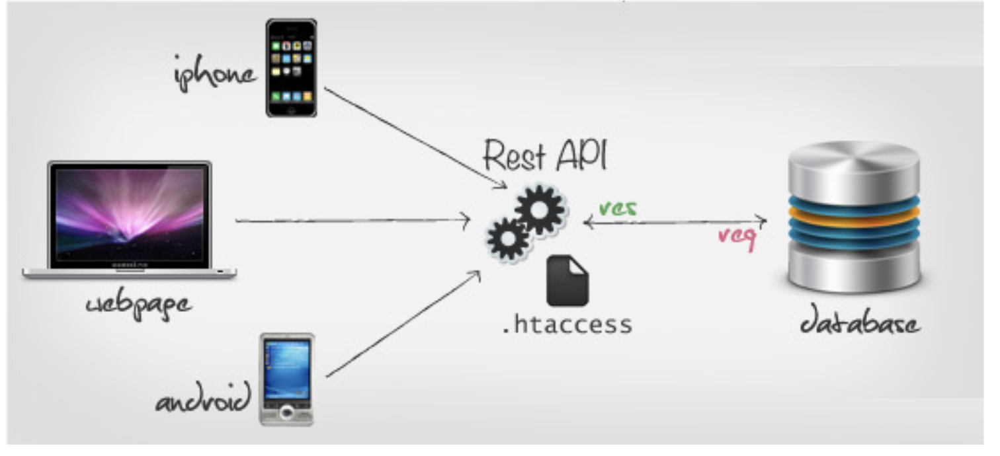
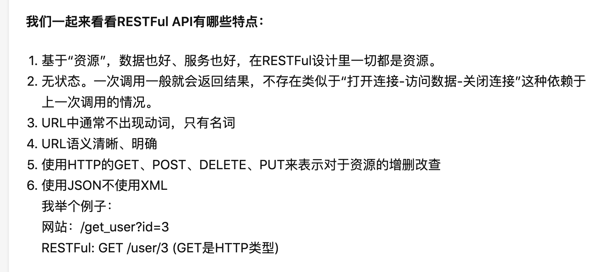
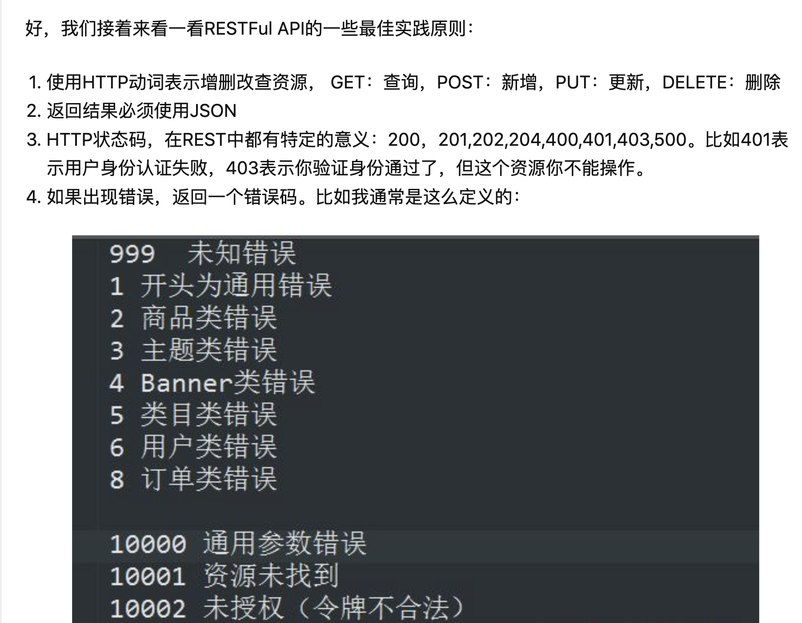
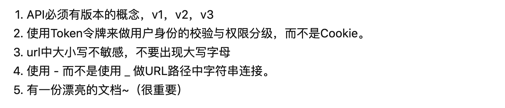

# REST&RESYFUL

REST - REpresentational State Transfer: 表现层状态转移

**URL定位资源，用HTTP动词（GET、POST、DELETE、DETC）描述动作**。

- REST不是rest这个单词，而是几个单词的缩写。
- REST描述的是在网络client和server的一种交互形式；REST本身不实用，实用的是如何设计RESTFUL API（REST风格的网络接口）
- Server提供的RESTFUL API中，URL只使用名词来指定资源，原则上不使用动词。“资源”是REST架构或者说整个网络处理的核心。
- 用HTTP协议里的动词来实现资源的添加、修改、删除等操作。即通过HTTP动词来实现资源的状态扭转
- Server和Client之间传递某资源的一个表现形式，比如用JSON、XML传输文本，或者用JPG、WEbP传输图片等。当然还可以压缩HTTP传输时的数据。
- 用HTTP Status Code 传递Server的状态信息。比如最常用的200表示成功，500表示Server内部错误等。

- 最后要解放思想，Web端不再用典型的PHP或者JSP架构，而是改为前端渲染和附带处理简单的商务逻辑。Web端和Server只使用上述定义的API来传递数据和改变数据状态。格式一般是JSON。IOS和Andriod同理可得。由此可见,Web、IOS、Android和第三方开发者变为平等的角色通过一套API来共同消费Server提供的服务。

---

REST--Representational State Transfer 

全程是 Resource Representational State Transfer ：通俗来讲就是：资源在网络中以某种表现形式进行状态转移。

**Restful API **

实用的是如何正确地理解Restful架构和设计好Restful API。

**为什么使用Restful结构呢？**

Restful可以通过一套统一的接口为web\ios\android提供服务。另外，对于广大平台来说，微信公共平台、微信开放平台等，它们不需要有显式的前端，只需要一套提供服务的接口，于是Restful是它们最好的选择。

在Restful架构下：

- URL root:
  https://example.org/api/v1/
  https://api.example.com/v1/

- API versioning:可以放在URL里面，也可以用HTTP的header：/api/v1/

- URL使用名词而不是动词，且推荐使用复数

  - BAD： /getProducts.   /listOrders

  - GOOD：   GET  /products  
  
- 保证 HEAD 和 GET 方法是安全的，不会对资源状态有所改变（污染）。HTTP协议支持分页（Pagination）操作，在Header中使用 Link 即可。

- 使用正确的HTTP Status Code表示访问状态

-  在返回结果用明确易懂的文本（String。注意返回的错误是要给人看的，避免用 1001 这种错误信息），而且适当地加入注释。
   
  
   

   
   
   
   
   ​    
   
    

 

