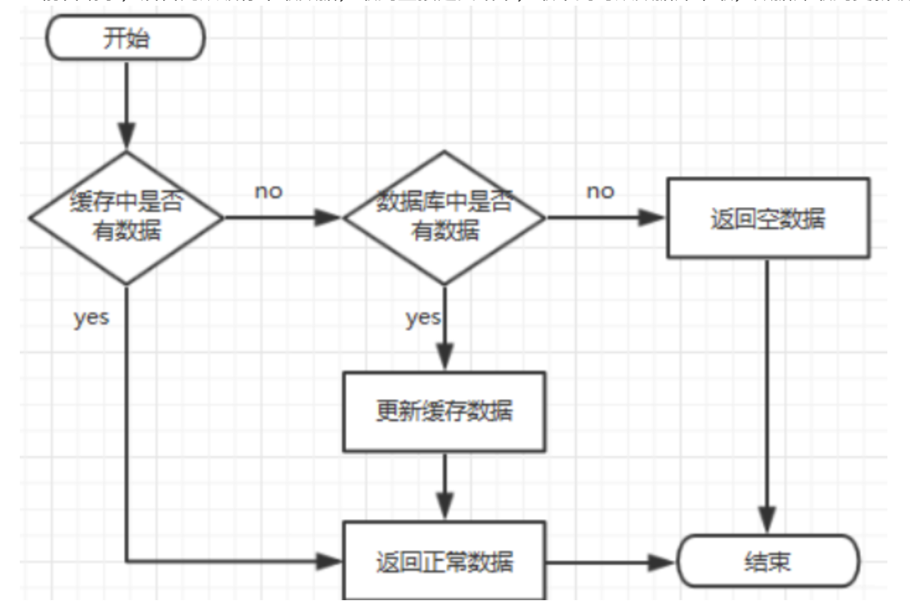

# 缓存穿透、缓存击穿、缓存雪崩区别和解决方案

## 一、缓存处理流程

前台请求，后台先从缓存中取数据，取到直接返回结果，取不到从数据库取，数据库取到更新缓存，并返回结果，数据库也没取到，那直接返回空结果。



## 二、缓存穿透

缓存穿透是指缓存和数据库中都没有的数据，而用户不断发起请求，如发起id为“-1”的数据或id为特别大不存在的数据。这时的用户很可能是攻击者，攻击会导致数据库压力过大。

解决方案：

1. 接口层增加校验，如用户鉴权校验，id做基础校验，id<=0的直接拦截；
2. 从缓存取不到的数据，在数据库中也没有，这时也可以将key-value对改为key-null，缓存有效时间可以设置短点，如30秒（设置太长会导致正常情况也没法使用）。这样可以防止用户反复用同一个id暴力攻击

## 三、缓存击穿

缓存击穿是缓存中没有但数据库中有的数据（一般是缓存时间到期），这时由于并发用户特别多，同时读缓存没读到数据，又同时取数据库去取数据，引起数据库压力瞬间增大，造成过大压力

解决方案：

​	设置热点数据永远不过期。

​	加互斥锁，互斥锁参考代码如下：

```java
public static String getData(String key) throws InterruptedException{
   String result = getDataFromRedis(key);
  if (result == null ){
     if (reenLock.tryLock()) {
       result = getDataFromMysql(key);
       if (result != null) {
         setDataToCache(key, result);
       }
       reenLock.unlock();
     } else {
       Thread.sleep(100);
       result = getData(key);
     }
  }
  return result;
}
```

## 四、缓存雪崩

缓存雪崩是指缓存中数据大批量到过期时间，而查询数据量巨大，引起数据库压力过大甚至down机。和缓存击穿不同的是，缓存击穿指并发查同一条数据，缓存雪崩是不同数据都过期了，很多数据都查不到从而查数据库。

解决方案：

1. 缓存数据的过期时间设置随机，防止同一时间大量数据过期现象发生。
2. 如果缓存数据是分布式部署，将热点数据均匀分布在不同的缓存数据库中。
3. 设置热点数据永不过期