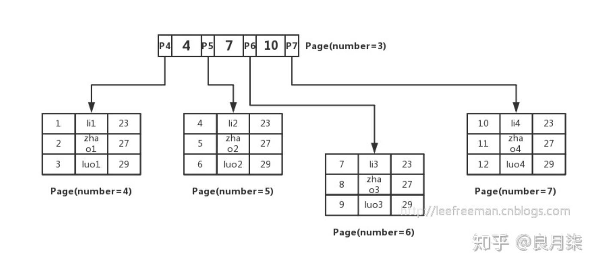

# 面试题： mysql一颗B+ 树能存多少条数据？

摘抄URL：https://zhuanlan.zhihu.com/p/379092178 

https://zhuanlan.zhihu.com/p/266630305

## 前言

早上吃早点的时候刷知乎，刷到了这个专栏。稍微看了一下，感觉写的还可以，查漏补缺啦。

说实话，我不是太会回答这个问题。虽然我知道mysql的Innodb引擎的存储方式等。

## 要搞清楚这个问题，先从Innodb索引数据结构、数据组织方式开始讲

## 存储单元及 扇区、块、页之间的关系

存储器范围比较大，但是数据具体怎么存储呢？

**有自己最小的存储单元**

1. 数据持久化存储在磁盘里，磁盘的最小单位是扇区，一个**扇区**的大小是 **512字节。**
2. 文件系统的最小单位是块，一个  **块** 的大小是 **4K**， 相当于8个扇区。
3. InnoDB存储引擎，有自己的最小单元，称之为页，一个页的大小是 **16K**。

innodbd的所有数据文件（后缀为ibd的文件），他的大小都始终是16384（16K）的证倍。

## InnoDB引擎

查看InnoDB的大小：

show variables like 'innodb_page_size';

可以查看到value为 16384/1024 = 16。

B+树的存储结构这里就不放了。

**页： 除了可以存储数据 （叶子结点）。还可以存放键值和指针（非叶子结点），当然他们是有序的，这样的数据组织形式，我们称为素质索引表。**

### B+树如何检索记录？



- 我们先将数据记录按主键进行排序，分别存放在不同的页中（为了便于理解我们这里一个页中只存放3条记录，实际情况可以存放很多），除了存放数据的页以外，还有存放键值+指针组成。
- 如图page number = 3的页，该页存放键值和指向数据页的指针，这样的页由N个键值+指针组成。

当然，这种键值+ 指针的页也是排好序的。

这样的数据组织形式，我们称为索引组织表。

接下来看如何去查找一条数据。

select * from user where id = 5；这里id为主键，我们通过这颗B+树来查找。

1. 首先找到根页
2. 每张表的根页位置在表空间文件中是固定的
3. 找到根页后通过二分查找法，定位到 xx = xx在指针PX指向的页中
4. 然后在去page Number = X 中的页中查找，同样通过二分查找即可找到xx = xx的记录


**回到问题的开始，通常一颗B+树可以存放多少行数据，这里我们先假设B+树高度为2，即存在一个根节点和若干叶子结点，那么这颗B+树的存放总记录为： 根节点指针树 * 单个叶子结点能记录的行数。**

上文已经说明单个叶子结点（页）中的记录数= 16k / 1k = 16(**这里假设一行记录的数据大小为1K，实际上现在很多互联网业务数据记录大小通常就是1K**)。

现在我们需要计算的是： 非叶子结点能存放多少指针，其实这也比较好算：

- 假设主键ID为bigint类型，长度为8字节，而指针大小在InnoDB源码中设置为 6 字节，这样一共14字节，我们一个页中能存放多少个这个的单元，其实就代表有多少指针，即。 **16384/14 = 1170。**

- 所以一颗高度为2的B+树，能存放1170*16 = 18720条这样的数据记录。

根据同样的原理：可以看出一个高度为3的B+树


### **如何计算B+树的高度？**

上面我们通过推断出B+树的高度通常是1-3。

在InnoDB的表空间文件中，约定page number为3的代表主见索引的根页，而在根页偏移量为64的地方存放了该B+树的page level。

如果page level 为1，那么树高为2，page level为2，则树高为3。

B+树的高度=page level + 1。

B+树的根页在整个表空间文件中的第3个页开始，所以可以算它在文件中的偏移量： 16384*3 = 49152 + 64 = 49216。

然后采用hexdump工具，查看空间文件制定偏移量上的数据:

```
hexdump -s 49126 -n 10 lineitem.ibd
000x040 00 02
```


**总结：lineitem表的数据行数为600多万，B+树高度为3，custemer表行数为15W，B+树高度也为3.可以看出尽管数据差异较大，这两个表的高度都是3，换句话说这两个表通过索引查询的效率并没有太大差异，因为都只需要做3次IO。**


执行下列sql。

```sql
SELECT
b.name, a.name, index_id, type, a.space, a.PAGE_NO
FROM
information_schema.INNODB_SYS_INDEXES a,
information_schema.INNODB_SYS_TABLES b
WHERE
a.table_id = b.table_id AND a.space <> 0
and b.name like '%sp_job_log';
```


