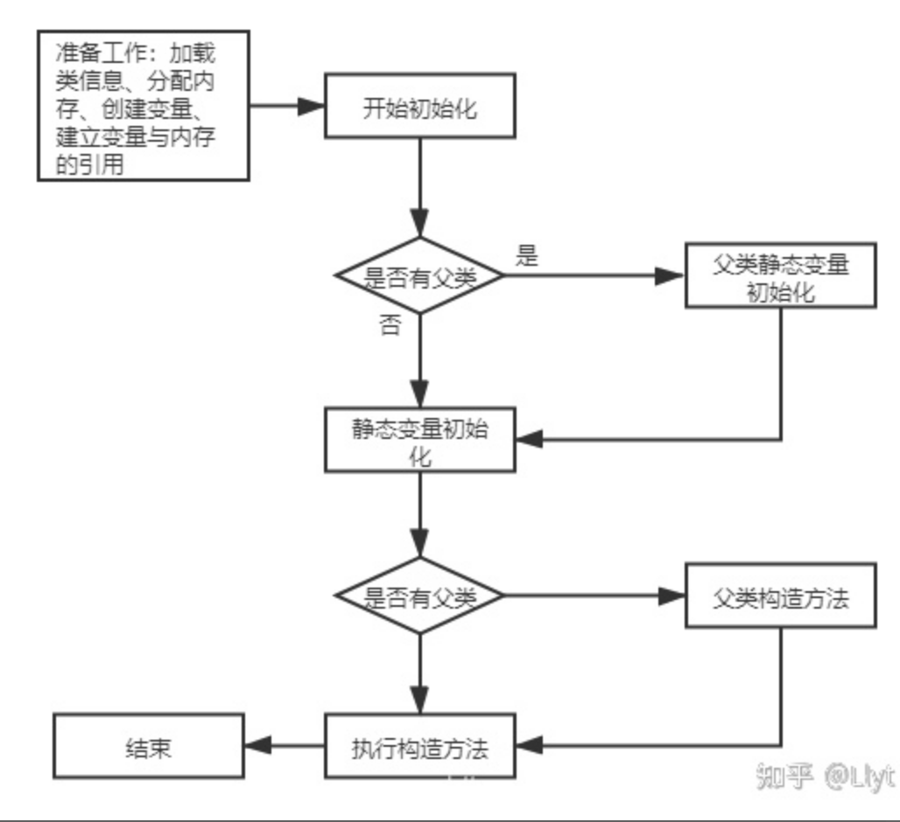
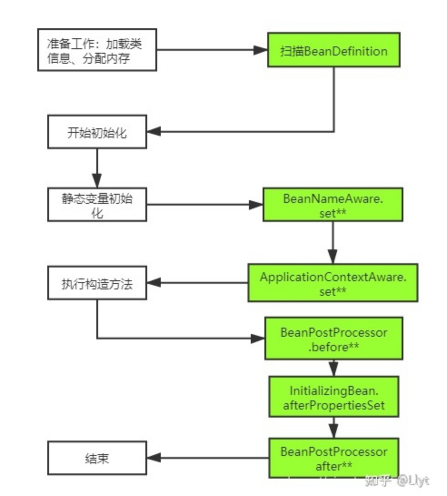

# 面试题：讲一下Java对象创建和Spring Bean的生命周期

摘抄URL： https://www.zhihu.com/search?q=spring%E4%B8%ADbean%E7%9A%84%E7%94%9F%E5%91%BD%E5%91%A8%E6%9C%9F&utm_content=search_suggestion&type=content

## Java对象创建

创建对象的语句

```java
A a = new A();
```

指行图如下：



## Spring Bean的生命周期

自己平时定义

```java
@Component
public class TestBean {

}
@Bean 
public Object myObject() {

}
```

Bean初始化中有一些接口：

- 一部分： 扫描并获取BeanDefinition
- 而部分： 初始化Bean。

Spring在Bean的初始化过程为我们提供了很多接口，采用回调的方式

| 接口                    | 说明                                                         | 回调时机                                  |
| ----------------------- | ------------------------------------------------------------ | ----------------------------------------- |
| BeanNameAware           | bean实现接口setBean方法，通过这个方法获取bean名              | 发生在bean生命周期初始，早于构造方法      |
| ApplicationContextAware | 实现接口setApplicationContext                                | 发生在BeanNameAware和构造方法之间         |
| InitializingBean        | 方法为 afterPropertySet                                      | 设置bean的所有属性之后，在构造方法之后    |
| BeanPostProcessor       | 有两个方法：一： postProcessBeforeInitialization和postProcessAfterInitialzation | 在构造方法之后，分别在InitialzingBean前后 |



