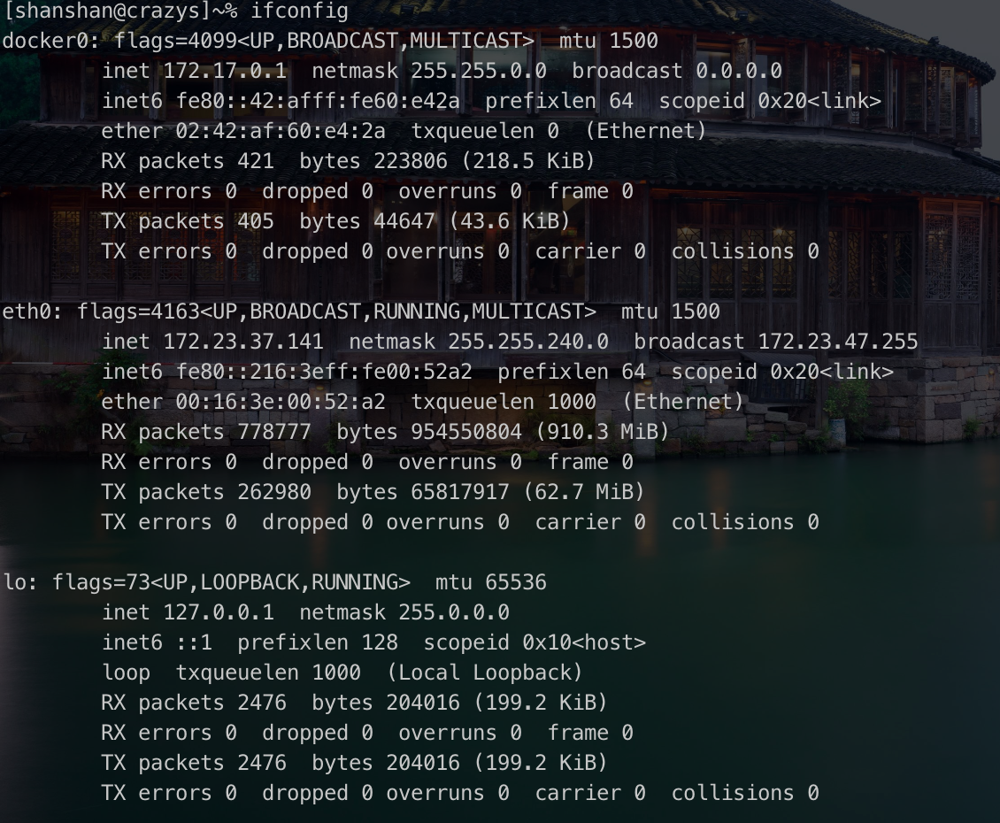

## Linux-06

今天是学习linux的第6天，从第7节开始学～

## 4.7 网络命令

**网络命令：write**

指令名称： write

指令所在路径： /usr/bin.write

指令权限：所有用户

语法：write <用户名>

功能描述：**给用户法信息，以Ctrl+D保存结束**

范例： write linzhiling

Ctrl + 退格键 才能退格

**网络命令： wall**

指令名称： wall

命令英文原意： write all

指令所在路径： /usr/bin/wall

执行权限： 所有用户

语法： wall 【message】

功能描述：发广播信息

范例： wall ShenChao is a honest man!

**网络命令：ping**

命令名称：ping

命令所在路径：/bin/ping

执行权限：所有用户

语法： ping 选项 IP地址

​					-c 指定发送次数

功能描述：测试网络连通性

范例：ping 192.168.1..156

**网络命令： ifconfig**

命令名称：ifconfig

命令英文原意： interface configure

命令所在路径： /sbin/ifconfig

执行权限：root

语法： ifconfig 网卡名称 IP地址

功能描述：查看和设置网卡信息

范例： ifconfig eth0 192.168.8.250

linux 一般来说有2块网卡： eth0 和 lo

eth0 真实网卡 

lo:回环网卡，127.0.0.1

**网络命令： mail**

命令名称： mail

命令所在路径： /bin/mail

执行权限：所有用户

语法：mail 【用户名】

功能描述： 查看发送电子邮件

范例： mail root

**网络命令：last**

命令名称： last

命令所在路径： /usr/bin/last

执行权限：所有用户

语法：last

功能描述：列出目前与过去登入系统的用户信息

范例： last

**网络命令： lastlog**

命令名称：lastlog

命令所在路径： /usr/bin/lastlog

执行权限：所有用户

语法：lastlog

功能描述：检查某特定用户上次登陆的时间

范例：lastlog

​			lastlog -u 502   

502表示uid

**网络命令：netstat**

命令名称：netstat  (net state)

命令所在路径：/bin/netstat   

执行权限：所有用户

语法：netstat 【选项】

功能描述：显示网络相关信息

选项：

-t : TCP协议

-u : UDP协议

-l : 监听

-r : 路由

-n : 显示IP地址和端口号

范例： 

Netstat -tlum   查看本机监听的端口

netstat	-an 查看本机所有的网络连接

netstat	-rn 查看本季路由表

**挂载命令**

命令名称： mount

命令位置：/bin/mount

执行权限：所有用户

命令语法：mount 【-t 文件系统】 设备文件名 挂载点

范例： mount -t iso9660 **/dev/sr0 /mnt/cdrom**

  

## 4.8 关机重启命令

**shutdown命令**

命令格式： shutdown 【选项】 时间

​				-c : 取消前一个关机命令

​				-h : 关机

​				-r : 重启

能够正确保存已经启动的服务

**其他关机命令**

halt	poweoff 直接断电	init 0 

**其他关机命令**

reboot init 6

**系统运行级别**

0 	关机

6	重启

1	单用户  启动最小的核心程序，进行修复 single user mode

2	不完全多用户，不含NFS 

3	完全多用户

4	未分配

5	图形界面

**logout命令**

退出

