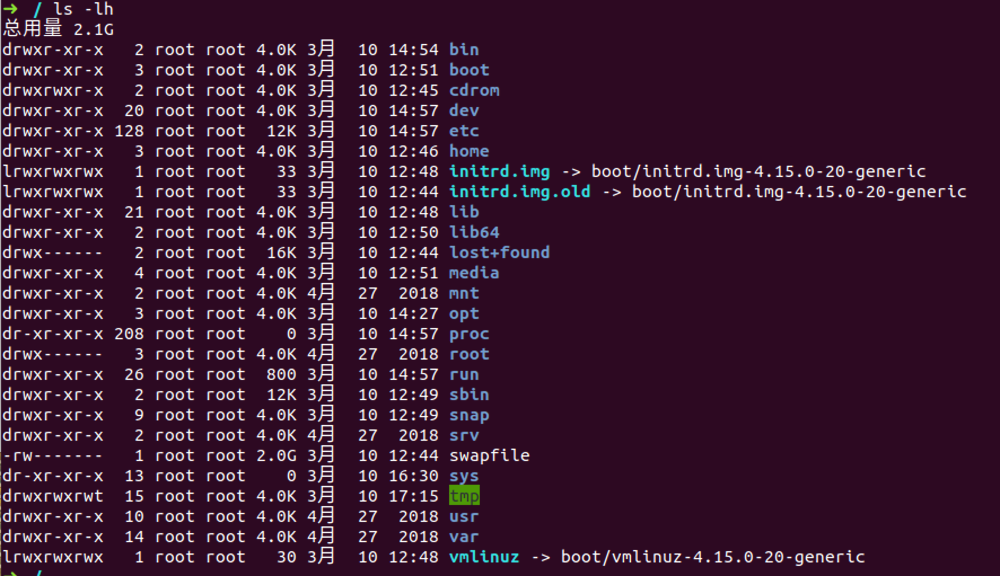
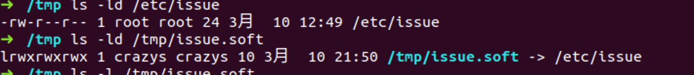
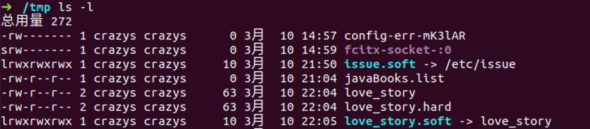
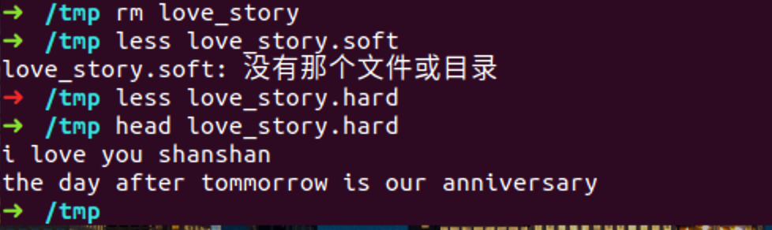
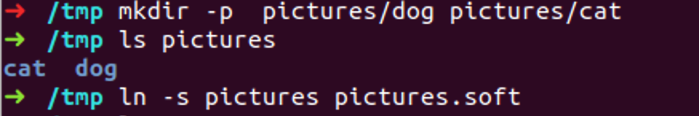

# linux-01   2021-3-10

主要学习了3.1 3.2 4.1的内容，对linux命令回顾了一下～，然后理解了linux文件命名方式没有太大的约束，但是一般不加入空格键

## 视频内容：3.1 学习Linux的注意事项

- Linux 严格区分大小写

- Linux中所有内容以文件形式保存，包括硬件

  - 硬盘文件是 /dev/sd[a-p]
  - 光盘文件是 /dev/sr0

- Linux不靠扩展名区分文件

  `bin:下放了linux常用的一些命令,binary，二进制的可执行文件`

  `并没有隐藏扩展名`

  - 压缩包： .gz 、.bz2 、.tar.bz2、 .tgz
  - 二进制软件包： .rpm
  - 网页文件： .html 、.php
  - 脚本文件： .sh
  - 配置文件：.conf

  帮助管理员，便于使用

`etc:保存了常见的配置文件，mysql的配置文件 .cnf的缩写`

- Linux所有的存储设备都必须挂载之后用户才能使用，包括硬盘、U盘和光盘

比如，在虚拟机上安装pd-tools时，先需要挂载

- Windows下的程序不能在Linux中安装和运行

`绝大多数的linx服务器不使用图形界面`

## 视频内容3.2 服务器管理和维护建议

### 1. Linux各目录的作用

/bin/ : 存放系统命令的目录，普通用户和超级用户都可以执行。不过放在/bin下的命令在单用户模式下也可以执行

/sbin/: (super) 保存和系统环境设置相关的命令，只有超级用户可以使用这些命令进行系统环境设置，但是有些命令可以允许普通用户查看

/usr/bin/ :存放系统命令的目录，普通用户和超级用户都可以执行。这些命令和系统启动无关，在单用户模式在不能执行

/usr/sbin/: 存放根文件系统不必要的系统管理命令，例如多数表服务程序。只有超级用户可以使用。大家其实可以注意到Linux的系统，在所有“sbin”目录中保存的命令只有超级用户可以使用，“bin”目录中保存的命令所有用户都可以使用

**/boot/ ：系统启动目录，保存系统启动相关的文件，如内核文件和启动引导程序文件等**

**/dev/:	设备文件保存位置。我们已经说过Linux中所有内容以文件形式保存，包括硬件。那么这个目录就是用来保存所有硬件设备文件等**

/etc/ : 配置文件保存位置。系统内所有采用默认安装方式（npm安装）的服务的配置文件全部都保存在这个目录当中，如用户账户和密码，服务的启动脚本，常用服务的配置文件等

/home/ ： 普通用户的家目录。建立每个用户时，每个用户要有一个默认登陆位置，这个位置就是这个用户的家目录，所有普通用户的家目录就是在/home下建立一个和用户名相同的目录。如用户crazys的家目录就是home/crazys

**/lib/ : 系统调用的库函数保存位置** 

/lost + found/ : 当系统意外崩溃或者机器意外关机，而产生一些文件碎片放在这里。当系统启动的过程中fsck工具会检查这里，并修复已经损坏的文件系统。这个目录只在每个分区中出现，例如/lost+fount/就是根分区的备份恢复目录，/boot/lost+found/就是/boot分区的备份恢复目录

**三个挂载目录：**

/media/ : 挂载目录

/mnt/ : 	挂载目录

/misc/ : 挂载目录

/opt/ : 第三方安装的软件保存位置。现在更多的是在：/usr/local/目录当中用来安装软件

**存在在内存中的两个目录：**

**/proc/ : 虚拟文件系统, 主要保存系统的内核，进程，外部设备和网络状态灯。**

/sys/ : 虚拟文件系统。主要保存内核相关信息的

/root/ : 超级用户目录

/srv/ : 服务数据目录。

/tmp/: 临时目录。 可以清空

**/usr/ : 系统软件资源目录。 Unix Software Resource。系统中安装的软件大多数保存在这里。**

**/var/ : 动态数据保存位置。主要保存缓存、日志以及软件运行所产生的文件**

/usr/lib/ : 包含各应用软件的函式库、目标档案以及不被一般使用者惯用的执行档案或脚本

/usr/share : 存放共享文件的地方

### 2、服务器注意事项

- 远程服务器不允许关系，只能重启
- 重启时应该关闭服务
- 不要在服务器访问高峰运行高负载命令
- 远程配置防火墙时不要把自己踢出服务器
- 指定合理的密码规范并定期更新
- 合理分配权限
- 定期备份重要数据和日志

**Linux 常用命令**

## 4.1 文件处理命令

### 4.1.1 命令格式与目录处理命令ls

**命令格式**

命令【-选项】【参数】

例子： ls -la /etc

说明：

1.  个别命令使用不遵循此格式

2. 当有多个选项时，可以写在一起
3. 简化选项与完整选项 - a == --all

**目录处理命令：ls**

命令名称： ls

命令英文原意： list

命令所在路径： /bin/ls

执行权限：所有用户

功能描述：显示目录文件

语法： ls 选项【-ald】 【文件或者目录】

-a : all 显示所有文件，包括隐藏文件

-l : -l 详细信息显示

-d : 查看目录（只看本身）属性 

-h : 人性化显示

-i： 每个文件的唯一标识

- -rw-r-r--

  - "-"文件类型（ - 二进制文件 d目录 l 软链接文件）

  - rw-r r-- r--

    u      g   o

    u 所有者	g 所属组	o其他人

    r 读 w写 x执行 read write executor 

  

  比如，我这里查看根目录的属性。

  看其中第一个字符的显示：其中bin等目录，就是 目录directory， - 就是代表二进制文件， l代表软链接（目前还不懂什么意思）

​	

### 4.1.2 目录处理命令

mkdir -p cd pwd rmdir  cp -r -p mv rm -r -f

**目录处理命令： mkdir**

命令名称： mkdir

命令英文原意： make directories

命令所在路径： /bin/mkdir

执行权限：所有用户

语法： mkdir -p 【目录名】

功能描述： 创建新目录

​					-p 递归创建

范例： mkdir - p /tmp/Japan/boduo

​			mkdir /tmp/Japan/longze      /tmp/Japan/cangjing

**目录处理命令： cd**

命令名称： cd

命令英文原意： change directory

命令所在路径： shell 内置命令

执行权限：所有用户

语法： cd 【目录】

功能描述： 切换目录

范例： cd /tmp/Japan/boduo. **切换到指定目录**

​		     cd. ..  **回到上一级目录**

​			

**显示当前目录： pwd**

命令名称： pwd

命令英文原意： print working directory

命令所在路径： /bin/pwd

执行权限： 所有用户

语法： pwd

功能描述：显示当前目录

范例： pwd

​			/tmp/Japan

**文件处理命令：rmdir**

命令名称： rmdir

命令英文原意“ remove empty directories

命令所在路径： /bin/rmdir

执行权限：所有用户

语法： rmdir【目录名】

功能描述： 删除空目录

范例: rmdir /tmp/Japan/boduo

**目录处理命令：cp**

命令名称： cp

命令英文原意： copy

命令所在路径： /bin/cp

执行权限： 所有用户

语法： cp -rp 【原文件或目录】【目标目录】

​				-r 复制目录（目录里面可以有文件）

​				-p 还保留文件属性 （时间不变等）

功能描述： 复制文件或者目录 

 目标目录是可以改名的～

范例： 	cp -r /tmp/Janpan/cangjing /root

将目录/tmp/Japan/canjing 复制到目录/root 下

cp -rp /tmp/Japan/boduo /tmp/Japan/longze /root

将/tmp/Japan 目录下的boduo和longze目录到/root下，保持目录属性

**目录处理命令： mv**

命令名称： mv

命令英文原意： move

命令所在路径： /bin/mv

执行权限： 所有用户

语法： mv 【原文件或目录】 【目标目录】

功能描述： 剪切文件、改名

范例： mv /tmp/Japan/cangjing    /root

​			mv /tmp/Japan/longze /root/nvshen

在同一个目录下，就是改名

​			mv /root/nvshen /root/hehe

**目录处理命令： rm**

命令名称： rm

命令英文原意： remove

命令所在路径： /bin/rm

执行权限： 所有用户

语法： rm - rf [文件或者目录]

​			-r 删除目录

​			-f 强制执行 force强制删除

功能描述： 删除文件

1. 做备份
2. 误删除后，不对硬盘做读写操作
3. 有专业数据恢复对公司，但是巨贵

### 4.1.3 文件处理命令

touch cat -n tac more less head -n tail

  并不建议用空格当作文件名的组成部分

**文件处理命令： touch **

命令名称： touch 

命令所在路径： /bin/touch

执行权限： 所有用户

语法： touch 【文件名...】

功能描述： 创建空文件

范例： touch JavaWebBooks.list

在当前目录创建的文件，如果要在其他地方创建，则得写完全路径

**文件处理命令： cat**

命令名称： cat

命令所在路径： /bin/cat

执行权限：所有用户

语法： cat 【文件名】

功能描述： 显示文件内容

​					-n 显示行号

范例： cat /etc/issue

​			cat -n /etc/services

cat不太适合浏览比较长的命令

**tac 反着看**

**文件处理命令：more**

命令名称： more

命令所在路径： /bin/more

执行权限： 所有用户

语法： more 【文件名】

​				空格或f 	翻页

​				Enter		换行

​				q或Q		退出

功能描述： 分页显示文件内容

范例： 	more /etc/services

**文件处理命令： less**

命令名称: less

命令所在路径： /usr/bin/less

执行权限：所有用户

语法: less 【文件名】

功能描述： 分页显示文件内容（可向上翻页） pageUp、pageDown 

范例： less /etc/services

**并且支持搜索（在浏览状态 输入 /搜索的关键词 就可以了）， 按n表示下一个**

**文件处理命令： head**

命令名称： head

命令所在路径： /usr/bin/head

执行权限：所有用户

语法： head 【文件名】

功能描述： 显示文件前面几行

​					-n 指定行数

范例：  head -n 20 /etc/services

**文件处理命令： tail**

命令名称： tail

命令所在路径：/usr/bin/tail

执行权限： 所有用户

语法： tail 【文件名】

功能描述：显示文件后面几行

​				-n 指定行数

​				-f 动态显示文件末尾内容

范例： tail -n 18 /etc/services

### 4.1.4 链接命令

**文件处理命令：In**

命令名称： In

命令英文原意： link

命令所在路径： /bin/In

执行权限：所有用户

语法： In -s 【原文件】【目标文件】

​				-s 创建软链接

功能描述： 生成链接文件

范例：

In -s /etc/issue 	/tmp/issue.soft

   创建文件/etc/issue 的软链接 /tmp/issue.soft

**软链接特征： 类似Windows快捷方式**

**1、lrwxrwxrwx** 

**2、文件大小 -只是符号链接。一般只有几个或者十几个字节。**

**3、/tmp/issue.soft -> /etc/issue 箭头指向源文件**

In /etc/issue /tmp/issue.hard

​	创建文件/etc/isser的硬链接 /tmp/issue.hard

**除了文件名的位置不一样，其他的都一样**

删除了原文件，硬链接还是可以访问

**硬链接特征：**

1、 拷贝cp -p + 同步更新

2、 通过i节点识别 （其i节点相同），一个i节点不一定对应一个文件，一个文件一定对应一个i节点

**3、 不能跨分区**

**4、 不能针对目录使用**，但是软链接是可以针对目录使用的

同分区：比如创建一个pictures的文件夹，下面有一个dog、一个cat，然后创建一个软链接指向picture

然后cd到pictures.soft

跨分区：将pictures 这个文件夹复制到etc当中去，然后创建到tmp中创建软链接

