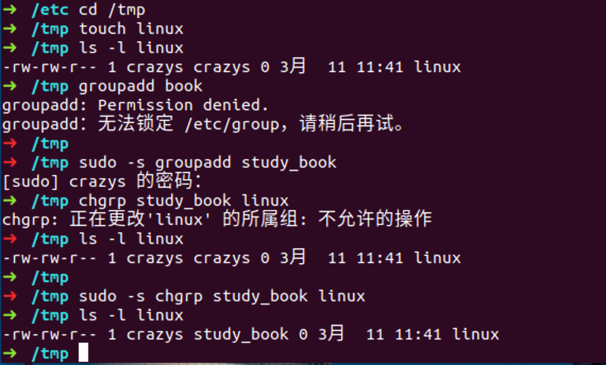
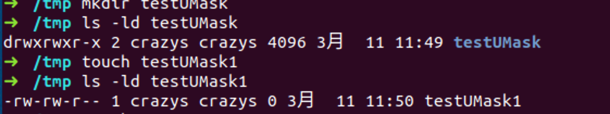

# linux-02 

从4.2开始学

## 4.2 权限管理命令

### 4.2.1 权限管理命令chmod

所有者	所属组	其他人  rwx

**权限管理命令： chmod**

命令名称： chmod

命令英文原意： change the permissions mode of a file

命令所在路径： /bin/chmod

执行权限： 所有用户

语法： chmod 【{ugoa} {+-=}{rwx}】【文件或目录】

​							【mode = 421】 【文件或者目录】

​							-R 递归修改

功能描述： 	改变文件或目录权限

**范例： chmod g+w testfile 赋予文件testfile所属组写权限**

​			**chmod 640	testfile 修改文件testfile的全写为 rw-r-- ---**

​			**chmod -R 777 修改目录testfile及其目录下文件为所有用户具有全部权限**

权限的数字表示

r -- 4  100

w -- 2  010

x -- 1	001

rwxrw-r--

7 6 4

|      | mode     | file             | directory                          |
| ---- | -------- | ---------------- | ---------------------------------- |
| r    | 读权限   | 可以查看文件内容 | **可以列出目录中的内容**           |
| w    | 写权限   | 可以修改文件内容 | **可以在目录中创建**、**删除文件** |
| x    | 执行权限 | 可以执行文件     | **可以进入目录**                   |

`file    r : cat/more/head/tail/less     w: vim                  x: script command`

`directory   r:ls         w:touch/mkdir/rmdir/rm/mv/cp    x: cd`

`tips: 一般来说，对一个目录，都具备r和x权限，即可以列出目录中的内容，并且可以进入目录`

### 4.2.2 其他权限管理命令

**权限管理命令： chown**

命令名称： chown

英文原意：change file ownership

命令所在路径： /bin/chown

执行权限： 所有用户

语法： chown 【用户】【文件或目录】

功能描述：改变文件或目录的所有者

范例： chown shenchao fengjie

改变文件fengjie的所有者为shenchao

`只有root能够改变用户的所有者`

**权限管理命令: chgrp**

命令名称： chgrp

命令英文原意： change file group ownership

命令所在路径： 所有用户

语法： chgrp 【用户组】【文件或目录】

功能描述： 改变文件或目录的所属组

范例： chgrp lamp brother fengjie

​	改变文件fengjie的所属组为lampbrother

`也只有root能够修改组的权限`

**权限管理命令： umask**

命令名称： umask

命令英文路径： the user file-creation mask 

命令所在路径： shell 内置命令

执行权限： 所有用户

语法： umask 【-S】

​     -S	以rwx形式显示新建文件缺省权限

功能描述： 显示、设置文件的缺省权限

范例： umask -S

022

777 rwx rwx rwx

022	--- -w- -w-     做逻辑与的比对. Umask 077 设置该值， 但是不推荐使用～

-----------------------

755   rwx r-x r-x 目录

​		 rw- r-- r--文件

今天

