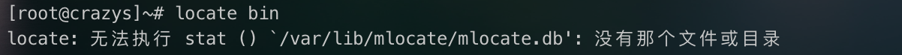
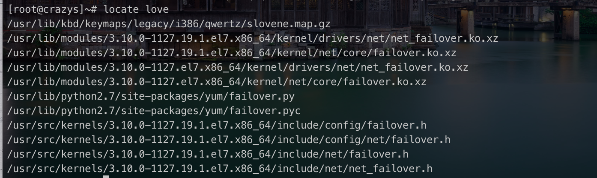
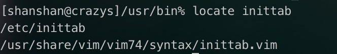
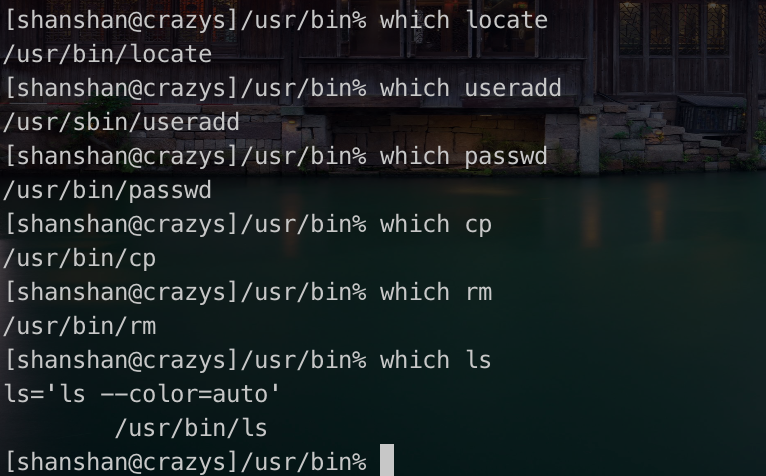
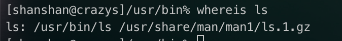
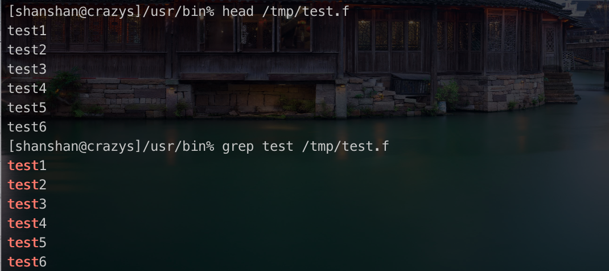

# linux-04

学习 linux 的第4天，今天从4.3.2开始学习。

### 4.3.2 其他搜索命令

**find. Locate yum install mlocate updatedb which whereis grep** 

`CentOS 7当中没有locate命令，需要先进行安装，安装的命令为：yum install mlocate`

然后会报错：

这个时候需要输入 updatedb 命令

输入完，就可以使用locate进行搜索了，这个命令真nb。

**文件搜索命令： locate **

能够实现快速查找

命令名称： locate 

命令所在路径： /usr/bin/locate

执行权限：所有用户

语法： locate文件名

功能描述： 在文件资料库中查找文件

范例： locate inittab

建立了一个文件资料库，在资料库中去找要搜索想要找的文件。

`文件资料库不搜录 存放在/tmp里面的文件`

- -i 不区分大小写

**文件搜索命令： which**

命令名称： which

命令所在路径： /usr/bin/which

执行权限：所有用户

语法：which 命令

功能描述： 搜索命令所在目录及别名信息

范例： which ls

**文件搜索命令： whereis**

命令名称：whereis

命令所在路径： /usr/bin/whereis

执行权限：所有用户

语法： whereis 【命令名称】

功能描述： 搜索命令所在目录及帮助文档路径

范例： where ls

**文件搜索命令： grep**

命令名称： grep

命令所在路径： /bin/grep

执行权限： 所有用户

语法： grep -iv 【指定字串】【文件】

功能描述： 在文件中搜寻字串匹配的行并输出

​			-i 不区分大小写

​			-v 排除指定字串

范例： grep mysql /root/install.log

grep -v ^# /etc/inittab 

删除有#的首行，看

