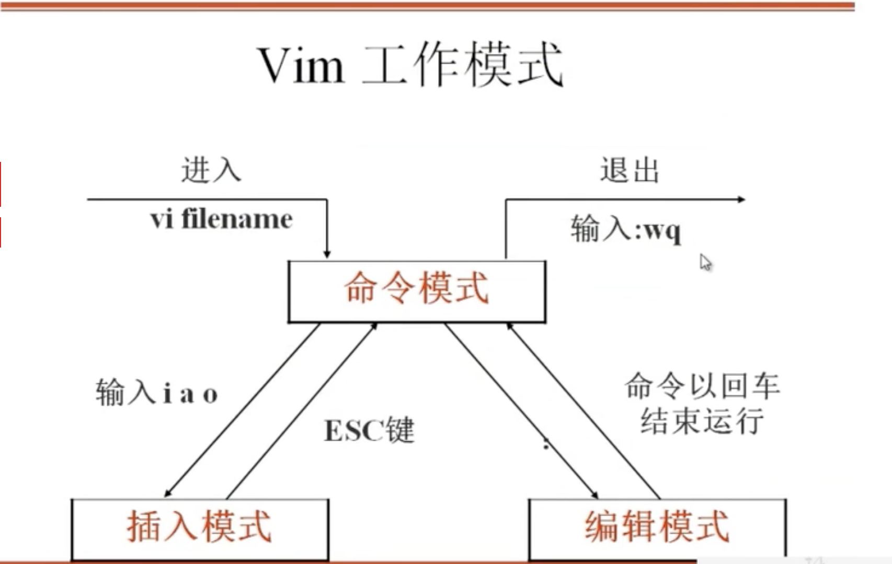

# Linux-07

学习Linux的第7天，从5.1开始学

## 5.1 vim常用操作

```
vim	命令模式	插入模式	编辑模式
	插入命令 aio AIO
	定位命令	: set nu  :set nonu
					 : n
					 0 $
					 gg G
	删除	x nx  dd ndd 
	复制和剪切		yy p  P
							dd p P
	替换和恢复		r/R	u
	搜索和替换	 /string  n
						:范围s/要替换关键词/替换为关健词/g
	保存退出	:wq ZZ  :q! :w :wq!
						
```


**Vim简介**

vim是一个功能强大的全屏幕文本编辑器，是linux/unix上最常用的文本编辑器，它的作用是建立、编辑、显示文本文件。

**Vim没有菜单，只有命令。**


**Vim 工作模式**




**插入命令**

| 命令 | 作用                 |
| ---- | -------------------- |
| a    | 在光标所在字符后插入 |
| A    | 在光标所在行尾插入   |
| i    | 在光标所在字符前插入 |
| I    | 在光标所在行行手插入 |
| o    | 在光标下插入新行     |
| O    | 在光标上插入新行     |

**定位命令**

| 命令       | 作用       |
| ---------- | ---------- |
| : set nu   | 设置行号   |
| : set nonu | 取消行号   |
| gg         | 到第一行   |
| G          | 到最后一行 |
| nG         | 到第n行    |
| ： n       | 到第n行    |
| $          | 移至行尾   |
| 0          | 移至行首   |

**删除命令**

| 命令    | 作用                         |
| ------- | ---------------------------- |
| x       | 删除光标所在处字符           |
| nx      | 删除光标所在处后n个字符      |
| dd      | 删除光标所在行，ndd删除n行   |
| dG      | 删除光标所在行到文件末尾内容 |
| D       | 删除光标所在处到行尾内容     |
| :n1,n2d | 删除置顶范围的行             |
|         |                              |

**复制和剪切命令**

| 命令 | 作用                           |
| ---- | ------------------------------ |
| yy   | 复制当前行                     |
| nyy  | 复制当前行以下n行              |
| dd   | 剪切当前行                     |
| ndd  | 剪切当前行以下n行              |
| p、P | 最粘贴在当前光标所在行下或行上 |

**替换和取消命令**

| 命令 | 作用                                |
| ---- | ----------------------------------- |
| r    | 取代光标所在处字符                  |
| R    | 从光标所在处开始替换字符，按esc结束 |
| u    | 取消上一步操作                      |

replace undo

恢复撤销： Ctrl + r

**搜索和搜索替换命令**

| 命令               | 作用                                        |
| ------------------ | ------------------------------------------- |
| /string            | 搜索指定字符串     搜索时忽略大小写：set ic |
| n                  | 搜索指定字符串的下一个出现位置              |
| :%s/old/new/g      | 全文替换指定字符                            |
| ：n1,n2s/old/new/g | 在一定范围内替换指定字符串                  |

%s 表示全文替换

起始行，终止行s /替换的字符串/替换的新的字符串/g

%s/ftp/yangmi/g

41,42s/ftp/yanmi/g

**保存和退出命令**

| 命令            | 作用                                     |
| --------------- | ---------------------------------------- |
| :w              | 保存修改                                 |
| :w new_filename | 另存为指定文件                           |
| :wq             | 保存修改并退出                           |
| ZZ              | 快捷键，保存修改并退出                   |
| ：q!            | 不保存修改退出                           |
| ： wq!          | 保存修改并退出（文件所有者及root可使用） |


## 5.2 vim技巧

- 导入命令执行结果 :r !命令

r !date 把当前时间导入该文件


:r 文件名 导入文件到该光标处

import 

:!which ls 

- 定义快捷键 :map 快捷键 出发命令

  范例： :map ^P I#<ESC>

  定义快捷键	Ctrl+P ，I跳到行首 加入# 退出

  :map ^B 0x 行首，并删掉第一个字符  

  :map ^H  i8243@qq.com <ESC>

- 连续行注释： :n1,n2s/^/#/g

  :1,4s/^(表示行首)/#(增加的内容)/g

  取消注释： :1,4s/^#//g

  ​						:n1,n2s/^#//g

  ​						:n1,n2s/^/\/\//g

  \ 转义符

- 替换  :ab mymail samlee@lampbrother.net


写到每个用户的 家目录

如果是root目录就是 /root/.vimrc

如果是普通用户就是 /home/shanshan/.vimrc

