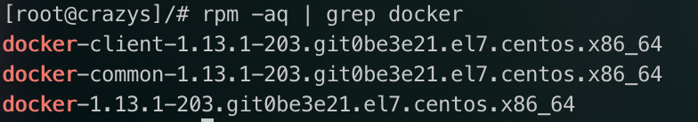
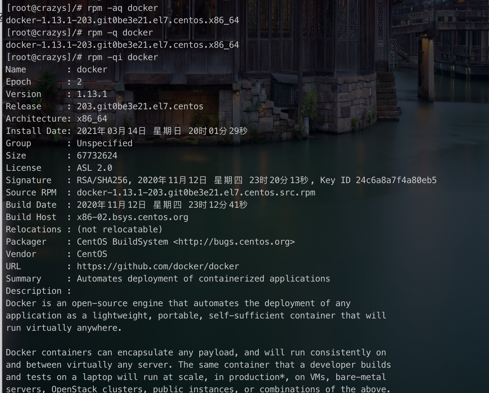
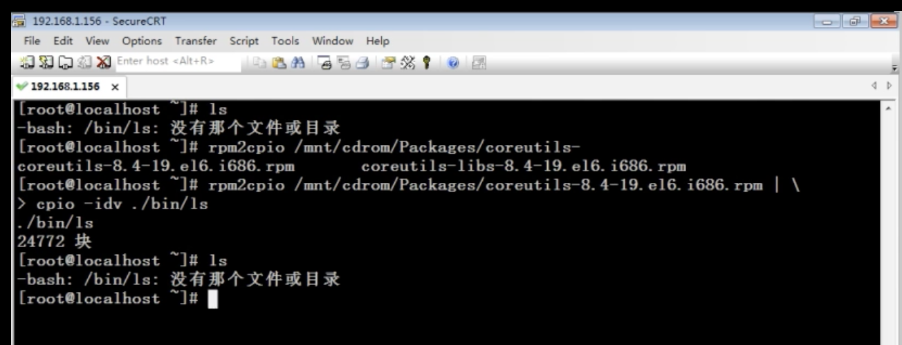
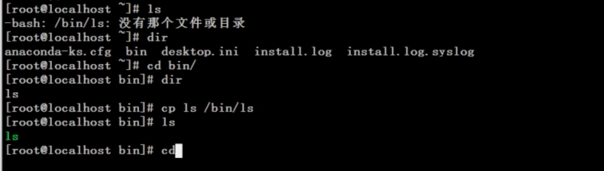
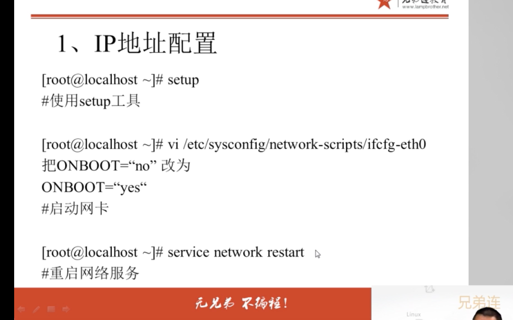
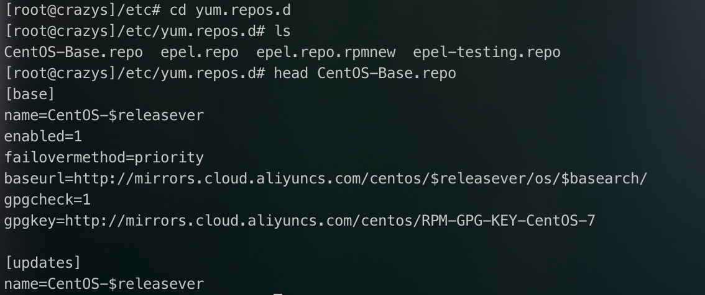

# linux-8

从6.1开始学

**第六讲 软件包管理**

## 6.1 软件包管理简介

**1、软件包分类**

- 源码包

  C语言（绝大多数），比较容易出错

  需要编译，时间需要很久～

  - 脚本安装包

  这个包不是很多

- 二进制包（RPM包、系统默认包）

  基本都是二进制包，经过编译为RPM包

  Centos: rpm

  Ubuntu : 其他的

**2、源码包**

源码包的特点：

- 开源，如果有足够的能力，可以修改源代码
- 可以自由选择所需的功能
- 软件是编译安装，所以更加适合自己的系统，更加稳定也效率更高
- 卸载方便

直接删掉安装的地方就可以了

源码包的缺点：

- 安装过程步骤较多，尤其安装较大的软件集合时，容易出现拼写错误

- 编译过程时间较长，安装比二进制安装时间长
- 因为是编译安装，安装过程中一旦报错新手很难解决

**3、RPM包**

Redhat Package management

二进制包的优点

- 包管理系统简单，只通过几个命令就可以实现包的安装、升级、查询和卸载
- 安装速度比源码包安装块的多

二进制包的缺点：

- 经过编译，不再可以看到源代码
- 功能选择不如源码包灵活
- 依赖性

## 6.2 RPM 包管理

### 6.2.1 rpm命令管理

**1、RPM包命名规则**

httpd-2.2.15-15.e16.entos.1.i686.rpm

httpd			软件包名

2.2.15		   软件版本

15				 软件发布的次数

E16.entos	适合的linux平台

i686				适合的硬件平台

rpm				rpm包扩展名

**2、RPM包依赖性**

- 树形依赖： a->b->c
- 环形依赖：a->b->c->a
- 模块依赖：模块依赖查询网站：www.rpmfind.net

### 6.2.2 安装升级与卸载

**1 、包全名与包名**

- 包全名：操作的包是没有安装的软件包时，使用包全名。而且要注意路径
- 包名：操作已经安装的软件包时，使用包名。是搜索/var/lib/rpm中的数据库

**2、RPM安装**

rpm	-ivh 包全名

选项： 

​		-i (install)			安装

​		-v(verbose)        显示详细信息

​		-h (hash)			显示进度

​		--nodeps			不检测依赖性

这个依赖性装包，太TM痛苦了

**3、RPM包升级**

rpm -Uvh 包全名

选项：

​		-U (upgrade) 	升级

**4、卸载**

rpm -e 包名

选项：

​		-e （erase）卸载

### 6.2.3 查询

**1、查询是否安装**

rpm -q 包名

查询包是否安装

选项： 

​	-q  查询（query）

​	-a	所有

查询所有包含docker的：

rpm	-qa | grep docker

查询包含docker的一条：

rpm. -q docker

**2、查询软件包详细信息**

rpm -qi 包名

选项： 

​			-i	查询软件信息（information)

​			-p	查询未安装包信息（package)

**3、查询包中文件安装位置**

rpm -ql 包名

​	-l 列表 (list)

​	-p 	查询未安装包信息 (package)

**4、查询系统文件属于哪个RPM 包**

rpm -qf 系统文件名

​	-f: 查询系统文件属于哪个软件包（file)

**5、查询软件包的依赖性**

**rpm -qR 包名**

​	-R 查询软件包的依赖性

​	-p 查询未安装包信息

### 6.2.4 	校验和文件提取

**1、RPM 包中文件校验**

Rpm -V 已安装的包名

​	-V 校验指定RPM包的文件(verify)

验证内容中的8个信息的具体内容如下：

- S 文件大小是否改变
- M 文件的类型或者权限（ rwx)是否被改变
- 5 文件md5校验和是否改变（可以堪称文件内容是否改变）
- D 设备的中，从代码是否改变
- L 文件的路径是否改变
- U 文件的属主（所有者）是否改变
- G 文件的属组是否改变
- T 文件的修改时间是否改变

**文件类型**

- c 配置文件(config file)
- d 普通文档（documentation)
- g "鬼"文件 ( ghost file)，很少见，就是该文件不应该被这个RPM包包含
- l 授权文件（license file)
- r 描述文件 (read me)

**2、RPM包中文件提取**

rpm2cpio 包全名｜ \

cpio -idv .文件绝对路径. (**这里的.表示提取的文件放在当前目录下**)

rpm2cpio  将rpm包转换为cpio格式的命令

cpio 是一个标准工具，它用于创建软件档案文件和从档案文件中提取文件

cpio	选项 < [文件｜设备]

-i:  copy-in 模式，还原

-d: 还原时自动新建目录

-v: verbose,显示还原过程

比如你把ls命令删除了，（这里剪切放到tmp下）

rpm	-qf /bin/ls

查询ls命令属于哪个软件包

mv /bin/ls /tmp/

造成ls命令误删除家乡

rpm2cpio	/mnt/cdrom/Packages/coreutils-8.4-19.el6.i686.rpm | cpio-idv ./bin/ls

**提取rpm包中的ls命令**到当前目录的/bin/ls下

cp	/root/bin/ls /bin/

这个操作最好是要cd 到root目录里面

## 6.3 RPM包管理- yum 在线管理

### 6.3.1 IP地址配置和网络yum源

**1、IP地址配置**

**2、网络yum源**

vi /etc/yum.reppos.d/CentOS-Base.repo

[base] 容器名称，一定要写在[]中

name 容器说明，可以自己随便写

mirrorlist	镜像站点，这个可以注释掉

baseUrl	我们的yum源服务器的地址。默认是CentOS官方的yum源服务器，是可以使用的，如果你觉得慢可改成你喜欢的Yum源地址

enabled 此容器是否生效，如果不写或写成enable=1都是生效，写成enable=0就是不生效

gpgcheck 如果是1是指RPM的数字证书生效，如果是0则不生效

gpgkey	数字证书的公钥保存位置。不用修改

### 6.3.2 yum命令

查询：yum list

搜索： yum search 关键字 

安装： yum -y install 包名 

​          -y. 自动回答yes

升级： yum -y update 包名（如果没有说包名，那么更新所有的，包括内核，然后爆炸）

卸载： yum -y remove 包名 （会卸载所有依赖包，可能导致系统崩溃）

尽量不要用 yum卸载和yum -y update所有的

yum grouplist 查询所有软件组

yum	groupinstall 软件组名	   安装指定软件组，组名可以由grouplist查询出来

yum	group remove 软件组名	卸载指定软件组

### 6.3.3 光盘yum源

基本可以去掉了，这一节，放在这里知道，有这么个东西吧～

1） 挂载光盘

mount /dev/cdrom /mnt/cdrom

2）让网络yum源文件失效

cd /etc/yum.repos.d

mv CentOs-Base.repo CentOS-Base.repo.bak

检测的是repo后缀，改名即可

3）修改光盘yum源文件

vim CentOS-Media.repo

[c6-media]

name=CentOS-$releasever -Media

baseurl=file:///mnt/cdrom

地址为你自己的光盘挂载地址

gpgcheck=1

**enabled=1**

gpgkey=file:///etc/pki/rpm-gpg/RPM-GPG-KEY-CentOS-6

