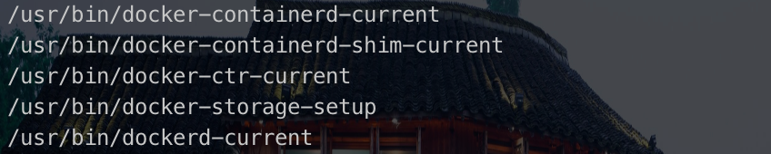
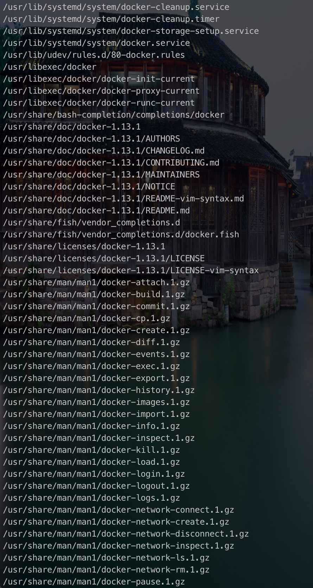
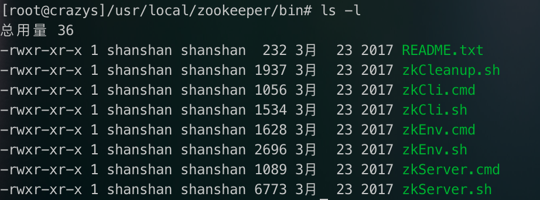
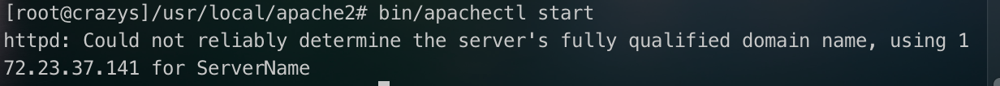

# linux-09

从6.4.1开始学！

## 6.4 源码包管理

### 6.4.1 源码包和RPM包的区别

**1、区别**

- 安装之前的区别：概念上的区别
- 安装之后的区别：安装位置不同

**2、RPM包安装位置**

是安装在默认位置中

RPM包默认安装路径

/etc/ :  配置文件安装目录

/usr/bin/	： 可执行的命令安装目录

/usr/lib/	:	程序所使用的函数库保存位置

/usr/share/doc/ : 	基本的软件使用手册保存位置

/usr/share/man/ : 	帮助文件保存位置

比如我们已经安装了docker。 用rpm -ql docker来看看docker安装的一些位置

**3、源码包安装位置**

安装在指定位置当中，一般是

/usr/local/软件名/

**4、安装位置不同带来的影响**

- RPM包安装的服务可以使用系统服务管理命令（service)来管理，例如RPM包安装的apache的启动方法是：

用绝对路径来启动， service会到系统的默认位置去搜索

/etc/rc.d/init.d/http start

service http start

- 而源码包安装的服务则不能被服务管理命令管理，因为没有安装到默认路径中。所以只能用绝对路径进行服务的管理，如： 

  启动zookeeper ：

  /usr/local/zookeeper/bin/zkServer.sh start

  

### 6.4.2 源码包安装过程

**1、安装准备**

- 安装C语言编译器
- 下载源码包

http://archive.apache.org/dist/httpd/

**2、安装注意事项**

- 源代码保存位置： /usr/local/src/
- 软件安装位置：/usr/local/
- 如何确定安装过程报错：
  - 安装过程停止
  - 并出现error、warning或no的提示
  - 

自己又装了个mwget，然后下载的httpd

下载的速度比较快：mwget http://archive.apache.org/dist/httpd/httpd-2.2.10.tar.gz

> 1. 后台下载：
>
> 使用wget -b + url
>
> 后台任务启动后，会返回两段话，第一段返回一个pid，代表这个后台任务的进程，并且我们可以kill掉这个id来终止此次下载，第二段返回了一句话，意思是会将输出（持续）写入到wget-log这个文件。
>
> 2. 查看wget后台进度
>
> 有几种方法可以查看 
>
> - 使用（断点续传） wget -c + 正在执行的下载地址
> - 找到下载文件的文件夹，其中那个正在写入的输出文件，使用
>
> tail -f wget-log
>
> 也可以实时查看下载进度，ctrl+c可退出
>
> 也可使用cat wget-log 来查看当前进度

> Unix 或Linux中 & 、jobs、fg、bg、^z都是跟系统任务有关的
>
> - & 用在一个命令的最后，可以把这个命令放到后台执行
>
> - Ctrl c 是强制终止程序的执行并结束进程
>
> - Ctrl z是中断任务的执行，但该任务并没有结束，它只是在进程中维持挂起的状态，用户可以使用fg/bg来继续前台/后台执行该任务
>
> - fg命令会重启前台被中断的任务    %id 将选中的命令调出
>
> - bg命令则会把中断的任务放到后台执行 %id
>
> - jobs 可以看当前有多少在后台运行的命令
>
> - ps 列出系统中正在运行的进程
>
> - kill 发送信号给以个或多个进程
>
> - 概念：当前任务
>
>   - 如果后台的任务号有2个，【1】【2】；如果后台的任务号有2个，[1],[2]；如果当第一个后台任务顺利执行完毕，第二个后台任务还在执行中时，当前任务便会自动变成后台任务号码“[2]”的后台任务。所以可以得出一点，即当前任务是会变动的。当用户输入“fg”、“bg”和“stop”等命令时，如果不加任何引号，则所变动的均是当前任务。
>
>   jobs命令执行的结果，＋表示是一个当前的作业，减号表是是一个当前作业之后的一个作业，jobs -l选项可显示所有任务的PID,jobs的状态可以是running, stopped, Terminated,但是如果任务被终止了（kill），shell 从当前的shell环境已知的列表中删除任务的进程标识；也就是说，jobs命令显示的是当前shell环境中所起的后台正在运行或者被挂起的任务信息；
>
>   当要重新执行当前被挂起的任务时，通过bg %num 即可将挂起的job的状态由stopped改为running，仍在后台执行；当需要改为在前台执行时，执行命令fg %num即可；
>
>   前台进程的挂起：
>   　　ctrl+Z;
>   　　进程的终止
>   　　后台进程的终止：
>   　　方法一：
>   　　通过jobs命令查看job号（假设为num），然后执行kill %num
>   　　方法二：
>   　　通过ps命令查看job的进程号（PID，假设为pid），然后执行kill pid
>   　　前台进程的终止：
>
>   ctrl+c
>   　　kill的其他作用
>   　　kill除了可以终止进程，还能给进程发送其它信号，使用kill -l 可以察看kill支持的信号。

du estimate space usage

-s summarize

-h human

**3、源码包安装过程**

- 下载源码包
- 解压缩下载源码包
- **进入解压缩目录**

INSTALL: 安装说明

READ：使用说明

- ./ configure 软件配置与检查

  - 定义需要的功能选项
  - 检测系统环境是否符合安装要求
  - 把定义号的功能选项和检测系统环境的信息都写入Makefile文件，用于后续的编辑

  --prefix=/usr/local/apache2

- make 编译

  - 如果出错了 make clean

- make install  向真正的地方去写入数据

> linux 如何查看端口占用？
>
> 1. losf -i:端口号
> 2. netstat -tuln | grep 端口号

**4、源码包的卸载**

不需要卸载命令，直接删除安装目录即可。不会遗留任何垃圾文件。

### 6.4.3 Linux软件包管理

1. 脚本安装包

- 脚本安装包并不是独立的软件包类型，常见安装的是源码包。
- 是人为把安装过程写成了自动安装的脚本，只要执行脚本，定义简单的参数，就可以完成安装。
- 非常类似于Windows下软件的安装方式。

2. Webmin的作用

- Webmin 是一个基于Web的 Linux系统管理界面。您就可以通过图形化的方式设置用户账号、Apache、DNS、文件共享等服务。

3. Webmin安装过程

- 下载软件: https://sourceforge.net/projects/webadmin/files/webmin/

>  wget https://sourceforge.net/projects/webadmin/files/webmin/1.970/webmin-1.970.tar.gz

- 解压缩，并进入加压缩目录

> tar -zxvf ~

- 执行安装脚本

> ./setip.sh

