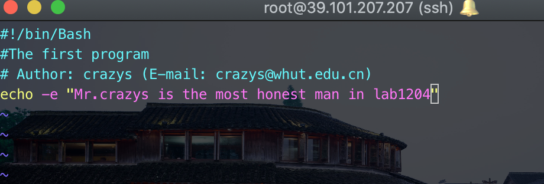
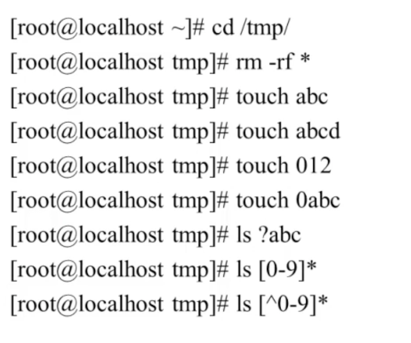
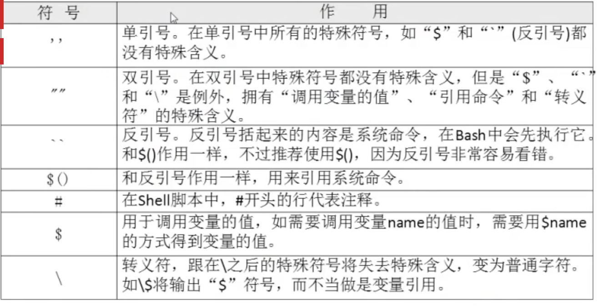
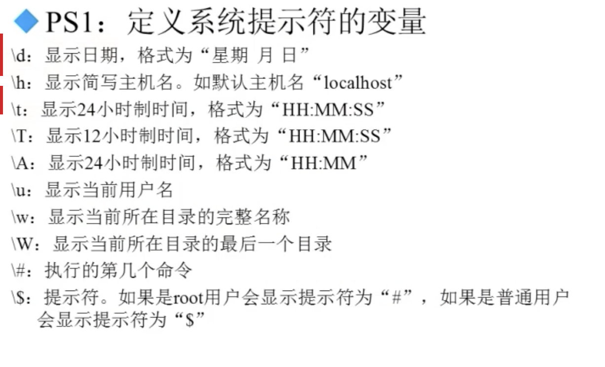

# linux-11 Shell基础

感觉文件这一节好无聊，和同样无聊的shell基础一起看吧。

## 10.1 Shell 概述

**1、Shell是什么**

- Shell是一个命令行解释器，它为用户提供了一个向linux内核发送请求以便运行程序的界面系统级程序，用户可以用Shell来启动、挂起、停止甚至是编写一些程序。
-  Shell还是一个功能相当强大的变成语言，易编写，易调试，灵活性较强。Shell是解释执行的脚本语言，在Shell中可以直接调用Linux系统命令。

**2、Shell的分类**

- Bourne Shell: 从1979起Unix就开始使用Bourne Shell ,Bourne shell的主文件名为sh。
- C Shell: C Shell主要在BSD版的Unix系统中使用，其语法和C语言相类似而得名。
- Shell的两种主要语法类型有Bourne和C，这两种语法彼此不兼容。Bourne家族主要包括sh、ksh、Bash、psh、zsh；C家族主要包括： csh、tcsh。

- Bash： Bash与sh兼容，现在使用的Linux就是使用Bash作为用户的基本Shell。

**3、Linux支持的Shell**

/etc/shells

## 10.2 Shell 脚本的执行方式

**1、echo输出命令**

echo 【选项】【输出内容】

选项： -e: 支持反斜线控制的字符转换

| 控制字符    | 作用                                                         |
| ----------- | ------------------------------------------------------------ |
| \ \         | \                                                            |
| \a          | 输出警告音                                                   |
| \b          | 退格键，也就是向左删除键                                     |
| \c          | 取消输出行末的换行符                                         |
| \e          | escape键                                                     |
| \f          | 换页键                                                       |
| \n          | 换行符                                                       |
| \r          | 回车键                                                       |
| \t          | 制表符，也就是tab键                                          |
| \v          | 垂直制表符                                                   |
| \0 nnn      | 按照八进制ASCII码表输出字符。其中0位数字零，nnn是三位八进制数 |
| \x hh       | 按照十六进制ASCII码表输出字符。其中hh是两位十六进制数        |
| \e[1; \e[0m | 开启颜色输出                                                 |

Echo -e "ab\bc"

ac

**2、第一个脚本**

#!/bin/Bash 这句话告诉程序，这个文件是shell脚本

**这里为/bin/bash,刚刚打错了**

**3、脚本执行**

- 赋予执行权限，直接运行
  - chmod 755 hello.sh
  - ./hello.sh
- 通过Bash调用执行脚本
  - bash hello.sh

dos2unix  从dos格式转换为linux格式

## 10.3 Bash基本功能

### 10.3.1 历史命令与补全

**1、历史命令**

history 【选项】【历史命令保存文件】

选项： -c : 清空历史命令

​			-w: 把缓存中的历史命令写入历史命令保存文件 (一般都是退出的时候，自动会将缓存中的历史命令写入保存文件)

~/.bash_history

- 历史命令默认会保存1000条，可以在环境变量配置文件/etc/profile中进行修改

这个条数要生效，要重新登录，或者source /etc/profile

> romantic love is one of the most addictive substances on Earth.

真正的保存位置在： /root/.bash_history

**历史命令的调用**

- 使用上、下箭头调用以前的历史命令
- 使用!n 重复执行第n条历史命令
- 使用!!重复执行上一条命了
- 使用!字串 重复执行最后一条以该字串开头的命令

**2、命令与文件补全**

- 在Bash中，命令与文件补全是非常方便与常用的功能，我们只要在输入命令或文件时，按“Tab”键就会自动进行补全

### 10.3.2  命令别名与快捷键

**1、命令别名**

alias 别名='原命令'

设定命令别名

alias

查询命令别名

**命令执行时顺序**

1. 第一顺位执行用绝对路径或相对路径执行的命令。
2. 第二顺位执行别名。
3. 第三顺位执行Bash的内部命令。
4. 第四顺位执行按照$PATH环境变量定义的目录查找顺序找到的第一个命令

**让别名永久生效**

- vim /root/.bashrc
- vim /Users/crazys/.zshrc

**删除别名**

- unalias  别名

**2、Bash常用快捷键**

| 快捷键     | 作用                                                         |
| ---------- | ------------------------------------------------------------ |
| ctrl+A     | 把光标移动到开头                                             |
| ctrl+E     | 把命令移动到结尾                                             |
| **ctrl+C** | 强制终止当前的命令                                           |
| **ctrl+L** | 清屏，相当于clear命令                                        |
| **ctrl+U** | 删除或剪切光标之前的命令                                     |
| **ctrl+K** | 删除或者剪切光标之后的内容                                   |
| **ctrl+Y** | 粘贴ctrl删除或者剪切的内容                                   |
| **ctrl+R** | 在历史命令中搜索，输入搜索内容，就会从历史命令中搜索         |
| **ctrl+D** | 退出当前终端                                                 |
| ctrl+Z     | 暂停，并放入后台。这个快捷键牵扯工作管理的内容，我们在系统管理章节详细介绍 |
| ctrl+S     | 暂停屏幕输出                                                 |
| ctrl+Q     | 恢复屏幕输出                                                 |

### 10.3.3 输入输出重定向

**1、标准输入输出**

| 设备   | 设备文件名  | 文件描述符 | 类型         |
| ------ | ----------- | ---------- | ------------ |
| 键盘   | /dev/stdin  | 0          | 标准输入     |
| 显示器 | /dev/stdout | 1          | 标准输出     |
| 显示器 | /dev/stderr | 2          | 标准错误输出 |

**2、输出重定向**

- 标准输出重定向
  - 命令 > 文件： 以覆盖的方式，把命令的正确输出输出到指定的文件或设备当中。
  - 命令 >> 文件： 以追加的方式，把命令的正确输出输出到指定的文件或设备当中。
- 标准错误输出重定向
  - 错误命令	2> 文件： 以覆盖的方式，把命令的错误输出输出到指定的文件或设备当中。
  - 错误命令 2>> 文件： 以追加的方式，把命令的错误输出输出到指定的文件或设备当中。
- 正确输出和错误输出同时保存
  - 命令 > 文件 2>&1 : 以覆盖的方式，把正确输出和错误输出都保存到同一个文件当中。
  - 命令 >> 文件 2>&1：以追加的方式，把正确输出和错误输出都保存到同一个文件当中。
  - 命令 &> 文件： 以覆盖的方式，把正确输出和错误输出都保存到同一个文件当中。
  - 命令 &>> 文件： 以追加的方式，把正确输出和错误输出都保存到同一个文件当中。
  - 命令 >> 文件1 2>>文件2： 把正确的输出追加到文件1中，把错误的输出追加到文件2中。

### 10.3.4 多命令顺序执行与管道符

**1、多命令顺序执行**

| 多命令执行符 | 格式           | 作用                                                         |
| ------------ | -------------- | ------------------------------------------------------------ |
| ；           | 命令1；命令2   | 多个命令顺序执行，命令之间没有任何逻辑联系                   |
| &&           | 命令1&&命令2   | 逻辑与     当命令1正确执行，则命令2才会执行当命令1执行不正确，则命令2才不会执行 |
| ｜｜         | 命令1｜｜命令2 | 逻辑或 当命令1执行不正确，则命令2才会执行 当命令1正确执行，则命令2不会执行 |

**磁盘复制**

dd if=输入文件 of=输出文件 bs=字节数 count=个数

if=输入文件		指定源文件或源设备

of =输出文件	 指定目标文件或目标设备

bs=字节数		指定一次输入/输出多少字节，即把这些字节看作一个数据块

count=个数		指定输入/输出多少个数据块

举例： date;dd if=/dev/zero of=/root/testfile bs=1k count=100000;date

./configure && make && make install

命令 && echo yes || echo no

**2、管道符**

命令格式： 命令1｜命令2

命令1的正确输出作为命令2点操作对象

颜色显示

举例： ll -a /etc/ || more

​			netstat -an | grep tcp

grep [选项] “搜索内容” 文件名

选项： -i : 忽律大小写

​			-n: 输出行号

​			-v：反向查找

​			--color=auto 搜索出的关键字用颜色显示

### 10.3.5 通配符和其他特殊符号

**1、通配符**

| 通配符 | 作用                                                         |
| ------ | ------------------------------------------------------------ |
| ?      | 匹配一个任意字符                                             |
| *      | 匹配0个或任意多个字符，也就是可以匹配任何内容                |
| []     | 匹配中括号中任意一个字符。例如:[abc]可以代表一定匹配一个字符，或者是c，或者是c，或者是c; |
| [-]    | 匹配括号中任意一个字符，-代表一个范围。例如[a-z]             |
| [^]    | 表示匹配不是中括号内的一个字符。例如[ ^ 0-9]                 |

**2、Bash中其他特殊符号**

## 10.4 Bash变量

### 10.4.1 用户自定义变量

**1、什么是变量**

- 变量是计算机内存的单元，其中存放的值可以改变。当Shell脚本需要保存一些信息时，如一个文件名或是一个数字，就把它存放在一个变量中。每个变量有一个名字，所以很容易引用它。使用便利可以保存游泳信息，使系统获知用户相关设置，变量也可以用于保存暂时信息。

**2、变量设置规则**

- 变量名称可以由字母、数字和下划线组成，但是不能以数字开头。如果变量名是“2name”则是错误的。
- 在Bash中，变量的默认类型都是字符串型，如果要进行数值运算，则必须指定变量类型为数值型。
- 变量用等号连接值，等号左右两侧不能有空格。
- 变量的值如果有空格，需要使用单引号或者双引号包括。
- 在变量的值中，可以使用“\”转义符。
- 如果需要增加变量的值，那么可以进行变量值的叠加。不过变量需要用双信号包含“$变量名”或者用${变量名}包含。
- 如果是把命令的结果作为变量值赋予变量，则需要使用反引号或$（）包含命令。
- 环境变量名建议大些，便于区分。

**3、变量分类**

- 用户自定义变量
- 环境变量：这种变量中主要保存的是和系统操作环境相关的数据。
- 位置参数变量：这种变量主要是用来向脚本当中传递参数或数据的，变量名不能自定义，变量作用是固定的。
- 预定义变量：是Bash中已经定义好的变量，变量名不能自定义，变量作用也是固定的。

**4、本地变量**

- 变量定义 name="zbz"
- 变量叠加 
  -  aa=123
  -  aa="$aa"456
  -  aa=${aa}456
- 变量调用 echo $name
- 变量查看 set
- 变量删除 unset name

### 10.4.2 环境变量

**1、环境变量是什么**

- 用户自定义变量只在当前的shell中生效，而环境变量会在当前shell和这个shell的所有子shell当中生效。如果把环境变量写入相应的配置文件，那么这个环境变量就会在所有的shell中生效

**2、设置环境变量**

- 申明变量 export 变量名=变量只

- 查询变量 env 

- 删除变量 unset 变量名

  > pstree 

**3、系统常见环境变量**

- PATH：系统查找命令的路径
- echo $PTH
- PATH="$PATH":/root/sh

 

### 10.4.3 位置参数变量