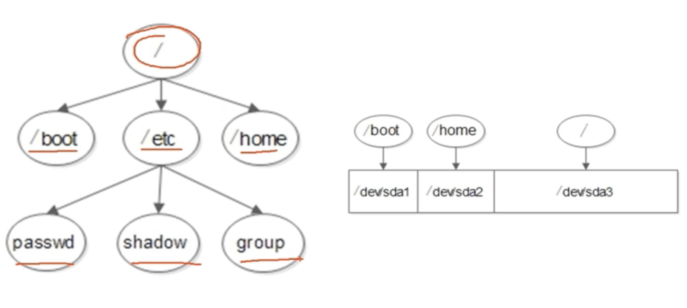

# Linux-10 2021-3-19

学习Linux的第10天

# 9.文件系统管理

## 2.2 系统分区

**1、磁盘分区**

**磁盘分区**是使用分区编辑器（partition editor）在磁盘上划分几个逻辑部分。碟片一旦划分成数个分区（Partition），不同类的目录于文件可以存储进不同的分区。

**分区类型**

- 主分区： 最多只能有4个
- 扩展分区：
  - 最多只能有1个。
  - 主分区加扩展分区最多有4个。
  - 不能写入数据，只能包含逻辑分区
- 逻辑分区

**2、格式化**

**格式化**（高级格式化）又称逻辑格式化，它是指根据用户选定的文件系统（如FAT16、FAT32、NTFS、EXT2、EXT3、EXT4等），在磁盘的特定区域写入特定数据，**在分区中划分出一片用于存放文件分配表、目录**等用于文件管理的磁盘空间。

**3、硬件设备文件名**

| 硬件              | 设备文件名          |
| ----------------- | ------------------- |
| IDE硬盘           | /dev/hd[a-d]        |
| SCSI/SATA/USB硬盘 | /dev/sd[a-p]        |
| 光驱              | /dev/cdrom /dev/sr0 |
| 软盘              | /dev/fd[0-1]        |
| 打印机            | /dev/ls[0-2]        |
| 打印机            | /dev/usb/lp[0-15]   |
| 鼠标              | /dev/mouse          |

**分区设备文件名**

- 设备文件名
  - /dev/had 1(ide硬盘接口)
  - /dev/sda 1(scsi硬盘接口、sata硬盘接口)

**4、挂载**

- 必须分区
  - / (根分区)
  - swap分区（交换分区，内存2倍，不超过2GB）
- 推荐分区
  - /boot (启动分区，200MB)

文件系统结构

/ 分区单独分配磁盘空间 /boot独立的磁盘空间	/home独立的磁盘空间

**总结**

- 分区： 把大硬盘分为小的逻辑分区
- 格式化：写入文件系统
- 分区设备文件名：给每个分区定义设备文件名
- 挂载：给每个分区分配挂载点

## 9.1 回顾分区和文件系统

**1、分区类型**

- 主分区： 总共最多只能分四个
- 扩展分区：只能有一个，也算作主分区的一种，也就是说主分区加扩展分区最多只能有四个。但是扩展分区不能存储数据和格式化，必须再划分成逻辑分区才能使用。
- 逻辑分区：逻辑分区是在扩展分区中划分的，如果是IDE硬盘，linux最多支持59个逻辑分区，如果是SCSI硬盘LIinux最多支持11个逻辑分区

**2、分区表示方法**

分区的设备文件名

| 分区      | 设备文件名 |
| --------- | ---------- |
| 主分区1   | /dev/sda1  |
| 主分区2   | /dev/sda2  |
| 主分区3   | /dev/sda3  |
| 扩展分区  | /dev/sda4  |
| 逻辑分区1 | /dev/sda5  |
| 逻辑分区2 | /dev/sda6  |
| 逻辑分区3 | /dev/sda7  |

文件系统： 

**ext2:** 是ext文件系统的升级版本，最大支持 16TB的分区和最大2TB的文件 。 Red Hat Linux 7.2

**ext3:** 和ext2最大的区别就是待日志功能，以提升系统的可靠性

**ext4:** 支持1EB文件系统和16TB文件，无限数量子目录

## 9.2 文件系统常用命令

### 9.2.1 df、du、fsck、dumpe2fs

**1、文件系统查看命令df**

df 【选项】【挂载点】

选项： -a 显示所有的文件系统信息，包括特殊文件系统，如/proc、/sysfs

​		-h.  使用习惯单位容量，如KB，MB或GB

​		-T   显示文件系统类型

​		-m 以MB为单位显示容量

​		-k 以KB为单位显示容量。默认就是KB为单位

**2、 统计目录或文件大小**

du 【选项】【目录或者文件名】

-a : 显示每个子文件的磁盘占用量。默认只统计子目录的磁盘占用量

-h : 使用习惯单位显示磁盘占用量

-s : 统计总占用量，而不列出子目录和子文件的占用量

> du命令和df命令的区别
>
> - df命令是从文件系统考虑的，不光要考虑文件占用的空间，还要统计被命令或程序占用的空间（最常见的就是文件已经删除，但是程序并没有释放的空间）
> - du命令是面向文件的，只会计算文件或者目录占用的空间

**3、文件系统修复命令fsck**

fsck  【选项】 分区设备文件名

-a : 不用显示用户提示，自动修复文件系统

-y : 自动修复。和-a 作用一致，不过有些文件系统只支持-y

**4、显示磁盘状态命令dumpe2fs**

dumpe2fs 分区设备文件名

### 9.2.2 挂载命令

**1、查询与自动挂载**

mount 【-l】 查询系统中已经挂载的盘符

mount 【-a】 依据配置文件/etc/fstab的内容，自动挂载

mount - o remount, noexec /home 重新挂载/boot分区，并使用noexec权限

mount - o remount, exec /home 记得改回来，要不然会影响系统启动

### 9.2.3 挂载光盘与U盘

mkdir /mnt/cdrom/ 建立挂载点

mount -t iso 9660 /dev/cdrom /mnt/cdrom  挂载光盘

mount /dev/sr0 /mnt/cdrom/

挂载u盘

fdisk -l 查看U盘设备文件名

mount -t vfat /dev/sdb1 /mnt/usb/

卸载命令：

umout 设备文件名或挂载点

### 9.2.4 支持NTFS文件系统

1. 编译内核
2. 下载NTFS-3G插件

## 9.3 fdisk分区

## 9.4 /etc/fstab 文件修复

## 9.5 分配swap分区