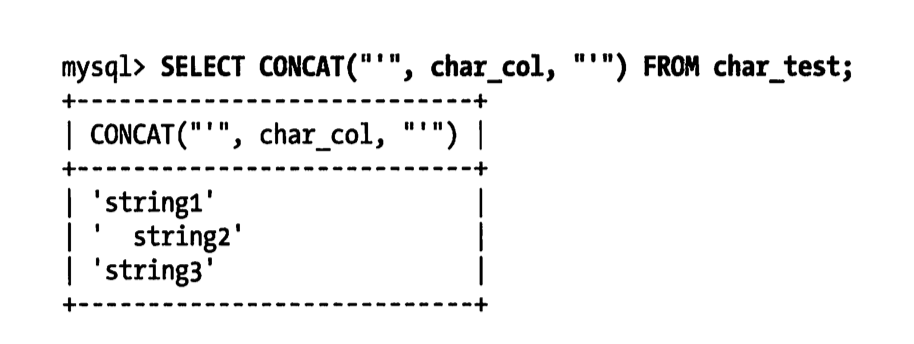
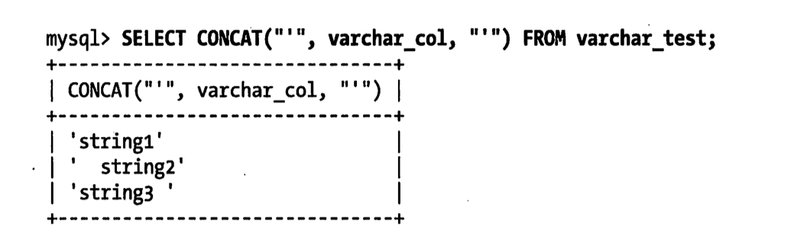
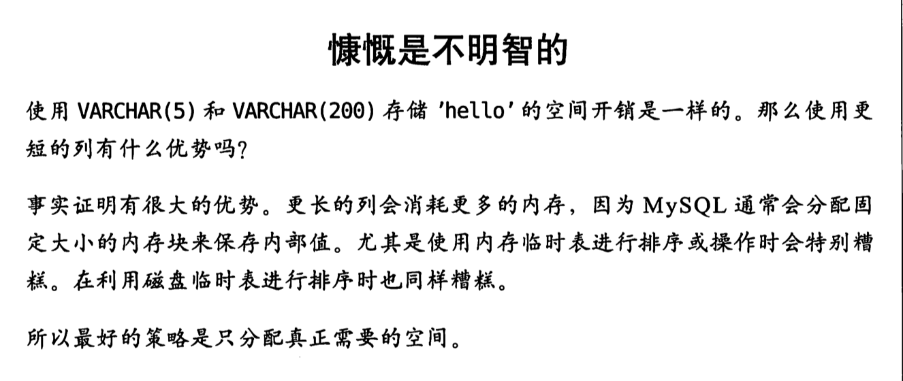
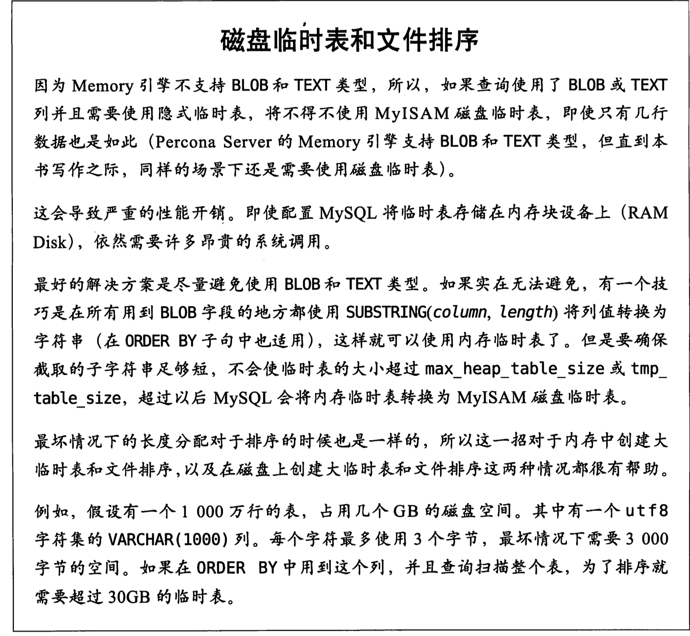
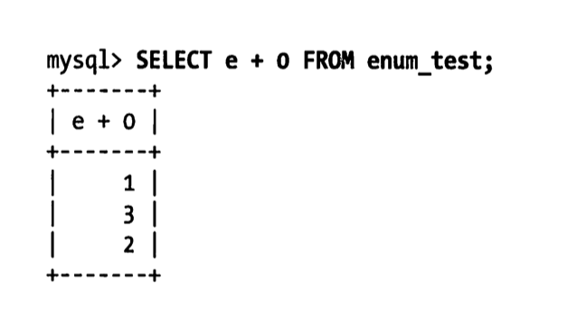
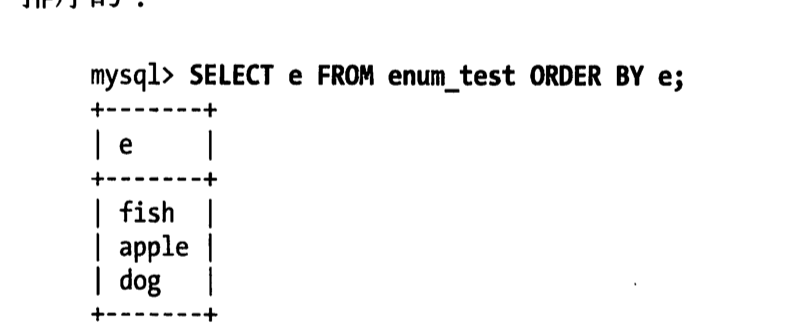
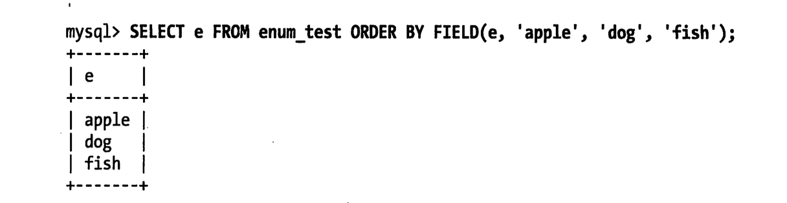
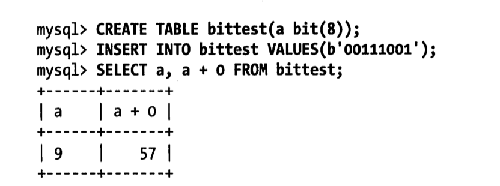
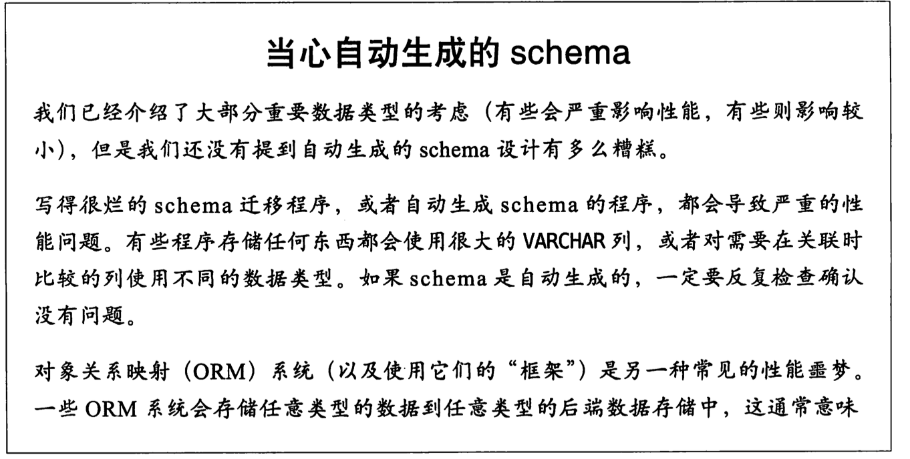
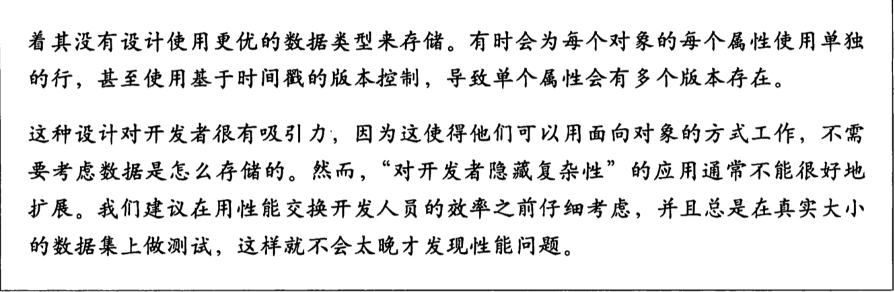

# 02 | Schema 与数据类型优化（第4章）

这一张主要关注的是MYSQL数据库的设计，主要介绍的是MYSQL数据库设计与其他关系型数据库管理的区别。

本章的内容是为下面两个章节做铺垫。这三章中，将讨论逻辑设计、物理设计和查询执行，以及它们之间的相互作用。

## 4.1 选择优化的数据类型

MySQL支持的数据类型非常多，选择正确的数据类型对于获得高性能至关重要。下面的一些原则非常重要：

- 更小的通常更好

  一般情况下，应该尽量使用可以正确存储数据的最小数据类型。更小的数据类型通常更快，因为它们占用更少的磁盘、内存和CPU缓存，并且处理时需要的CPU周期也更少。

  但要保证没有低估需要存储的值的范围，因为在schema中的多个地方增加数据类型的范围非常耗时。如果无法确定哪个数据类型最好，就选择你认为不会超过范围的最小类型。

- 简单就好

  简单数据类型的操作通常需要更少的cpu周期。比如：一个是应该使用mysql内建的类型而不是字符串来存储日期和时间，另外一个是应该用整型存储ip地址。

- 尽量避免null

  很多表都包含可为null的列，即使应用程序并不需要保存null也是如此，这是因为可为null是列的默认属性。通常情况下最好指定列尾not null，除非真的需要存储null值。

  如果查询中包含可为null的列，对mysql来说更难优化，因为可为null的列使得索引、索引统计和值都比较更复杂。可为null的列会使用更多的存储空间，在mysql里也需要特殊处理。当可为null的列被索引时，每个索引记录需要一个额外的字节，在myISAM里甚至还可能导致固定大小的索引变成可变大小的索引。

  通常把可为NULL的列改为not null带来的性能提升比较小，所以（调优时）没有必要首先在现有schema中查找并修改掉这种情况，除非确定这会导致问题。但是，如果在列上建索引，就应该尽量避免设计可为NULL的列。

  当然也有例外，例如值得一提的是，InnoDB使用单独的位（bit）存储NULL值，所以对于稀疏谁有很好的空间效率，但是这一点不适用于MyISAM。

在为列选择数据类型时，第一步需要确定合适的大类型：数字、字符串、时间等。

下一步是选择具体类型。很多MYSQL的数据类型可以存储相同类型的数据，只是存储的长度和范围不一样、允许的精度不同，或者需要的物理空间不同。

例如： datetime和timestamp列都可以存储相同类型的数据：时间和日期，精确到秒。

然而timestamp只使用datetime一半大存储空间，并且会根据时区变化，具有特殊的自动更新能力。另一方面，timestamp允许的时间范围要小的多，有时候其特殊能力会成为障碍。

***


### 4.1.1 整数类型
有两种类型的数字：整数和实数。

如果存储整数，可以使用这几种整数类型：tinyint,smallint,mediumint,int,bigint。分别使用8，16，24，32，64位存储空间。他们可以存储的值的范围为-2^(n-1)到2^(n-1)-1，其中N为存储空间的位数。

整数类型有可选的unsigned属性，表示不允许负值，这大致可以使正数的上限提高一倍。

例如tinyint sunsigned的范围为0～255,而tinyint的存储范围为-128～127。

有符号和无符号类型使用相同的存储空间，并具有相同的性能，因此可以根据实际情况选择合适的类型。

你的选择决定Mysql是怎么在内存和磁盘中保存数据的。然而，整数计算一般使用64位的bigint整数，即使在32位环境也是如此。

**mysql可以为整数类型指定宽度，例如int(11)，对大多数应用这是没有意义的；它不会限制值的合法范围，这是规定了msql的一些交互工具用来显示字符的个数**。对于存储和计算来说，int(1)和int(20)是相同的。

***


### 4.1.2 实数类型

实数的带有小数部分的数字。然而，它们不只是为了存储小数部分；也可以使用decimal存储比bigint还大的整数。Mysql即支持精确类型，也支持不精确类型。

float和double类型支持使用标准的浮点运算进行近视计算。如果需要知道浮点运算是怎么计算的，则需要研究所使用的平台的浮点数的具体实现。

decimal类型用于存储精确的小数。在mysql5.0和更高版本，decimal类型支持精确计算。mysql 4.1以及更早版本则使用浮点运算来实现decimal的计算，这样做会因为精度损失导致一些奇怪的结构。在这些版本的mysql里，decimal只是一个“存储类型”。

因为cpu不支持对decimal的直接计算，所以在mysql 5.0以及更高版本中，mysql服务器自身实现了decimal的高精度计算。相对而言，cpu直接支持原生浮点计算，所以浮点运算明显更快。

浮点和decimal类型都可以指定精度。对于decimal列，可以对小数点前后所允许的最大位数。mysql5.0和更高版本将数字打包到一个二进制字符串中（每4个字节存储9个数字）。例如，decimal(18,9)小数点两边各存储9个数字，一共使用9个字节：小数点前到数字使用4个字节，小数点后到数字用4个字节，小数点本身占1个字节。

mysql5.0和更高版本中的decimal类型允许最多65个数字。而早期的mysql版本中这个限制是254个数字，并且保存为未压缩的字符串（每个数字一个字节）。然而，这些版本并不能在计算中使用这么大的数字，因为的decimal只是一种存储格式；在计算中decimal会转换为double类型。

有多种方法可以指定浮点列所需要的精度，这会使得mysql悄悄选择不同的数据类型，或者在存储时对值进行取舍。这些精度定义是非标准的，所以我们只指定数据类型，不指定精度。

浮点类型在存储同样范围的值时，通常比decimal使用更少的空间。float使用4个字节。double使用8个字节，相比于float有更高的精度和更大的范围。和整数类型一样，能选择的只是存储类型；mysql使用double作为内部浮点计算的类型。

**因为需要额外的空间和计算开销，所以应该尽量只在对小数进行精确计算时才使用decimal-例如存储财务数据。但在数据量比较大时，可以考虑使用bigint代替decimal，将需要存储的货币单位根据小数的位数乘以相应的倍数即可。假设要存储财务数据精确到万分之一分，则可以把所有金额乘以一百万，然后将结果存储在bigint里，这样可以同时避免浮点存储计算不精确和decimal精确计算代价高的问题。**

***


### 4.1.4 字符串类型

mysql支持多种字符串类型，每种类型还有很多变种。这些数据类型在4.1和5.0版本发生了很大的变化，使得情况更加复杂。从Mysql 4.1开始，每个字符串列可以定义自己的字符集和排序规则，或者说校对规则。有性能影响。

**varchar 和 char 类型**

varchar 和 char 是两种最主要的字符串类型。不幸的是，很难精确地解释这些值是怎么存储在磁盘和内存中的，因为这跟存储引擎的具体实现有关。下面假设使用的存储引擎是InnoDB 或者 MyISAM。如果使用的不是这两种存储引擎，请参考所使用的存储引擎的文档。

先看看varchar和char值通常在磁盘上怎么存储。请注意，存储引擎存储char或者varchar值的方式在内存和在磁盘上可能不一样，所以mysql服务器从存储引擎读出的值可能需要转换为另一种存储格式。下面是关于两种类型的一些比较。

varchar

​	`varchar类型用于存储可变长字符串，是最常见的字符串数据类型。它比定长类型更节省空间，因为它仅使用必要的空间（例如，越短的字符串使用越少的空间）。有一种情况例外，如果mysql表使用row_format=fixed创建的话，每一行都会使用定长存储，这会浪费空间。`

​	`varchar需要使用1或2个额外字节记录字符串的长度：如果列的最大长度小于255字节，则只使用一个字节表示，否则使用2个字节。劫杀采用latin1字符集，一个varchar(10)的列需要11个字节的存储空间。varchar(1000)`的列则需要1002个字节，因为需要2个字节存储长度信息。

​	`varchar节省了存储空间，所以对性能也有帮助。但是，由于行是变长的，在update时可能使行变得比原来更长，这就导致额外的工作。如果一个行占用的空间增长，并且在页内没有更多的空间可以存储，在这种情况下，不同的存储引擎的处理方式是不一样的。例如MyISAM会将行拆成不同的片段存储，InnoDB则需要分裂页来使行可以放进页内。其他一些存储引擎也许不在原数据位置更新数据。`

下面这些情况使用varchar是合适的：字符串列的长度最大比平均长度大很多；列的更新很少，所以碎片不是问题；泗洪了像utf-8这样复杂的字符集，每个字符都使用不同的字节数进行存储。

在5.0或者更高版本，Mysql在存储和检索时会保留空格。但在4.1或更老的版本，MySql会剔除末尾空格。

InnoDB则更灵活，它可以把过长的varchar存储为BLOB,我们稍后讨论这个问题。

char

​	`char类型是定长的：mysql总是根据定义的字符串长度分配足够的空间。当存储char值时，mysql会删除所有末尾空格。char值hi根据需要采用空格进行填充以方便比较。`

​	`char适合存储很短的字符串，或者所有值都接近同一个长度。例如，char非常适合存储密码的md5值，因为这是一个定长的值。对于经常变更的数据，char也比varchar更好，因为定长的char类型不容易产生碎片。对于非常短的列，char也比varchar在存储空间上更有效率。例如用char(1)来存储只有y和n的值，如果采用单字节字符集值只需要一个字节，但是varchar(1)却需要两个字节，因为还有一个记录长度的额外字节。`


CHAR类型的这些行为可能有一点难以理解，下面通过一个具体的例子来说明。首先，我们创建一张只有一个char(10)字段的表并且往里面插入一些值：

```mysql
mysql> create table char_test(char_col char(10));
mysql> insert into char_test(char_col) values -> ('string1'),('  string2'),('string3  ');
```

当检索这些值的时候，会发现string3末尾的空格被截断了。



如果用varchar(10)字段存储相同的值，可以得到如下结果：



数据如何存储取决于存储引擎，并非所有的存储引擎都会按照相同的方式处理定长和变长的字符串。Memory引擎只支持定长的行，即使有变长字段也会根据最大长度分配最大空间。不过，填充和截取空格的行为在不同存储引擎都是一样的，因为这是在MYSQL服务器层进行处理的。

与char 和 varchar 类似的类型还有 binary和 varbinary，它们存储的是二进制字符串。二进制字符串跟常规字符串非常相似，但是二进制字符串存储的是字节码而不是字符。填充也不一样：Mysql填充binay采用的是\0而不是空格，在检索时也不会去掉天充值。

当需要存储二进制数据，并且希望Mysql使用字节码而不是字符进行比较时，这些类型非常有用。Mysql比较Binary字符串时，每次按一个字节，并且根据该字节的数值进行比较。因此，二进制比较比字符比较简单很多，所以也就更快。



**BLOB和TEXT类型**

BLOB和TEXT都是为存储很大的数据而设计的字符串数据类型，分别采用二进制和字符方式存储。

实际上，他们分别属于两组不同的数据类型家族：

- 字符类型是：tiny text，smallText，test,mediumtext，longtext
- 二进制类型是： tiny blob,small blob, blob,mediumblob,longblob。

BLOB是SMALLBLOB的同义词，TEXT是SMALLTEXT的同义词。

与其他类型不同，MySQL把每个BLOB和TEXT值当作一个独立的对象处理。存储引擎在存储时通常会做特殊处理。当BLOB和TEXT值太大时，InnoDB会使用专门的“外部”存储区域来进行存储，此时每个值在行内需要1-4个字节存储一个指针，然后在外部存储区域存储实际的值。

BLOB和TEXT家族之间仅有的不同的是BLOB类型存储的是二进制数据，没有排序规则或者字符集，而TEXT类型有字符集和排序规则。

MySQL对BLOB和TEXT列进行排序与其他类型是不同的：它只对每个列的最前max_sort_length字节而不是整个字符串做排序。如果只需要排序前面一小部分字符，则可以减小max_sort_length的配置，或者使用order by substring(column,length)。

Mysql不能讲BLOB和TEXT列全部长度的字符串进行索引，也不能使用这些索引消除排序。



**使用枚举代替字符串类型**

有时候可以使用枚举列代替常用的字符串类型。枚举列可以把一些不重复的字符串存储成一个与定义的集合。Mysql在存储枚举时非常紧凑，会根据列表值的数量压缩到一个或者两个字节中。Mysql在内部会将每个值在列表中的位置保存为整数，并且在表的.frm文件中保存“数字-字符串”映射关系的“查找表”。下面有一个例子：


这三行数据实际存储为整数，而不是字符串。可以通过在数字上下文环境检索看到这个双重属性。



如果使用数字作为enum枚举常量，这种双重性很容易导致混乱，例如enum('1','2','3')。建议尽量避免这样做。

另外一个让人吃惊的地方是，枚举字段是按照内部存储的整数而不是定义的字符串进行排序的：



一种绕过这种限制的方式是按照需要的顺序来定义枚举列。另外也可以在查询中使用field()函数显式地指定排序顺序，但这会导致MySql无法利用索引消除排序。



如果在定义时就是按照字母的顺序，就没有必要这么做了。

枚举最不好的地方是，字符串列表是固定的，添加或删除字符串必须使用alter table。因此，对于一系列未来可能会改变的字符串，使用枚举不是一个好主意，除非能接受只在列表末尾添加元素，这样在MYSQl5.1中就可以不重建整个表来完成修改。

由于Mysql把每个枚举值保存为整数，并且必须进行查找才能转换为字符串，所以枚举列有一些开销。通常枚举的列表都比较小，所以开销还可以控制，但也不能保证一直如此。在特定情况下，把char/varchar列与枚举列进行关联可能会比直接关联char/varchar列更慢。

转换列为枚举类型还有另一个好处。根据show table status命令输出结果中data_length列的值，把这两列转换成enum可以让表的大小缩小1/3。通过转换后主键也只有原来的一半大小了。因为这是InnoDB,如果表上有其他索引，减小主键大小也会使非主键索引也变得更小。

***


### 4.1.4 日期和时间类型

MySql可以使用许多类型来保存日期和时间值，例如year和date。Mysql能存储的最小时间粒度为秒。但是Mysql也可以使用微秒级的粒度进行临时运算，我们会展示怎么绕开这种存储限制。

大部分时间类型都没有代替品，因此没有什么是最佳选择的问题。唯一的问题是保存日期和时间的时候需要做什么。Mysql提供两种相似的日期类型：DATETIME和TIMESTAMP。对于很多应用程序，他们都能工作，但是在某些场景，一个比零一个工作得好。

DATETIME

​	这个类型能保存大范围的值，从1001年到9999年，精度为秒。它把日期和时间封装到格式为YYYYYMMDDHHMMSS的整数中，与时区无关。使用8个字节的存储空间。

​	默认情况下，MYSQL是一种可排序的、无歧义的格式显示DATETIME的值，例如"2008-01-15 22:37:08"。这是ANSI标准定义的日期和时间表示方法。

TIMESTAMP

​	就像它的名字一样，TIMESTAMP类型保存了从1970年1月1日午夜以来的秒数，它和UNIX时间戳相同。TIMESTAMP只使用了4个字节的存储空间，因此它的范围比DATETIME小的多；只能表示从1970年到2039年。MYsql提供了FROM_UNIXTIME()函数把Unix时间戳转换为日期，并提供了UNIX_IMESTAMP（）函数把日期转换为Unix时间戳。

​	MYSQL4.1以及更新的版本按照DATETIME的方式格式化TIMESTAMP的值。

​	TIMESTAMP显示的值也依赖时区。MySQL服务器、操作系统，以及客户端连接都有时区设置。

​	因此，存储为0的TIMESTMP在美国东部时区和格林尼治的时间会有差异。有必要强调一下这个区别：如果在多个时区存储或访问数据，TIMESTAMP和DATETIME的行为将很不一样。强者提供的值与时区有关系，后者则保留文本表示的日期和时间。

​	TIMESTAMP也有DATETIME没有的特殊属性。默认情况下，如果插入时没有指定第一个TIMESTAMP列的值，MYSQl则设置这个列的值为 “当前时间”。在插入一行记录时，MYSQL默认也会更新第一个TIMESTAMP列的值（除非在UPDATE语句中明确指定值）。你可以配置任何TIMESTAMP列的插入和更新行为。最后，TIMESTAMP列默认值为NOT NULL，这也和其他的数据类型不一样。

除了特殊行为之外，通常也应该尽量使用TIMESTAMP，因此它比DATETIME空间效率更高。有时候人们会将UNIx时间戳存储为整数值但这不会带来任何收益。用整数保存时间戳的格式通常不方便处理，所以我们不推荐这样做。

可以用bigint类型存储微妙级别的时间戳，或者使用double存储秒之后的小数部分。也可以使用MariaDB代替MYsql。

***

### 4.1.5 位数据类型

Mysql有少数几种存储类型使用紧凑的位存储数据。所有这些位类型，不管底层存储格式和处理方式如何，从技术上来说都是字符串类型。

Bit

​	在mysql5.0之前,bit 是tinyint的同义词。但是在mysql5.0 以及更新版本，这是一个特性完全不同的数据类型。下面将讨论bit类型新的行为特性。

​	可以使用bit列在一列冲存储一个或者多个true/false值。bit(1)定义一个包含单个位的字段，bit(2)可以存储2个位，依次类推，bit列的最大长度是64个位。

​	bit的行为因存储引擎而异。MyISAM会打包所有的BIT列，所以17个单独的BIT列只需要17个位存储，这样MYISAM只使用3个字节就能存储这17个bit列。其他存储引擎例如Memory和InnoDB，为每个Bit列使用一个足够存储的最小整数类型来存放，所以不能节省存储空间。

​	MYSQL把BIT当作字符串类型，而不是数字类型。当检索bit(1)的值时，结果是一个包含二进制0或1值的字符串，而不是ascii码的"0"或"1"。然而，在数字上下文的场景中检索时，结果将是位字符串转换成数字。



这是相当令人费解的，所以我们认为应该谨慎使用bit类型。所以对大部分应用，最好避免使用这种类型。

如果想在一个bit的存储空间存储一个true/false值，另一个方法是创建一个可以位空的char(0)列。该列可以保存空值（NULL）或者长度为零的字符串（空字符串）。

Set

​	一种代替set的方式是使用一个整数包装一系列的位。例如可以把8个位包装到一个tinyint中，并且按照位操作来使用。可以在应用中为每个位定义名称常量来简化这个工作。

***

### 4.1.6 选择标识符（identifier)

为标识列选择合适的数据类型非常重要。一般来说更有可能用标识列与其他值进行比较（例，在关联操作中），或者通过标识列寻找其他列。标识列也可能在另外的表中作为外键使用，所以为标识列选择数据类型时，应该选择跟关联表中的对应列一样的类型。

当选择标识列的类型时，不仅仅需要考虑存储类型，还需要考虑MYSQl对这种类型怎么执行计算和比较。例如MYSQL在内部使用整数存储ENUM和SET类型，然后在做比较操作时转换为字符串。

一旦选定了一种类型，要确保在所有关联表中都使用童颜更多类型。类型之间需要精确匹配，包括像unsigned这样的属性。混用不同数据类型可能导致性能问题，即使没有性能影响，在比较操作时隐式转换也可讷讷个导致很难发现的错误。这种错误可能会很久以后才turn出现，那时候可能都已经忘记是在比较不同的数据类型。

在可以满足值的范围的需求，并且预留未来增长空间的前提下，应该选择最小的数据类型。例如有一个state_id列存储美国各州的名字，就不需要几千或者几百万个值，所以不需要使用int。tiny_int足够存储，并且比int少了3个字节。如果用这个值作为其他表的外间，3个字节可能导致很大的性能差异。

下面是一些小技巧：

- 整数类型：整数通常是标识列最好的选择，因为它们很快并且可以使用auto_increment。
- enum和set类型：对于标识列来说，enum和set通常是一个糟糕的选择，尽管对某些只包含固定状态或者类型的静态“定义表”来说可能没有问题的。enum和set列市和存储固定信息，例如有序的状态、产品类型、人的性别。举个例子，如果使用枚举字段来定义产品类型，也许会设计一张以这个枚举字段为主键的查找表。这时，使用枚举类型作为标识列是可行的，但大部分情况下都要避免这么做。

- 字符串类型：如果可能，应该避免使用字符串类型作为标识列，因为它们很消耗空间，并且通常比数字类型慢。尤其在MyISQMQ表里使用字符串作为标识列时要特别小心。MyISQM默认对字符串使用压缩索引，这会导致查询慢得多。在我们的测试中，我们注意到最多有6倍的性能下降。

  对于完全“随机”的字符串也需要多家注意，例如md5()、sha1()产生的字符换。这些函数生成的新值会任意分布在很大的空间内，这会导致insert以及一些select语句变得很慢。

  - 因为插入值会随机地写道索引的不同位置，所以是的insert语句更慢。这会导致页分裂、磁盘随机访问，以及对于聚簇存储引擎残生聚簇索引碎片
  - select语句会变得很慢，因为逻辑上相邻的行会分布在磁盘和内存的不同地方。
  - 随机值导致缓存对所有类型的查询语句效果都很差，因为会使得缓存赖以工作的访问局部性原理失效。如果整个数据集都一样的“热”，那么缓存任何一部分特定数据到内存都没有好处；如果工作集比内存在，缓存将会有很多刷新和不命中。

如果存储uuid值，则应移除“-”符号；或者更好的做法，用unhex()函数转换成uuid值为16字节的数字，并且存储在一个binary（16）列中。检索时可以通过hex()函数来格式化为16进制格式。





***

### 4.1.7 特殊类型数据

某些类型的谁并不直接与内置类型一致。比如低于秒级的时间戳。

另一个例子是ipv4地址。人们经常使用varchar(15)列来存储IP地址。然后，他们实际上是32位无符号整数，不是字符串。用小数点将地址分成四段的表示方法只是位了让人们阅读容易。所以应该使用无符号整数存储ip地址。Mysql提供了INET_ATON()和INET_NTOA()函数在这两种表示方法之间转换。

***


## 4.2 MYSQl schema 设计中的陷阱

虽然有一些普遍的好或坏的设计原则，