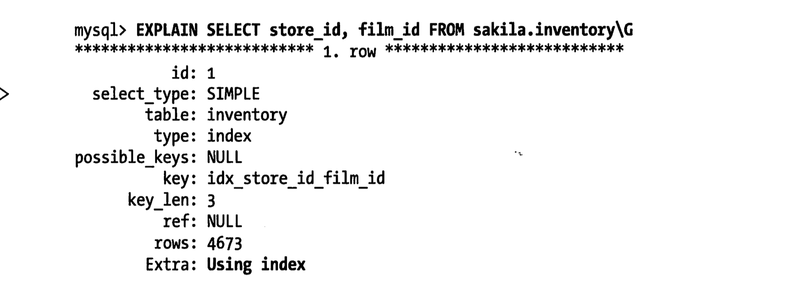
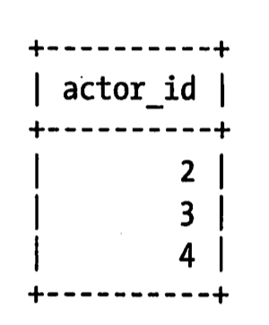

#  03 | 创建高性能的索引（第5章）

索引(在MySQL也叫做“键（key)”)是存储引擎用于快速找到记录的一种数据结构。这是索引的基本功能，除此之外，本章还将讨论索引其他一些方面有用的属性。

索引对于良好的性能非常关键。尤其是当表中的数据量越来越大时，索引对性能的影响愈发重要。在数据量较小且负载较低时，不恰当的索引对性能的影响可能还不明显，但当数据量主键增长时，性能则会急剧下降。

不过，索引却经常被忽略，有时候甚至被误解，所以在实际案例中经常会遇到由糟糕索引导致的问题。这也是我们把索引优化放在靠前的章节，甚至比查询优化还靠前的原因。

索引优化应该是对查询性能优化最有效的手段了。索引能够轻易将查询性能提高几个数量级，“最优”的索引有时比一个“好的”索引性能要好两个数量级。创建以个真正“最优”的索引经常需要重写查询，所以，本章和下一章的关系非常亲密。

## 5.1 索引基础

要理解MySQL中索引是如何工作的，最简单的办法就是去看看一本书的“索引”部分：如果想在一本书中找到某个特定主题，一般会先看书的“索引”，找到对应的页码。

在MySQL中，存储引擎用类似的方法使用索引，其先在索引中找到对应值，然后根据匹配的索引记录找到对应值，然后根据匹配的索引记录找到对应的数据行。假如要运行下面的查询：

```mysql
select first_name 
from sakila.actor 
where actor_id = 5;

```

如果在actor_id列上建有索引，则MySQL将使用该索引找到actor_id为5的行，也就是说，MySQL先在索引上按值进行查找，然后返回索引包含该值的数据行。

索引可以包含一个或多个列的值。如果索引包含多个列，那么列的顺序也十分重要，因为MySQL只能高效地使用索引的最左前前缀列。创建一个包含两个列的索引，和创建两个只包含一列的索引是大不相同的，下面将详细介绍。

**tips:如果使用的是ORM，是否还需要关心索引？**

`简而言之：是的，仍然需要理解索引，即使是使用对象映射（ORM）工具。`

`ORM工具能够生产复合逻辑的、合法的查询（多数时候），除非只是生成非常基本的查询（例如仅是根据主键查询），否则它很难生成适合索引的查询。无论是多么复杂的ORM工具，在精妙和复杂的索引面前都是“浮云”。读完本章后面的内容以后，你就会同意这个观点的！很多时候，即使是查询优化技术专家也很难兼顾到各种情况，更别说是ORM了。`

### 5.1.1 索引的类型

索引有很多中类型，可以为不同的场景提供更好的性能。在MySQL中，索引是在存储引擎层而不是服务器层实现的。索引，并没有统一的索引标准：不同存储引擎的索引的工作方式并不一样，也不是所有的存储引擎都支持所有类型的索引。即使多个存储引擎支持同一种类型的索引，其底层的实现也可能不同。

下面我们先来看看MySQL支持的索引类型，以及它们的优点和缺点。

#### **B-Tree索引**

当人们谈论索引的时候，如果没有特别指明类型，那多半说是B-Tree索引，它使用B-Tree数据结构来存储数据。大多数MySQL引擎都支持这种索引。Archive引擎是一个例外：5.1之前Archive不支持任何索引，直到5.1才开始支持单个自增列的索引。

我们使用术语“B-Tree”，是因为MySQL在Create Table和其他语句中也使用该关键字。

不过，底层的存储引擎也可能使用不同的存储结构，例如，NDB集群存储引擎内部实际上使用了T-Tree结构存储这种索引，即使其名字是BTREE；InnoDB则使用的是B+Tree，各种数据结构和算法的变种不在本书的讨论范围之内。

存储引擎以不同的方式使用B-Tree索引，性能也各有不同，各有优劣。例如，MyISAM使用前缀压缩技术使得索引更小，但InnoDB则按照原数据格式进行存储。再如MyISAM索引通过数据的物理位置引用被索引的行，而InnoDB则根据主键引用被索引的行。

B-Tree通常意味着所有的值都是按顺序存储的，并且每一个叶子到根的距离相同。图5.1展示了B-Tree索引的抽象表示，大致反映了InnoDB索引是如何工作的。MyISAM使用的结构有所不同，但基本思想是类型的。


B-Tree索引能够加快访问数据的速度，因为存储引擎不再需要进行全表扫描来获取需要的数据，取而代之的是从索引的根节点（图至并未画出）开始进行搜索。根节点的槽中存放了指向子节点的指针，存储引擎根据这些执行向下层查找。通过比较节点页的值和要查找的值可以找到合适的指针进入下层子节点，这些指针实际上定义了子节点页中值的上限和下限。最终存储引擎要么是找到对应的值，要么记录不存在。

叶子节点比较特别，它们的指针指向的是被索引的数据，而不是其他的节点页（不同引擎的“指针”类型不同）。图5-1中绘制了一个节点和其对应的叶子节点，其实在根节点和叶子节点之间可能有很多层节点页。树的深度和表的大小直接相关。

B-Tree对索引列是顺序组织存储的，所以很适合查找范围数据。例如，在一个基于文本域的索引树上，按字母顺序传递的值进行查找是非常合适的，所以像“找出所有以I到K开头的名字”这样的超着效率会非常高。

假设有如下数据表：

```mysql
create table People(
	last_name varchar(50) not null,
  first_name varchar(50) not null,
  dob date not null,
  gender enum('m','f') not null,
  key(last_name, first_name, dob)
);
```

对于表中的每一行数据，索引中包含了last_name、first_name和dob列的值，图5-5显示了该索引是如何组织数据的存储的。


请注意，索引对多个值进行排序的依据是create table语句中定义索引时列的顺序。看一下最后两个条目，两个人的姓和名都一样，则根据它们的出生日期来排列顺序。

可以使用B-Tree索引的查询类型。B-Tree索引适用于全键值、键值范围或键前缀查找。其中键前缀查找只适用于根据最左前缀的查找。前面所述的索引对如下类型的查询有效。

**全值匹配**

​	全职匹配指的是和索引中的所有列进行匹配，例如前面提到的索引可用于查找姓名为Cuba Allen、出生于1960-01-01的人。

**匹配最左前缀**

​	前面提到的索引可用于查找所有姓为Allen的人，即只使用索引的第一列。

**匹配列前最**

​	也可以只匹配某一列的值的开头部分。例如前面提到的索引可用于查找所有以J开头的姓的人。这里也只使用了索引的第一列。

**匹配范围值**

​	例如前面的索引可用于查找姓在Allen和Barraymore之间的人。这里也只使用了索引的第一列。

**精确匹配某一列并范围匹配另外一列**

​	前面提到的索引也可用于查找所有姓为Allen，并且名字是字母K开头（比如Kim、Karl等）的人。即第一列last_name圈匹配，第二列first_name范围匹配。

**只访问索引的查询**

​	B-Tree通常可以支持“只访问索引的查询”，即查询只需要访问索引，而无须访问数据行。后面我们将单独讨论这种“覆盖索引”的优化。


因为索引树中的节点是有序的，所以除了按·值查找之外，索引还可以用于查询中的order by操作（按顺序查找）。一般来说，如果B-Tree可以按照某种方式查找到值，那么也可以按照这种方式用于排序。所以，如果order by 子句满足前面列出的几种查询类型，则这个索引也可以满足对应的排序需求。

下面是一些关于B-Tree索引的限制：

- 如果不是按照索引的最左列开始查找，则无法使用索引。例如上面例子中的索引无法查找名字为Bill 的人，也不发查找某个特定生日的人，因为这两列都不是最左数据列。类似地，也无法查找姓氏以某个字母结尾的人。
- 不能跳过索引中的列。也就是说，前面所述的索引无法用于查找姓为Smith并且在某个特定日期出生的人。如果不指定名(first_name)，则Mysql只能使用索引的第一列。
- 如果查询中有某个列的查询范围，则其右边的所有列都无法使用索引优化查找。例如在查询where last_name = 'Smith' And first_name like 'J%' And dob = '1976-12-13'，这个查询只能使用索引的前两列，因为这里like是一个范围条件。如果范围查询列值的数量有限，那么可以通过使用多个等于条件来代替范围条件。在本章的索引案例学习部分，我们将演示一个详细的案例。

到这里读者应该明白，前面提到的索引列的顺序是多么的重要：这些限制都和索引列的顺序有关。在优化性能的时候，可能需要使用相同的列但顺序不同的索引来满足不同类型的查询需求。

也有些限制并不是B-Tree本身导致的，而是Mysql优化器和存储引擎使用索引的方式导致的，这部分限制在未来的版本中可能就不再是限制了。


#### 哈希索引

哈希索引（hash index )基于哈希表实现，只有精确匹配索引所有列的查询才有效。对于每一行数据，存储引擎都会对所有的索引列计算一个哈希码（hash code)，哈希码是一个较小的值，并且不同键值的行计算出来的哈希码也不一样。哈希索引将索引的哈希码存储在索引中，同时在哈希表中保存指向每个数据行的指针。

在MySQL中，只有Memory引擎显示支持哈希索引。这也是Memory引擎表的默认索引类型，Memory引擎同时也支持B-Tree索引。值得一提的是Memory引擎是支持非唯一哈希索引的，这在数据库世界里面是比较与众不同的。如果多个列的哈希值相同，索引会以链表的方式存放多个记录指针到同一个哈希条目中。

下面来看一个例子。假设有如下表：

```mysql
create table testhash (
		fname varchar(50) not null,
		lname varchar(50) not null,
		key using hash(fname)
	)engine = memory
```

表中包含如下数据：


假设索引使用假想的哈希函数f()，它返回下面的值（都是示例数据）

```mysql
f('Arjen') = 2333
f('Baron') = 7437
f('Peter') = 8784
f('Vadim') = 2458
```

则哈希索引的数据结构如下：


注意每个槽的编号是顺序的，但是数据行不是。现在，来看如下查询：

```mysql
select lname from testhash where fname = 'Peter'
```

MySQL先计算'Peter'的哈希值，并使用该值寻找对应的记录指针。因为f('Peter') = 8784，所以MySQL仔索引中查找8784，可以找到指向第3行的指针，最后一步是比较第三行的值是否为‘Peter’，以确保就是要查找的行。

因为索引自身只需要存储对应的哈希值，所以索引的结构十分紧凑，这也让哈希索引查找的速度非常快。然而，哈希索引也有它的限制：

- 哈希索引只包含哈希值和行指针，而不存储字段值，所以不能使用索引中的值来避免读取行。不过，访问内存中的行的速度很快，所以大部分这一点对性能的影响并不明显。
- 哈希索引数据并不是按照索引值顺序存储的，所以也就无法用于排序。
- 哈希索引也不支持部分索引列匹配查找，因为哈希索引始终是使用索引列的全部内容来计算哈希值的。例如，在数据列（A，B）上建立哈希索引，如果查询只有数据列A，则无法使用该索引。
- 哈希索引只支持等值比较查询，包括=、IN()、<=>也不支持任何范围查询，例如where prive > 100。
- 访问哈希索引的数据非常快，除非有很多哈希冲突。当出现哈希冲突的时候，存储引擎必须遍历链表中所有的行指针，逐行进行比较，知道找到所有符合条件的行。
- 如果哈希冲突很多的话，一些索引维护操作的代价也会很高。例如，如果在某个选择性很低的列上建立哈希索引，那么当从表中删除遗憾个时，存储引擎需要遍历对应哈希值当链表中的每一行，找到并删除对应行的引用，冲突越多，代价越大。

因为这些限制，哈希索引只适用于某些特定的场合。而一旦适合哈希索引，则它带来的性能提升讲非常显著。举个例子，在数据仓库应用中有一种经典的“星型”schema，需要关联很多查找表，哈希索引就非常适合查找表的需求。

除了Memory引擎外，NDB集群引擎也支持唯一哈希索引，且在NDB集群引擎中作用非常特殊，但这不属于本书的范围。

InnoDB引擎有一个特殊的功能叫做“自适应哈希索引（adaptive hash index)”。当InnoDB注意到某些索引值被使用得非常频繁时，它会在内存中基于B-Tree索引之上再创建一个哈希索引，这样就让B-Tree索引也具有哈希索引的一些优点，比如快速的哈希查找。这是一个完全自动的，内部的行为，用户无法控制或者配置，不过如果有必要，完全可以关闭该功能。

**创建自定义哈希索引**。如果存储引擎不支持哈希索引，则可以模拟像InnoDB一样创建哈希索引，这可以享受一些哈希索引的便利，例如只需要很小的索引就可以为超长的键创建索引。

思路很简单：在B-Tree基础上创建一个伪哈希索引。这和真正的哈希索引不是一回事，因为还是使用B-Tree进行查找，但是它使用哈希值而不是键本身进行索引查找。你需要做的就是在查询的where子句中手动置顶使用哈希函数客户。

下面是一个实例，例如需要存储大量的URL，并需要根据URL进行搜索查找。如果使用B-Tree来存储URL，存储的内容就会很大，因为URL本身都很长。正常情况下会有如下查询：

```mysql
select id frmo url where url = "http://www.mysql.com";
```

若删除原来URL列山过的索引，而新增一个被索引的url_crc列，使用crc32座哈希，就可以使用下面的方式查询：

```mysql
select id from url where url = "http://www.mysql.com" and
url_crc = CRC32("http://www.mysql.com");
```

这样做的性能会非常高，因为Mysql优化器会使用这个选择性很高而体积很小的基于url_crc列的索引来完成查找（在上面的案例中，索引值为1560514994）。即使有很多个记录有相同的索引值，查找仍然很快，只需要根据哈希值做快速的整数比较就能找到索引条目，然后一一比较返回对应的行。另外一种方式就是对完整的URL字符串做索引，那样会非常慢。

这样实现的缺陷是需要维护哈希值。可以手动维护，也可以使用触发器实现。下面的案例演示了触发器如何在插入和更新时维护url_crc列。首先创建如下表：

```mysql
create table pseudohash(
	id int unsigned not null auto_increment,
	url varchar(255) not null,
	url_crc int unsigned not null default 0,
	primary key(id)
);
```

然后创建触发器。先临时修改一下语句分隔符，这样就可以在触发器定义中使用分号：

```mysql
delimiter 
create trigger pseudohash_crc_ins 
before insert on pseudohash
for each row
begin 
set new.url_crc = crc32(NEW.url);
end;

create trigger pseudohash_crc_upd 
before update on pseudohash
for each row 
begin
set New.url_crc = crc32(NEW.url);
end;
delimiter;

```

剩下的 工作就是验证一下触发器如何维护哈希索引：


如果采用这种方式，记住不要使用SHA1（）和MD5（）作为哈希函数。因为这两个函数计算出来的哈希值是非常长的字符串，会浪费大量空间，比较时也会跟慢。SHA1（）和MD5（）是强加密函数，设计目标是最大限度消除冲突，但这里并不需要这样高的要求。简单哈希函数的冲突在一个可以接受的范围，同时又能够提供更好的性能。

如果数据表非常大，CRC32（）会出现大量的哈希冲突，则可以考虑自己设限一个简单的64位哈希函数。这个自定义函数要返回整数，而不是字符串。一个简单的办法可以使用MD5（）函数返回值的一部分来作为自定义哈希函数。这可能比自己写一个哈希算法性能要差（参考第7章），不过这样实现最简单：


> conv("",16,10) 将16进制转换为10进制
>
> right()提取，右边的16个数

处理哈希冲突。当使用哈希索引进行查询的时候，必须在where子句中包含常量值


一旦出现哈希冲突，另一个字符串的哈希值也恰好是1560614994，则下面的查询是无法正确工作的。


因为所谓的“生日悖论”，出现哈希冲突的概率增长速度可能比想象的要快得多。crc32()返回的是32位的整数，当索引有93000条记录时出现冲突的概率是1%。例如我们将word中的词导入数据表并进行crc32（）计算，最后由98569行。就进行出现一次哈希冲突了，冲突让下面的查询返回了多条记录：


正确的写法应该如下：


要避免冲突问题，必须在where条件中带入哈希值和对应列值。如果不是想查询具体值，例如只是统计数，则可以不带入列值，直接使用crc32()的哈希值查询即可。还可以使用如fnv64()函数作为哈希函数，这是移植自Percona Server的函数，可以以插件的方式在任何MySQL版本中使用，哈希值为64位，速度快，且冲突比crc32()要少很多。


#### 空间索引（R-Tree）

MyISAM表支持空间索引，可以用作地理数据存储。和B-Tree索引不同，这类索引无须前缀查询。空间索引会从所有维度来索引数据。查询时，可以有效地使用任意维度来组合查询。比如使用MySQL的GIS相关函数如MBRCONTAINS（）等来维护数据。MySQL的GIS支持并不完善，所以大部分人都不会使用这个特性。开源关系数据库系统中对GIS的解决方案做得好的是PostgreSQL的PostGIS。


#### 全文索引

全文索引是一种特殊类型的索引，它查找的是文本中的关键词，而不是直接比较索引中的值。全文搜索和其他几类索引的匹配方式完全不一样。它有需要需要注意的细节，如停用词、词干和复数、布尔搜索等。全文索引更类似于搜索引擎做的事情，而不是简单的where条件匹配。

在相同的列上同时创建全文索引和基于值的B-Tree索引不会有冲突，全文索引适用于match against操作，而不是普通的where条件操作。


#### 其他索引类别

还有很多第三方的存储引擎使用不同类型的数据结构来存储索引。例如TokiDB使用分形树索引(fractal tree index )，这是一类较新开发的数据结构，既有B-Tree的很多优点，也避免了B-Tree的一些缺点。如果通读本章，可以看到很多关于InnoDB的主题，包括聚镞索引、覆盖索引等。多数情况下，针对InnoDB的讨论也都适用于TokuDB。

ScaleDB使用Patricia tries，其他一些存储引擎技术如InfiniDB和Infobright则使用了一些特殊的数据结构来优化某些特殊的查询。


## 5.2 索引的优点

索引可以让服务器快速地定位到表的指定位置。但是这并不是索引的唯一作用，到目前为止可以看到，根据创建索引的数据结构不同，索引也有一些其他的附加作用。

最常见的B-Tree索引，按照顺序存储数据，所以MySQL可以用来做order by 和 group by 操作。因为数据是有序的，所以B-Tree也就会将相关的列值都存储在一起。最后，因为索引中存储了实际的列值，所以某些查询只使用索引就能够完成全部查询。据此特性，总结下来索引有如下三个优点：

1. 索引大大减少了服务器需要扫面的数据量。
2. 索引可以帮助服务器避免排序和临时表。
3. 索引可以将随机I/O变为顺序I/O。

“索引”  这个主题完全值得单独写一本书，如果想深入理解这部分内容，强烈建阅读由 Tapio Lahdenmaki和Mike Leach 编写的Relational Database Index Design and the Optimizers一书，该树详细介绍了如何计算索引的成本和作用、如何评估查询速度、如何分析索引维护的代价和其带来的好处等。

其在书中介绍了如何评价一个索引是否适合某个查询的“三星系统”；

- 索引将相关的记录放到一起则获得"一星""；

- 如果索引的数据顺序和查找中排列顺序一致则获得"二星"；
- 索引索引中的列包含了查询中需要的全部列则获得“三星”

**TIpS：索引是最好的解决方案吗？**

`索引并不总是最好的工具。总的来说，只有当索引帮助存储引擎快速查找到记录带来的好处大于其带来的额外工作时，索引才是有效的。对于非常小的表，大部分情况下简单的全表扫描更高效。对于中到大型的表，索引就非常有效。但对于特大型的表，建立和使用索引的代价将随之增长。这种情况下，则需要一种技术可以直接区分出查询需要的一组数据，而是不是一条记录一条记录地匹配。例如可以使用分区技术，请参考第7章。`

`如果表的数量特别多，可以建立一个元数据信息表，用来查询需要用到的某些特性。例如执行那些需要聚合多个应用分布在多个表的数据的查询，则需要记录“哪个用户的信息存储在哪个表中”的元数据，这样在查询时就可以直接忽略那些不包含指定用户信息的表。对于大型系统，这是一个常用的技巧。事实上，Infobirgiht就是使用类似的实现。对于TB级别的数据，定位单条记录的意义不大，所以经常会使用块级别元数据技术来代替索引。`

## 5.3 高性能的索引策略

正确地创建和使用索引是实现高性能查询的基础。前面已经介绍了各种类型的索引及其对应的优缺点。现在我们一起来看看如何真正地发挥这些索引的优势。

高效地选择和使用索引有很多方式，其中有些是针对特殊案例的优化方案，有些则是针对特定行为的优化。使用哪个索引，以及如何评估选择不同索引的性能影响的技巧，则需要持续不断地学习。接下来的几个小节将帮助读者理解如何高效地使用索引。

### 5.3.1 独立的列

我们通常会看到一些查询不当地使用索引，或者使得MySQL无法使用已有的索引。如果查询中的列不是独立的，则MySQL就不回使用索引。“独立的列”是指索引不能是表达式的一部分，也不能是函数的参数。

例如，下面这个查询无法使用actor_id列的索引：

```mysql
select acotr_id from sakila.actor where actor_id + 1 = 5;
```

凭肉眼很容易看出where中的表达式其实等价于acotr_id =5，但是MySQL无法自动解析这个方程式。这完全是用户行为。我们应该养成简化where 条件的习惯，始终将索引单独放在比较符号的一侧。

下面是另一种常见的错误：

```mysql
select ... where TO_DYAS(CURRENT_DATE) - TO_DATS(date_col) <= 10；
```


### 5.3.2 前缀索引和索引选择性

有时候需要索引很长的字符列，这会让索引变得大且慢。一个策略是前面提到过大模拟哈希索引。但有时候这样做还不够，还可以做些什么呢？

通常可以索引开始的部分字符，这样可以大大节约索引空间，从而提高索引效率。但这样也会降低索引的选择性。索引的选择性是指，不重复的索引值（也称为基数，cardinality）和数据表的记录总数（#T）的壁纸，范围从1/#T 到1 之间。索引的选择性越高则查询效率越高，因为选择性高的索引可以让MySQL在查找时过滤掉更多的行。唯一索引的选择性是1，这是最好的索引选择性，性能也是最好的。

一般情况下某个列前缀的选择性也是足够高的，足以满足查询性能。对于BLOB、TEXT或很长的varchar类型的列，必须使用前缀索引，因为MySQL不允许索引这些列的完整长度。

诀窍在于要选择足够长的列的前缀以保证较高的选择性，同时又不能太长（以便节约空间）。前缀应该足够长，以似的前缀索引的选择性接近于索引整个列。换句话说，前缀的“基数”应该接近于完整列的“基数”。

为了决定前缀的合适长度，需要找到最常见的值的列表，然后和最常见的前缀列表进行比较。在示例数据库Saila中并没有合适的例子，所以我们从表city中生成一个示例表，这样就有足够的数据进行演示：


注意到，上面每个值都出现了45～64次，现在查找到最频繁出现的城市前缀，先从3个前缀字母开始：


每个前缀都比原来的城市出现的次数更多，因此唯一前缀比唯一城市要少得多。然后我们增加前缀长度，知道这个前缀的选择性接近完整列的选择性。经过实验后发现前缀长度为7比较合适：

```mysql
select Count(*) as cnt, Left(city,7) as pref 
from sakila.city_demo 
group by pref
order by cnt desc
limit 10;
```


计算合适的前缀长度的另外以个办法就是计算完整列的选择性，并使前缀的选择性接近于完整列的选择性。


通常来说（尽管也有例外情况），这个例子中如果前缀的选择性能够接近0.031，基本上就可以用了。可以在一个查询中针对不同前缀长度进行计算，这对于达标非常有用。下面给出了如何在同一个查询中计算不同前缀长度的选择性：

```mysql
select count(distinct left(city,3)/count(*)) as sel3,
	count(distinct left(city, 4)/count(*)) as sel4,
	count(distinct left(city, 5)/count(*)) as sel5,
	count(distinct left(city, 6)/count(*)) as sel6,
	count(distinct left(city, 7)/count(*)) as sel7,
 from sakila.city_demo
```


查询显示当前前缀长度到达7的时候，再增加前缀长度，选择性提升的幅度就已经很小了。

只看平均选择性是不够的，也有例外的情况，需要考虑最坏情况喜爱的选择性。平均选择性会让你认为前缀长度为4或者5的索引已经足够了，但如果数据分布很不均匀，可能就会有陷阱。如果观察前缀为4的最常出现城市的次数，可以看到明显不均匀：

```mysql
select count (*) as ant, left(city,4) as pref
from sakila.city_demo
group by pref order by cnt desc 
limit 5
```


如果前缀是4个字节，则最常出现的前缀的出现次数比最常出现的城市的出现次数要大很多。即这些值的选择性比平均选择性要低。如果有比这个随机生成的示例更真实的数据，就更有可能看到这种现象。例如在真实的城市名上建一个长度为4的前缀索引，对于以“San”和“New”开头的城市的选择性就会非常糟糕，因为很多城市都以这两个词开头。

在上面的示例中，已经找到了合适的前缀长度，下面演示胰腺癌如何创建前缀索引：

```mysql
alter table sakila.city_demo add key (city(7));
```

前缀索引是一种能使索引更小、更快的有效办法，但另一方面也有其缺点：MySQL无法使用前缀索引做group by 和order by，也无法使用前缀索引做覆盖扫描。

一个常见的场景是针对很长的十六进制唯一ID使用前缀索引。在前面的章节中已经讨论了很多有效的技术来存储这类ID信息，但如果使用的是打包过的解决方案，因为无法修改存储结构，那该怎么半？例如使用其他基于MySQY的应用在存储在网站的会话（session）时，需要在一个很长的十六进制字符串上创建索引。此时如果采用长度为8的前缀索引通常能显著地提升性能，并且这种方法是对上层应用完全透明。

`有时候后缀索引也有用途。mysql原生并不支持反向索引，但是可以把字符串反转后存储，并给予此索引前缀索引。可以通过触发器来维护这种索引。参考5.1节中“创建自定义哈希索引”部分的相关内容。`

### 5.3.3 多列索引

很多人对多列索引的理解都不够。一个常见的错误就是，为每个列创建独立的索引，或者按照错误的顺序创建多列索引。

我们会在5.3.4节中单独讨论索引列的顺序问题。先看第一个问题，为每个列创建独立的索引，从show create table中很容易看到这种情况：


这种索引策略，一般是由于人们听到一些专家诸如“把where条件里面的列都建上索引”这样模糊的建议导致的。实际上这个建议是非常错误的。这样以来最好的情况下也只能是“一星索引”，其性能比起真正最优的索引可能差几个数量级。有时候如果无法向设计一个“三星”索引，那么不如忽略掉where子句，集中精力优化索引列的顺序，或者创建一个全覆盖索引。

在多个列上建立独立的单列索引大部分情况下并不能提高MySQL的查询性能。MySQL 5.0 和更新版本引入了一种叫做“索引合并（index merge）”的策略，一定程度上可以使用表上的多个单列索引来定位指定的行。更早版本的MySQL 只能使用某一个单列搜索，然而这种情况下没有哪一个独立的单列索引是非常有效的。例如，表fim_actor在字段film——id 和actor_id上各有一个单列索引。但对于下面这个查询where条件，这两个单列索引都不是好的选择：

```mysql
select film_id, acotr_id from sakila.film_actor
where actor_id = 1 or film_id =1;
```

在老的MySQL版本中，MySQL对这个查询会使用全表扫描。除非改写成如下的两个查询union的方式：

```mysql
select film_id, actor_id from sakila.film_actor
where actor_id = 1
union all
select film_id, actor_id from sakila.film_actor 
where film_id = 1
and actor_id <> 1;

```

但在MySQL5.0 和更新的版本中，查询能够同时使用这两个单列索引进行扫描，并将结果进行合并。这种算法有三个变种：OR条件的联合（union），ANd 条件的相交（intersection），组合前两种情况的联合以及相交。下面的查询就是使用了两个索引扫描的联合，通过explain中的extra列可以看到这点：


MySQL会使用这类技术优化复杂查询，所以在某些语句的Extra列中还可以看到嵌套操作。

索引合并策略有时候是一种优化的结果，但实际上更多时候说明了表上的索引建的很槽糕：

- 当出现服务器对多个索引做相交操作时（通常有多个and条件），通常意味着需要一个包含所有相关列的多列索引，而不是多个独立的单列索引。
- 当服务器需要对多个索引做联合操作时（通常有多个OR条件），通常需要耗费大量CPU和内存资源在算法的缓存、排序和合并操作上。特别是当其中有些索引的选择性不高，需要合并扫描返回的大量数据的时候。
- 更重要的是，优化器不会把这些计算到“查询成本”中，优化器只关心随机页面读取。这会是的查询的成本会被“低估”，导致该执行计划还不如直接走全表扫描。这样做不但会消耗更多的CPU和内存资源，还可能会影响查询的并发性，但如果是单独运行这样的查询则往往会忽略并发性的影响。通常来说，还不如像在MySQL4.1或者更早的时代一样，将查询改成union的方式往往更好。

如果在explain中看到有索引合并，应该好好检查一下查询和表的结构，看是不是已经是最优的。也可以通过参数optimizer_switch来关闭索引合并功能。也可以使用ingonre index提示让优化器忽略掉某些索引。

### 5.3.4 选择合适的索引列顺序

我们需要的最容易引起困惑的问题就是索引列的顺序。正确的顺序依赖于使用该索引的查询，并且同时需要考虑如何更好地满足排序和分组的需要（顺便说明，本届内容适用于B-Tree索引；哈希或者其他类型的索引并不会像B-Tree索引一样顺序存储数据）。

在一个多列B-Tree索引中，索引列的顺序索意味着索引首先按照最左列进行排序，其次是第二列，等等。所以，索引可以按照升序或者降序进行扫描，以满足精确符合列顺序的order by、 group by 和distinct等子句的查询需求。

所以多列索引的列顺序至关重要。在“三星索引”系统中，列顺序也决定了一个索引是否能够成为一个真正的“三星索引”。在本章的后续部分我们将通过大量的例子来说明这一点。

对于如何选择索引的列顺序有一个经验法则：将选择性最高的列放到索引最前列。这个建议有用吗？在某些场景可能有帮助，但通常不如避免随机IO和排序那么重要，考虑问题需要更全面。

当不需要考虑排序和分组时，将选择性最高的列放在前面通常是很好的。这时候索引的作用只是用于优化where条件的查找。在这种情况下，这样设计的索引确实能够最快地过滤出需要的行，对于在where子句中只适用了索引部分前缀列的查询来说选择性也更高。然而，性能不只是依赖于所有索引列的选择性（整体基数），也和查询条件的具体值有关，也就是和值的分布有关。这和前面介绍的选择前缀的长度需要考虑的地方一样。可能需要根据那些运行频率最高的查询来调整索引列的顺序，让这种情况下索引的选择性最高。

以下面的查询为例：

```mysql
select * from payment where staff_id = 2 and customer_id = 584;
```

是应该创建一个（staff_id, customer_id）索引还是应该颠倒一下顺序？

可以跑一些查询来确定在这个表中的值的分布情况，并确定哪个列的选择性更高。先用下面的查询预测一下，看看各个where条件的分支对应的数据基数有多大：


根据前面的经验法则，应该将索引列customer_id放到前面，因为对应条件值的custer_id数量更小。	

我们再来看看对于这个customer_id的条件值，对应的staff_id列的选择性如何：


这样做有一个地方需要注意，查询的结果非常依赖于选定的具体值。如果按上述办法优化，可能对其他一些条件值的查询不公平，服务器的整体性能可能变得更糟，或者其他某些查询的运行变得不如预期。

如果是从诸如pt_query-digest这样的工具的报告中提取“最差”查询，那么再按上述办法选定的索引顺序往往是非常高效的。如果没有类似的具体查询来运行，那么最好还是按经验法则来做，因为经验法则考虑的是全局基数和选择性，而不是某个查询：

```mysql
select count(distinct staff_id)/count(*) as staff_id_selectivity,
count(distinct customer_id)/count(*) as 
customer_id_selectivity,
count(*) 
from payment\G
```


Customer_id 的选择性更高，所以答案是将其作为索引列的第一列：

```mysql
alter table payment add key(customer_id, staff_id);
```

当使用前缀索引的时候，在某些条件值的基数比正常值高的时候，问题就来了。例如，在某些应用程序中，对于没有登陆的用户，都将其用户名记录为“guest”,在记录用户行为的会话(session)表和其他记录用户活动的表中“guest”就称为一个特殊用户ID。一旦查询设计这个用户，那么和对于正常用户的查询就大不同了，因为通常有很多绘画都是没有登陆的。系统账号也会导致类似的问题。一个应用通常都有一个特殊的管理员账号，和普通账号不同，它并不是一个具体的用户，系统中所有的其他用户都是这个用户的好友，所以系统往往通过它向网站的所有用户发送状态通知和其他消息。这个账号的巨大的好友列表是很容易导致网站出现服务器性能问题。

这实际上是一个非常典型的问题。任何的异常用户，不仅仅是那些用于管理应用的设计糟糕的账号会有同样的问题；那些拥有大量好友、图片、状态、收藏的用户，也会有前面提到的系统账号同样的问题。

下面是一个我们遇到过的真实案例，在一个用户分享购买商品和购买经验的论坛上，这个特殊表上的查询运行得非常慢：

```mysql
select count(distinct treadId) as count_value
from Message
where (groupId = 10137) And (userId = 1288826) 
and (anonymous = 0) 
order by priority desc,
modifiedDate desc
```

这个查询看似没有建立合适的索引，所以客户咨询我们是否可以优化。explain的结果如下：

```mysql
id : 1
select_type: simple
type: ref
key: ix_groupId_userId
key_len: 18
ref: const,const
rows:1261162
Extra:Using where
```

MySQL为这个查询选择了索引(groupId, userId)，如果不考虑列的基数，这看起来是一个非常合理的选择。但是如果考虑一下user ID 和 group ID 条件匹配的行数，可能就会有不同的想法了：

```mysql
select count(*), SUM(groupId = 10137),
sum(userId = 1288826),
suym(anonymous = 0)
from message\G
```

```mysql
count(*): 4142217
sum(groupId = 10137) : 4092654
sum(userId = 1288826) : 1288496
sum(anonymous = 0) : 4141934
```

从上面的结果来看符合组(groupId)条件几乎满足表中的所有行，如何用户(userID)条件的有130万条记录-也就是说索引基本上没什么用。因为这些数据是从其他应用中迁移过来的，迁移的时候把所有的消息都赋予了管理员组的用户。这个案例的解决办法是修改应用程序代码，区分这类特殊用户和组，禁止针对这类用户和组执行这个查询。

从这个小案例可以看到经验法则和推论在多数情况是有用的，但要注意不要假设平均情况下的性能也能代表特殊情况下的性能，特殊情况可能会摧毁整个应用的性能。

最后，尽管关于选择性和基数的基数的经验法则值得去研究和分析，但一定要记住别忘了where 子句中的排序、分组和范围条件等其他因素，这些因素可能对查询的性能造成非常大的影响。

### 5.3.5 聚簇索引

**聚簇索引并不是一种单独的索引类型，而是一种数据存储方式。具体的细节依赖于其实现方式，但InnoDB的聚簇索引实际上在同一个结构中保存了B-Tree索引和数据行。**

当表有聚簇索引时，它的数据行实际上存放在索引的叶子 页（leaf page)中。术语 “聚簇”表示数据行和相邻的键值紧凑地存储在一起。因为无法同时把数据存放在两个不同的地方，所以一个表只能有一个聚簇索引（不过，覆盖索引可以模拟多个聚簇索引的情况，本章后面将详细介绍）。

因为是存储引擎负责实现索引，因此不是所有的存储引擎都支持聚簇索引。本节我们主要关注InnoDB，但是这里讨论的原理对于任何支持聚簇索引的存储引擎都是使用的。

图5-3展示了聚簇索引中的记录是如何存放的。注意到，叶子页包含了行的全部数据，但是节点页纸包含了索引列。在这个案例中，索引列包含的是整数值。


一些数据库服务器允许选择哪个索引作为聚簇索引，但直到本书写作之际，还没有任何一个MySQL内建的存储引擎支持这一点。InnoDB将通过主键聚集数据，这也就是说图5-3中的“被索引的列”就是主键列。

如果没有定义主键，InnoDB会选择一个唯一的非空索引代替。如果没有这样的索引，InnoDB会隐式定义一个主键来作为聚簇索引。InnoDB只聚集在同一个页面中的记录。包含相邻键值的页面可能会相距甚远。

聚簇主键可能对性能有帮助，但也可能导致严重的性能问题。所以需要仔细地考虑聚簇索引，尤其是将表的存储引擎从InnoDB改成其他引擎的时候（反过来也一样）。

聚集的数据有一些很重要的优点：

- 可以把相关度数据保存在一起。例如实现电子邮箱时，可以根据用户ID来聚集数据，这样只需要从磁盘读取少数的数据页就能获得某个用户的全部邮件。如果没有使用聚簇索引，则每封邮件都可能导致一次磁盘I/O。
- 数据访问更快。聚簇索引将索引和数据保存在同一个B-Tree中，因此从聚簇索引中获取数据通常比在非聚簇索引中查找要快。
- 使用覆盖索引扫描的查询可以直接使用页节点中的主键值。

如果在设计表和查询时能充分利用上面的优点，那就能极大地提升性能。同时，聚簇索引也有一些缺点：

- 聚簇数据最大限度地提高了I/O密集型应用的性能，但如果数据全部都放在内存中，则访问的顺序就没那么重要了，聚簇索引也就没什么优势了。
- 插入速度严重依赖于插入顺序。按照主键的顺序插入是加载数据到InnoDB表中速度镞快到方式。但如果不是按照主键顺序加载数据，那么在加载完成后最好使用OPTIMIZE TABLE命令重新组织一下表。
- 更新聚簇索引列的代价很高，因为会强制InnoDB将每个被更新的行移动到新的位置。
- 给予聚簇索引的表在插入新行，或者主键被更新导致需要移动行时，可能面临“页分裂”的问题。当行的主键值要求必须将这一行插入到某个已满的页中的时候，存储引擎会将该页分成两个页面来容纳该行，这就是一次分裂操作。页分裂会导致表占用更多的池畔空间。
- 聚簇索引可能导致全表扫描变慢，尤其是行比较稀疏，或者由于页分裂导致数据存储不连续的时候。
- 二级索引（非聚簇索引）可能比想象的要更大，因为在二级索引的叶子节点包含了引用行的主键列。
- 二级索引访问需要两次索引查找，而不是一次。

最后一点可能让人有些疑惑，为什么二级索引需要两次索引查找？大难在于二级索引中保存的“行指针”的实质。要记住，二级索引叶子节点保存的不是指向行的物理位置的指针，而是行的主键值。

这意味着通过二级索引查找行，存储引擎需要找到二级索引的叶子节点获得对应的主键值，然后根据这个值去聚簇索引中查找到对应的行。这里做了重复的工作：两次B-Tree查找而不是一次。对于InnoDB，自适应哈希索引能够减少者少这样的重复工作。

#### InnoDB和MyISAM的数据分布对比

聚簇索引和非聚簇索引的数据分布有区别，以及对应的主键索引和二级索引的数据分布页游区别，通常会让人感到困扰和意外。来看看那InnoDB和MyISAM是如何存储下面这个表的：

```mysql
create table layout_test (
	col1 int not null,
	col2 int not null,
	primary key(col1),
	key(col2)
);
```

 假设该表的主键取值为1～10000，按照随机顺序插入并使用OPTIMIZE  TABLE 命令做了优化。换句话说，数据在磁盘上的存储方式已经最优，但行的顺序是随机的。列col2的值是从1～100之间随机取值，所以有很多重复的值。

**MyISAM的数据分布**。MyISAM的数据分布非常简单，所以先介绍它。MyISAM按照数据插入的顺序存储在磁盘上，如图5-4所示。


在行的旁边显示了行号，从0开始递增。因为行是定长的，所以MyISAM可以从表的开头跳过所需的字节找到需要的行（MyISAM并不总是使用上图中 “行号”，而是根据定长还是变长的行使用不同策略）。

这种分布方式很容易创建索引。下面显示的一系列图，隐藏了页的物理细节，只显示索引中的“节点”，索引中的每个叶子节点包含“行号”。图5-5显示了表的主键。


这里忽略了一些细节，例如前一个B-Tree节点内有多少个内部节点，不过这不影响对非聚簇存储引擎的基本数据分布的理解。

`tips: 并不是所有的非聚簇索引都能做到一次索引查询就找到行。当行更新的时候可能无法存储在原来的位置，这会导致表中出现行的碎片化或者移动行并在原指针保存“向前指针”，这两种情况都会导致在查找行时需要更多工作。`

那col2列上的索引又会如何呢？有什么特殊的吗？回答是否定的：它和其他索引没有什么区别。图5-6显示了cols列上的索引。


事实上，MyISAM中主键索引和其他索引在结构上没有什么不同。主键索引就是一个名为Primary的唯一非空索引。

**InnoDB的数据分布。**因为InnoDB支持聚簇索引，所以使用非常不同的方式存储同样的数据。InnoDB以如图5-7所示的方式存储数据。


第一眼看上去，感觉和前面的图5-5没有什么不同，但再仔细看细节，会注意到该图显示了整个表，而不是只有索引。因为在InnoDB中，聚簇索引“就是”表，所以不像MyISAM那样需要独立的行存储。

聚簇索引的每一个叶子节点都包含了 主键值、事物ID、用于事物和MVCC的回滚指针 以及所有剩余列（在这个列子中是cols)。如果主键是一个列前缀索引，InnoDB页会包含完整的主键和剩下的其他列。

还有一点和MyISAM的不同是，InnoDB的二级索引和聚簇索引很不相同。InnoDB二级索引的叶子节点中存储的不是“行指针”，而是主键值，并以此作为指向行的“指针”。这样的策略减少了当出现行移动或者数据页分裂时二级索引的维护工作。使用主键值当作指针会让二级索引占用更多的空间，换来的好处是，InnoDb在移动行时无须更新二级索引中的这个“指针”。

图5-8显示的示例表clo2索引。每一个叶子节点都包含了索引列，紧接着是主键值（col1)。


图5-8展示了B-Tree的叶子节点结构，但我们故意省略了非叶子节点这样的细节。InnoDB的非叶子节点包含了索引列和一个指向下级节点的指针（下一级节点可以是非叶子节点，也可以是叶子节点）。这对聚簇索引和二级索引都适用。

图5-9描述了InnoDB和MyISAM如何存放表的抽象图。从图5-9中可以很容易看出InnoDB和MyISAM保存数据和索引的区别。


如果还没有理解聚簇索引和非聚簇索引又什么区别、为何有这些区别以及这些区别的重要性，也不用担心。随着学习的深入，尤其是学完本章剩下的部分遗迹下一章后，这些问题就会变得越发清楚。这些概念有些复杂，需要一些时间才能完全理解。

#### 在InnoDB表中按主键顺序插入行

如果正在使用InnoDB表并且没有什么数据需要聚集，那么可以简单定义一个代理键作为主键，这种主键的数据应该和应用无关，最简单的方法是使用auto_increment自增列。这样可以保证数据行是按顺序写入，对于根据主键做关联操作的性能也会更好。

最好避免随机的（不连续且值的分布范围非常大）聚簇索引，特别是对于I/O密集型的应用。例如，从性能的角度考虑，使用UUID来作为聚簇索引则会很槽糕：它使得聚簇索引的插入变得完全随机，这是最坏的情况，使得数据没有任何聚集特性。

为了演示这一点，我们做如下两个基准测试。第一个使用整数ID插入userinfo表：

```mysql
create table userinfo (
	id 						int unsigned not null auto_increment,
  name					varchar(64) not null default '',
  email					varchar(64) not null default '',
  password			varchar(64) not null	default '',
  dob						date	default null,
  address				varchar(255)	not null default '',
  city					varchar(64)		not null default '',
  state_id			tinyint unsigned not null default '0',
  zip						varchar(8)	not null default '',
  country_id		smllint	unsigned not null default '0',
  gender		('M','F') not null default 'M',
  account_type	varchar(32)	not null default '',
  verfied				tinyint		not null	default '0',
  allow_mail			tinyint	unsigned not null default '0',
  parrent_account int unsigned not null default '0',
  closest_airport varchar(3) not null default '',
  primary key(id),
  unique	key email(email),
  key	country_id(country_id),
  key	state_id(state_id),
  key	state_id_2(state_id,city,address)
) engine = InnoDB
```

注意到使用了自增的整数ID作为主键。

第二个例子是userinfo_uuid表。除了主键改为UUID，其余和前面的userinfo表完全相同。

`tips:值得指出是的，这是一个真实案例中的表，有很多二级索引和列。如果删除这些二级索引只测试主键，那么性能差异将会更明显。`

```
create table userinfo_uuid(
	uuid	varchar(36) not null,
)
```

我们测试了这两个表的设计。首先，我们在一个有足够内存容纳索引的服务器上向这两个表各插入100万条记录。然后向这两个表继续插入300万条记录，使索引的大小超过服务器的内存容量。表5-1对测试结果做了比较。

> 


注意到向UUID主键插入行不仅花费的时间更长，而且索引占用的空间也更大。这一方面是由于主键字段更长；另一方面毫无疑问是由于页分裂和碎片导致的。

为了明白为什么会这样，来看看往第一个表中插入数据时，索引发生了什么变化。图5-10显示了插满一个页面后继续插入相邻的下一个页面的场景。


如图5-10所示，因为主键的值是顺序的，所以InnoDB把每一条记录都存储在上一条记录的后面。当达到页的最大填充因子时（InnoDB默认的最大填充因此是页大小的15/16，留出部分空间用于以后修改），下一条记录就会写入新的页中。一旦数据按照这种顺序的方式加载，主键页就会近视与被顺序的记录填满，这也是所期望的记过（然而，二级索引页可能是不一样的）。

对比一下向第二个使用了UUID聚簇索引的表插入数据，看看有什么不同，图5-11显示了结果。


因为新行的主键值不一定比之前插入的大，所以InnoDB无法简单地总是把新行插入到索引的最后，而是需要为新的行寻找合适的位置-通常是已有数据的中间位置-并且分配空间。这会增加很多的额外工作，并导致数据分布不够优化。下面是总结的一些缺点：

- 写入的目标页可能已经刷到磁盘上并从缓存中移除，或者是还没有被加载到缓存中，InnoDB在插入之前不得不先找到并从磁盘读取目标页到内存中。这将导致大量的随机IO。
- 因为写入是乱序的，InnoDb不得不频繁地做页分裂操作，以便为新的行分配空间。页分裂会导致移动大量数据，一次插入最少需要修改三个页而不是一个页。
- 由于频繁的页分裂，页会变得稀疏并被不规则地填充，所以最终数据会有碎片。

在把这些随机值载入到聚簇索引以后，也许要做一次optimize table 来重建表并优化页的填充。

从这个案例可以看出，使用InnoDb时应该尽可能地按主键顺序插入数据，并且尽可能地使用单调增加的聚簇键的值来插入新行。


**顺序的主键什么时候会造成更坏的结果？**

对于高并发工作负载，在InnoDB中按主键顺序插入可能会造成明显的争用。主键的上界会成为“热点”。因为所以的插入都发生在这里，所以并发插入可能导致间隙锁竞争。另一个热点可能是auto_increment锁机制；如果需要这个问题，则可能需要考虑重新设计表或者应用，或者更改innodb_autoinc_lock配置。如果你的服务器版本还不支持innodb_autoinc_lock_mode参数，可以升级到新版本的InnoDb，可能对这种场景会工作得更好。


### 5.3.6 覆盖索引

通常大家会根据查询的where条件来创建合适的索引，不过这只是索引优化的一个方面。设计优秀的索引应该考虑到整个查询，而不单单是where条件部分。索引确实是一种查找数据的高校方式，**但是MySQL页可以使用索引来直接获取列的数据，这样就不再需要读取数据行。如果索引的叶子节点中已经包含要查询的数据，那么还有什么必要再回表查询呢？如果一个索引包含（或者说覆盖）所有需要查询的字段的值，我们就称之为“覆盖索引”。**

覆盖索引是非常有用的工具，能够极大地提高性能。考虑一下如果查询只需要扫描索引而无须回表，会带来多少好处：

- 索引条目通常元小于数据行大小，所以如果只需要读取索引，那么MySQL就会极大地减少数据访问量。这对缓存的负载非常重要，因为这种情况下响应时间大部分花费在数据拷贝上。覆盖索引对于I/O密集型的应用也有帮助，因为索引比数据更小，更容易全部放入内存中。
- 因为索引是按照列值顺序存储的，所以对于I/O密集型的返回查询会比随机从磁盘读取每一行数据的I/O要少得多。对于某些存储引擎，例如MyISAM和Percona XtraDB,甚至可以通过OPTIMIZE命令是的索引完全顺序排列，这样简单的范围查询能使用完全顺序的索引访问。
- 一些存储引擎如MyISAM在内存中只缓存索引，数据则依赖于操作系统来缓存，因此要访问数据需要一次系统调用。这可能会导致严重的性能问题，尤其是那些系统调用栈了数据访问中的最大开销的场景。
- 由于InnoDB的聚簇索引，覆盖索引对InnoDB表特别有用。InnoDb的二级索引在叶子节点中保存了行的主键值，索引如果二级主键能够覆盖查询，则可以避免对主键索引的二次查询。

在所有这些场景中，在索引中满足查询的成本一般比查询行要小得多。

不是所有类型的索引都可以成为覆盖索引。覆盖索引必须要存储索引列的值，而哈希索引、空间索引和全文索引等都不存储索引列的值，所以MYSQL只能使用B-Tree索引做覆盖索引。另外，不同的存储引擎实现覆盖索引的方式也不同，而且不是所有的引擎都支持覆盖索引。

当发起一个呗索引覆盖的查询时，在explain 的extre列可以看到“using index”的信息。例如，表sakila.inventory有一个多列索引(store_id,film_id)。MySQL如果只需要访问这两列，就可以使用这个索引做覆盖索引，如下所示：



索引覆盖查询还有很多陷阱可能会导致无法实现优化。MYSQL查询优化器会在执行查询前判断是否有一个索引能进行覆盖。假设索引覆盖了where条件中的字段，但不是整个查询设计的字段。如果条件为假，MYSQL5.5和更早的版本也总是会回表获取数据行，尽管并不需要这一行最中会被过滤额掉。

来看看为什么会发生这样的情况，以及如何重写查询以解决该问题。从下面的查询开始：


`tips:很容易把Extra列的“using index”和type列的“index”搞混淆。其实这两者完全不同，type列和覆盖索引毫无关系；它只是表示这个查询访问数据的方式，或者说是MYSQL查找行的方式。MYSQL手册中称之为连接方式(join type)。`

这里索引无法覆盖该查询，有两个原因：

- 没有任何索引能够覆盖这个查询。因为查询从表中选择了所有的列，而没有任何索引覆盖了所有的列。不过，理论上MySQL还有一个捷径可以利用：WHERE条件中列是有索引可以覆盖的，因此MYSQL可以使用该索引找到对应的actor并检查title是否匹配，过滤掉之后再读取需要的数据行。
- MySQL不能再索引中执行LIKE操作。这是底层存储引擎API的限制，MYSQL5.5和更早版本只允许再索引中做简单比较操作（例如等于、不大于以及大于）。MySQl能再索引中做最左前缀匹配的LIKE查询，因为该操作可以转换为简单的比较操作，但是如果是通配符开头的LIKE查询，存储引擎就无法做比较查询。这种情况下，MYSQL服务器只能提取数据行的值而不是索引值来做比较。

也有办法可以解决上面说的两个问题，需要重写查询并巧妙地设计索引。先将索引扩展策至覆盖三个数据列（artist，title,prod_id），然后按如下方式重写查询：

```mysql
explain
select * from products 
join (
	select prod_id
	from products
	where actor = 'SEAN CARRY' and tile like '%APOLLO%'
) as t1 
on (t1.prod_id = products.pro_id)\G
```


我们把这种方式叫做延迟关联（deferred join)，因为延迟了对列的访问。在查询的第一阶段MYSQL可以使用覆盖索引，在from子句的查询中找到匹配的pro_id，然后根据这些prod_id值在外层查询匹配获取需要的所有列值。虽然无法使用索引覆盖整个查询，但总算比完全无法利用索引覆盖的号。

这样优化的效果取决于where条件匹配返回的行数。假设这个products表有100万行，我们来看一下上面两个查询在三个不同的数据集上的表现，每个数据集都包含100万行：

1. 第一个数据集，Sean Carrey 出演了30000部作品，其中有20000部的标题中包含了Apollp。
2. 第一个数据集，Sean Carrey 出演了30000部作品，其中有40部的标题中包含了Apollp。
3. 第三个数据集，Sean Carrey 出演了50部作品，其中10部的标题中包含了Apollo。

使用上面的三种数据集来测试两种不同的查询，得到的结果如表5-2所示。


下面是对结果的分析：

- 在示例1中，查询返回了一个很大的结果集，因此看不到优化的效果。大部分时间都花在读取和发送数据上了。

- 在示例2中，经过索引过滤，尤其是第二个条件过滤只返回了很少的结果集，优化的效果非常明显：在这个数据集上性能提高了5倍，优化后的查询的效率主要得益于只需要读取40行完整数据行，而不是原查询中需要的30000行。

在大多数存储引擎中，覆盖索引只能覆盖那些只访问索引中部分列的查询。不过，可以更近一步优化InnoDB。回想一下，InnoDB的二级索引的叶子节点都包含了主键的值，这意味着InnoDb的二级索引可以有效地利用这些“额外”的主键列来覆盖查询。

例如，sakila.acotr使用InnoDB存储引擎，并在last_name字段有二级索引，虽然该索引的列不包括主键actor_id，但也能够用于对actor_id做覆盖查询：


**tips: 未来MySQL 版本的改进**

`上面提到的很多限制都是由于存储引擎APi设计所导致的，目前的APi设计不允许MySQL将过滤条件传到存储引擎层。如果MySQL在后续版本能够做到这一点，则可以把查询发送到数据上，而不是像现在这样只能把数据从存储引擎拉到服务器层，再根据查询条件过滤。在本书写作之际，mysql5.6包含了存储引擎APi上所做的一个重要的改进，其被称为“索引条件推送（index condition pushdown）。这个特性将大大改善现在的查询执行方式，如此依赖上面介绍的很多技巧也就不再需要了。”`

**现在已经实现了，mysql会尝试将数据的过滤放到存储引擎层过滤，然后再尝试在服务器层过滤。**

### 5.3.7 使用索引扫描来做排序

MySQL有两种方式可以生成有序的结果：通过排序操作；或者按索引顺序扫描；如果explain出来的type列的值为“index”，则说明MySQl使用了索引扫描来做排序。

扫描索引本身是很快的，因为只需要从一条索引记录移动到紧接着到下一条记录。但如果索引不能覆盖查询所需的全部列，那就不得不每扫描一条索引记录就都回表查询一次对应的行。这基本上都是随机I/O，因此按索引顺序读取数据的速度通常要比顺序地全表扫描慢，尤其是在I/O密集型的工作负载时。

MySQl 可以使用同一个索引既满足排序，又用于查找行。因此，如果可能，设计索引时应该尽可能同时满足这两种任务，这样最好。

只有当索引的顺序和order by 子句的顺序完全一致，并且所有列的排序方向都一样时，MySQL才能够使用索引来对结果做排序。如果查询需要关联多张表，则只有当order by 子句引用的字段全部为第一个表时，才能使用索引做排序。order by 子句和查找型查询的限制是一样的：需要满足索引的最左前缀的要求；否则，MySQL都需要执行排序操作，而无法利用索引排序。

有一种情况下order by 子句可以不满足索引的最左前缀的要求，就是前导列卫敞亮时。如果where子句或者join子句中对这些列指定了常量，就可以弥补 索引的不足。


即使order by 子句不满足索引的最左前缀的要求，也可以用于查询排序，这是因为索引的第一列被指定为一个常数。

还有更多可以使用索引做排序的查询示例。下面这个查询可以利用索引排序，是因为查询为索引的第一列提供了常量条件，而使用第二列进行排序，将两列组合在一起，就形成了索引的最左前缀：

```mysql
... where rental_date = "2005-05-25" 
order by inventory_id desc;
```

下面这个查询也没问题，因为order by 使用的两列就是索引的最左前缀：

```mysql
... where rental_date > '2005-05-25' 
order by rental_date, inventory_id；
```

下面是一些不能使用索引做排序的查询：

- 下面这个查询使用了两种不同的排序方式，但是索引列都是正序排序的：

```mysql
...where rental_date = '2005-05-25'
order by inventory_id desc,customer_id asc;
```

- 下面这个查询的orderby子句中引用了一个不再索引中的列：

```mysql
... where rental_date = '2005-05-25'
order by inventory_id, staff_id;
```

- 下面这个查询的where和order by 中的列无法组合成索引的最左前缀：

```mysql
... where rental_date = '2005-05-25'
order by customer_id;
```

- 下面这个查询在索引列的第一列上是范围条件，所以MySQL无法使用索引的其余列：

```mysql
...where rental_date > '2005-05-25' 
order by inventory_id, customer_id;
```

- 这个查询在inventory_id列上有多个等于条件。对于排序来说，这也是一种范围查询：

```mysql
... where rental_date = '2005-05-25' and inventory_id in(1,2) order by customer_id;
```

下面这个例子理论上是可以使用索引进行关联排序的，但由于优化器在优化时film_actor表当作关联的第二张表，所以实际上无法使用索引：


使用索引做排序第一个最重要的用法是当查询同时有order by 和limit 子句的时候。后面我们会具体介绍这些内容。

### 5.3.8 压缩（前缀压缩）索引

MyISAM使用前缀压缩来减少索引的大小， 从而让更多的索引可以放入内存中，这在某些情况下能极大地提高性能。默认只压缩字符串，但通过参数设置也可以对整数做压缩。

MyISAM压缩每个索引块的方法是，先完全保存索引块的第一个值，然后把其他值和第一个值进行比较得到相同前缀的字节数和剩余的不同后缀部分，把这部分存储起来即可。例如，索引块中的第一个值是“perform”，第二个值是“performance”，那么第二个值的前缀压缩后存储的是类似“7，ance”这样的形式。MyISAM对行指针也采用类似的前缀压缩方式。

压缩块使用更少的空间，代价是某些操作可能更慢。因为每个值的压缩前缀依赖前面的值，所以MyISAM查找时无法在索引块使用二分查找而只能从头开始扫描。正序的扫描速度还不错，但是如果是倒叙扫描-例如order by desc -就不是很好了。所有在块中查找某一行的操作平均都需要扫描半个索引块。

测试表明，对于CPU密集型应用，因为扫描需要随机查找，压缩索引使得MyISAm在索引查找上要慢好几倍。压缩索引的倒叙扫描就更慢了。压缩索引需要在CPU内存资源与磁盘之间做权衡。压缩索引可能只需要十分之一大小的磁盘空间，如果是I/O密集型应用，对某些查询带来的好处会比成本多很多。

可以在create table语句中指定pack_keys参数来控制索引压缩的方式。

### 5.3.9 冗余和重复索引

MySQl允许在相同列上创建多个索引，无论有意的还是无意的。mySQl需要单独维护重复的索引，并且优化器在优化查询的时候也需要逐个地进行考虑，这会影响性能。

重复索引是指在相同的列上按照相同的顺序创建相同类型的索引。应该避免这样创建重复索引，发现以后也应该立即移除。

有时会在不经意间创建了重复索引，例如下面的代码：


一个经验不足的用户可能是想创建一个主键，先加上唯一限制。然后再加上索引以供查询使用。事实上，MySQL的唯一限制和主键限制都是通过索引实现的，因此，上面的写法实际上在相同的列上创建了三个重复的索引。通常并没有理由这样做，除非是在同一列上创建不同的索引来满足不同的查询需求。

`如果索引类型不同，并不算是重复索引。例如经常有很好的理由创建key(col)和fulltext key (col)。`

冗余索引和重复索引有一些不同。如果创建了索引(A,B)，再创建索引（A）就是冗余索引，因为这只是前一个索引的前缀索引。因此索引(A,B)也可以当作索引（A）来使用（这种冗余只是对B-Tree来说的）。但是如果再创建索引(B,A),则不是冗余索引，索引（B）也不是，因为B不是索引（A，B）的最左前缀列。另外，其他不同类型的索引（例如哈希索引或者全文索引）也不会是B-Tree索引的冗余索引，而无论覆盖的索引列是什么。

冗余索引通常发生在为表添加新索引的时候。例如，有人可能会增加一个新的索引（A，B）而不是扩展已有的索引（A）。还有一种情况是将一个索引扩展为（A，ID），其中ID是主键，对于InnoDb来说主键列已经包含在二级索引中了，所以这也是冗余的。

大多数情况下都不需要冗余索引，应该尽量扩展已有的索引而不是创建新索引。但也有时候出于性能方面的考虑需要冗余索引，因为扩展已有的索引会导致其变得太大，从而影响其他使用该索引的查询的性能。

例如，如果在整数列上有一个索引，现在需要额外增加一个很长的varchar来扩展该索引，那性能可能会急剧下降。特别是有查询把整个索引当作覆盖索引，或者这是MyISAM表并且有很多范围查询的时候。

考虑一下前面“在InnoDB中按主键顺序插入行”一节提到的uerinfo表。这个表有1000 000 行，对每个state_id值大概有20 000条记录。在state_id列下有一个索引对下面的查询有用，假设查询名为Q1:

```mysql
select count(*) from userinfo where state_id = 5;
```

一个简单的测试表明该查询的执行速度大概是每秒115次（QPS）。还有一个相关查询需要列索几个列的值，而不是只统计行数，假设名为Q2:

```mysql
select state_id, city, address from userinfo where state_id = 5；
```

对于这个查询，测试结果QPS小于10.提升该查询性能的最简单办法就是扩展索引为(state_id, city, address)，让索引能覆盖查询：

```mysql
alter table userinfo 
drop key state_id
add key state_id_2(state_id, city, address)
```

索引扩展后，Q2运行得更快了，但是Q1却变慢了。如果我们想让两个查询都变得更快，就需要两个索引，尽管这样一来原来的单列索引是冗余的了。表5-3显示这两个查询在不同的索引策略下的详细结果，分别使用MyISAM和InnoDb存储引擎。注意到只有state_id索引时，InnoDB引擎上的查询Q1的性能下降并不明显，这是因为InnoDb没有使用索引压缩。


有两个索引的缺点是索引成本更高。表5-4显示向表中插入100万行数据所需要的时间。


可以看到，表中规定索引越多插入速度会越慢。一般来说，增加新索引将会导致insert、update、delete等操作的速度变慢，特别是当新增索引后导致达到了内存瓶颈的时候。

解决冗余索引和重复索引的方法很简单，删除这些索引就可以，但首先要做的是找出这样的索引。可以通过写一些复杂的访问information_schema表的查询来找，不过还有两个更简单的方法。可使用Shlomi Noach的common_schema中的一些视图来定位,common_schema是一系列可以安装到服务器上的常用的存储和视图。这比自己编写查询要快而且简单。另外也可以使用Percona Toolkit中的pt-duplicate-key-checker,该工具通过分析表结构来找出冗余和重复的索引。对于大型服务器来说，使用外部的工具可能会更合适些。如果服务器上有大量的数据或者大量的表，查询information_schema表可能会导致性能问题。

在决定那些索引可以被删除的时候要非常小心。回忆一下，在前面的InnoDb的示例表中，因为二级索引的叶子节点包含了主键值，所以在列(A)上的索引就相当于在（A，ID）上的索引。如果有像where A = 5 order by id 这样的查询，这个索引会很有作用。但如果将索引扩展为（A, B ），则实际上就变成了（A, B ,ID），那么上面查询的order by 子句就无法使用该索引做排序，而只能用文件排序了。所以，建议使用Percona 工具箱中的pt-upgrade 工具来仔细检查计划中的索引变更。

### 5.3.10 未使用的索引

除了冗余索引和重复索引，可能还会有一些服务器永远用不到的索引。这样的索引完全是累赘，建议考虑删除。有两个工具可以帮助定位未使用的索引。最简单有效的办法是在Percona Server或者MariaDB中打开userstates服务器变量，然后让服务器正常运行一段时间，再通过查询information_schema.INDEX_STATISTICS就能查到每个索引的使用频率。

另外，还可以使用Percona Toolkit中的pt-index-usage，该工具可以读取查询日志，并对日志中的每条查询进行explain操作，然后打印出关于索引和查询的报告。这个工具不仅可以找出哪些索引是未使用的，还可以了解查询的执行计划-例如再某些情况有些类似的查询的执行方式不一样，这可以帮助你定位到那些偶尔服务质量差的查询，优化它们以得到一致的性能表现。该工具也可以将结果写入到MySQL到表中，方便查询结果。


### 5.3.11 索引和锁

索引可以让查询锁定更少的行。如果你的查询从不访问那些不需要的行，那么就会锁定更少的行，从两个方面来看这对性能都有好处。首先，虽然InnoDb的行锁效率很高，内存使用也很少，但是锁定行的时候仍然会带来额外开销；其次，锁定超过需要的行会增加锁争用冰减少并发性。

InnoDb只有在访问行的时候才会对其加锁，而索引能够减少InnoDb访问的行数，从而减少锁的数量。但这只有当InnoDb在存储引擎能够过滤掉所有不需要的行时才有效。如果索引无法过滤掉无效的行，那么在InooDb检索到数据并返回给服务器层以后，MySQl服务器才能应用where子句。这时已经无法避免锁定行了：InnoDb已经锁住了这些行，到适当的时候才释放。在MySQL5.1 和更新的版本中，InnoDb可以在服务器端过滤掉行后就释放锁，但是在早起的MySQl版本中，InnoDb只有在事物提交后才能释放锁。

通过下面的例子再次使用数据库Sakila很好地解释了这些情况：

```mysql
set autocommit = 0;
begin;
select actor_id from sakila.acotr where actor_id < 5
and actor_ID <> 1 for update;
```



这条查询仅仅会返回2～4之间的行，但是实际上获取了1～4之间的行的排他锁。InnoDb会锁住第1行，这是因为MySQL为该查询选择的执行计划是索引范围扫描：


换句话说，底层存储引擎的操作是“从索引的开头开始获取满足条件actor_id < 5的记录”， 服务器并没有告诉InnoDb可以过滤第1行的where条件。注意到explain 的Extra列出现了“Using where”，这表示MySQL服务器将存储引擎返回行以后再应用where 过滤条件。

下面的第二个查询就能证明第1行却是已经被锁定，尽管第一个查询的结果中并没有这个第1行。保持第一个链接打开，然后开启第二个链接并执行如下查询：


这个查询将会挂起，直到第一个事物释放第1行的锁。这个行为对于基于语句的复制（将在第10章讨论）的正常运行来说是必要的。

就像这个例子显示的，即使使用了索引，InnoDB也可能锁住一些不需要的数据。如果不能使用索引查找和索引行的话问题可能会更糟糕，MySQL会做全表扫描并锁住所有的行，而不管是不是需要。

关于InnoDb、索引和锁有一些很少有人知道的细节：InnoDB在二级索引上使用共享（读）锁，但访问主键索引需要排他（写）锁。消除了使用覆盖索引的可能性，并且使得Select for update 比lock in share mode 或非锁定查询要慢很多。

## 5.4 索引案例学习

理解索引最高的办法是结合示例，所以这里准备了一个索引的案例。

假设要设计一个在线约会网站，用户信息表有很多列，包括国家、地区、城市、性别、眼睛颜色，等等。网站必须支持上面这些特征的各种组合来搜索用户，还必须允许根据用户的最后在线时间、其他会员对用户的评分等对用户进行排序并对结果进行限制。如何设计索引满足上面的复杂需求呢？

出人意料的第一件需要考虑的事情是需要使用索引来排序，还是线检索数据在排序。使用索引排序会严格限制索引和查询的设计。例如，如果希望使用索引做根据其他会员对用户的评分的排序，则where 条件中的age between 18 and 25就无法使用索引。如果mySQl使用某个索引进行范围查询，也就无法再使用另一个索引（或者是该索引的后续字段）进行排序了。如果这是很常见的where条件，那么我们当然就会认为很多查询需要做排序操作（例如文件排序filesort）。


### 5.4.1 支持多种过滤条件

现在需要看看哪些列拥有很多不同的取值，哪些列在where子句中出现得最频繁。在有更多不同值的列上创建索引的选择性会更好。一般来说这样做都是对的，因为可以让MySQL更有效地过滤掉不需要的行。

Country 列的选择性通常不高，但可能很多查询都会用到。sex列的选择性肯定很低，但也会在很多查询中用到。所以考虑到使用的频率，还是建议在创建不同组合索引的时候将（sex,country）列作为前缀。

但根据传统的经验不是说 **不应该在选择性低的列上创建索引的吗？** 那为什么这里要将两个选择性很低的字段作为索引的前缀列？我们的脑子坏了？

我们的脑子当然没坏。这么做有两个理由：第一点，如前所述几乎所有的查询都会用到sex列。前面曾提到，几乎每一个查询都会用到sex列，甚至会把网站设计成每次都只能按某一种性别搜索用户。更重要的一点是，索引中加上这一列也没有坏处，即使查询没有使用sex列也可以通过下面的“诀窍”绕过。

这个“诀窍”就是：如果某个查询不限制性别，那么可以通过在查询条件中新增And sex in ('m', 'f')来让mysql选择该索引。这样写并不会过滤任何行，和没有这个条件时返回的结果相同。但是必须加上这个列的条件，MySQl才能够匹配索引的最左前缀。这个“诀窍”在这类场景中非常有效，但如果列有太多不同的值，就会让IN()列表太长，这样做就不行了。

这个案例显示了一个基本原则：考虑表上所有的选项。当设计索引时，不要只为现有的查询考虑需要哪些索引，还需要考虑对查询进行优化。如果发现某些查询需要创建新索引，但是这个索引又会降低另一些查询的效率，那么应该想一下是否能优化原来的查询。应该同时优化查询和索引以找到最佳的平衡，而不是闭门造车去设计最完美的索引。

接下来，需要考虑其他常见where条件的组合，并需要了解哪些组合在没有合适索引的情况下会很慢。（sex,country,age）上的索引就是一个很明显的选择，另外很有可能还需要(sex, country, region, age)和

（sex, country , region, city, age）这样的组合索引。

这样就会需要大量的索引。如果想尽可能重用索引而不是建立大量的组合索引，可以使用前面提到的IN()技巧来避免同时需要(sex, country, age)和(sex, country, region, age)的索引。如果没有指定这个字段搜索，就需要定义一个全部国家列表，或者国家的全部地区列表，来确保索引前缀有同样的约束。

这些索引将满足大部分最常见的搜索查询，但是如何为一些生僻的搜索条件（比如has_pictures、eye_color、hair_color和education）来设计索引呢？这些列的选择性高、使用也不频繁，可以选择忽略它们，让MySQL多扫描一些额外的行即可。另一个可选择的方法是在age列的前面加上这些列，在查询时使用前面提到过的IN()基数来处理搜索时没有指定这些列的场景。

你可能已经注意到了，我们一直将age列放在索引的最后面。age列有什么特殊的地方吗？为什么要放在索引的最后？我们总是尽可能让MySQl使用更多的索引列，因为查询只能使用索引的最左前缀，直到遇到第一个范围条件列。前面提到的列在where子句中都是等于条件，但age列则多半是范围查询（例如查找年龄在18-25岁之间的人）。

当然，也可以使用IN（）来代替范围查询，例如年龄条件改为IN（18，19，20，21，22，23，24，25），但不是所有的范围查询都可以转换。这里描述的基本原则是，尽可能将需要做范围查询的列放到索引的后面，以便优化器能使用尽可能多的索引列。

前面提到可以在索引中加入更多的列，并通过IN（）的方式覆盖那些不在where子句中的列。但这种技巧也不能滥用，否则可能会带来麻烦。因为每增加一个IN（）条件，优化器需要做的组合都将以组合形式增加，最终可能会极大地降低查询性能。考虑下面的where子句：

```mysql
where eye_color in ('brown','blue','hazel')
and hair_color in ('black','red','blonde','brown')
and sex in ('m','f')
```

优化器则会转化成4 3 2 = 24种组合，执行计划需要检查where子句中所有的24种组合。对于MySQL来说，24种组合并不是很夸张，但如果组合书达到上千个则需要特别小心。老版本的MYSQL在IN（）组合条件过多的时候会有很多问题。查询优化可能需要花很多时间，并消耗大量的内存。新版本的MySQl在组合书超过一定数量后就不再进行执行评估了，这可能会导致MYSQl不能很好地利用索引。

### 5.4.2 避免多个范围条件

假设我们有一个last_online列并希望通过下面的查询显示过去几周上限过的用户：

```mysql
where eye_color in ()
and hair_color in 
and sex in ('M','F')
and last_online > DATE_SUB(NOW(), INTERVAL 7 DAY)
and age betwwen 18 and 25
```

**什么是范围条件？**

从explain的输出很难区分MySQl是要查询范围值，还是查询列表值。EXPLAIN使用同样的词“range”来描述这两种情况。例如，从type列来看，MySQL会把下面这种查询当作是“range”类型：


从EXPLAIN的结果是无法区分这两者的，但可以从值的范围和多个等于条件来得出不同。在我们看来，第二哥查询就是多个等值条件查询。

我们不是挑剔：这两种访问效率是不同的。对于范围条件查询，MySQL无法再使用范围列后面的其他索引列了，但是对于“多个等值条件查询”则没有这个限制。

这个查询有一个问题：它有两个范围条件，last_online和age列，MySQL可以使用last_online列索引或者age列索引，但无法同时使用它们。

如果条件中只有last_online而没有age，那么我们可能考虑再索引的后面加上last_online列。这里考虑如果我们无法把age字段转换为一个IN（） 的列表，并且仍要求对于同时last_online和age这两个维度的范围查询的速度很快，那该怎么办？答案是，很遗憾没有一个直接的办法能够解决这个问题。但是我们能够将其中的一个范围查询转换为一个简单的等值比较。为了实现这一点，我们需要先计算好一个active列，这个字段由定时任务来维护。当用户每次登陆时，将对应值设置为1，并且将过去连续七天未曾登陆的用户的值设置为0.

这个办法可以让MySQL使用（active,sex, country ,age）索引。active列并不是完全精确的，但是对于这类查询来说，对精度的要求也没有那么高。如果需要精确数据，可以把last_online列放到where子句。但不加入到索引中。这和本章前面通过计算URL哈希值来实现URL的快速查找类似。所以这个查询条件没法使用任何索引，但因为这个条件的过滤性不高，即使在索引中加入该列也没有太大的帮助。换个角度来说，缺乏合适的索引对该查询的影响也不明显。

到目前为止，我们可以看到：如果用户希望同时看到活跃和不活跃的用户，可以在查询中使用IN（）列表。我们已经加入了很多这样的表，但另外一个可选的方案就只能是为不同的组合列创建单独的索引。至少需要建立如下的索引：(active,sex,country,age)，(active,country,age)，（sex.country,age）和(country,age)。这些索引对某个具体的查询来说可能都是更优化的，但是考虑到索引的维护和额外的空间占用的代价，这个可选方案就不是一个好策略了。

在这个案例中，优化器的特性是影响策略的一个很重要的因素。如果未来版本中的MySQL能够实现松散索引扫描，就能在一个索引上使用多个范围条件，那也就不需要为上面考虑的这类查询使用IN（）列表了。

### 5.4.3 优化排序

在这个学习案例中，最后要介绍的是排序。使用文件排序对小数据集是很快的，但如果一个查询匹配的结果由上百万行的话会怎么样？例如如果where 之句只有sex列，如何排序？

对于那些选择性非常低的列，可以增加一些特殊的索引来做排序。例如：可以创建(sex, rating)索引用于下面的查询：

```mysql
select <clos> from profiles where sex = 'M' order by rating
limit 10;
```

这个查询同时使用了order by和limit，如果没有索引的话会很慢。

即使有索引，如果用户界面上需要翻页，并且翻页翻到比较靠后时查询也可能非常慢。

下面这个查询就通过order by 和limit 偏移量的组合翻页到很后面的时候：

```mysql
select <cols> from profiles 
where sex = 'M'
order by rating
limit 100000,10;
```

无论如何创建索引，这种查询都是个严重的问题。因为随着偏移量的增加，MySQl需要花费大量的时间来扫描需要丢弃的数据。反范式化、预先计算和缓存可能是解决这类查询的仅有策略。一个更好的办法是限制用户能够翻页的数量，实际上这对用户体验的影响不大，因为用户很少会真正在乎搜索结果的第10 000页。

优化这类索引的另一个比较好的策略是使用延迟关联，通过使用覆盖索引查询返回需要的主键，再根据这些主键关联原表获得需要的行。这可以减少MySQl扫描那些需要丢弃的行数。下面这个查询显示了如何高效地使用(sex, rating)索引进行排序和分页：

```
select <cols> from profiles
inner join (
	select <primary key cols> from profiles
	where x.sex = 'M' order by rating limit 100 000,10
) as x using (<primary key cols>);
```

## 5.5 维护索引和表

即使使用正确的类型创建了表并加上了合适的索引，工作也没有结束：还需要维护表和索引来确保它们都能正常工作。维护表有三个主要目的：找到并修复损坏的表，维护准确的索引统计信息，禁烧碎片。

### 5.5.1 找到并修复损坏的表

表损坏（corruption)是很糟糕的事情。对于MyISAM存储引擎，表损坏通常是系统崩溃导致的。其他的引擎也会由于硬件问题、MySQl本身的缺陷或者操作系统的问题导致索引损坏。

损坏的索引会导致查询返回错误的结果或者莫须有的主键冲突等问题，严重时甚至还会导致数据库等崩溃。如果你需要了古怪的问题-例如一些不应该发生的错误-可以尝试运行check table来检查是否发生了表损坏（注意有些存储引擎不支持该命令；而有些引擎则支持以不同的选项来控制完全检查表的方式）。check table通常能够找出大多数的表和索引的错误。

可以使用repair table 命令来修复损坏的表，但同样不是所有的存储引擎都支持该命令。如果存储引擎不支持，也可以通过以个不做任何操作（no-op)的alter操作来重建表，例如修改表的存储引擎为当前的引擎。下面是以个针对InnoDb表的例子：

```mysql
alter table innodb_tb1 engine = innob;
```

此外，也可以使用一些存储引擎相关的离线工具，例如myisamchk；或者将数据导出一份，然后再重新导入。不过，如果损坏的是系统区域，或者是表的“行数据”雨区，而不是索引，那么上面的办法就没有用了。在这种情况下，可以从备份中恢复表，或者尝试从损坏的数据文件中尽可能地恢复数据。

如果InnoDB引擎的表出现了损坏，那么一定是发生了严重的错误，需要立刻调查一下原因。InnoDb一般不会出现损坏。InnoDb的设计保证了它并不容易被损坏。如果发生损坏，一般要么是数据库的硬件问题例如内存或者磁盘问题，要么是由于数据库管理员的错误例如在MySql外部操作了数据文件（有可能），抑或是InnoDB本身的缺陷（不太可能）。常见的类似错误通常是由于使用了rsync备份InnoDB导致的。不存在什么查询能够让InnoDb表损坏，也不用担心暗处有“陷阱”。如果某条查询导致InnoDB数据的损坏，那一定是遇到了Bug，而不是查询的问题。

如果遇到数据损坏，最重要的是找出是什么导致了损坏，而不是简单地修复，否则很有可能还会不断地损坏。可以通过设置innodb_force_recovery参数进入InnoDB的强制恢复模式来修复数据。还可以使用InnoDb数据恢复工具箱（InnoDb Data Revovery Toolkit)直接从InnoDB数据文件恢复出数据。

#### 5.5.2 更新索引统计信息

MySQL的查询优化器会通过两个APi来了解存储引擎的索引值的分布信息，以决定如何使用索引。

第一个API是records_in_range()，通过向存储引擎传入两个边界值获取在这个范围大概有多少条记录。对于某些存储引擎，该接口返回精确值，例如MyISAM；但对于另一些存储引擎则是一个估算值，例如InnoDB。

第二个APi是info()，该接口返回各种类型的数据，包括索引的基数（每个简直有多少条记录）。

如果存储引擎向优化器提供的扫描行数信息是不准确的信息，或者执行行计划本身太复杂以至无法准确地获取各个阶段匹配的行数，那么优化器会使用索引统计信息来估算扫描行数。MySQL优化器使用的是基于成本的模型，而衡量成本的主要指标就是一个查询需要扫描多少行。如果表没有统计信息，或者统计信息不准确，优化器就很有可能做出错误的决定。可以通过运行analyze table 来重新生成统计信息解决这个问题。

每种存储引擎实现索引统计信息的方式不同，所以需要进行analyze table的频率也因不同的引擎而不同，每次运行的成本也不同：

- Memory 引擎根本不存储索引统计信息。
- MyISAM 将索引统计信息存储在磁盘中，analyze table需要进行一次全索引扫描来计算索引行数。在整个过程中需要锁表。
- 直到MySQL5.5 版本, InnoDB也不在磁盘存储索引统计信息，而是通过随机的索引访问进行评估并将其存储在内存中。
- 可以使用show index from 命令来查看索引的基数（Cardinality)。例如：


这个命令输出了很多关于索引的信息，在MySQl手册中对上面每个字段的含义都有详细的解释。这里需要特别提及的是索引列的基数（Cardinality)，其显示了存储引擎估算索引列有多少个不同的取值。在MySQl5.0和更新的版本中，还可以通过INFORMATION_SCHEMA.STATISTICS表很方便地查询到这些信息。例如基于INFORMATION_SCHEMA的表，可以编写一个查询给出当前选择性比较低的索引。需要注意的是，如果服务器上的库表非常多，则从这里获取元数据的速度可能会非常慢，而且会给MySQL带来额外的压力。

InnoDB的统计信息值得深入研究。InnoDb引擎通过抽样的方式来计算统计信息，首先随机地读取少量的索引页面，然后以此为样本计算索引的统计信息。在老的InnoDB版本中，样本页面数是8，新版本的InnoDB可以通过参数innodb_status_samples_pages来设置样本页的数量。设置更大的值，理论上来说可以帮助生成更准确的索引信息，特别是对于某些超大的数据表来说， 但具体设置多大合适依赖于具体的环境。

InnoDB会在表首次打开，或者执行analyze table，抑或和表的大小发生非常大的变化的时候计算索引的统计信息。

InnoDb在打开某些information_schema表，或者使用show table status 和show index，抑或在MySQl客户端开启自动补全功能的时候都会触发索引统计信息的更新。如果服务器上有大连过的数据，这可能是个很严重的问题，尤其是当I/O比较慢的时候。客户端或者监控程序处罚索引信息采样更新时可能会导致大量的锁，并给服务器带来很多的额外压力，这会让用户因为启动时间漫长而沮丧。只要show index查看索引统计信息，就一定会触发统计信息的更新。 **可以关闭innodb_status_on_metadata参数来避免上面提到的问题。**

如果使用Percona版本，使用的就是XtraDB引擎而不是原生的InnoDB引擎，那么可以通过innodb_status_auto_update参数来禁止通过自动采样的方式更新索引统计信息，这时需要手动执行analyze table 命令来更新统计信息。如果某些查询执行计划很不问题的话，可以用该办法固化查询计划。我们当初引入这个参数也正是为了解决一些苦户的这种问题。

如果想要更稳定的执行计划，并在系统重启后更快地生成这些统计信息，那么可以使用系统表来持久化这些索引统计信息。甚至还可以在不同的机器间迁移索引统计信息，这样新环境启动时就无须再手机这些数据。

Percona版本，设置 innodb_use_sys_status_table参数可以启动该特性。

5.6版本则通过innodb_analyze_is_persistent参数控制。

一旦关闭索引统计信息的自动更新，那么就需要周期性地使用analyze table 来手动更新。否则，索引统计信息就会永远不变。如果数据分布发生大的变化，可能会出现一些很槽糕的执行计划。

### 5.5.3 减少索引和数据的碎片

B -Tree索引可能会碎片化，这会降低查询的效率。碎片化的索引可能会以很差或者无序的方式存储在磁盘上。

根据设计，B-Tree需要随机磁盘访问才能定位到叶子页，所以随机访问是不可避免的。然而，如果叶子页在物理分布上是顺序且紧密的，那么查询的性能就会更好。否则，对于范围查询、索引覆盖扫描等操作来说，速度可能会降低很多倍；对于索引覆盖扫描这一点更加明显。

表的数据存储也可能碎片化。然而，数据存储的碎片化比索引更加复杂。有三种类型的数据碎片。

- 行碎片（row fragmentation)：这种碎片指的是数据行被存储为多个地方的片段中。即使查询只从索引中访问一行记录，行碎片也会导致性能下降。
- 行间碎片（Intra-row fragmentation)：行间碎片是指逻辑上顺序的页，或者行在磁盘上不是顺序存储的。行间碎片对诸如全表扫描和聚簇索引扫描之类的操作有很大的影响，因为这些操作原本能够从磁盘上顺序存储的数据中获益。
- 剩余空间碎片（Free space fragmentation):剩余空间碎片是指数据页中有大量的空余空间。这会导致服务器读取大量不需要的数据，从而造成浪费。

对于MyISAM表，这三类碎片化都可能发生。但InnoDb不会出现短小的行碎片：InnoDb会移动端小的行并重写到一个片段中。

可以通过执行optimize table或者到处再导入到方式来重新整理数据。这对多数存储引擎都是有效的。对于一些存储引擎如MyISAM，可以通过排序算法重建索引的方式来消除碎片。老版本的InnoDB没有什么消除碎片化的方法。不过最新版本的InnoDb新增了”在线“添加和删除索引的功能，可以通过先删除，然后又再重新创建索引的方式来消除索引的碎片化。

对于那些不支持optimize table的存储引擎，可以通过以个不做任何操作（no-op)的alter table操作来重建表。只需要将表的存储引擎修改为当前的引擎即可：

```mysql
alter table <table> engine = <engine>;
```

应该通过一些实际测量而不是随意假设来确定是否需要消除索引和表的碎片化。Percona的XtraBackup有个 --stats参数以非备份的方式运行，而只是打印索引和表的统计情况，包括页中的数据量和空余空间。这可以用来确定数据的碎片化程序。另外也要考虑数据是否已经达到稳定状态，如果你进行碎片整理将数据压缩到一起，可能反而会导致后续的更新操作触发一系列的页分裂和重组，这会对性能造成不良的影响（直到数据再次达到新的稳定状态）。

## 5.6 总结

通过本章可以看到，索引是一个非常复杂的话题！MySQL和存储引擎访问数据的方式，加上索引的特性，使得索引成为一个影响数据访问的有力而灵活的工作（无论数据是在磁盘中还是在内存中）。

在MySQl中，大多数情况下都会使用B-Tree索引。其他类型的索引大多只适用于特殊的目的。如果在合适的场景中使用索引，将大大提高查询的响应时间。本章不再介绍更多这方面的内容，最后值得总的回顾一下这些特性以及如何使用B-Tree索引。

在选择索引和编写利用这些索引的查询时，有如下三个原则是中需要记住：

1. 单行访问是很慢的。特别是在机械硬盘存储中。如果服务器从存储中读取一个数据库只是为了获取其中一行，那么就浪费了很多工作。最好读取的块中包含尽可能多所需要的行。使用索引可以创建位置引用以提升效率。
2. 按顺序访问数据是很快的，这有两个原因。第一，顺序I/o不需要多次磁盘寻道，所以比随机I/O要快很多（特别是机械盘）。第二，如果服务器能够按需要顺序读取数据，那么就不再需要额外的排序操作，并且group by 查询也无须再做排序和将行按组进行聚合计算了。
3. 索引覆盖查询是很快的。如果一个索引包含了查询需要的所有列，那么存储引擎就不需要再回表查找行。这避免了大量的单行访问，而上面的第1点已经写明单行访问是很慢的。

总的来说，编写查询语句时应该尽可能选择合适的索引以避免单行查找、尽可能地使用数据原生顺序从而避免额外的排序操作，并尽可能使用索引覆盖查询。

如果表上的每一个查询都能有一个完美的索引来满足当然是最好的。但不幸的是，要这么做有时可能需要创建大量的索引。还有一些时候对某些查询是不可能创建以个达到“三星”的索引的。这时必须要有所取舍以创建最合适的索引，或者寻求代替策略。

理解索引是如何工作的非常重要，应该根据这些理解来创建最合适的索引，而不是根据一些诸如“在多列索引中将选择性最高的列放在第一列”或“应该为where子句中出现的所有列创建索引”之类的经验法则及其推论。

那如何判断一个系统创建的索引是合理的呢？一般来说，我们建议按相应时间来对查询进行分析。找出那些消耗最长时间的查询或者那些给服务器带来最大压力的查询，然后检查这些查询的schema、SQL和索引结构，判断是否有查询扫描了太多的行，是否做了很多额外的排序或者使用了临时表，是否使用随机I/O访问数据，或者是有太多回表查询那些不在索引中的列的操作。

如果一个查询无法从所有可能的索引中获益，则应该看看是否可以创建一个更合适的索引来提升性能。如果不行，也可以看看是否可以重写该查询，将其转化成一个能够高效利用现有索引或者新创建索引的查询。

如果根据第3章介绍的基于响应时间的分析不能找出油问题的查询呢？是否可能有我们没有注意到“很糟糕”的查询，需要一个更好的索引获取更高的性能？一般来说，不可能。对于诊断时抓不到的查询，那就不是问题。但是，这个查询未来有可能会成为问题，因为应用程序、数据和负载都在变化。如果仍想找到那些索引不是很合适的查询，并在它们成为问题前进行优化，则可以使用pt-query-digest的查询审查“review”功能，分析其explain出来的执行计划。