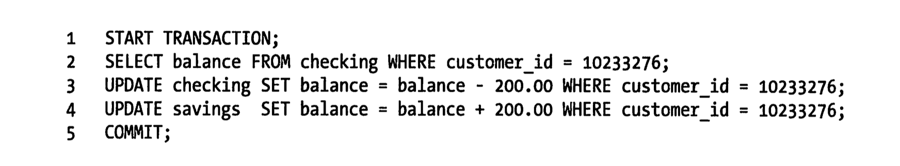
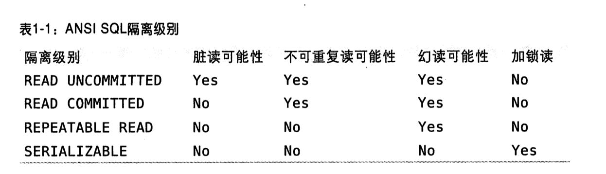
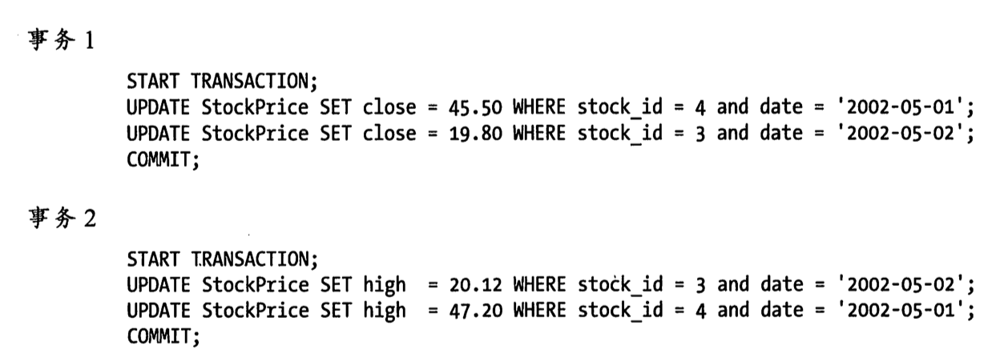
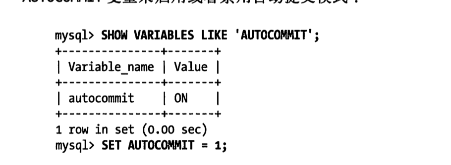

# 04 ｜ MySQL架构与历史(第一章) （1-33）

和其他数据库系统相比，MySQL有点与众不同，它的架构可以在多种不同场景中应用并发挥好的作用，但同时也会带来一点选择上的困难。MySQL并不完美，却足够灵活，能够适应高要求的环境，例如Web应用。同时，MySQL既可以嵌入到应用程序中，也可以支持数据仓库、内容索引和部署软件、高可用的冗余系统、在线事务处理系统等各种应用类型。

为了充分发挥MySQL的性能并顺利地使用，就必须理解其设计。MySQL的灵活性体现在喝多方面。例如，你可以通过配置使他在不同的硬件上都运行得很好，也可以支持多种不同的数据类型。但是，MySQL最重要、最与众不同的特性是它的存储引擎架构，这种架构的设计将查询处理及其他系统任务和数据的存储/提取相分离。这种处理和存储分离的设计可以在使用时根据性能、特性，以及其他需求来选择数据存储的方式。

本章概要地描述了MySQL的服务器架构、各种存储引擎之间的主要区别，以及这些区别的重要性。另外也会回顾一下MySQL的历史背景和基准测试，并试图通过简化细节和演示案例来讨论MySQL的原理。这些讨论，很有意义。

## 1.1 MySQL 逻辑架构

如果能在头脑中构建出一幅MySQL各组件之间如何协同工作的架构图，就会有主语深入理解MySQL服务器。图1-1展示了MySQL的逻辑架构图。


最上层的服务并不是MySQL所独有的，大多数基于网络的客户端/服务器的工具或者服务都有类似的架构。比如连接处理、授权认真、安全等等。

第二层架构是MySQL比较有意思的部分。大多数MySQL的核心服务功能都在这一层，包括查询解析、分析、优化、缓存以及所有的内置函数（例如，日期、时间、数学系和加密函数），所有跨存储引擎的功能都在这一层实现：存储过程、触发器、视图等。

第三层包含了存储引擎。存储引擎负责MySQL中数据等存储和提取。和GNU/Linux下的各种文件系统一样，每个存储引擎都有它的优势和劣势。服务器通过API与存储引擎进行通信。这些接口屏蔽了不同存储引擎之间的差异，使得这些差异对上层的查询过程透明。存储引擎API包含几十个底层函数，用于执行诸如“开始一个事务”或者“根据主键提取一行记录”等操作。但存储引擎不回去解析SQL，不同存储引擎之间也不会相互通信，而只是简单地响应上层服务器的请求。

`InnoDB是一个例外，它会解析外键定义，因为MySQL服务器本身没有实现该功能。`

### 1.1.1 连接管理与安全性

每个客户端连接都会在服务器进程中拥有一个线程，这个连接的查询只会在这个单独的线程中执行，该线程只能轮流在某个CPU核心或者CPU中运行。服务器会负责缓存线程，因此不需要为每一个新建的连接创建或者销毁线程。

`MySQL 5.5 或者更新的班嗯提供了一个APi，支持线程池（Thread-Pooling）插件，可以使用池中少量的线程来服务大量的连接。`

当客户端（应用）连接到MySQL服务器时，服务器需要对其进行认证。认证基于用户名、原始主机信息和密码。如果使用了安全套接字（SSL）的方式连接，还可以使用X.509证书认证。一旦客户端连接成功，服务器会继续验证该客户端是否具有执行某个特点查询的权限（例如，是否允许客户端对world数据库的Country表执行SELECT语句）。

### 1.1.2 优化与执行

MySQL会解析查询，并创建内部数据结构（解析树），然后对其进行各种优化，包括重写查询、决定表的读取顺序，以及选择合适的索引等。用户可以额通过特殊的关键字提示（hint） 优化器，影响它的决策过程。也可以请求优化器解释(explain)优化过程的各个因素，使用户可以知道服务器是如何进行优化决策的，并提供一个参考基准，便于用户重构查询和schema、修改相关配置，使应用尽可能高效运行。第6章将讨论更多优化器的细节。

优化器并不关心表使用的是什么存储引擎，但存储引擎对于优化查询是有影响的。优化器会请求存储引擎提供容量或某个具体操作的开销信息，以及表数据的统计信息等。例如，某些存储引擎的某些索引，可能对一些特定的查询有优化。关于索引与schema的优化，请参考第4章和第5章。

对于select语句，在解析查询之前，服务器会先检查查询缓存（Query Cache），如果能够在其中找到对应的查询，服务器就不必再执行查询解析、优化和执行的整个过程，而是直接返回查询缓存中的结果集。第7章详细讨论了相关内容。

## 1.2 并发控制

无论何时，只要有多个查询需要在同一时刻修改数据，都会产生并发控制的问题。本章的目的是讨论MySQL在两个层面的并发控制：服务器层与存储引擎层。并发控制是一个庞大的话题，有大量的理论文献对其进行过详细的论述。本章只简要地讨论MySQL如何控制并发读写，因此读者需要有相关的知识来理解本章接下来的内容。

以Unix系统的email box为例，典型的mbox文件格式是非常简单的。一个mbox邮箱中的所有邮件都串行在一起，彼此首尾连接。这种格式对于读取和分析邮件信息非常友好，同时投递邮件也很容易，只要在文件末尾附加新的邮件内容即可。

但如果两个进程在同以时刻对同一个邮箱投递邮件，会发生什么情况？显然，邮箱的数据会被破坏，两封邮件的内容会交叉地附加在邮箱文件的末尾。设计良好的邮箱投递系统会通过锁（lock)来防治数据损坏。如果客户试图投递邮件，而邮箱已经被其他客户锁住，那就必须等待，直到锁释放才能进行投递。

这种锁的方案在实际应用环境中虽然工作良好，但并不支持并发处理。因为任意一个时刻，只有一个进程可以修改邮箱的数据，这在大容量的邮箱系统中是个问题。

### 1.2.1 读写锁

从邮箱中读取数据没有这样的麻烦，即使同一时刻多个用户并发读取也不回有什么问题。因为读取不会修改数据，所以不会出错。但如果某个客户正在读取邮箱，同时另外一个用户试图删除编号25的邮件，会产生什么结果？结论是不确定，读的客户可能会报错退出，也可能读取到不一致的邮箱数据。所以，为安全起见，即使是读取邮箱也需要特别注意。

如果把上述的邮箱当成数据库中的一张包，把邮件当成表中的一行记录，就很容易看出，同样的问题依然存在。从很多方面来说，邮箱就是一张简单的 数据库表。修改数据库表中的记录，和删除或者修改邮箱中的邮件信息，十分类似。

解决这类经典问题的方法就是并发控制，其实非常简单。在处理并发读或者写时，可以通过实现一个由两种类型的锁组成的锁系统来解决问题。这两种类型的锁通常被称为共享锁（shared lock)和排他锁（exclusive lock），也叫读锁和写锁。

在实际的数据库系统中，每时每刻都在发生锁定，当某个用户在修改某一部分数据时，MySQL会通过锁定防止其他用户读取同一数据。大多数时候，MySQL锁的内部管理都是透明的。

### 1.2.2 锁粒度

一种提高共享资源并发性的方式就是让锁对象更有选择性。尽量只锁定需要修改的数据，而不是所有的资源。更理想的方式是，只对会修改的数据片进行精确的锁定。任何时候，在给定的资源上，锁定的数据量越少，则系统的并发程度越高，只要相互之间不发生冲突即可。

问题是枷锁也需要消耗资源。锁的各种操作，包括获得锁、检查锁是否已经解除、释放锁等，都会增加系统等开销。如果系统花费大量的时间来管理锁，而不是存取数据，那么系统的性能可能会因此受到影响。

所谓的锁策略，就是在锁的开销和数据的安全性之间寻求平衡，这种平衡当然也会影响到性能。大多数商业数据库系统没有提供更多的选择，一般都是在表上施加行级锁(row-level lock)，并以各种复杂的方式来实现，以便在锁比较多的情况下尽可能地提供更好的性能。

而MySQL则提供了多种选择。每种MySQL存储引擎都可以实现自己的锁策略和锁粒度。在存储引擎的设计中，锁管理是个非常重要的决定。将锁粒度固定在某个级别，可以为某些特定的应用场景提供更好的性能，但同时却会失去对另外一些应用场景的良好支持。好在MySQL支持多个存储引擎的架构，所以不需要单一的通用解决方案。下面将介绍两种最重要的锁策略。

**表锁（table lock)**

表锁是MySQL中最基本的锁策略，并且是开销最小的策略。表锁非常类似于前文描述的邮箱加锁机制：它会锁定整张表。一个用户在对表进行写操作（插入、删除、更新等）前，需要先获得写锁，这会阻塞其他用户对该表的所有读写操作。只有没有写锁时，其他读取的用户才能获得读锁，读锁之间是不想糊阻塞的。

在特定的场景中，表锁也可能有良好的性能。例如，READ LOCAL 表锁支持某些类型的并发写操作。另外，写锁也比读锁有更高的优先级，因此一个写锁请求可能会被插入到读锁队列的前面（写锁可以插入到锁队列中读锁的前面，反之读锁则不能插入到写锁的前面）。

尽管存储引擎可以管理自己的锁，MySQL本身还是会使用各种有效的表锁来实现不同的目的。例如，服务器会为诸如alter table之类的语句使用表锁，而忽略存储引擎的锁机制。

**行级锁（row lock)**

行级锁可以最大程度地支持并发处理（同时也带来了最大的锁开销）。众所周知，在InnoDB和XtraDB，以及其他一些存储引擎中实现了行级锁。行级锁只在存储引擎层实现，而MySQL服务器层没有实现。服务器层完全不了解存储引擎中的锁实现。在本章的后续内容以及全书中，所有的存储引擎都以自己的方式显现了锁机制。


## 1.3 事务

在理解事务的概念之前，接触数据库系统的其他高级特性还言之过早。**事务就是一组原子性的SQL查询，或者说一个独立的狗功能单元。**如果数据库引擎能够成功地对数据库应用该组查询的全部语句，那么就执行该组查询。如果其中有任何一条语句因为崩溃或其他原因无法执行，那么所有的语句都不会执行。也就是说，事务内的语句，要么全部执行成功，要么全部执行失败。

本节的内容并非属于MySQL，如果读者已经熟悉了事务的ACID的概念，可以直接跳转到1.3.4节。

银行应用是解释事务必要性的一个经典例子。假设一个银行的数据库有两张表：支票(checking)表和存储（savings)表。现在要从用户Jane的支票账户转移200美元到她的储蓄账户，那么需要至少三个步骤：

1. 检查支票账户的余额高于200美元。
2. 从支票账户余额中减去200美元。
3. 在储蓄账户余额中增加200美元。

上述三个步骤的操作必须打包在一个事务中，任何一个步骤失败，则必须回滚所有的步骤。

可以用START  TRANSACTIOn语句开始一个事务，然后要么使用COMMIT提交事务将修改的数据持久保留，要么使用ROLLBACK撤销所有的修改。

事务SQL的样本如下：



单纯的事务概念并不是故事的全部。试想一下，如果执行到第四条语句时服务器崩溃了，会发生什么？天知道，用户可能会损失200美元。再加入，在执行到第三条语句和第四条语句之间，另外一个进程要删除支票账户的所有余额，那么结果可能就是银行在不知道这个逻辑的情况下白白给了Jane200美元。

除非系统通过严格的ACID测试，否则空谈事务的概念是不够的。ACID表示原子性（atomicity）、一致性（consistency）、隔离性（isolation）和持久性（durability）。一个运行良好的事务处理系统，必须具备这些标准特征。

**原子性**

​	**一个事务必须被是为一个不可分割的最小工作单元，整个事务中的所有操作要么全部提交成功，要么全部失败回滚，**对于一个事务来说，不可能只执行其中的一部分操作，这就是事务的原子性。

**一致性**

​	**数据库总是从一个一致性的状态转换到另外一个一致性的状态。**在前面的例子中，一致性确保了， 即使在执行第三、四条语句之间时系统崩溃，支票账户中也不会损失200美元，因为事务最终没有提交，所以事务中所做的修改也不会保存到数据村中。

**隔离性**

​	**通常来说，一个事务所做的修改是在最终提交以前，对其他事务是不可见的。**在前面的例子中，当执行完第三条语句、第四条语句还未开始时，此时有另外一个账户汇总程序开始运行，则其看到的支票账户的余额并没有被减去200美元。后面我们讨论隔离级别（Isolation level）的时候，会发现未什么要说“通常来说”是不可见的。

**持久性**

​	**一旦事务提交，则其所做的修改就会永久保存到数据库中。**此时即使系统崩溃，修改的数据也不会丢失。持久性是个有点模糊的概念，**因为实际上吃就行也分很多不同的级别。**有些持久性策略能够提供非常强的安全保证，而有些则未必。而且不可能有能做到100%的持久性保证的策略（如果数据库本身就能够做到真正的持久性，那么备份又怎么能增加持久性呢？）。在后面一些章节中，我们会继续讨论MySQL中持久性的真正含义。

事务的ACID特性可以确保银行不会弄丢你的钱。而在应用逻辑中，要实现这一点非常难，甚至可以说是不可能完成的任务。**一个兼容ACID的数据库系统，需要做很多复杂但可能用户并没有觉察到的工作，才能确保ACID的实现。**

就像锁粒度的升级会增加系统开销一样，这种事务处理过程中额外的安全性，也会需要数据库系统做更多的额外工作。一个实现了ACID的数据库，相比没有实现ACID的数据库，通常会需要更强的CPU处理能力、更大的内存和更多的磁盘空间。正如本章不断重复的，这也正是MySQL的存储引擎架构可以发挥优势的地方。用户可以根据业务是否需要事务处理，来选择合适的存储引擎。对于一些不需要事务的查询应用，选择一个非事务型的存储引擎，可以获得更高的性能。即使存储引擎不支持事务，也可以通过lock tables 语句为应用提高一定程度的保护，这些选择用户都可以自主决定。


### 1.3.1 隔离级别

隔离性其实比想象的要复杂。在SQL标准中定义了四种隔离级别，每一种级别都规定了一个事务中所做的修改，哪些在事务内和事务间也是可见的，哪些是不可见的。较低级别的隔离同唱可以执行更高级别的并发，系统的开销也更低。

> 每种存储引擎实现的隔离级别不尽相同。如果熟悉其他的数据库产品，可能会发现某些特性和你期望的会有些不一样。

下面简单地介绍一下四种隔离级别。

**READ UNCOMITTED （未提交读）**

​	**在 READ UNCOMITTED级别，事务中的修改，即使没有提交，对其他事物也都是可见的。**事务可以读取未提交的数据，这也被称为脏读（Dirty Read）。这个级别会导致很多问题，从性能上来说，READ UNCOMMITED不会比其他的级别好太多，但却缺乏其他级别的很多好处，除非真的有非常必要的理由，在实际应用中一般很少使用。

**READ COMMITED (提交读)**

​	大多数数据库系统的默认隔离级别都是READ COMMITED（但MYSQL不是）。READCOMMITED满足前面提到的隔离性的简单定义：一个事务开始时，只能“看见”已经提交的事务所做的修改。换**句话说，一个事务从开始知道提交之前，所做的任何修改对其他事物都是不可见的。**这个级别有时候也叫做 不可重复读（nonrepeatable read），因为两次执行同样的查询，可能会得到不一眼规定结果。

**REPETABLE READ (可重复读)**

​	REPETABLE READ 解决了脏读的问题。**该级别保证了同一个事物中多次读取同样记录的结果是一致的。**但是理论上，可重复读隔离级别还是无法解决另外一个幻读的问题。 所谓幻读，指的是当某个事物在读取某个范围内的记录时，另外一个事务又在该范围内插入了新的记录，当之前的事务再次读取该范围的记录时，会产生幻行。InnoDB和XtrDB 存储引擎通过多版本并发控制（MVCC, Multiversion Concurrency Control）解决了幻读的问题。本章稍后会做进一步的讨论。

​	可重复读是MySQL的默认事务隔离级别。

**SERIALIZABLE （可串行化）**

​	**SERIALIZABLE 是最高的隔离级别。它通过强制事务串执行，避免了前面说的幻读问题。简单来说，SERIALIZABLE会在读取的每一行数据上都加锁，所以可能导致大量的超时和锁争用问题。**即使应用中很少使用到这个隔离级别，只有在非常需要确保数据的一致性而且可以接受没有并发的情况下，才考虑采用该级别。



### 1.3.2 死锁

死锁是指两个或者多个事务在同一资源上相互占用，并请求锁定对方占用的资源，从而导致恶性循环的现象。当多个事务试图以不同的顺序锁定资源时，就可能会产生死锁。多个事务同时锁定同以个资源时，也会产生死锁。例如，设想下面两个事务同时处理StockPrice表：



如果凑巧，两个事务都执行了第一条update语句，更新了一行数据，同时也锁定了该行数据，紧接着，每个事务都尝试去执行第二条update语句，却发现该行已经被对方锁定，然后两个事务都等待对方释放锁，同时又持有对方需要的锁，则陷入死循环。除非有外部因素介入才可能解除死锁。

为了解决这种问题，数据库系统实现了各种死锁检测和死锁超时机制。越复杂的系统，比如InnoDB存储引擎，越能检测死锁的循环依赖，并立即返回一个错误。这种解决方式很有效，否则死锁会导致出现非常慢的查询。还有一种解决方式，就是当查询的时间达到锁等待超时的设定后放弃锁清秋，这种方式通常来说不太好。**InnoDB目前处理死锁的方法是，将持有最少行级排他锁的事务进行回滚（这是相对比较简单的死锁会滚算法）。**

锁的行为和顺序是和存储引擎相关的。以同样的顺序执行语句，有些存储引擎会产生死锁，有些则不回。死锁的产生有双重原因：有些事因为真正的数据冲突，这种情况通常很难避免，但有些完全是由于存储引擎的实现方式导致的。

死锁发生以后，只有部分或者完全回滚其中一个事务，才能打破死锁。对于事务型的系统，这是无法避免的，所以应用程序在设计时必须考虑如何处理死锁。大多数情况下只需要重新执行因死锁会滚的事务即可。

### 1.3.3 事务日志

事务日志可以帮助提高事务的效率。使用事务日志，存储引擎在修改表的数据时只需要修改其内存拷贝，再把该修改行为记录到持久在硬盘上的事务日志中，而不用每次都将修改的数据本身持久到磁盘。事务日志采用的是追加的方式，因此写日志的操作是磁盘上一小块区域的顺序I/O，而不像随机I/O需要在磁盘的多个地方移动磁头，所以采用事务日志的方式相对来说要快得多。事务日志持久以后，内存中被修改的数据在后台可以慢慢地刷回到磁盘。目前大多数存储引擎都是这样实现的，我们通常称之为预写式日志（Write-Ahead Logging），修改数据需要写两次磁盘。

如果数据的修改已经记录道事务日志并持久化，但数据本身还没有写回磁盘，此时系统崩溃，存储引擎在重启时能够自动恢复这部分修改的数据。具体的恢复方式则视存储引擎而定。

### 1.3.4 MySQL中的事务

MySQL提供了两种事务型的存储引擎： InnoDB和NDB Cluster。另外还有一些第三方存储引擎也支持事务，比较知名的包括XtraDB和PBXT。后面讲详细讨论它们各自的一些特点。

**自动提交(auto commit)**

MySQL默认采用自动提交（auto commit）模式。也就是说，如果不是显式地开始一个事务，则每个查询都被当作一个事务执行提交操作。在当前连接中，可以通过设置auto commit变量来启用或者禁用自动提交模式：



1或者On表示启动，0或者OFF表示禁用。当auto commit = 0，所有的查询都是在一个事务中，直到显式地执行commit提交或者rollback回滚，该事务结束，同时又开始了另一个新事务。修改auto commit对非事务型的表，比如MyISAM或者内存表，不会有任何影响。对这类表来说，没有commit 或者rollback的概念，也可以说是相当于一只处于autocommit启用下的模式。

另外还有一些命令，在执行之前会强制执行commit提交当前的活动事务。典型的例子，在数据定义语言（DDL），如果是会导致大量数据改变的操作，比如alter table，就是如此。另外还有lock tables等其他语句也会导致同样的结果，如果有需要，请检查对应版本的官方文档来确认所有可能导致自动提交的语句列表。

MySQL可以通过执行SET TRANSACTION ISOLATION LEVWEL 命令来设置隔离级别。新的隔离级别也会在下一个事务开始的时候生效。可以在配置文件中设置整个数据库的隔离级别，也可以只改变当前会话的隔离级别。：

```mysql
set session transaction isolation level read commited;
```

MySQL能够识别所有的4个ANSI隔离级别，InnoDB引擎也支持所有的隔离级别。


**在事务中混合使用存储引擎**

MySQL服务器层不管理事务，事务时由下层的存储引擎实现的。所以在同一个事务中，使用多种存储引擎是不可靠的。

如果在事务中混合使用了事务型和非事务型的表，在正常提交的情况下不会有什么问题。

但如果该事务需要会滚，非事务型的表上的变更就无法撤销，这会导致数据库处于不一致的状态，这种情况很难修复，事务的最终结果将无法确定。所以，为每张表选择合适的存储引擎非常重要。

在非事务型的表上执行事务相关操作的时候，MySQL通常不会发出提醒，也不回报错。有时候只有会滚的时候才会发出一个警告：“某些非事务的表上的变更不能被会滚”。但大多数情况下，对非事务型表的操作都不回有提示。


**隐式和显式锁定**

InnoDB采用的是两阶段锁定协议（two-phase locking protocal）。在事务执行过程中，随时都可以执行锁定，锁只有在执行commit或者rollback的时候才会释放，并且所有的锁事在同一时刻被释放。前面描述的锁定都是隐式锁定，InnoDB会根据隔离级别在需要的时候自动加锁。

另外，InnoDB也支持通过特定的语句进行显示锁定，这些语句不属于SQL规范：

- select ... lock in share mode
- select ... for update

MysQL也支持LOCK tables 和unlock tables语句，这是在服务器层实现的，和存储引擎无关。它们有自己的用途，但不能代替事务处理。如果应用需要用到事务，还是应该选择事务型存储引擎。

经常可以发现，应用已经将表从MyISAM转换到InnoDB，但还是显式地使用Lock table语句。这不但没有必要，还会严重影响性能，实际上InnoDB的行级锁工作得更好。

> lock tables和事务之间相互影响的话，情况会变得非常复杂，在某些mysql 版本中甚至会产生无法预料的结果。因此，本书建议，除了事务中禁用了auto commit，可以使用lock tables之外，其他任何时候都不要显示地执行lock tables，不管使用的是什么存储引擎。

## 1.4 多版本并发控制

MySQL的大多数事务型存储引擎实现的都不是简单的行级锁。基于提升并发性能的考虑，它们一般都同时实现了多版本并发控制（MVCC)。不仅是MySQL，包括Oracle、PostgreSQL等其他数据库系统也都实现了MVCC，但各自的实现机制不尽相同，因为MVCC没有一个统一的实现标准。

**可以认为MVCC是行级锁的一个变种，但是它在很多情况下避免了加锁操作，因此开销更低。虽然实现机制有所不同，但大都实现了非阻塞的读操作，写操作也只锁定必要的行。**

**MVCC的实现，是通过保存数据在某个时间点快照来实现的。**也就是说，不管需要执行多长时间，每个事务看到的数据都是一致的。**根据事务开始的时间不同，每个事务开始的时间不同，每个事务对同一张表，同一时刻看到的数据可能是不一样的。**如果之前没有这方面的概念，这句话听起来就有点迷惑。熟悉以后会发现，这句话其实还是很容易理解的。

前面说到不同存储引擎的MVCC实现是不同的，典型的有 **乐观(optimistic)**并发控制和 **悲观（pessimistic）**并发控制。下面我们通过InnoDB的简化版行为来说明MVCC是如何工作的。

**InnoDB的MVCC，是通过在每行记录后面保存两个隐藏的列来实现的。**这两个列，一个保存了行的创建时间，一个保存行的过期时间（或删除时间）。当然存储的并不是实际的时间值，而是系统版本号（system version number）。**每开始一个新的事务，系统版本号都会自动递增。事务开始时刻的系统版本号会作为事务的版本号，用来和查询到的每行记录的版本号进行比较。**下面看一下在REPEATABLE READ隔离级别下，MVCC具体是如何操作的。

**SELECT **

​	InnoDB会根据以下两个条件检查每行记录：

​	a. **InnoDB只查找版本早于当前事务版本的数据行**（也就是，行的系统版本号小于或等于事务的系统版本号），这样可以确保事务读取的行，要么是在事务开始前已经存在的，要么是事务自身插入或者修改过的。

 	b. 行的删除版本要么未定义，要么大于当前事务版本号。这可以确保事务读取到的行，在事务开始之前未被删除。

​	只有符合上述两个条件的记录，才能返回作为查询结果。

**INSERT**

​	InnoDB为新插入的每一行保存当前系统版本号作为行版本号。

**DELETE**

​	InnoDB为删除的每一行保存当前系统版本号作为行删除标识。

**UPDATE**

​	InnoDB为插入一行新记录，保存当前系统版本号作为行版本号，同时保存当前系统版本号到原来的行作为行删除标识。

保存这两个额外系统版本号，使大多数读操作都可以不用加锁。这样设计使得读数据操作很简单，性能很好，并且也能保证只会读取到符合标准的行。不足之处是每行记录都需要额外的存储空间，需要做更多的行检查工作，以及维护一些额外的维护工作。

MVCC只在REPEATABLE READ和READ COMMITED两个隔离级别下工作。其他两个隔离级别都和MVCC不兼容，因为READ UNCOMMITED总是读取最新的数据行，而不是符合当前事务版本的数据行。而SERIALIZABLE则会对所有读取的行都加锁。


## 1.5 MySQL的存储引擎

### 1.5.1 InnoDB存储引擎

### 1.5.2 MyISAM存储引擎

### 1.5.3 MySQL内建的其他存储引擎

### 1.5.4 第三方存储引擎

### 1.5.5 选择合适的引擎

### 1.5.6转换表的引擎

## 1.6 MySQL时间线（TimeLine）

## 1.7 MySQL的开发模式

## 1.8 总结

