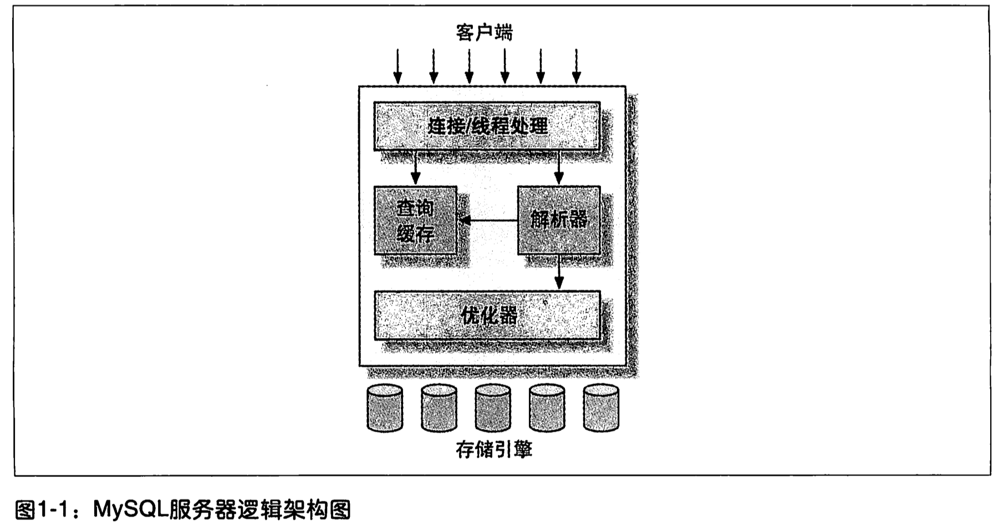

# 04 ｜ MySQL架构与历史(第一章) （1-33）

和其他数据库系统相比，MySQL有点与众不同，它的架构可以在多种不同场景中应用并发挥好的作用，但同时也会带来一点选择上的困难。MySQL并不完美，却足够灵活，能够适应高要求的环境，例如Web应用。同时，MySQL既可以嵌入到应用程序中，也可以支持数据仓库、内容索引和部署软件、高可用的冗余系统、在线事务处理系统等各种应用类型。

为了充分发挥MySQL的性能并顺利地使用，就必须理解其设计。MySQL的灵活性体现在喝多方面。例如，你可以通过配置使他在不同的硬件上都运行得很好，也可以支持多种不同的数据类型。但是，MySQL最重要、最与众不同的特性是它的存储引擎架构，这种架构的设计将查询处理及其他系统任务和数据的存储/提取相分离。这种处理和存储分离的设计可以在使用时根据性能、特性，以及其他需求来选择数据存储的方式。

本章概要地描述了MySQL的服务器架构、各种存储引擎之间的主要区别，以及这些区别的重要性。另外也会回顾一下MySQL的历史背景和基准测试，并试图通过简化细节和演示案例来讨论MySQL的原理。这些讨论，很有意义。

## 1.1 MySQL 逻辑架构

如果能在头脑中构建出一幅MySQL各组件之间如何协同工作的架构图，就会有主语深入理解MySQL服务器。图1-1展示了MySQL的逻辑架构图。

最上层的服务并不是MySQL所独有的，大多数基于网络的客户端/服务器的工具或者服务都有类似的架构。比如连接处理、授权认真、安全等等。

第二层架构是MySQL比较有意思的部分。大多数MySQL的核心服务功能都在这一层，包括查询解析、分析、优化、缓存以及所有的内置函数（例如，日期、时间、数学系和加密函数），所有跨存储引擎的功能都在这一层实现：存储过程、触发器、视图等。

第三层包含了存储引擎。存储引擎负责MySQL中数据等存储和提取。和GNU/Linux下的各种文件系统一样，每个存储引擎都有它的优势和劣势。服务器通过API与存储引擎进行通信。这些接口屏蔽了不同存储引擎之间的差异，使得这些差异对上层的查询过程透明。存储引擎API包含几十个底层函数，用于执行诸如“开始一个事务”或者“根据主键提取一行记录”等操作。但存储引擎不回去解析SQL，不同存储引擎之间也不会相互通信，而只是简单地响应上层服务器的请求。

`InnoDB是一个例外，它会解析外键定义，因为MySQL服务器本身没有实现该功能。`

### 1.1.1 连接管理与安全性

每个客户端连接都会在服务器进程中拥有一个线程，这个连接的查询只会在这个单独的线程中执行，该线程只能轮流在某个CPU核心或者CPU中运行。服务器会负责缓存线程，因此不需要为每一个新建的连接创建或者销毁线程。

`MySQL 5.5 或者更新的班嗯提供了一个APi，支持线程池（Thread-Pooling）插件，可以使用池中少量的线程来服务大量的连接。`

当客户端（应用）连接到MySQL服务器时，服务器需要对其进行认证。认证基于用户名、原始主机信息和密码。如果使用了安全套接字（SSL）的方式连接，还可以使用X.509证书认证。一旦客户端连接成功，服务器会继续验证该客户端是否具有执行某个特点查询的权限（例如，是否允许客户端对world数据库的Country表执行SELECT语句）。

### 1.1.2 优化与执行

MySQL会解析查询，并创建内部数据结构（解析树），然后对其进行各种优化，包括重写查询、决定表的读取顺序，以及选择合适的索引等。用户可以额通过特殊的关键字提示（hint） 优化器，影响它的决策过程。也可以请求优化器解释(explain)优化过程的各个因素，使用户可以知道服务器是如何进行优化决策的，并提供一个参考基准，便于用户重构查询和schema、修改相关配置，使应用尽可能高效运行。第6章将讨论更多优化器的细节。

优化器并不关心表使用的是什么存储引擎，但存储引擎对于优化查询是有影响的。优化器会请求存储引擎提供容量或某个具体操作的开销信息，以及表数据的统计信息等。例如，某些存储引擎的某些索引，可能对一些特定的查询有优化。关于索引与schema的优化，请参考第4章和第5章。

对于select语句，在解析查询之前，服务器会先检查查询缓存（Query Cache），如果能够在其中找到对应的查询，服务器就不必再执行查询解析、优化和执行的整个过程，而是直接返回查询缓存中的结果集。第7章详细讨论了相关内容。

## 1.2 并发控制

无论何时，只要有多个查询需要在同一时刻修改数据，都会产生并发控制的问题。本章的目的是讨论MySQL在两个层面的并发控制：服务器层与存储引擎层。并发控制是一个庞大的话题，有大量的理论文献对其进行过详细的论述。本章只简要地讨论MySQL如何控制并发读写，因此读者需要有相关的知识来理解本章接下来的内容。

以Unix系统的email box为例，典型的mbox文件格式是非常简单的。一个mbox邮箱中的所有邮件都串行在一起，彼此首尾连接。这种格式对于读取和分析邮件信息非常友好，同时投递邮件也很容易，只要在文件末尾附加新的邮件内容即可。

但如果两个进程在同以时刻对同一个邮箱投递邮件，会发生什么情况？显然，邮箱的数据会被破坏，两封邮件的内容会交叉地附加在邮箱文件的末尾。设计良好的邮箱投递系统会通过锁（lock)来防治数据损坏。如果客户试图投递邮件，而邮箱已经被其他客户锁住，那就必须等待，直到锁释放才能进行投递。

这种锁的方案在实际应用环境中虽然工作良好，但并不支持并发处理。因为任意一个时刻，只有一个进程可以修改邮箱的数据，这在大容量的邮箱系统中是个问题。

### 1.2.1 读写锁

从邮箱中读取数据没有这样的麻烦，即使同一时刻多个用户并发读取也不回有什么问题。因为读取不会修改数据，所以不会出错。但如果某个客户正在读取邮箱，同时另外一个用户试图删除编号25的邮件，会产生什么结果？结论是不确定，读的客户可能会报错退出，也可能读取到不一致的邮箱数据。所以，为安全起见，即使是读取邮箱也需要特别注意。

如果把上述的邮箱当成数据库中的一张包，把邮件当成表中的一行记录，就很容易看出，同样的问题依然存在。从很多方面来说，邮箱就是一张简单的 数据库表。修改数据库表中的记录，和删除或者修改邮箱中的邮件信息，十分类似。

解决这类经典问题的方法就是并发控制，其实非常简单。在处理并发读或者写时，可以通过实现一个由两种类型的锁组成的锁系统来解决问题。这两种类型的锁通常被称为共享锁（shared lock)和排他锁（exclusive lock），也叫读锁和写锁。

在实际的数据库系统中，每时每刻都在发生锁定，当某个用户在修改某一部分数据时，MySQL会通过锁定防止其他用户读取同一数据。大多数时候，MySQL锁的内部管理都是透明的。

### 1.2.2 锁粒度

一种提高共享资源并发性的方式就是让锁对象更有选择性。尽量只锁定需要修改的数据，而不是所有的资源。更理想的方式是，只对会修改的数据片进行精确的锁定。任何时候，在给定的资源上，锁定的数据量越少，则系统的并发程度越高，只要相互之间不发生冲突即可。

问题是枷锁也需要消耗资源。锁的各种操作，包括获得锁、检查锁是否已经解除、释放锁等，都会增加系统等开销。如果系统花费大量的时间来管理锁，而不是存取数据，那么系统的性能可能会因此受到影响。

所谓的锁策略，就是在锁的开销和数据的安全性之间寻求平衡，这种平衡当然也会影响到性能。大多数商业数据库系统没有提供更多的选择，一般都是在表上施加行级锁(row-level lock)，并以各种复杂的方式来实现，以便在锁比较多的情况下尽可能地提供更好的性能。

而MySQL则提供了多种选择。每种MySQL存储引擎都可以实现自己的锁策略和锁粒度。在存储引擎的设计中，锁管理是个非常重要的决定。将锁粒度固定在某个级别，可以为某些特定的应用场景提供更好的性能，但同时却会失去对另外一些应用场景的良好支持。好在MySQL支持多个存储引擎的架构，所以不需要单一的通用解决方案。下面将介绍两种最重要的锁策略。

**表锁（table lock)**

表锁是MySQL中最基本的锁策略，并且是开销最小的策略。表锁非常类似于前文描述的邮箱加锁机制：它会锁定整张表。一个用户在对表进行写操作（插入、删除、更新等）前，需要先获得写锁，这会阻塞其他用户对该表的所有读写操作。只有没有写锁时，其他读取的用户才能获得读锁，读锁之间是不想糊阻塞的。

在特定的场景中，表锁也可能有良好的性能。例如，READ LOCAL 表锁支持某些类型的并发写操作。另外，写锁也比读锁有更高的优先级，因此一个写锁请求可能会被插入到读锁队列的前面（写锁可以插入到锁队列中读锁的前面，反之读锁则不能插入到写锁的前面）。

尽管存储引擎可以管理自己的锁，MySQL本身还是会使用各种有效的表锁来实现不同的目的。例如，服务器会为诸如alter table之类的语句使用表锁，而忽略存储引擎的锁机制。

**行级锁（row lock)**

行级锁可以最大程度地支持并发处理（同时也带来了最大的锁开销）。众所周知，在InnoDB和XtraDB，以及其他一些存储引擎中实现了行级锁。行级锁只在存储引擎层实现，而MySQL服务器层没有实现。服务器层完全不了解存储引擎中的锁实现。在本章的后续内容以及全书中，所有的存储引擎都以自己的方式显现了锁机制。

## 1.3 事务

### 1.3.1 隔离级别

### 1.3.2 死锁

### 1.3.3 事务日志

### 1.3.4 MySQL中的事务

## 1.4 多版本并发控制

## 1.5 MySQL的存储引擎

### 1.5.1 InnoDB存储引擎

### 1.5.2 MyISAM存储引擎

### 1.5.3 MySQL内建的其他存储引擎

### 1.5.4 第三方存储引擎

### 1.5.5 选择合适的引擎

### 1.5.6转换表的引擎

## 1.6 MySQL时间线（TimeLine）

## 1.7 MySQL的开发模式

## 1.8 总结

