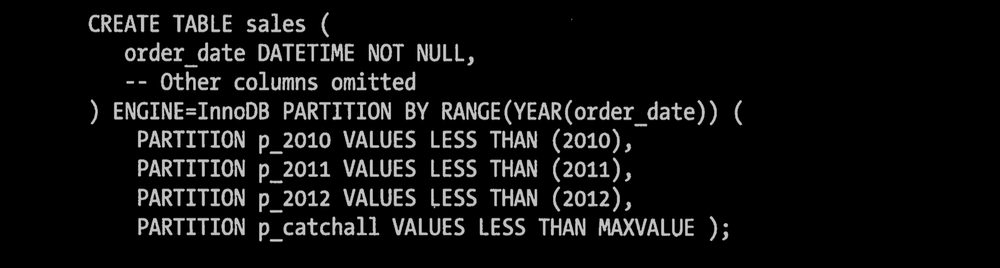

# 06｜ MySQl高级特性（第7章）

259-323

## 7.1 分区表

对用户来说，分区表是一个独立的逻辑表，但是底层是由多个物理子层组成。实现分区的代码实际上是对一组底层表的Handler Object的封装。对分区表的请求，都会通过Handler Object转化成对存储引擎的接口调用。所以分区对于SQL层来说是一个完全封装底层实现的黑盒子，对应用是透明的， 但是从底层的文件系统来看就很容易发现，每一个分区表都有一个使用# 分隔命名的表文件。

MySQL实现分区表的方式--对底层表的封装--意味着索引也是按照分区的子表定义的，而没有全局索引。这和Oracle不同，在Oracle中可以更加灵活地定义索引和表是否进行分区。

MySQL在创建表时使用PARTTION BY子句定义每个分区存放的数据。在执行查询的时候，优化器会根据分区定义过滤那些没有我们需要数据的分区，这样查询就无须扫描所有分区--只需要查找包含需要数据的分区就可以了。分区的一个主要目的是将数据按照一个较粗的粒度分在不同的表中。这样做可以将相关的数据存放在一起，另外，如果想一次批量删除整个分区的数据也会变得很方便。

在下面的场景中，分区可以起到非常大的作用：

- 表非常大以至于无法全部都放在内存中，或者只在表的最后部分有热点数据，其他均是历史数据。
- 分区表的数据更容易维护。例如，想批量删除大量数据可以使用清楚整个分区的方式。另外，还可以对一个独立分区进行优化、检查、修复等操作。
- 分区表的数据可以分布在不同的物理设备上，从而高效地利用多个硬件设备。
- 可以使用分区来避免某些特殊的瓶颈，例如InnoDB的单个索引的互斥访问、ext3文件系统的inode锁竞争等。
- 如果需要，还可以备份和恢复独立的分区，这在非常大的数据集的场景下效果非常好。

MySQL的分区实现非常复杂，我们不打算介绍实现的全部细节。这里我们将专注在分区性能方面，所以如果想了解更多的关于分区的基础知识，我们建议阅读MySQL官方手册中的“分区”一节，其中介绍了很多分区相关的基础知识。另外，还可以阅读CREATE. TABLE 、SHOW CREATE TABLE、ALTER TABLE和INFORMATION_SCHEMA.PARTITIONS、EXPLAIN关于分区部分的介绍。分区特性使得CREATE TABLE和ALTER TABLE命令变得更加复杂了。

分区表本身也有一些限制，下面是其中比较重要的几点：

- 一个表最多只能有1024个分区。
- 在MYSQL5.1中，分区表达式必须是整数，或者是返回整数的表达式。在MySQL5.5中，某些场景中可以直接使用列来进行分区。
- 如果分区字段中有主见或者唯一索引的列，那么所有主键列和唯一索引列都必须包含进来。
- 分区表中无法使用外键约束。

### 7.1.1 分区表的原理

如前所述，分区表由多个相关的底层表实现，这些底层表也是由Handler Object表示，所以我们也可以直接访问各个分区。存储引擎管理分区的各个底层表和管理普通表一样，分区表的索引只是在各个底层表上各自加上一个完全相同的索引。从存储引擎的角度来看，底层表和一个普通表没有任何不同，存储引擎也无须知道这是一个普通表还是一个分区表的一部分。

分区表上的操作按照下面的操作逻辑进行：

**SELECT查询**

​	当查询一个分区表的时候，分区层先打开并锁住所有的底层表，优化器先判断是否可以过滤部分分区，然后再调用对应的存储引擎接口访问各个分区的数据。

**INSERT操作**

​	当写入一条记录时，分区层先打开并锁住所有的底层表，然后确定哪个分区接收这条记录，再将记录写入对应底层表。

**DELETE操作**

​	当删除一条记录时，分区表先打开并锁住所有的底层表，然后确定数据对应的分区，最后对相应底层表进行删除操作。

**UPDATE操作**

​	当更新一条记录时，分区层先打开并锁住所有的底层表，MYSQL先确定需要更新的记录在哪个分区，然后取出数据并更新，再判断更新后的数据应该放在哪个分区，最后对底层表进行写入操作，并对原数据所在的底层表进行删除操作。

有些操作是支持过滤的。例如，当删除一条记录时，MySQL需要先找到这条记录，如果WHERE条件恰好和分区表达式匹配，就可以将所有不包含这条记录的分区都过滤掉。这对UPDATE语句同样有效。如果是INSERT操作，则本身就只命中一个分区，其他分区都会被过滤掉。MySQl先确定这条记录属于哪个分区，再将记录写入对应的底层分区表，无须对任何其他分区进行操作。

虽然每个操作都会“先打开并锁住所有的底层表”，但这并是不是说分区表在处理过程中是锁住全表的。如果存储引擎能够自己实现行级锁，例如InnoDB，则会在分区层释放对应表锁。这个加锁和解锁过程与普通InnoDB上的查询类似。

后面我们会通过一些例子来看看，当访问一个分区表的时候，打开和锁住所有底层表的代价及其带来的后果。

### 7.1.2 分区表的类型

MySQL支持多种分区表。我们看到最多的是根据范围进行分区，每个分区存储落在某个范围的记录，分区表达式可以是列，也可以是包含列的表达式。例如，下表就可以将每一年的销售额存放在不同的分区里：

PARTITION分区子句中可以使用各种函数。但有一个要求，表达式返回的值要是一个确定的整数，且不能是一个常数。这里我们使用函数YEAR（），也可以使用任何其他的函数，如TO_DAYS。根据时间间隔进行分区，是一种很常见的分区方式，后面我们还会再回过头来看看这个例子，看看如何优化这个例子来避免一些问题。

MySQL还支持键值分区、哈希分区和列表分区，这其中有些还支持子分区，不过我们在生产环境中很少见到。还可以使用RANGE COLUMNS类型的分区，这样即使是基于时间的分区也无须再将其转化成一个整数，后面将详细介绍。

在我们看过的一个子分区的案例中，对于一个类似于前面我们设计的按时间分区的InnoDB表，系统通过子分区可降低索引的互斥访问的竞争。最近一年的分区的数据会被非常频繁的访问，这会导致大量的互斥量的竞争。使用哈希子分区可以将数据切成多个小片，大大降低互斥量的竞争问题。

我们还看到一些其他的分区技术包括：

- 根据键值进行分区，来减少InnoDB的互斥量竞争。
- 使用数学模函数来进行分区，然后将数据轮询放入不同的分区。例如，可以对日期做模7的运算，或者更简单地使用返回周几的函数，如果只想保留最近几天的数据，这样分区很方便。
- 可以使用HASH（id div 10000），这将为100万数据建立一个分区。这样一方面实现了当初分区目的，另一方面比起使用时间范围分区还避免了一个问题，超过上限时，如果使用时间范围分区就必须新增分区。

### 7.1.3 如何使用分区表

假设我们希望从一个非常大的表中查询出一段时间的记录，而这个表中包含了很多年的历史数据，数据是按照时间排序的，例如，系统查询最近几个月的数据，这大约有10亿条记录。假设使用2012年的硬件设备，而原表中有10TB数据，这个数据远大于内存，并且使用的传统硬盘，不是闪存，你打算如何查询这个表？如何才能更高效？

首先很肯定：因为数据量巨大，肯定不能在每次查询的时候都扫描全表。考虑到索引在空间和维护上的消耗，也不希望使用索引。即使真的使用索引，你会发现数据并不是按照想要的方式聚集的，而且会有大量的碎片产生，最终会导致一个查询产生成千上万的随机I/O，应用程序也随之僵死。情况好一点的时候，也许可以通过一两个索引解决一些问题。不过多数情况下，索引不会有任何作用。这时候只有两条路可选：让所有的查询都只在数据表上做顺序扫描，或者将数据表和索引全部都缓存在内存里。

这里需要再陈述一遍：在数据量超大的时候，B-Tree索引就无法起作用了。除非是索引覆盖查询，否则数据库服务器需要根据扫描的结果会表，查询所有复合条件的记录，如果数据量巨大，这将产生大量随机I/O，数据库的相应时间将大到不可接受的程度。另外，索引维护的代价也非常高。有些系统，就完全放弃了B-TREE索引，而选择了一些更粗粒度的但消耗更少的方式检索数据，例如在大量数据上只索引对应的一小块元数据。

这正是分区要做的事情。理解分区时还可以将其当作索引的最终形态，以代价非常小的方式定位到需要的数据在哪一片“区域”。在这片“区域”中，你可以做顺序扫描，可以建索引，还可以将数据都缓存到内存，等等。因为分区无须额外的数据结构记录每个分区有哪些数据--分区不需要精确定位每条数据的位置，也就无须额外的数据结构--所以其代价非常低。只需要一个简单的表达式就可以表达每个分区存放的是什么数据。

为了保证大数据量的可扩展性，一般有下面两个策略：

**全量扫描数据，不要任何索引**

​	可以使用简单的分区方式存放表，不要任何索引，根据分区的规则大致定位需要的数据位置。只要能够使用WHERE条件，将需要的数据限制在少数分区中，则效率是很高的。当然，也需要做一啊些简单的运算保证查询的响应时间能够满足要求。使用该策略假设不用桨数据完全放入到内存中，同时还假设需要的数据全部都在磁盘上，因为内存相对很小，数据很快就会被挤出内存，所以缓存起不了任何作用。这个策略适用于以正常的方式访问大量数据的时候。

**索引数据，并分离热点**

​	如果数据有明显的“热点”，而且除了这部分数据，其他数据很少被访问到，那么可以将这部分热点数据单独放在一个分区中，让这个分区的数据能够有机会都缓存在内存中。这样查询就可以只访问一个很小的分区表，能够使用索引，也能够有效地使用缓存。

