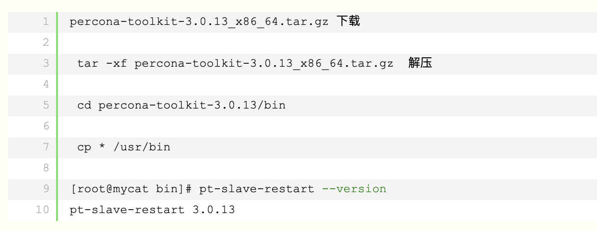
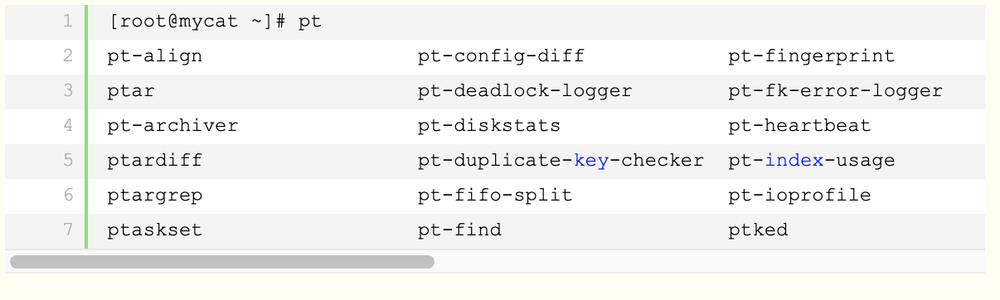

# Percona Toolkit工具使用

Persona Toolkit 简称pt工具- PT-Tools，是Percona公司开发用于管理MySQL的工具，功能包括检查主从复制的数据一致性、检查重复索引、定位IO占用高的表文件、在线DDL等

下载地址： https://www.percona.com/downloads/percona-toolkit/LATEST/

1.pt-archive ----MySQL的在线归档，无影响生产

2.pt-kill -----自定义查杀。确保慢查询及恶性攻击对生产无影响

3.pt-online-schema-change ----在线DDL操作，对上亿的大表加索引加字段且对生产无影响

4.pt-query-digest -----慢查询Log的分析。

5.pt-slave-delay ---就是指定从库比主库延迟多长时间

6.pt-table-checksum & pt-table-sync-----检查主从是否一致性-----检查主从不一致之后用这个工具进行处理 这两个一搬是搭配使用

\7. pt-find ---找出几天之前建立的表

\8. pt-slave-restart -----主从报错，跳过报错

9.pt-summary ---整个系统的的概述

10.pt-mysql-summary ---MySQL的表述，包括配置文件的描述

11.pt-duplicate-key-checker ---检查数据库重复索引

 这里只放了一些简单的命令使用，用于记录。