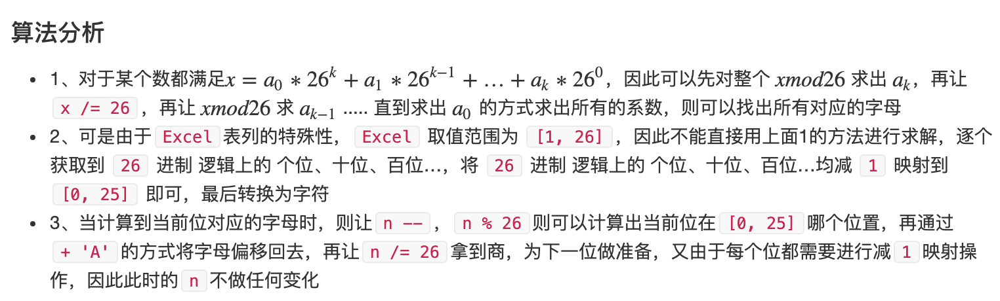

## [168. Excel表列名称](https://leetcode-cn.com/problems/excel-sheet-column-title/)

**analyse:**

```
这个题还是很有意思的，虽然是一个简单题，但是就我个人认为，应该加为中等题。
看的acwing上一个大哥的分析，感觉很棒。
```



source:https://www.acwing.com/solution/content/19291/

**code:**

```java
class Solution {
    public String convertToTitle(int c) {
        StringBuilder res = new StringBuilder();
        while (c > 0) {
            c--;
            char ch = (char)('A' + c % 26);
            res.append(ch);
            c /= 26;
        }
        return res.reverse().toString();
    }
}
```

