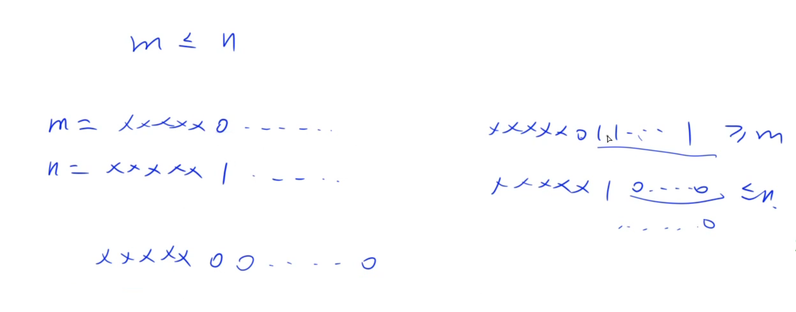

## [201. 数字范围按位与](https://leetcode-cn.com/problems/bitwise-and-of-numbers-range/)

**analyse:**

```
思路太难了，顶不住！
```




**code:**

```java
class Solution {
    public int rangeBitwiseAnd(int left, int right) {
        int res = 0;
        for (int i = 30; i >= 0; i--) {
            int l = (left >> i) & 1;
            int r = (right >> i) & 1;
            if (l != r) break;
            if (l == 1) res += 1 << i;
        }
        return res;
    }
}
```

