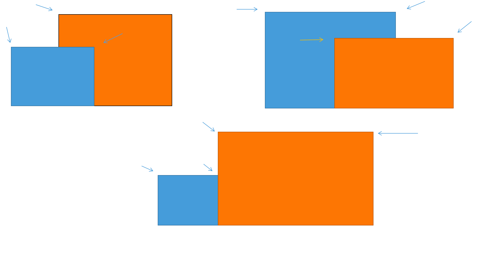

欣赏：

摘抄： https://leetcode-cn.com/problems/the-skyline-problem/solution/gong-shui-san-xie-sao-miao-xian-suan-fa-0z6xc/

```
扫描线问题。
1. 使用很多很多的长条进行切分，这样的话宽度就一样了。需要去求长度。

1. 由相邻两个横坐标以及最大高度，可以确定一个矩形
2. 输出每个矩形的左上的端点，同时可以跳过由前一矩形延伸而来的边
3. 维护一个最大高度即可，可以采用优先队列
4. 实现时，我们可以先记录一个所有的左右端点的横坐标以及高度，并根据端点横坐标进行从小到大排序。

前往后处理时，根据当前遍历到的点进行分情况讨论：
- 左端点： 因为是左端点，必然存在一条从右延伸的边，但是并不一定是需要被记录的边，因此在同一矩形中，我们只需要记录最上边的边。这时可以将高度进行入队。
- 右端点：以为着之前往右延伸的线结束了，需要将高度出队
```



**code:**

```java
class Solution {
    public List<List<Integer>> getSkyline(int[][] bs) {
        List<List<Integer>> res = new ArrayList<>();
        
        List<int[]> ps = new ArrayList<>();
        
        for (int[] b: bs) {
            int l = b[0], r = b[1], h = b[2];
            ps.add(new int[]{l, -h});
            ps.add(new int[]{r, h});
        }
        
        Collections.sort(ps, (o1, o2) -> o1[0] != o2[0] ? o1[0] - o2[0] : o1[1] - o2[1]);
        
        
        PriorityQueue<Integer> q = new PriorityQueue<>((o1, o2) -> o2 - o1);
        
        int prev = 0;        
        q.offer(prev);
        for (int[] p: ps) {
            int index = p[0], h = p[1];
            if (h > 0) {
                q.remove(h);
            } else {
                q.offer(-h);
            }
            int cur = q.peek();
            if (cur != prev) {
                res.add(Arrays.asList(index, cur));
                prev = cur;
            } 
        }
        
        return res;
    }
}
```

