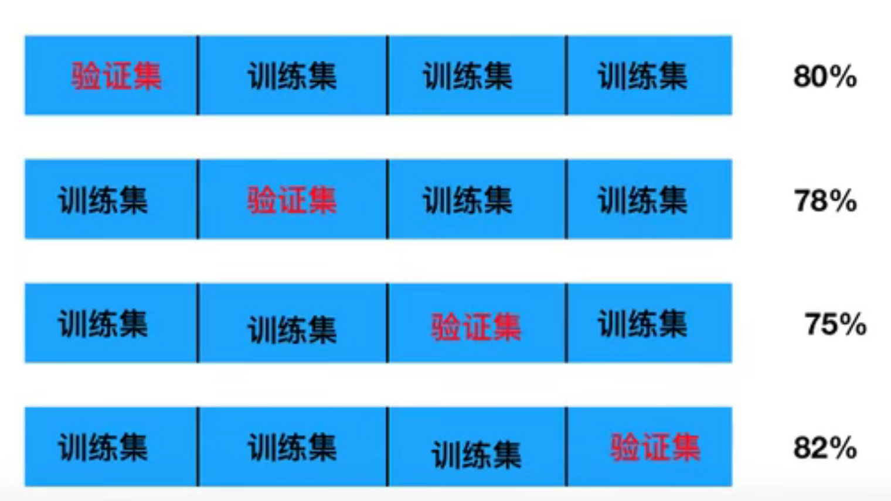
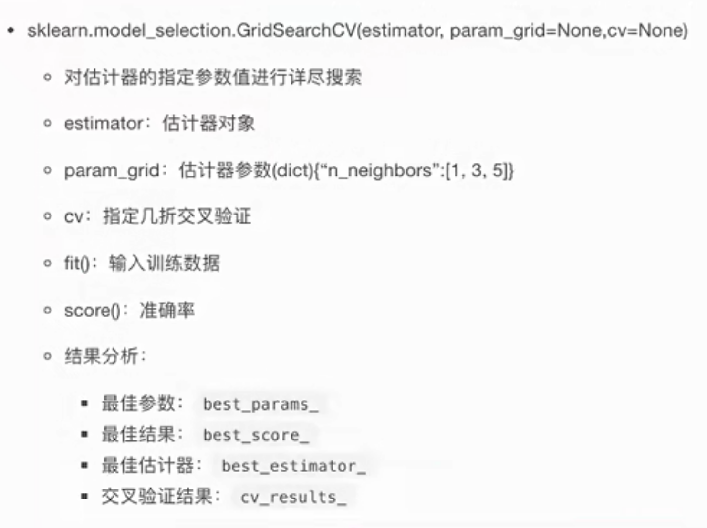

目标值： 类别

1. sklearn 转换器和与预估器
2. KNN算法
3. 模型选择与调优
4. 朴素贝叶斯算法
5. 决策树
6. 随机森林

## 3.1 sklearn转换器和古记起

学习目标： 

- 知道sklearn的转换器和估计器流程

### 3.1.1 转换器

转化器- 特征工程的父类

之前做特征工程的步骤：

1. 实例化
2. 调用fit_transform()：
   1. fit() 计算 每一列的平均值、标准差
   2. transform().    (X - MEAN) / STD 进行最终的转换

### 3.1.2 估计器

sklearn中，估计器是一个重要的角色，是一类实现了算法的API

1. 用于分类的估计器
   - sklearn.neighhbors k  - 近邻算法
   - sklearn.naive_bayes 贝叶斯
   - sklearn.linear_model.LogisticRegression 逻辑回归
   - sklearn.tree 决策树与随机森林
2. 用于回归的估计器
   - sklearn.linear_model.LinearRegression 线性回归
   - sklearn.linear_model.Ridge 岭回归
3. 用于无监督学习的估计器
   - sklearn.cluster.KMeans 聚类

估计器工作流程

(训练集 x_train, y_train)

1. 实例化一个estimator

2. estimator.fit(x_train, y_train) 计算

   -- 调用完毕，模型生成

3. 模型评估： 

   1） 比对真实值和预测值

   ​	 y_predict = estimator.predict(x_test)

   ​	 y_predict = y_predict

   2) 计算准确率

   ​	 accuracy = estimator.score(x_test, y_test)

## **3.2 K - 近邻算法**

### 3.2.1 什么是K- 近邻算法

核心思想： 根据你的邻居推断出你的类别

K Nearest Neighbor 算法又叫做KNN算法，这个算法是机器学习里面一个比较经典的算法，总体来说KNN算法是相对比较容易理解的算法

- 定义： 如果一个样本在特征空间中的k个最相似（即特征空间中最邻近）的样本中的大多数属于某一个类别，则该样本也属于这个雷贝。

- 距离公式： 两个样本的距离可以通过如下公式计算： 又叫做欧式距离

- k = 1带来的影响： 容易收到异常点的影响

- 如何确定谁是邻居？ 

  计算距离： 距离公式， 最常见的是 欧式距离： 向量的距离

  ​														曼哈顿距离： 绝对值距离

  ​														明可弗斯基距离： 总额和

  

分析： k = 1 爱情片             k = 2 爱情片     k = 6 无法确

问题： k值取得过大，样本不均衡影响, k取的过下，容易收到异常点影响

结合前面约会对象数据，分析k-近邻算法需要做什么样的处理呢？  无量纲化处理。

标准化处理。

### 3.2.2 K - 近邻算法API

- sklearn.neighbors.KNeighborsClassfier(n_neighbors = 5, algorithm = 'auto')
  - n_neighobots: int 可选，默认为5
  - auto, ball_tree, kd_TREE, BRUTE, Auto将尝试根据传递给fit方法的值来决定最合适的算法

### 3.2.3 案例1: 鸢尾花种类预测

**流程： **

1. 获取数据
2. 数据集划分
3. 特征工程
   1. 标准化
4. KNN预估器流程
5. 模型评估

### 3.2.4 总结

**优点： ** 简单，易于理解，易于实现，无需训练

缺陷： 1） 必须指定K值，K值选择不当则分类精度不能保证

​			2） 懒惰算法，对测试样本分类时对计算量大，内存开销过大

使用场景： 小数据场景，几千-几万样本，具体场景具体业务取测试

## 3.3 模型选择与调优

1. 什么是交叉验证
2. 超参数搜索-网格搜索（Grid Search)
3. 鸢尾花案例增加K值调优
4. 案例： 预测facebook签到位置
5. 总结

### 3.3.1 什么是交叉验证（cross validation）

交叉验证： 将拿到的训练数据，分为训练和验证机。以下图为例：将数据分成4份，其中一份作为验证集。然后经过4次的测试，每次都更换不同的验证集。即得到4组模型的结果，取平均值作为最终结果。又称4折交叉验证。

**1. 分析：**

我们之前知道数据分为训练及和测试集，但是为了让从训练得到模型结果更加准确。做以下处理：

- 训练集： 训练集+ 验证集
- 测试集： 测试集

**2. 为什么需要交叉验证**

交叉验证目的： 为了让被评估的模型更加准确可信

### 3.3.2 超参数搜索-网格搜索(Grid Search)

其实就是暴力搜索

### 3.·2.4 Facebook 案例分析

1）获取数据

2）数据处理

​	目的：特征值 x 

​			目标值. y

​	a.  缩小数据范围，取坐标 2 < x < 2.5   1.0 < y < 1.5的范围的数据进行分析

​	b.  time-> 年月日时分秒

​	c. place_id: 过滤签到次数少的地点

​	d. 数据集划分

3)  特征工程，标准化

4） KNN算法预估流程

5） 模型选择与调优

6)   模型评估

  