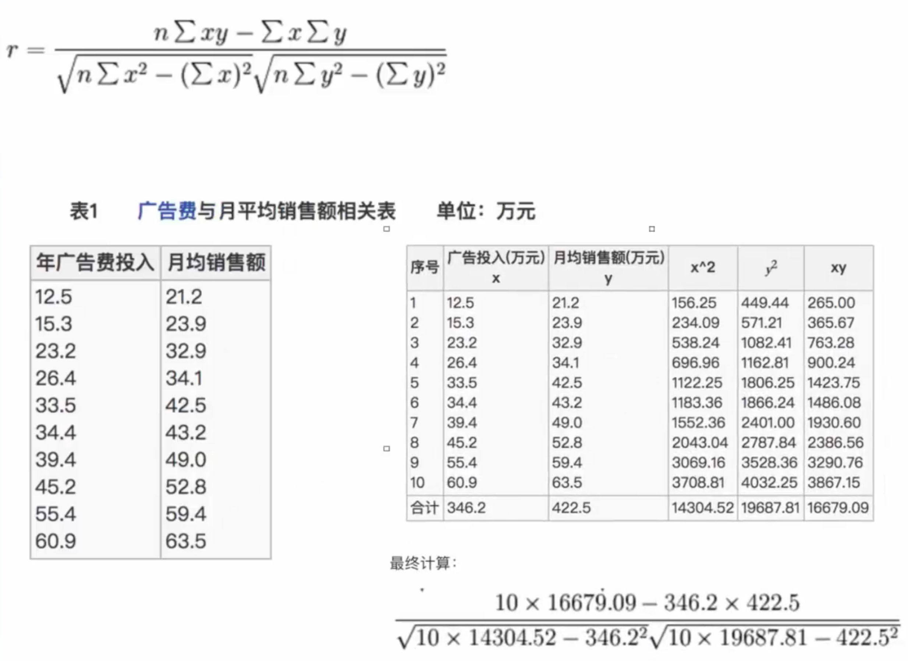
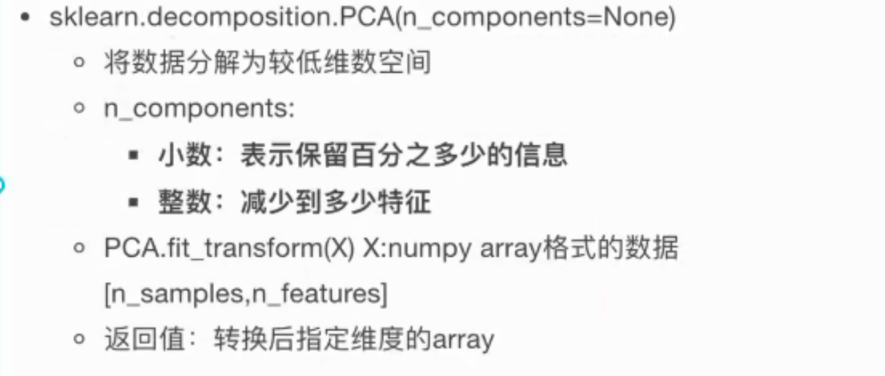
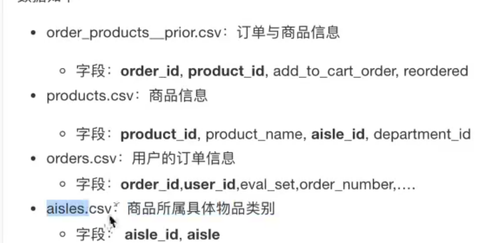

**特征选择：**

数据中包含冗余或相关变量

模块： sklearn.feature_selection
方法一： 过滤式
	方差选择法：低方差特征过滤
		删除低方差的一些特征，前面讲过方差的意义。再集合方差的大小来考虑这个方式的角度。
			特征方差小： 某个特征大多样本的值比较相近
			特征方差大： 某个特征很多样本的值都有差别

 	variance 方差
		threshold 阈值
	sklearn.feature_ selection.VarianceThreshold(threshold = 0.0)
	 删除所有低方差特征
	 Variance.fit_transform(X)
	 X:numpy array 格式的数据[n_samples, n_features]
		 返回值： 训练集差异低于threshold 

​	相关系数： 特征与特征之间的相关程度
​		 这里使用的是 皮尔逊相关系数(Pearson Correlation Coefficient)
​		 	反映变量之间相关关系密切程度的统计指标

​	

​		相关系数的取值范围为[-1,1]。

​		 一般可按三级划分： |r| < 0.4 位低度相关 [0.4, 0.7) 显著相关 [0.7,1)高度线性相关

​		当特征与特征之间相关性很高：

​				1） 选取其中一个

​				2） 加权求和

​				3） 主成分分析

方法二： 嵌入式
	决策树： 信息墒、信息增益
	正则化：L1、L2
	深度学习：卷积等


**主成分分析：**

降纬，并尽可能保留更多信息。



```python
from sklearn.decomposition import PCA
def pca_demo():
    data = [
        [2,8,4,5],
        [6,3,0,5],
        [1,4,5,6]
    ]
    transfer = PCA(n_components=0.95)

    data_new = transfer.fit_transform(data)
    print(data_new)

    return None
```


demo: 案例： 探究用户对物品类别的喜好细分

用户	user

物品类别 aisle

1. 需要将user_id和aisle放在同一个表中
2. 找到user_id和aisle交叉表和透视表
3. 特征冗余过多 ->PCA降纬



