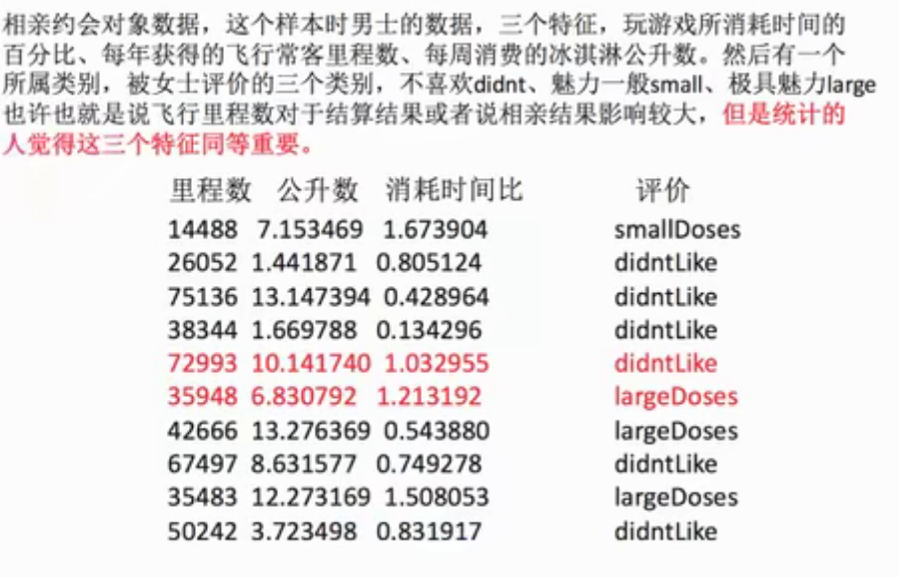

1. 什么是特征预处理

   provides several common utility functions and transformer classes 

   通过一些普遍的实用函数，将特征数据转换为更加适合算法模型的特征数据

2. 为什么要进行归一化/标准化

   - 特征的单位或者大小相差较大，或者某特征的方差相比其他的特邀打出几个数量级，容易影响目标结果，使得一些算法无法学习到其他的特征

3. 包含内容

数值型数据的无量纲化：

- 归一化
- 标准化

1. 特征预处理APi

   sklearn.processing




2. 归一化

2. 1 定义

通过对原始数据进行变换把数据映射到（默认0,1)之间

2. 2 公式


其实挺好理解的：

```
x - min / max - min = X' - mi / mx - mi其实就是角度一样
mx: 映射的最大值
mi: 映射的最小值
max: 这一列的最大值
min: 这一列的最小值
x: [[]...]中的元素
```

​	**sklean.preprocessing.MinMaxScaler(feature_range=(0,1)...)**


n_samples：样本的长度，n_features: 样本的列

问题： 异常值变为min,max


3. 标准值

   3.1 定义

   通过对原始数据进行变换把数据变换到均值为0，标准差为1范围内

   3.2 公式

   标准值 = （x - mean) / std

   3.3 问题：

   对于归一化来说： 如果出现异常点，影响了最大值和最小值，那么结果显然会发生改变

   对于标准化来说：如果出现异常点，由于具有一定数据量，少量的异常点对于平均值的影响并不大，从而方差改变较小

   

​	

```python
# coding=utf-8
# Press the green button in the gutter to run the script.
from sklearn.datasets import load_iris
from sklearn.model_selection import train_test_split

from sklearn.feature_extraction import DictVectorizer
from sklearn.feature_extraction.text import CountVectorizer

from sklearn.feature_extraction.text import TfidfVectorizer

from sklearn.preprocessing import MinMaxScaler
from sklearn.preprocessing import StandardScaler

import jieba

import pandas as pd

def datasets_demo():
    """
    sklearn 数据集使用
    :return:
    """

    # 获取数据集
    iris = load_iris()

    print("鸢尾花数据集")
    print("描述" +  iris["DESCR"])

    print("特征名称:")
    print(iris.feature_names)

    print("查看特征值:")
    print(iris.data, iris.data.shape)

    print("标签名称")
    print(iris.target_names)

    print("标签数组")
    print(iris.target)

    # 数据集划分
    x_train, x_test, y_train, y_test = train_test_split(iris.data, iris.target, test_size=0.2, random_state=22)
    print(x_train, x_train.shape)
    print(x_test, x_test.shape)
    print(y_train, y_train.shape)
    print(y_test, y_test.shape)
    return None


def dict_demo():
    """
    字典特征抽取
    :return:
    """
    data = [{'city': "北京", 'temperature': 100},
            {'city': "深圳", 'temperature': 60},
            {'city': "上海", 'temperature': 30}
            ]

    # 1. 实例化转换器雷
    transfer = DictVectorizer(sparse=False)
    # 2. 调用fit_transform()
    data_new = transfer.fit_transform(data)
    print("data_new:")
    print(data_new)
    print("特征名字：")
    # 解决字典中中文乱码
    return None

def count_demo():
    """
    文本特征抽取： CountVecotrizer
    统计每个样本特征词出现的个数
    :return:
    """

    data = ["life is short, i like like java",
            "life is too long, i dislike python"]

    # 1. 实例化一个转换器类
    # transfer = CountVectorizer()
    # 停用词使用
    transfer = CountVectorizer(stop_words=["is", "too"])
    # 2. 调用fit_transform
    data_new = transfer.fit_transform(data)
    print(data_new)
    print(type(data_new))
    print(data_new.toarray())
    return None

def count_chinese_demo():
    """
    中文文本特征抽取： CountVecotrizer
    统计每个样本特征词出现的个数
    需要使用jieba 分词，以及其他的一些方法
    :return:
    """
    # 不做分词处理，不太好，手动来拆分不适合实际的开发
    data = ["我爱姗姗",
            "姗姗爱我"]

    # 1. 实例化一个转换器类
    transfer = CountVectorizer()
    # 2. 调用fit_transform
    data_new = transfer.fit_transform(data)
    print(data_new)
    print(type(data_new))
    print(data_new.toarray())
    return None


def cut_word(text):
    """
    进行中文分词"我爱北京天安门" --> "我 爱 北京 天安门"：
    :param text:
    :return:
    """
    return " ".join(list(jieba.cut(text)))

def count_chinese_demo2():
    """
    中文文本特征抽取，自动分词
    任务：
    将下面三句话进行特征值化
    1. 今天很残酷，明天更残酷，后天没很美好，但绝大部分是死在明天晚上，所以每个人不要放弃今天。
    2. 我们看到的从很远星系的光是在几百万年之前发出的，这样当我门看到宇宙时，我们是在看它的过去。
    3. 如果只用一种方式了解某样事物，你就不会真正了解它。了解事物真正含义的秘密取决于如何将其与我们所了解的事物相联系。

    :return:
    """

    # 1. 将中文文本进行分词
    data = ["今天很残酷，明天更残酷，后天很美好，但绝大部分是死在明天晚上，所以每个人不要放弃今天。",
            "我们看到的从很远星系的光是在几百万年之前发出的，这样当我门看到宇宙时，我们是在看它的过去。",
            "如果只用一种方式了解某样事物，你就不会真正了解它。了解事物真正含义的秘密取决于如何将其与我们所了解的事物相联系。"]

    data_new = []
    for sentence in data:
        data_new.append(cut_word(sentence))
    # print(data_new)

    # 2. 特征化处理

    transfer = CountVectorizer()

    data_final = transfer.fit_transform(data_new)
    print(data_final)
    print(data_final.toarray())
    print(transfer.get_feature_names())


    return None


def tfidf_demo():
    """
    用TF-IDF的方法进行文本特征抽取
    :return:
    """

    # 1. 将中文文本进行分词
    data = ["今天很残酷，明天更残酷，后天很美好，但绝大部分是死在明天晚上，所以每个人不要放弃今天。",
            "我们看到的从很远星系的光是在几百万年之前发出的，这样当我门看到宇宙时，我们是在看它的过去。",
            "如果只用一种方式了解某样事物，你就不会真正了解它。了解事物真正含义的秘密取决于如何将其与我们所了解的事物相联系。"]

    data_new = []
    for sentence in data:
        data_new.append(cut_word(sentence))
    # print(data_new)

    # 2. 特征化处理

    transfer = TfidfVectorizer()

    data_final = transfer.fit_transform(data_new)
    print(data_final)
    print(data_final.toarray())
    print(transfer.get_feature_names())


def minmax_demo():
    """
    归一化
    :return:
    """

    # 1. 获取数据
    data = pd.read_csv("/Users/crazys/PycharmProjects/pythonProject1/机器学习/datingTestSet2.txt", sep="\t")
    print(data)
    data = data.iloc[:, :3]
    print("data:\n", data)
    # 2. 获取转化器类
    # transfer = MinMaxScaler(feature_range=[2, 3])
    transfer = StandardScaler()
    # 3. call
    data_new = transfer.fit_transform(data)
    print(data_new)


if __name__ == '__main__':

    # datasets_demo()
    # dict_demo()

    # 文本特征抽取： CountVecotrizer
    # count_demo()
    # count_chinese_demo()
    # count_chinese_demo2()

    # 中文分词
    # cut_word("我爱北京天安门")
    # count_chinese_demo2()

    # tfidf_demo()

    minmax_demo()
```

