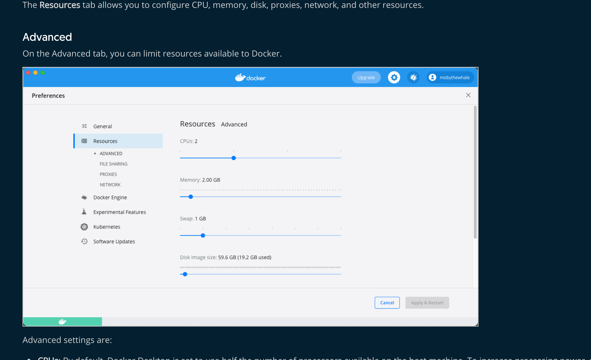

1. Jupyter notebook读取大型csv文件遇到The kernel appears to have died. It will restart automatically的错误原因排查

   ```
   1. docker stats your_container_ID 
   看出我的内存给1.91个G太小了。
   2. 分配内存为4G
   ```



2. 下载jupyter 

   ```
   conda install pytorch torchvision torchaudio cudatoolkit=11.0 然后就ojbk
   ```

3. VSCODE 配置jupyter. 打开一个ipynb文件夹，然后安装jupter的插件。

   ```
   1. 安装anaconda
   2. 新建环境 conda create --name=dataScience python=3.8
   3. 在虚拟环境下安装ipykernel
   	pip install --user ipykernel
   4. 将虚拟环境添加到jupyter
   	python -m ipykernel install --user --name=dataScience
   5. jupyter kernelspec list
   	Available kernels:
     datascience    /Users/crazys/Library/Jupyter/kernels/datascience
     python3        /usr/local/anaconda3/share/jupyter/kernels/python3
     确实是可以用了
     
   不需要之前的虚拟环境，可以使用conda删除那个环境
   1. 确认有哪些环境
   jupyter kernelspec list
   2. 删除对应的虚拟环境
   jupyter kernelspec uninstall myenv
   ```

   
