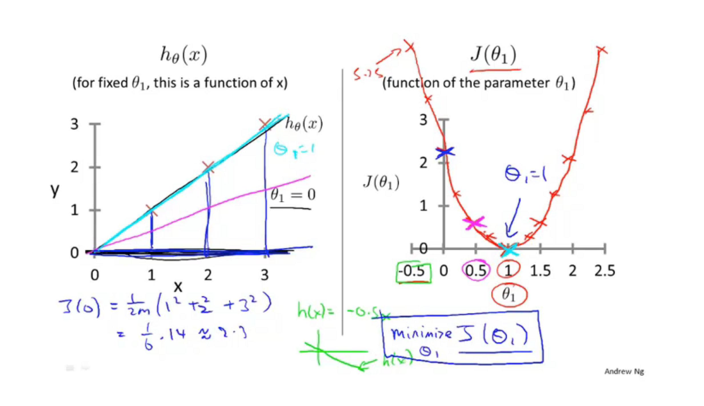
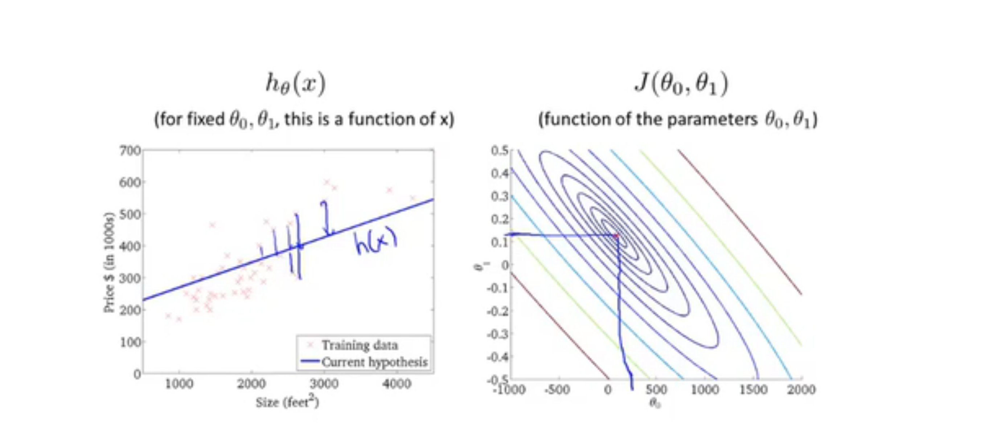

## 1.1 机器学习

### 1.1.1 机器学习概念

A computer program is said to learn from exprience E with respect to some task T and some performance measure P, if its perfomance on T as measured by P ,improves with exprience E.

Machine learning algorithms:

- Supervised Learning
- Unsuperised Learning

Others: Reinforcement learning, recommender systems.

Also talk about : Practival advice for applying learning algorithms

### 1.1.2 Supervised Learning

We gave the algorithm a data set, in which the "right answers" were given.

- Regression
- Classification

### 1.1.3 Unsupervised Learning

- Cluster


## 2.  Linear regression 线性回归

### 2.1 Model representation 模型描述

```
h(x) = a + bx
```

Linear regression with one variable(x). Univariate linear regression.(单变量线性回归)

###  2.2 Cost function 代价函数

figure out how to fit the best possible staight linear to our data.

Hppothiesis(假设函数): h(x) = a + bx

Hypothesis: which we use to make predictions.

a,b: parameters of the model.

Cost function: cost function is alos called the squared error functino or sometimes called the square error cost function and.

J(theta zeron,  theta one) = 

```python
f(i) = theta0 + theta1 * x
for i in sum:
	sum += (f(i) - y(i))^2
sum /= 2m;
```

### 2.3 Cost function (1)




### 2.3 Cost function (2)



