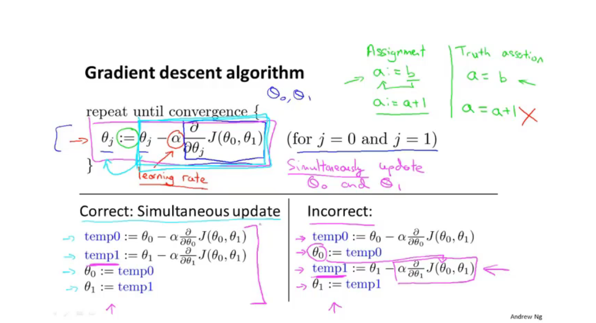
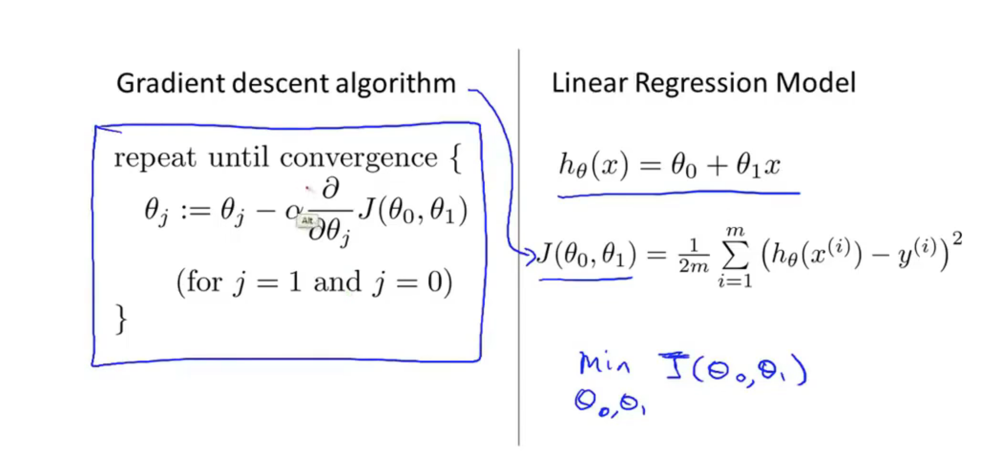
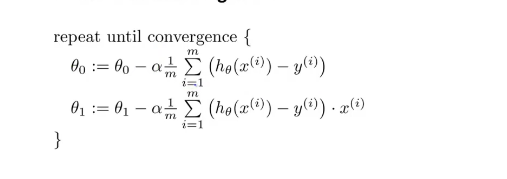

## 2.5  Gradient descent 梯度下降

have some function J(a, b)

want min J(a, b) find (ai, bi)

1. Start with some ai, bi

2. keep changing ai, bi to reduce J(a, b) until we hopefully end up at a minumum

## 2.6 Gradient descent intuition

**Alpha: ** learning rate. And it controls how big a step we take when updating my parameter theta J.

**Derivative term(导数项):** 

## 2.7 Gradient descent for linear regression

   

Batch Gradient Descen： Each step of  gradient descent uses all the training examples。

