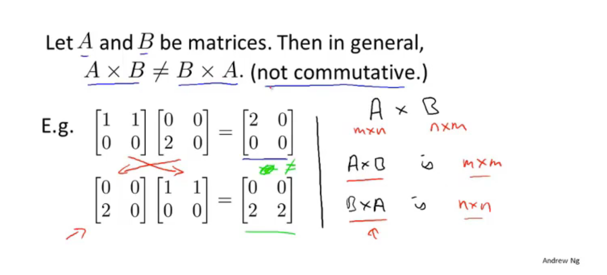

## day03 3-1

# 3 Linear Algebra review

## 3.1 Matrices and vectors

**Matrix**: Rectangular array of numbers.

**Dimension of matrix** :number of rows x number of columns

**Matrix Elements(entries of matrix** :  Aij = "i,j entry" in the i th row , j th colmn

**vector:** a vector turns out to be a special case of a matrix. An n by 1 matrix.

**Vector Elements** yi = i th element

In this class, We use 1-indexed. 

## 3.2 Addition and scalar(标量) multiplication

**Matrix addition** 

**Scalar Multiplication**

**Combination of Operands**

## 3.3 Matrix-vector multiplication

that's how you multiply a matrix and a vector

## 3.4 matrix-matrix multiplication

We talk about the method in linear regression for how to solve for the parameters theta zero and theta one, all in one show, so without needing an iterative algrorithm.

a little trick

## 3.5 matrix multiplication properties

**identity matrix**

## 3.6 Inverse and transpose

**matrix inverse:**

