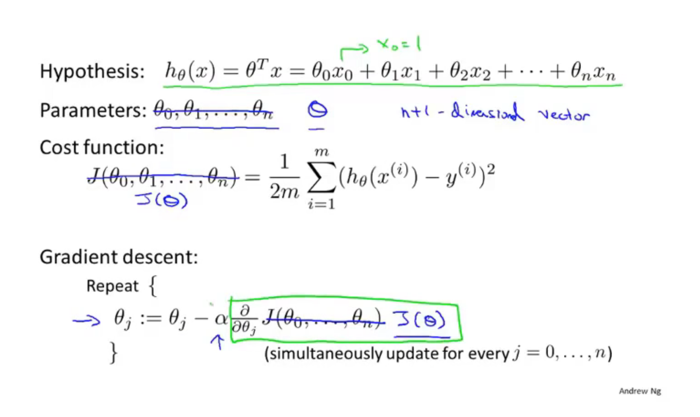
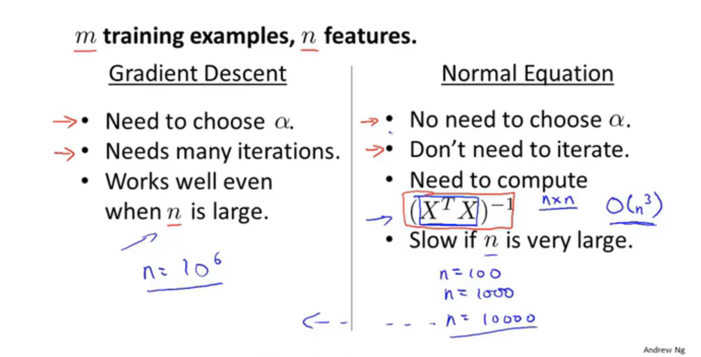
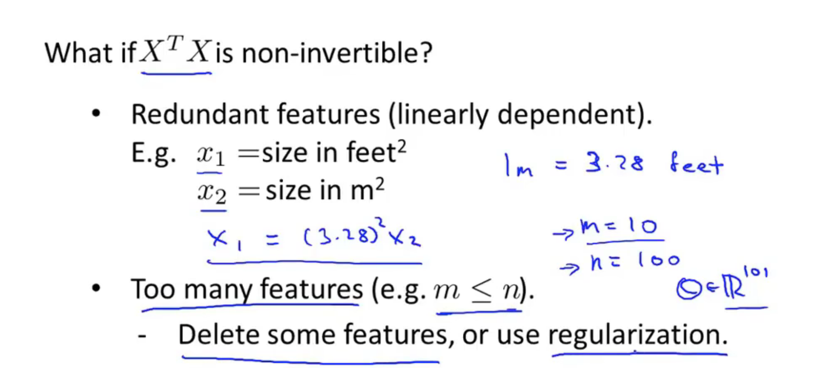

# 4 Linear Regreesion with multiple variables

## 4.1 Multiple features

## 4.2 Gradient descent for multiple variables

## 4.3 Gradient descent in practive !: Feature Scaling(特征缩放)

## 4.4 Gradient descent in practive II: Learning rate

## 4.5 Features and polynomial regression

**feature choose: may create a feature?**

## 4.6 Normal equation(正规方程)

**Normal equation:** method to solve for theta analytically

  

## 4.7 Normal equation and non-invertibility(optional)

