# 6 Logistic Regression

## 6.1 Classification

**discrete 离散** 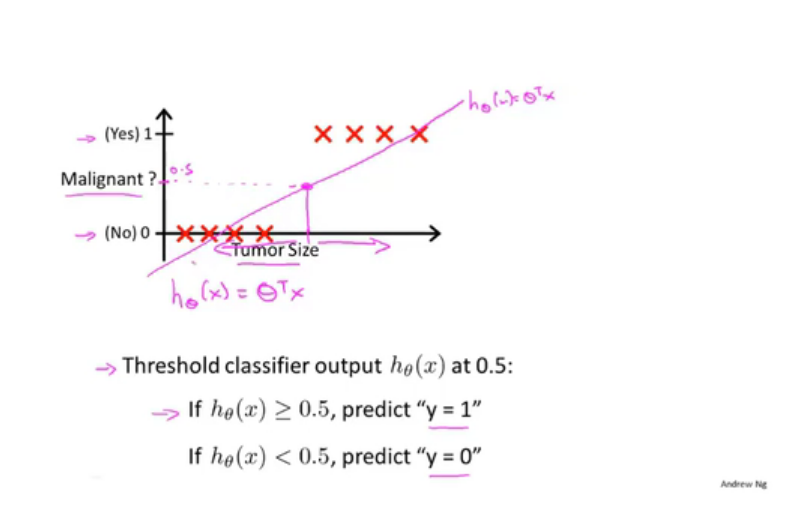

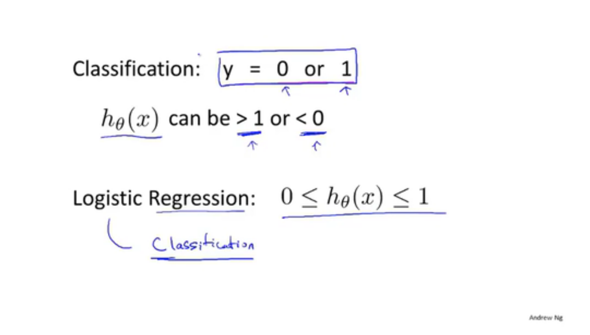

## 6.2 Hypothesis Representation

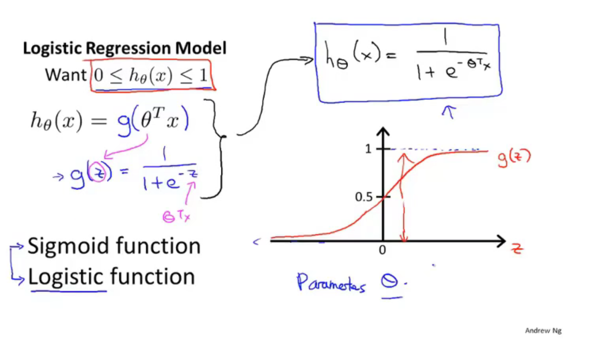

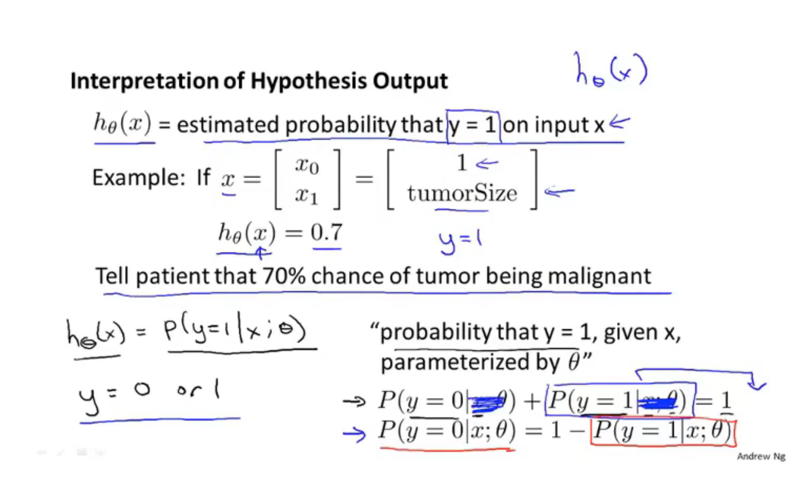

## 6.3 Decision boundary

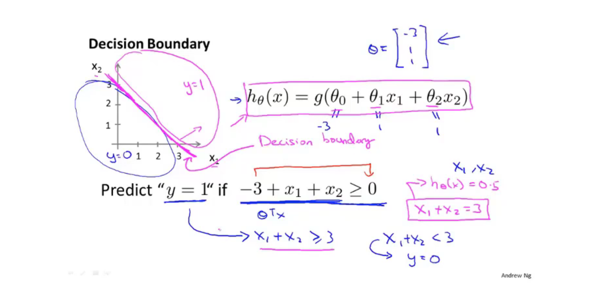

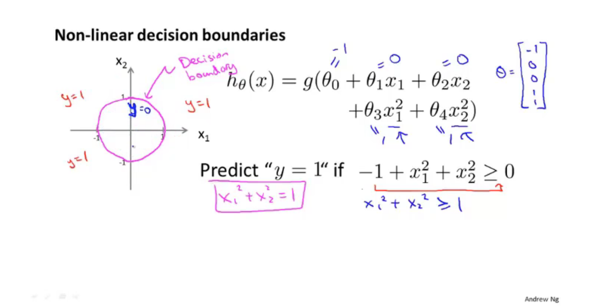

## 6.4 Cost function

**optimization: 优化**

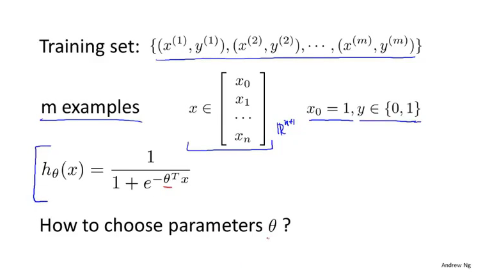

**The interpretation of this cost function is that this is the cost I wany my learning algorithm to have to pay, if it outputs that value if its prediction is H of x and the actual label was y**

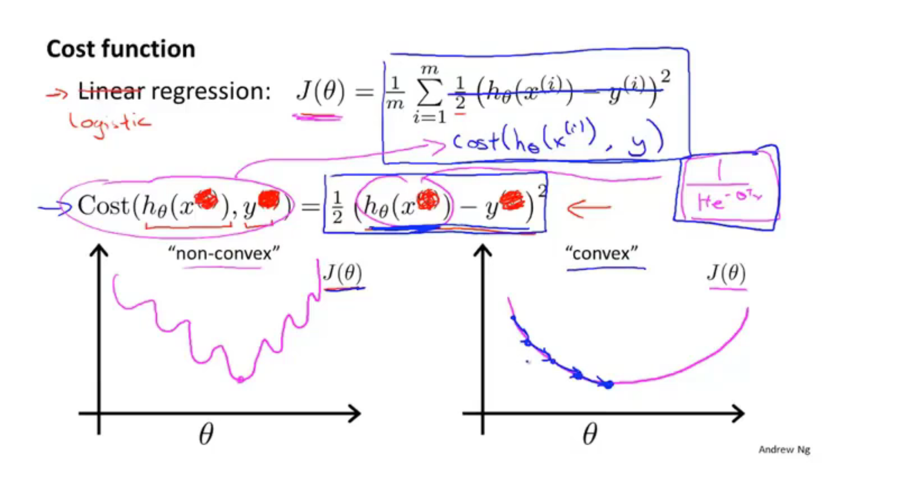

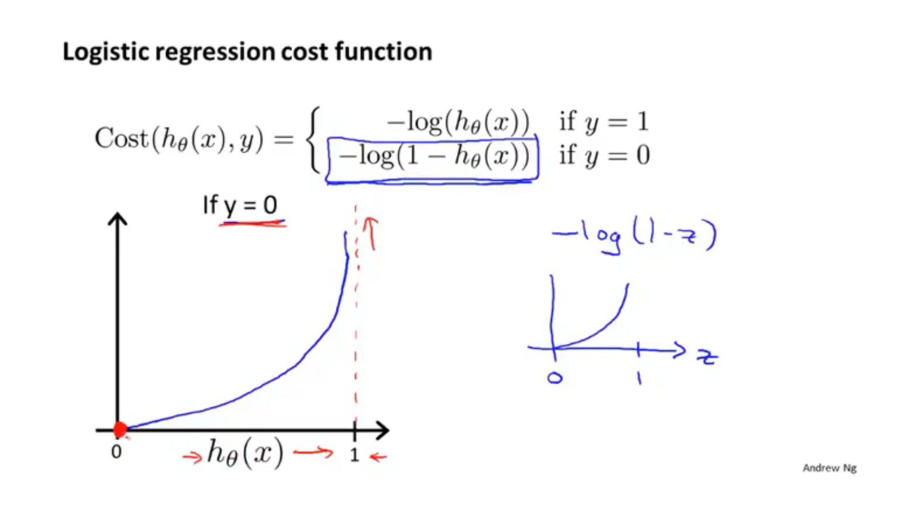

## 6.5 Simplified cost function and gradient descent

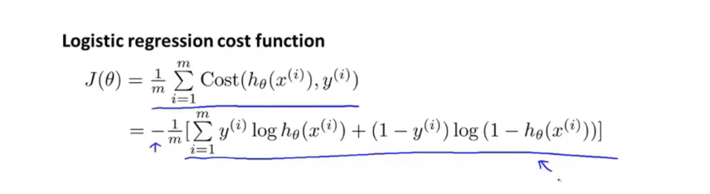

**this formula can be derived from statistics using the principle of maximum likelihood estimation**

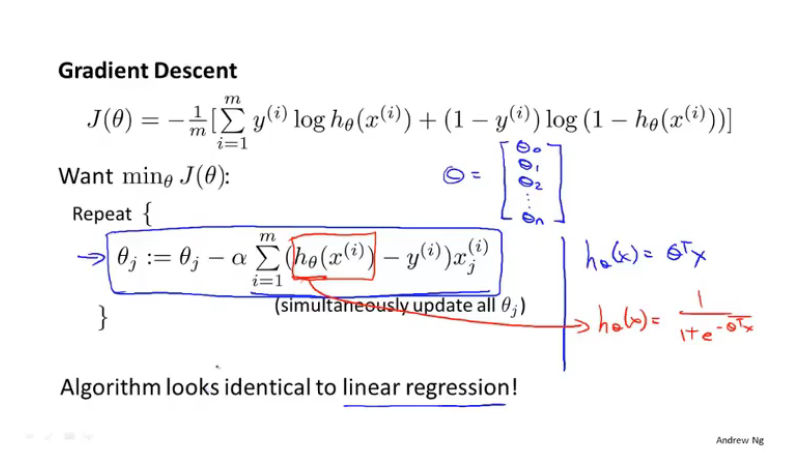

## 6.6 Advanced optimization

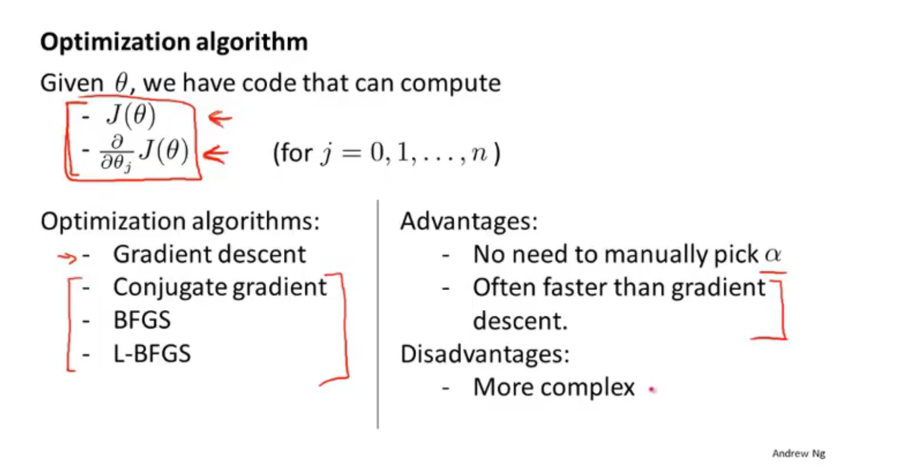

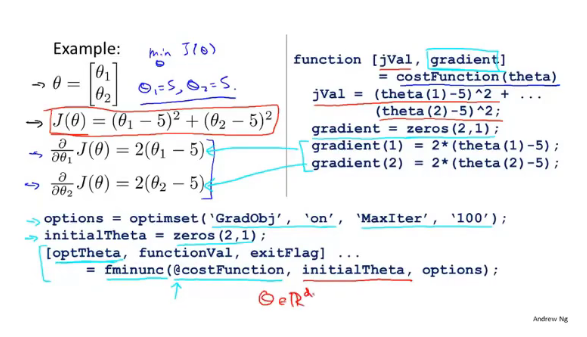

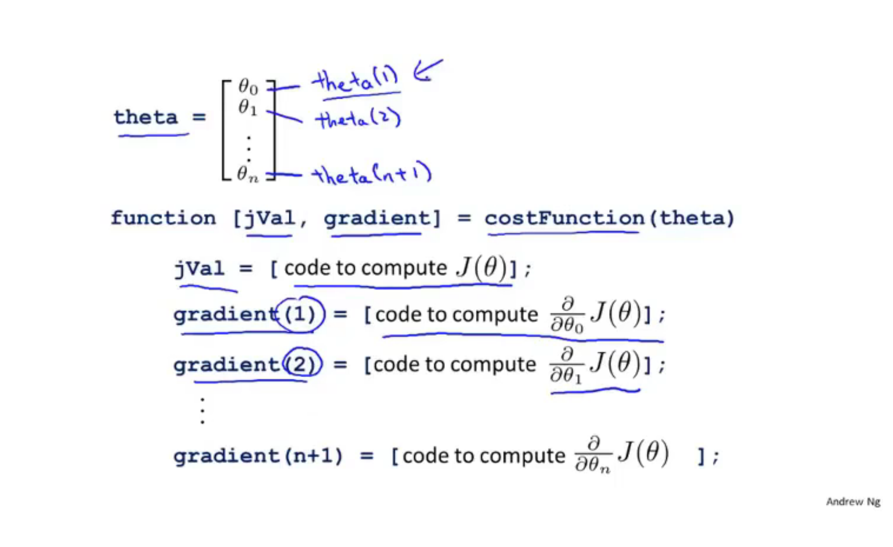

## 6.7 Multi-class classification: One - vs - all

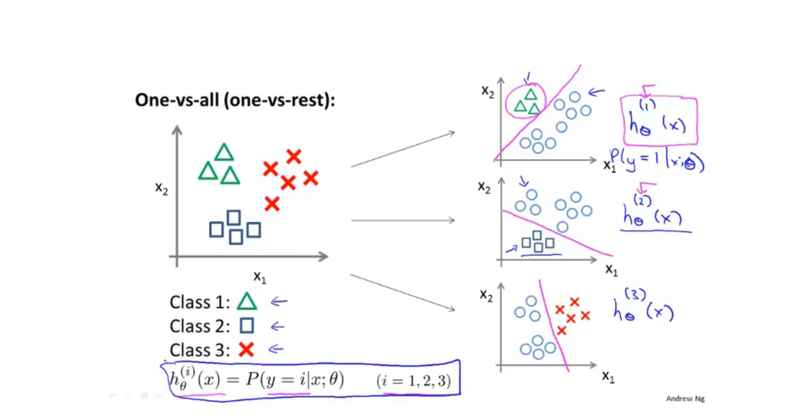

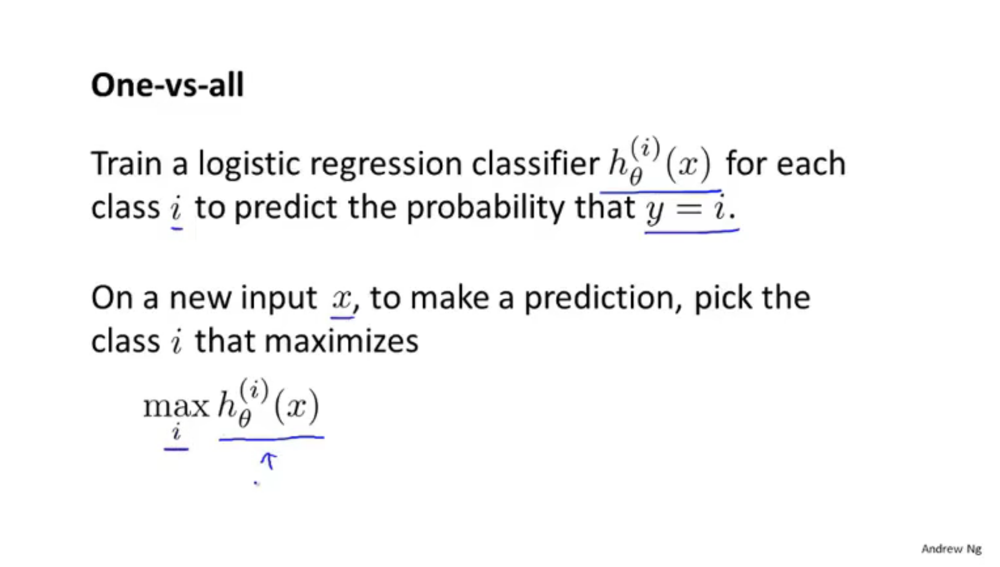

