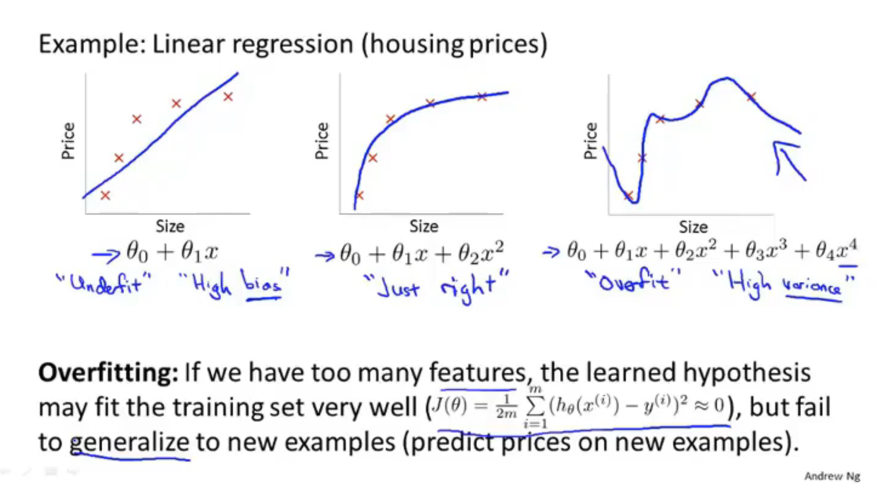
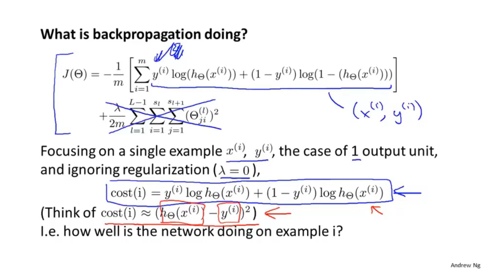

# 7 Regularization

## 7.1 The problem of overfitting 

**variance: 方差**

## 7.2 Cost function

## 7.3 Regularized linear regression

## 7.4 Regularized logistic regression

# 8 Netural Networks: Representation

## 8.1 Non-linear hpypotheses

## 8.2 Neurons and the brain

略

## 8.3 Model Representation

## 8.4 Model representation II

## 8.5 Examples and intuitions I 

## 8.6 Examples and intuition II 

## 8.7 Multi-class classification

# 9 Neural Networks: Learning

## 9.1 Cost function

## 9.2 Backpropagation algorithm

## 9.3 Backpropagation intuition

 ## 9.4 Implementation note: Unrolling parameters

## 9.5 Gradient checking

epsilon: 

 

## 9.6 Random initialization

略

## 9 .7 Putting it together

