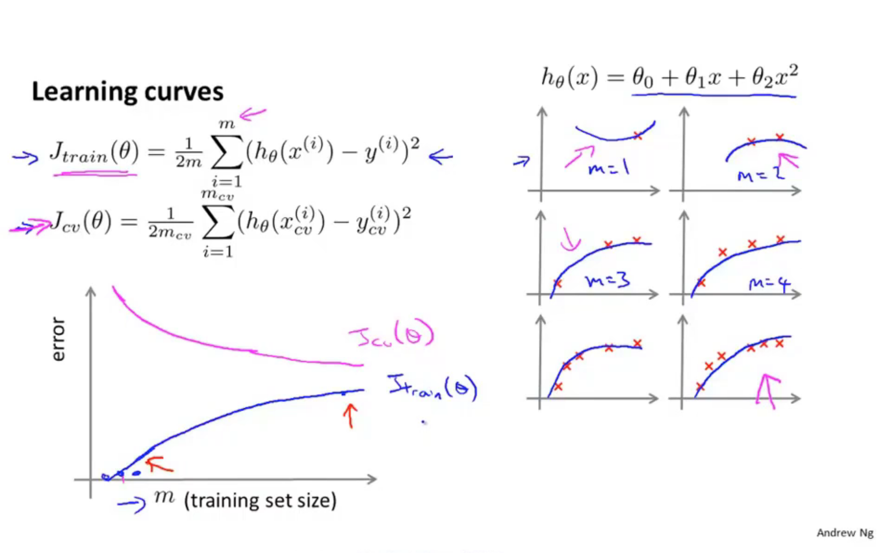

# 10. Advice for applying machine learning

## 10.1 Deciding what to try next

$$
J(\theta) = \frac{1}{2m} \left(\sum_{i = 1}^{m} (h_\theta(x^{{i}}) - y^{(i)})^2 + \lambda\sum_{j=1}^{m}\theta_j^2 \right)
$$

- Get more training examples
- Try smaller sets of features
- try getting additional features
- try adding polynomial features
- try decreasing lambda
- try increasing lambda

 **Machine learning diagnostic**

Diagnostic: A test that you can run to gain insight what is/isn't working with a learning algorithm, and gain guidance as to how best to improve its performance.

Diagnostics can take time to implement, but doing so can be a very good use of your time.

## 10.2 Evaluating a hypothesis

**Evaluating your hypothesis:**

**Training/Test procedure for linear regression**

- Learn parameter theta from training data(minimizing training error J(theta))
- Compute test set error:

$$
J_{test}(\theta) = \frac{1}{2m_{test}} \sum_{i = 1}^{m} (h_\theta(x_{test}^{{i}}) - y_{test}^{(i)})^2
$$

**Traning/testing procedure for logistic regression**

- Learn parameter $\theta$ from traning data 

- Compute test set error:

  
  $$
  J_{test}(\theta) = - \frac{1}{m_{test}}\sum_{i = 1}^{m_{test}} y_{test}^{(i)}logh_\theta(x_{test)}^{(i)}) + (1 - y_{test}^{(i)}logh_\theta(x_{test}^{(i)})
  $$
  

- Miclassification error 
  $$
  err(h_\theta(x), y) = \begin{cases}
  															1  \ if \ h_\theta(x) \ge 0.5 & y =0 \
  																or \ if \ h_\theta(x) < 0.5 & y = 1  \\
  															0  \ otherwise
  																	
  											\end{cases}
  $$

  $$
  TEST \ error = \frac {1} {m_{test}} \sum_{i = 1}^{m_{test}} err(h_\theta(x_{test}^{(i)}, y_{test}^{(i)}))
  $$

## 10.3 Model selection and training/validation/test sets

## 10.4 Diagnosing bias(偏差) vs variance(方差)

## 10.5 Regularization and bias/variance

## 10.6 Learning curves

   

## 10.7 Deciding whtat to try next(revisited)

