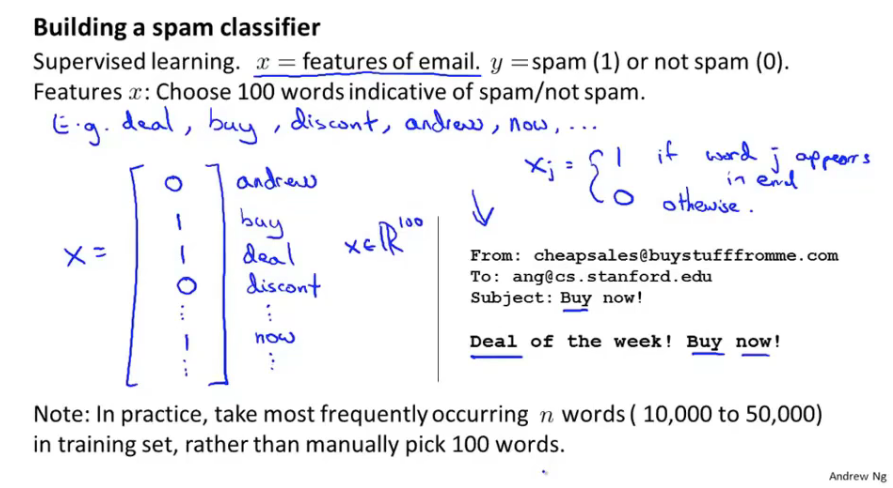
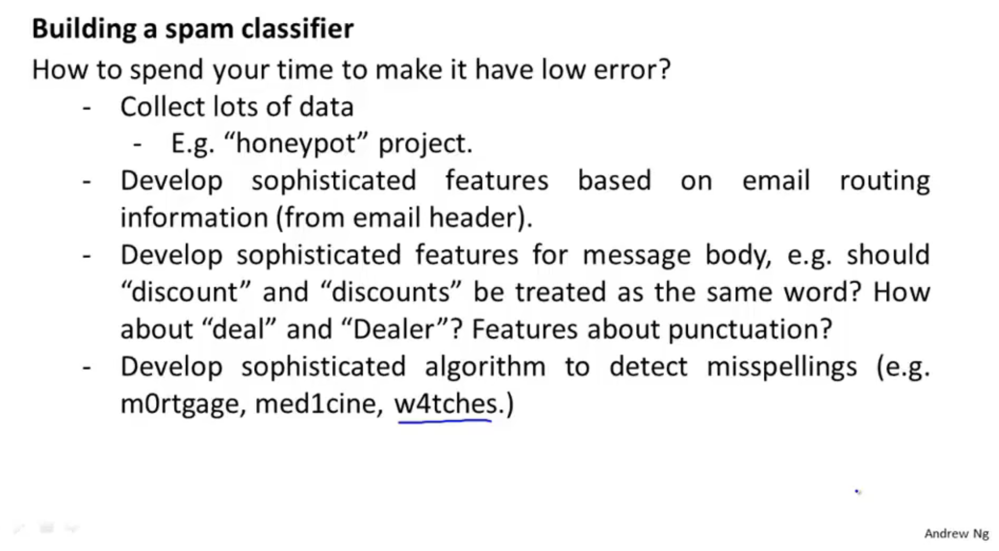
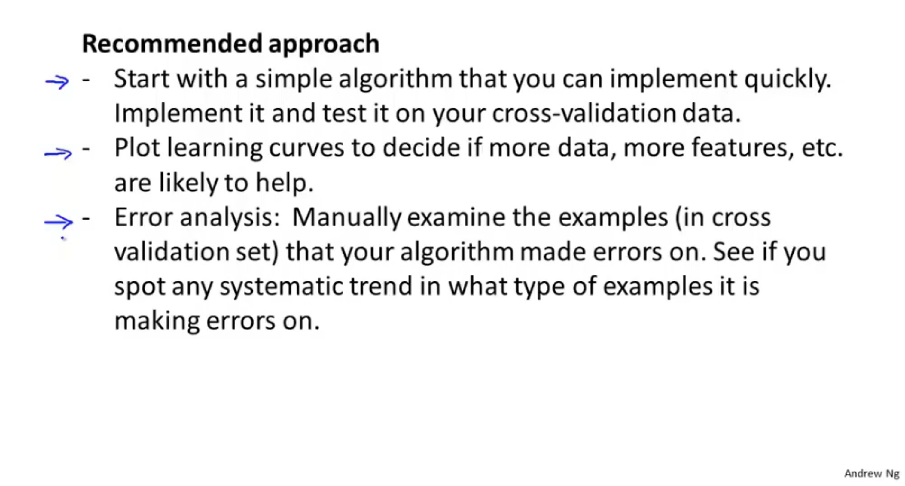
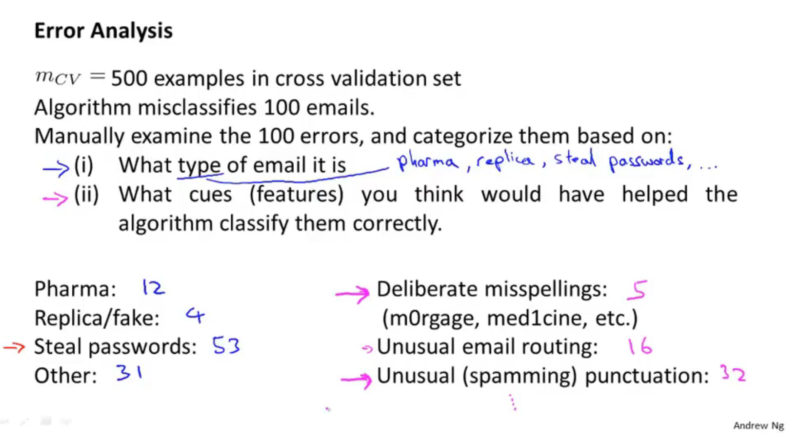
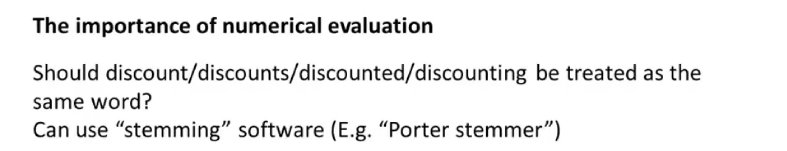
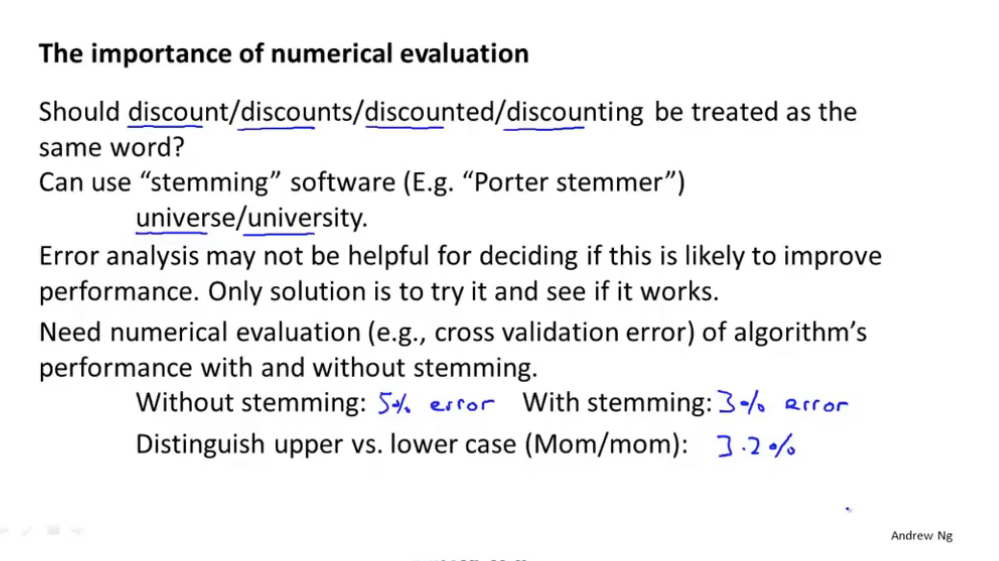
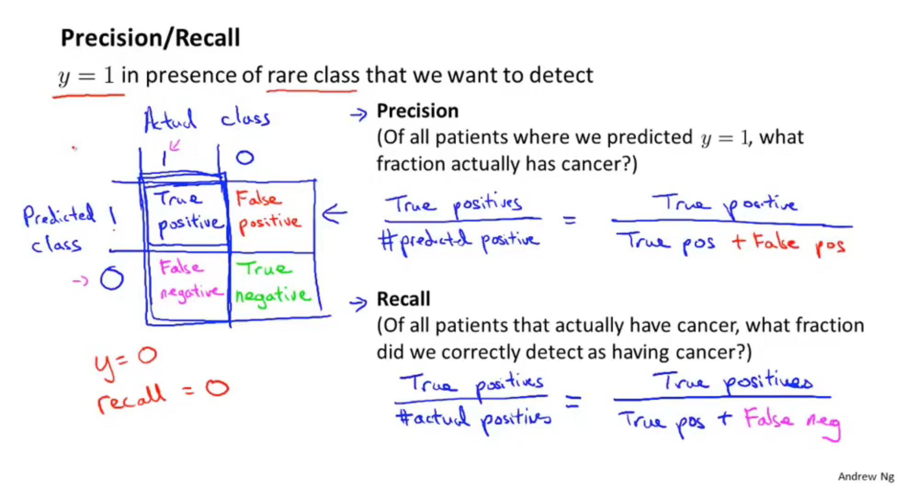
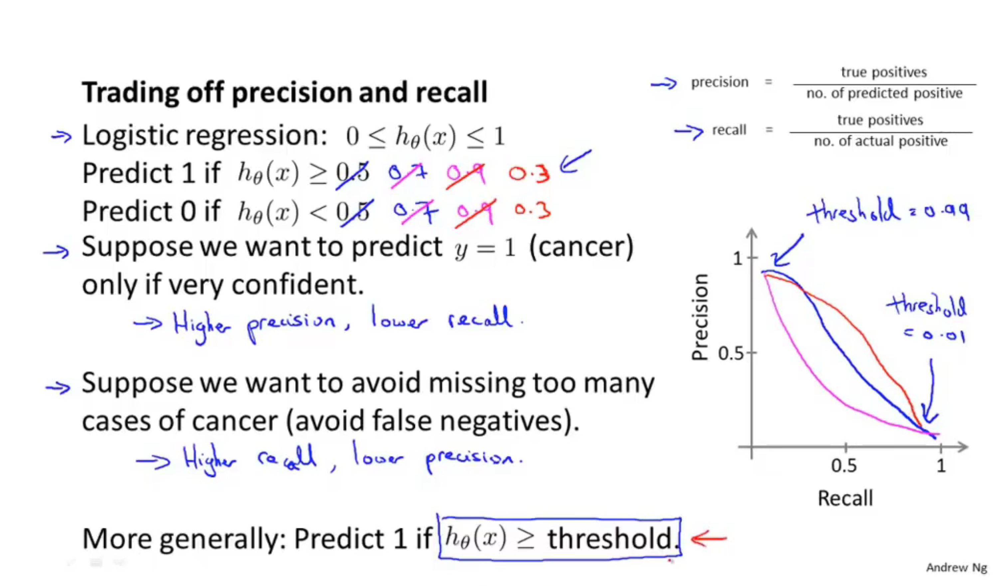
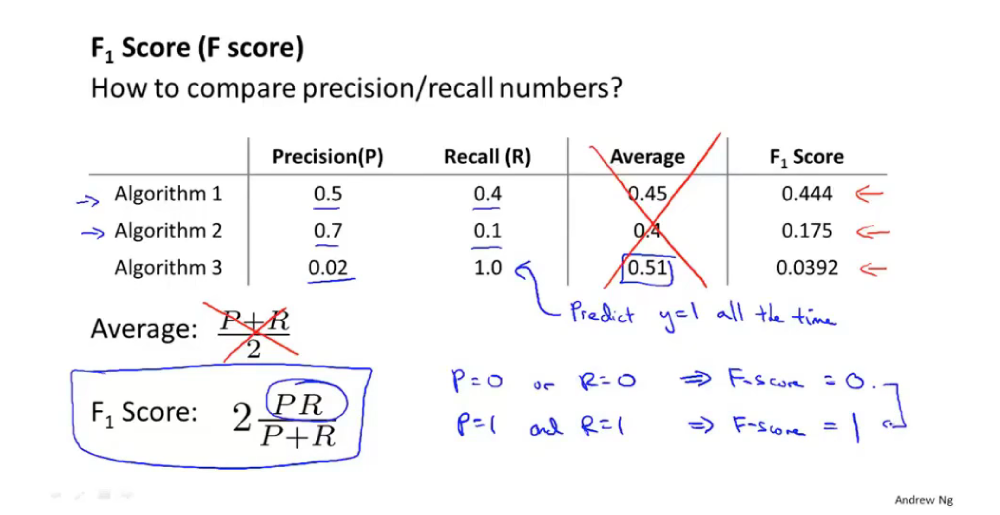
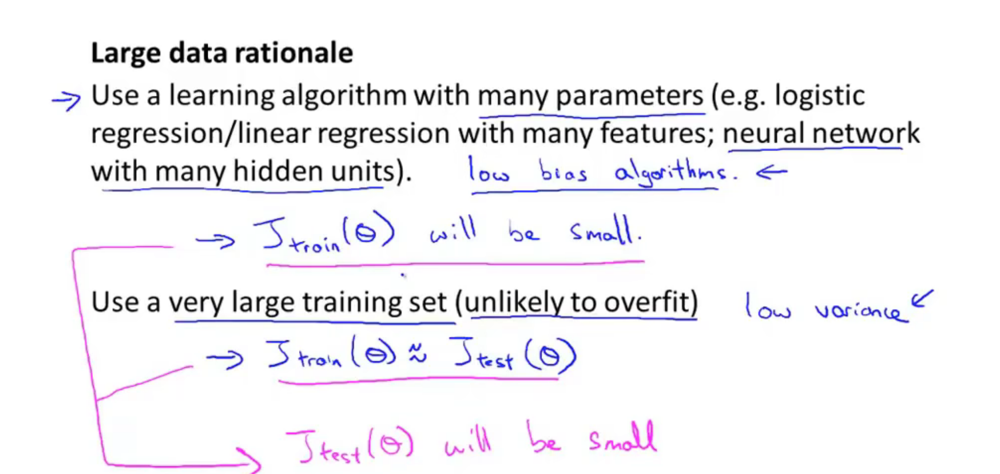

# 11. Machine learning system design

## 11.1 Prioriting what to work on: Spam(垃圾邮件) classification example

## 11.2 Error Analysis

 

## 11.3 Error metrics(指标) for skewed classes(偏斜类) 

## 11.4 Trading(权衡) off precision and recall

## 11.5 Data for machine learning

\

