# 13. Clustering

## 13.1 Unsupervised learning introduction

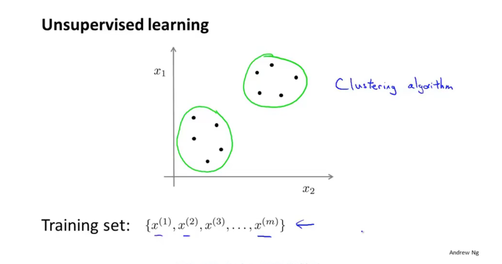

## 13.2 K-means algorithm

**converge: 收敛**

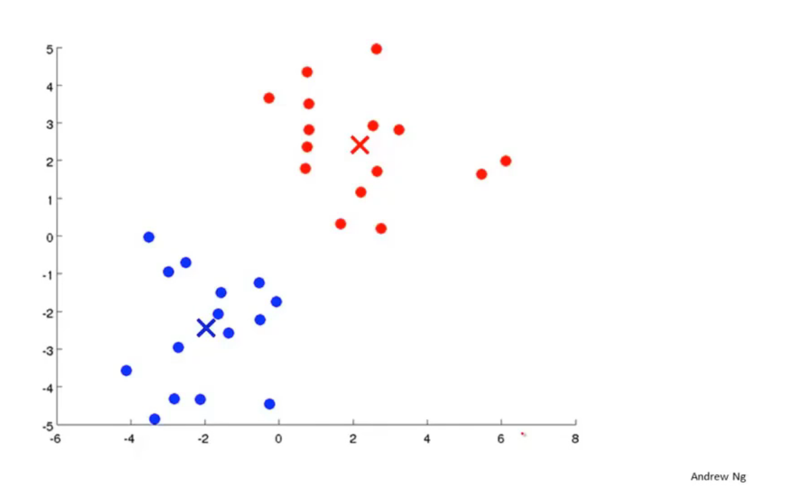

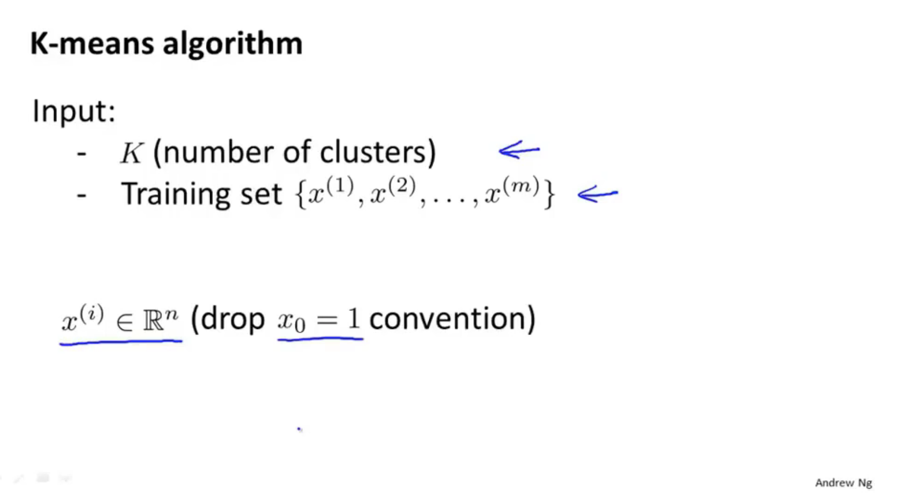

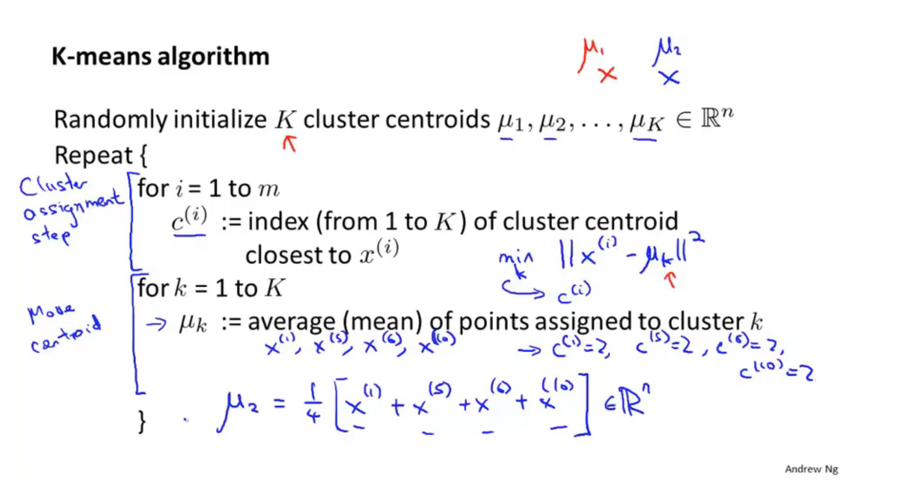

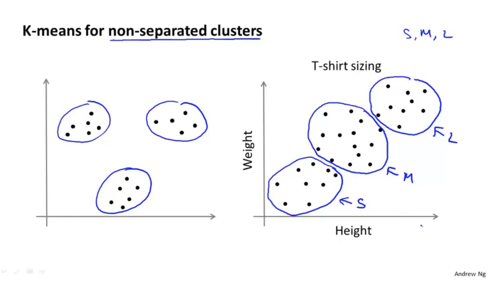

## 13.3 Optimization objective

1. knowing what is the optimization objective of K-means will help us to debug the learning algorithm and just make sure that k-means is runing correctly
2. how can we use it to help k-means find better clusters and avoid local optima

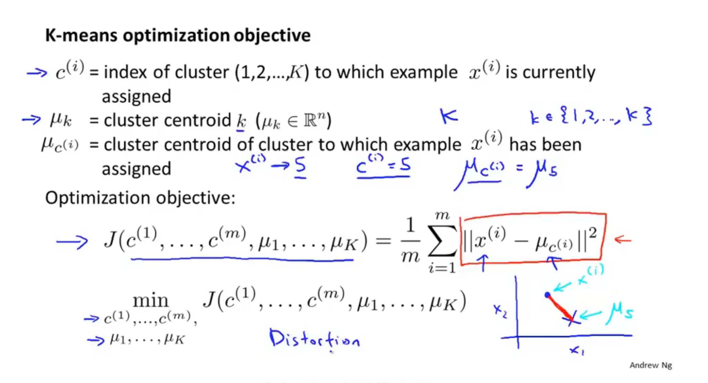

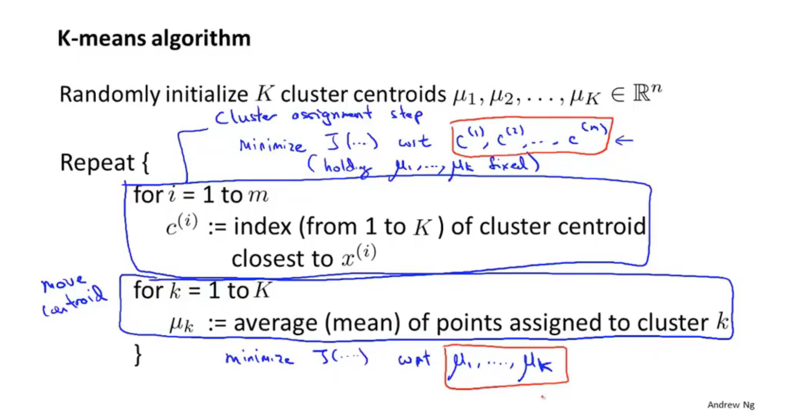

## 13.4 Random initialization

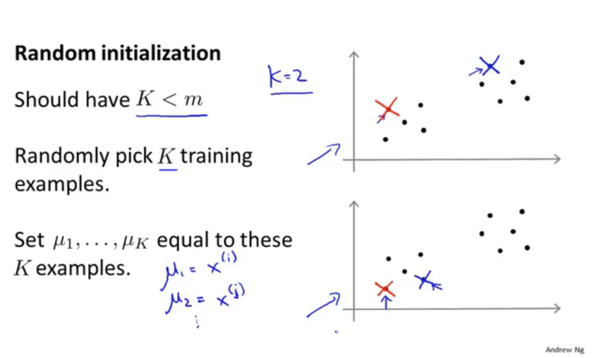

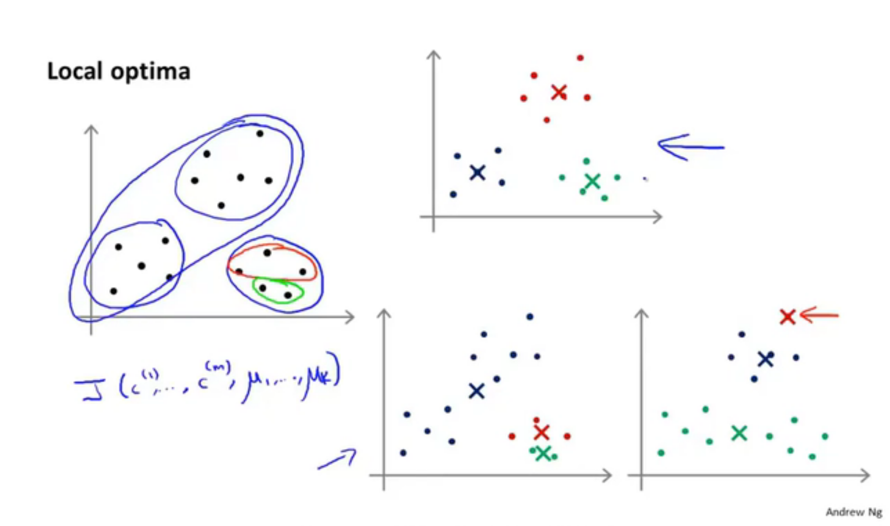

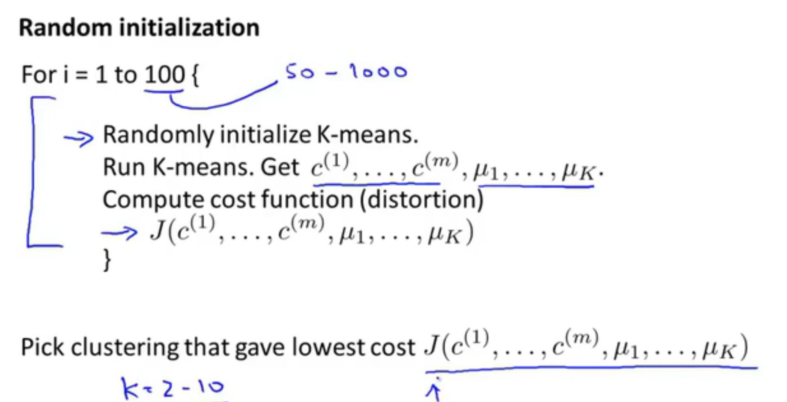

## 13.5 Choosing the number of clustors

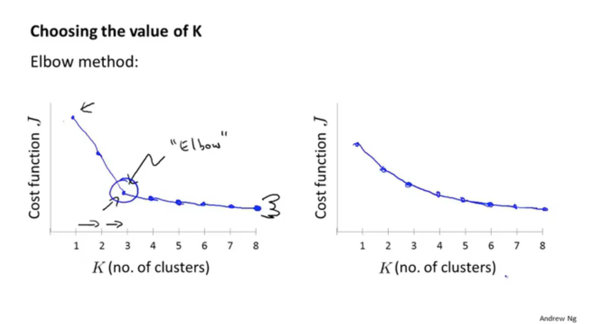

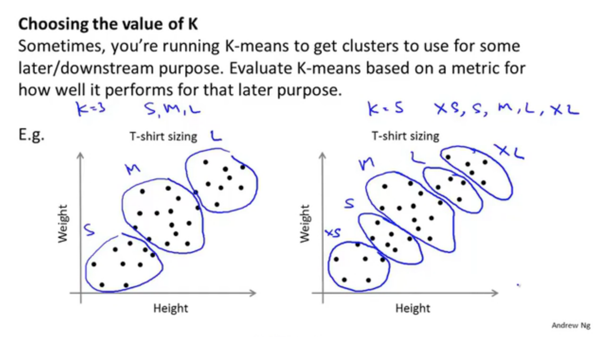

