# 14. Dimensionality Reduction

## 14.1 Motivation I: Data Compression

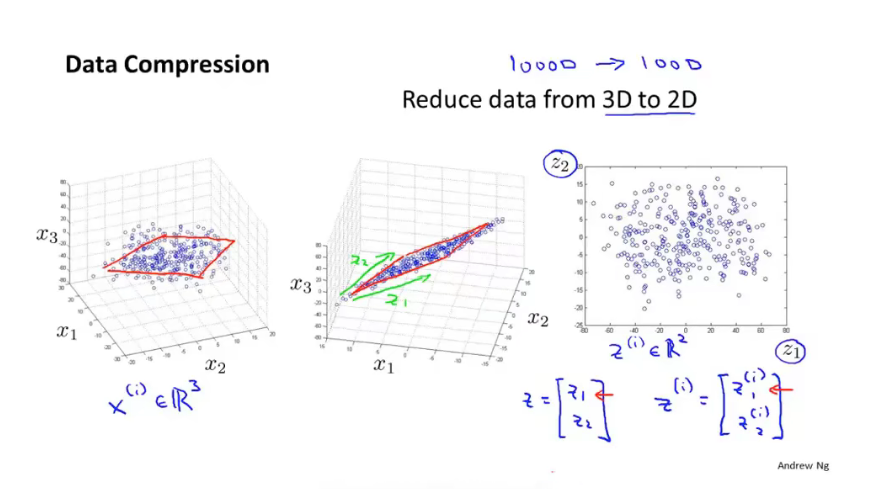

## 14.2 MOtivation II: Data Visualization

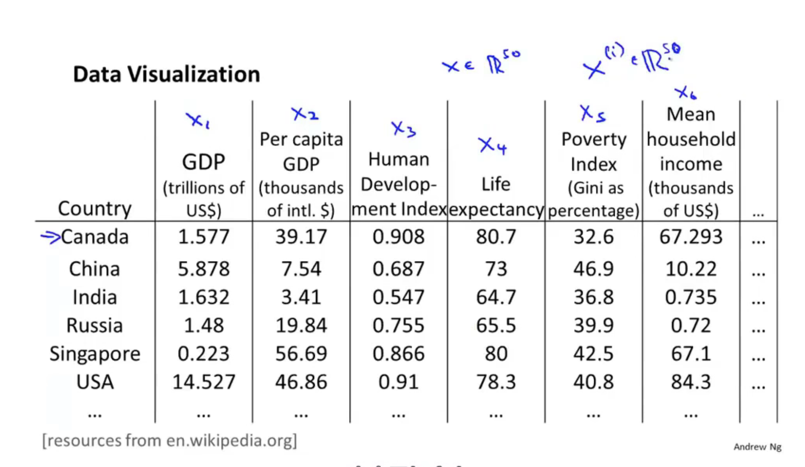

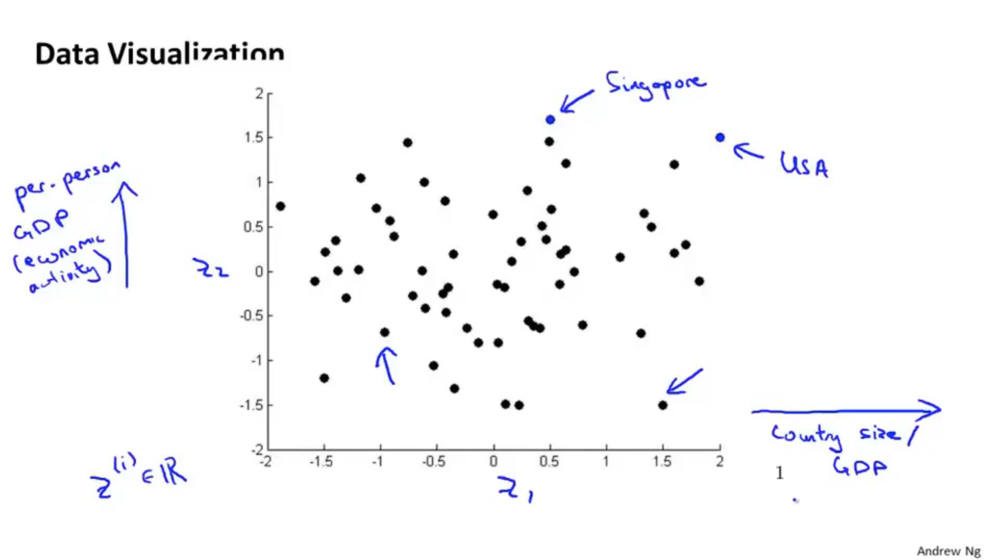

## 14.3 Principal Component Analysis problem formulation 

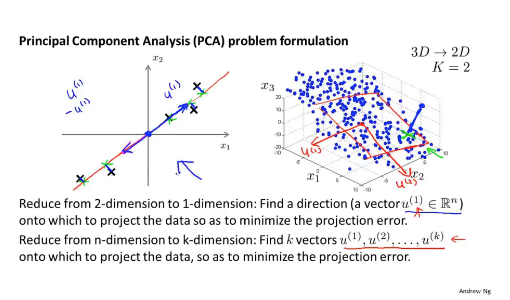

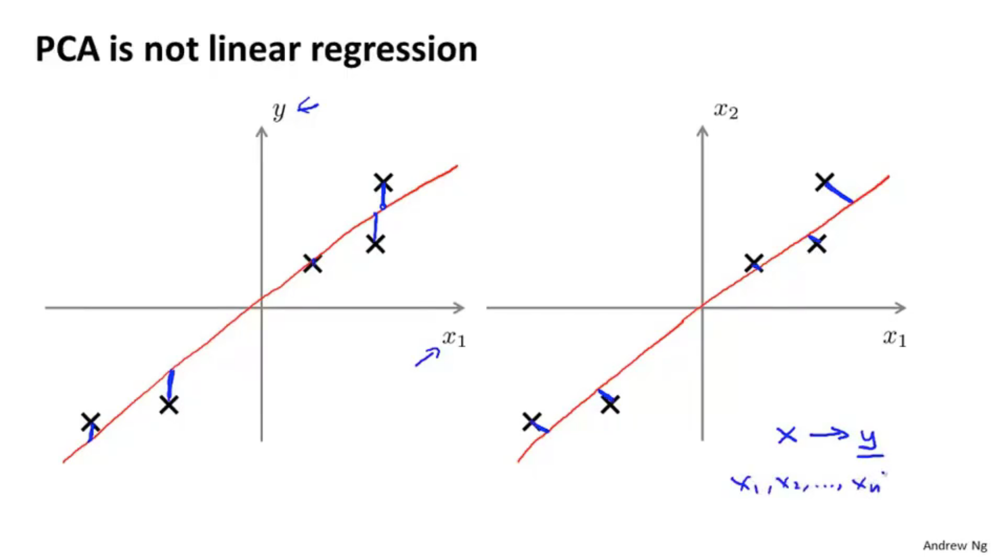

**cosmetic: 表面的**

## 14.4 Principal Component Analysis algorithm

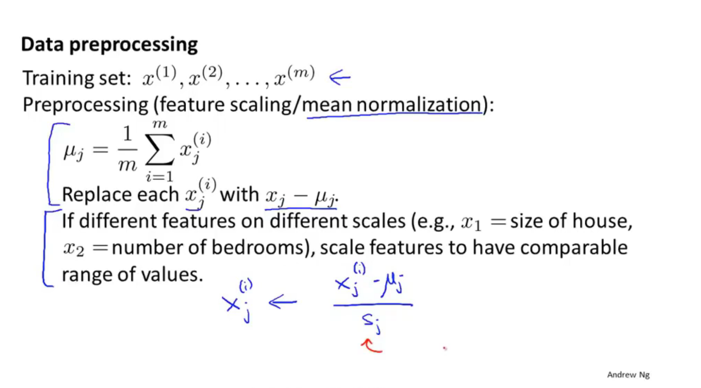

 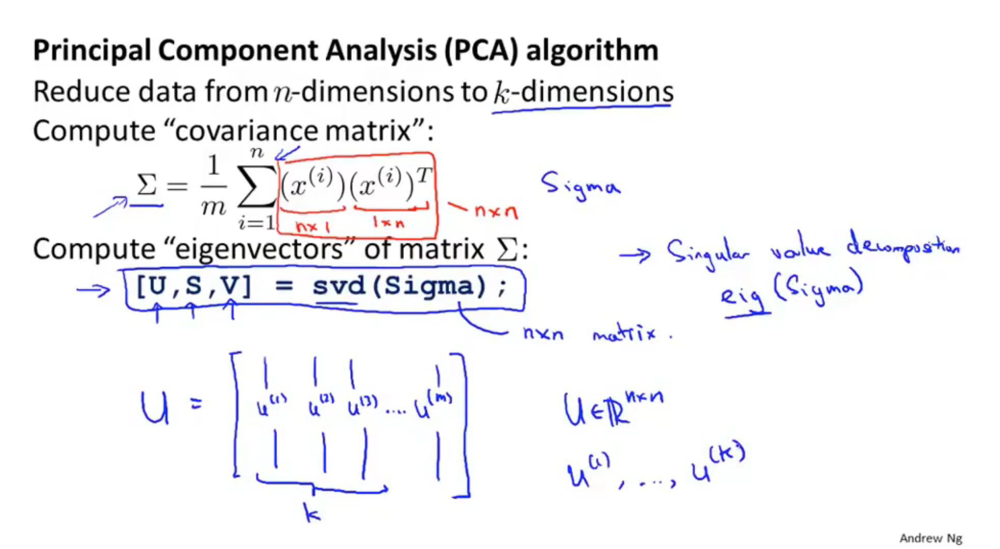

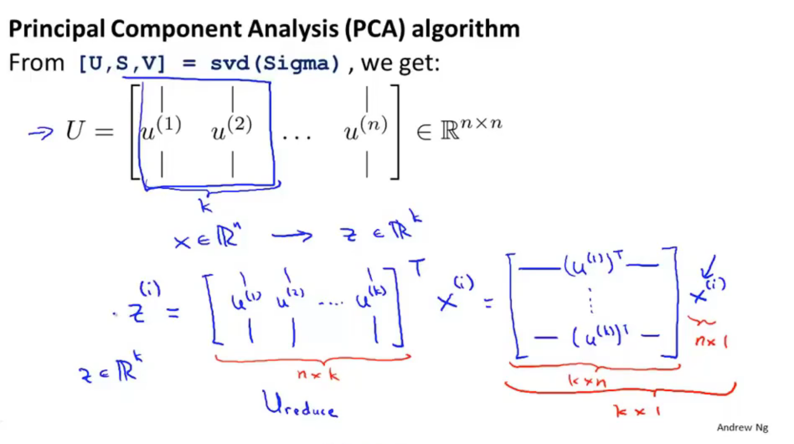

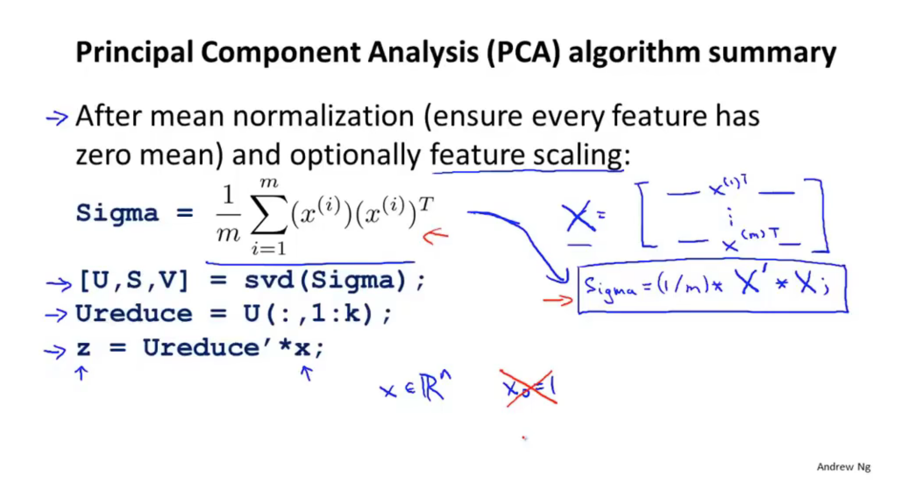

## 14.5 Choosing the number of princle components

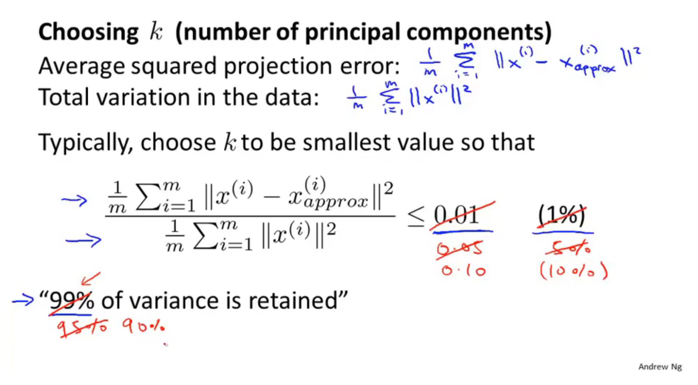

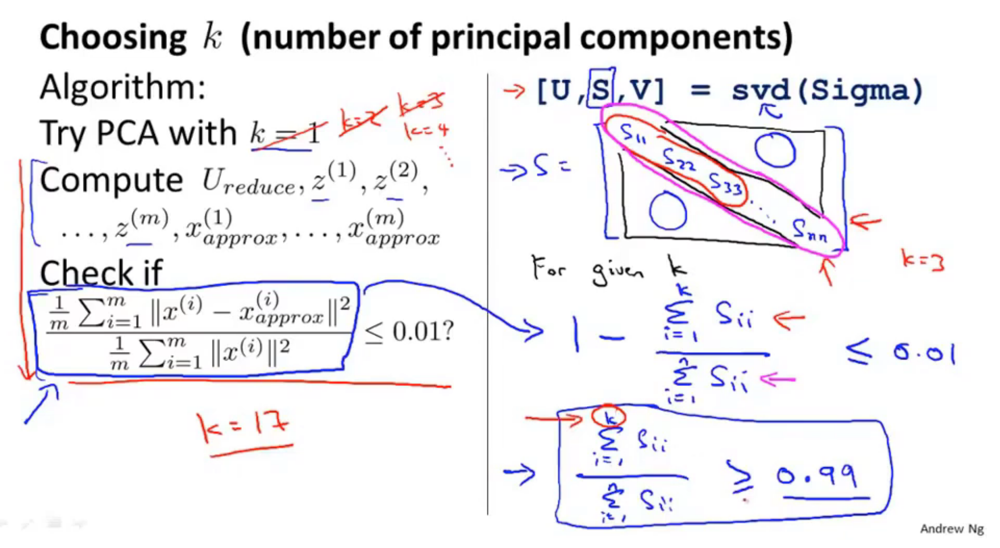

  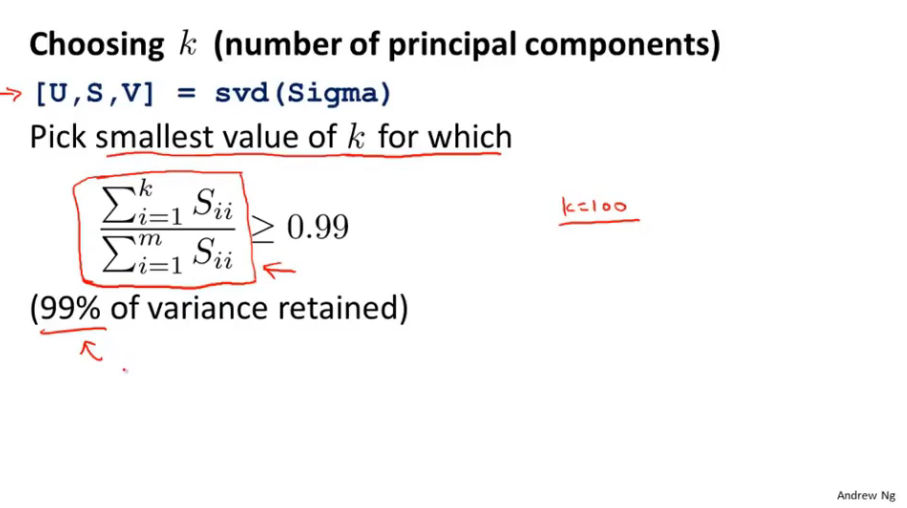

## 14.6 Reconstruction from compressed representation

**approx: 大约**

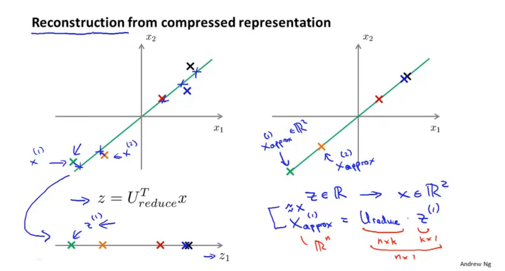

## 14.7 Advice for applying PCA

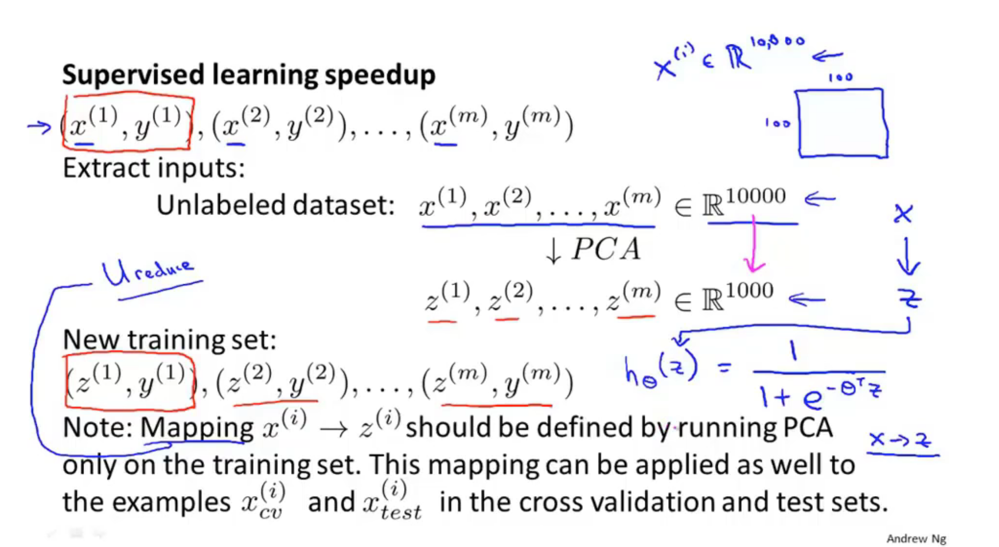

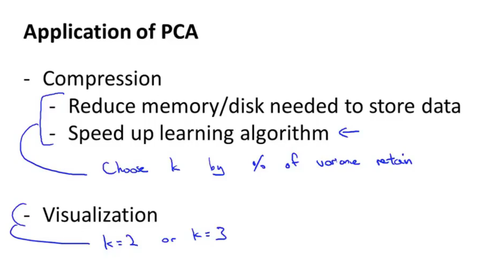

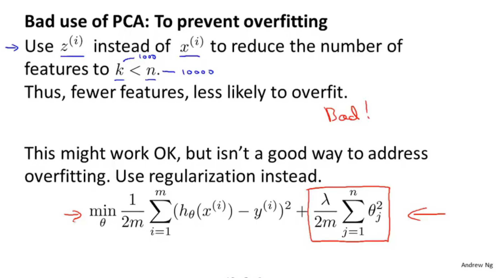

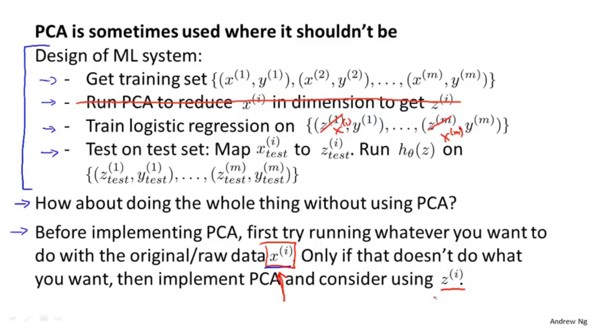

