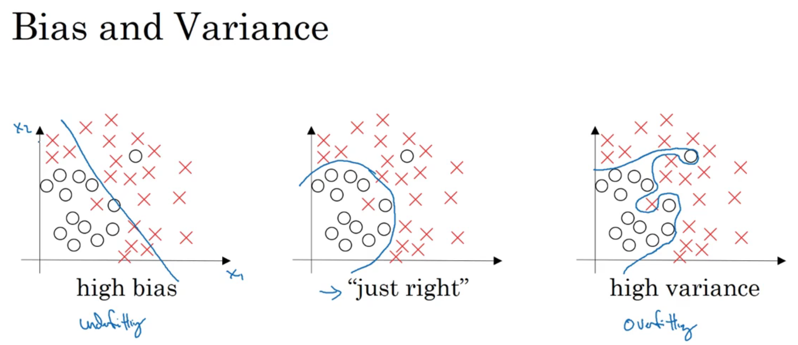

# 5 Setting up your ML application 

## 5. 1  Train/dev/test sets

****

**tuning : 调优**

**training set, dev set , test set**

Prea: 7/3 6/2/2

Big data: 95%/2.5%/2.5%.      99.5%/0.4%/0.1%

**Mismatched train/test distribution:**

```
make sure dev and test comf from same distribution
No having a test set might be okay.(only dev set.)
```

## 5.2 Bias/Variance



  

train set error低， dev set error高： 产生high variance

train set error高，dev set error和train差不多： 产生high bias

在一些高纬数据中，某些部分的数据具有高方差（拟合过度），某些部分的数据具有高偏差（欠拟合）。

## 5.3 Basic "recipe" for machine learning

**basic recipe for machine learning**

**blurry: 模糊的**

```
          Y
high bias -> bigger network, train longer, new network architecture 
(training data performance)
N               
                y
high variance ? -> more data, regulazation, more architecture search
(dev set) 
N 
Done

```

## 5.4 Regularization

---

Logistic regression


---

Neural network

 **arcane: 晦涩难懂**


## 5.5 Why regularization reduce overfitting


## 5.6 Dropout regularization

 

## 5.7 Understanding dropout

Always in dropout.


## 5.8 Other regularization methods


## 5-9 Normalizing(正规化) inputs

1. subtract out or to zero out the mean 
   1. 求平均值
   2. 把每一个数都减去这个平均值，使得新数的平均值为0）
2. normalize the variances（sigma squared is a vector with the variances of each of the features）
   1. 第一步已经计算了每一个x - mean，这里计算$\sigma = \frac {1}{m}\sum_{i = 1}^{m}x^{(i)}**2$   
   2. $x/=\sigma$, 使得x的variance = 1
3. use the same mu and sigma squared to normalize you test set (测试集中做相同的操作需要使用训练集中的平均值和方差值) 


1. By just settin gall of them to a 0 mean and say ,variance 1, thatju st guarantees that all your features on a similar scale and will usually help your learning algorithm run faster.


## 5.10 Vanishing(消失)/exploding(爆炸) gradients


## 5.11 Weight initialization for deep networks


## 5.12 Numerical approximation(数值近视) of gradients 


## 5.13 Gradient Checking

W[1], b[1] 这些由矩阵转换为向量，然后进行连接


 ## 5.14 Gradient Checking implementations


