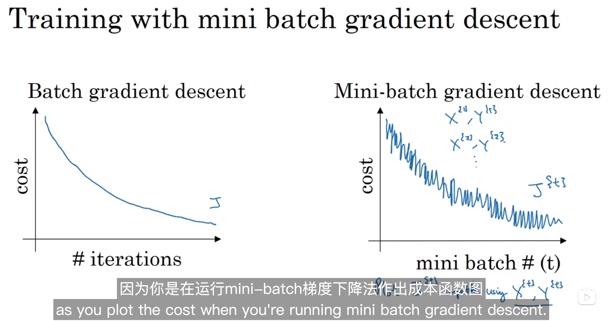

# 6. Optimization Algorithms

## 6.1 Mini-batch gradient descent

 **empirical: 经验** **regime: 制度** **capsule: 压缩** **connotation: 内涵**

## 6.2 Understanding mini-batch gradient descent 

**stochastic ： 随机的** **ameliorated: 改善** **converge: 收敛** **consequent descent: 顺向** **oscillate: 震荡**

## 6.3 Exponentially(指数) weighted（权值） averages（平均）

**moving average in the statistics literature**

## 6.4 understanding exponentially weighted averages

## 6.5 Bias correction in exponentially weighted average

能够处理初始的偏差

## 6.6 Gradient descent with momentum(动量)

**Basic idea: ** to compute an exponentially weighted average of your gradients, and then use that gradient to update your weights instead.

用于加速梯度下降

**diverging: 不同**

减缓了梯度下降的速度,使得在横轴的方向上走的更远。

**robust: 健壮性 **  **omitted: 省略了**

## 6.7 RMSprop（Root mean square prop）

**square root : 平方根**

## 6.8 Adam optimization algrotihm

**adaptive: 自适应**

Adam: Adaptive Moment Estimation

## 6.9 Learning rate decay (衰减)

Recall that one epoch is one pass through the data.

**discrete: 离散**

## 6-10  The problem of local optima 

**saddle points : 鞍点**

