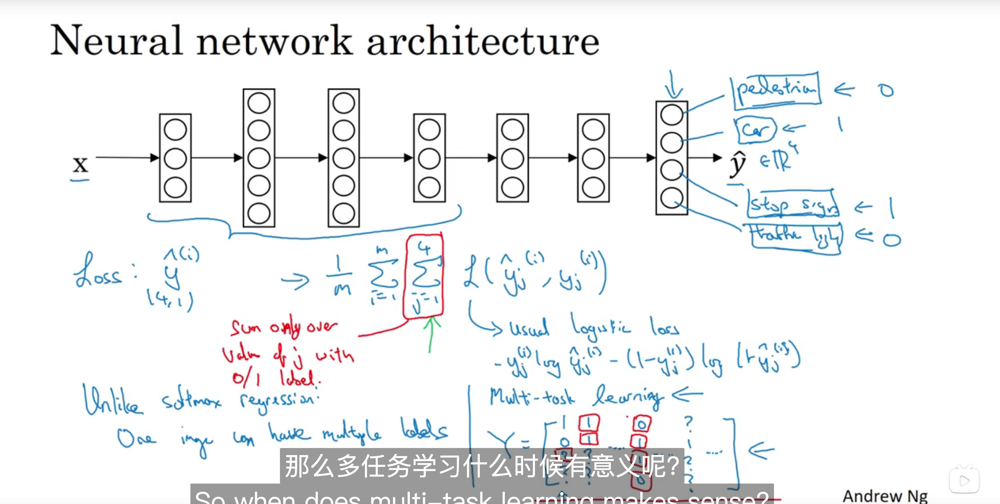
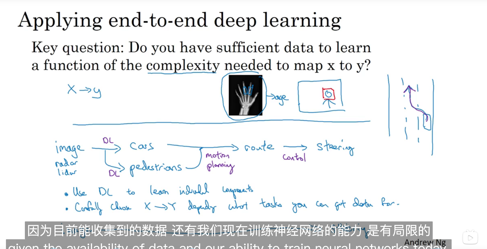

# 9.Error Analysis

## 9.1 Carraying out error analysis

**process of error analysis:**
If you're trring to get a learning algortihm to do a task that humans can do. And if your learning algorithm is not yet at the performance of a human. Then manually examing mistakes that your algorithm is making, can give you insights into what to do next.

**Look at dev examples to evaluate ideas**
Error analysis:
- Get ~100 mislabled dev set examples.
- Count up how many are dogs.

**Evaluate muiltiple ideas in parallel**
Ideas for cat detection:
- Fix pictures of dogs being reognized as cats
- Fix great cats beging misrecognized
- Imporeve performance on blurry images

Imgae					Dog					Greate Cats Blurry 	Instagram		Comments
1							勾
2
...
% of total	  8%				  43%				57%				12%					

## 9.2 Cleaning up Incorrectly labeled data
**Incorrectly labled examples**
DL algorithms are quite robust to random errors in the training set.

**Error analysis**

Imgae					Dog					Greate Cats Blurry 	Instagram		Incorrectly labled	Comments
1							勾
2
...
% of total	  8%				  43%				57%				12%					

Overall dev set error

Errors due	incorrect lables

Errors due to other causes

Goal of dev set is to help you select between two classifers A & B.

**Correcting incorrect dev/test set examples**

- Apply same proecess to your dev and test sets to make sure they continnue to come from the same distribution
- Consider examining examples your algorithm got right as well as ones it got wrong.
- Train and dev/test data may now come from slightly different distributions.

## 9.3 Build your first system quickly, then iterate 

**Speech recoginition example**
- Noisy background 
	- Cafe noise 
	- Car noise 
- Accented(口音) speech 
- Farr from microphone
- Young children's speech
- Stuttering
- ...

**Recommend**
* Set up dev/test set and metric 
* Build initial system quickly 
* Use Bias/Variance analysis & Error analysis to prioritize nest steps

# Mismatched training and dev/test data

## 9.4 Traning and testing on different distributions
**Cat app examples**

data1: Data from webpages: 200k
data2: Data from mobile app: 10k

Option1:  data1 + data2 -> shuffle
Option2: train(data1 + 5k data2) dev(2.5k data2) test(2.5k data2)

## 9.5 Bias and Variance with mismatched data distributions
**Cat classifier example**
Assume humans get 0% error.
Traning error 1%
Dev error 10% 
But if it has a data mismatched problem, it can't work out for our old exprience.

So we add **Traing-dev set: ** Same distribution as training set, but not used for training.

So the we have as follows:
train        training-dev 			dev 			test

Train error 					1%           	1%
Traing-dev error      9%						1.5%
Dev error							10%						10%
Problem								variance			data mismatch

Human error						0%						0%
Training error 				10%						10%
Train-dev error				11%						11%
Dev error							12%						20%
Problem								Bias					Bias + Data mismatch

**Bias/variance on mismatched traning and dev/test sets**
1 Human level							4%			1-2 avoidable bias
2 Traing set error				7%			2-3 variance
3 Traing-dev set error		10%			3-4 data mismatched
4 Dev error								12%			4-5 degree of overfitting to dev set
5 Test error							12%

**More general formulation**

a                                General speech re		                Rear mirror data
Human level                      Human level 4%
"                                           	             								avoidable bias
Error on exmples trained on      Training error 7%
"																							variance
Error on exmples not trained on  Training-dev error 10%    Dev/Test errpr
"																				data mismatched

## 9.6 Addressing data mismatch
- Carray out manual error analysis to try to understand difference between training and dev/test sets
	- noisy - car noise street numbers
- Make traning data more similar; or collect more data similar to dev/test sets
	- similar noisy in-car data

Artificial data syjnthesis does work

# Learning from multiple tasks
## 9.7 Transfer learning 

pre-training:  另外一个人物进行预先训练使得你的模型已经学习到了一些知识 

fine-tuning:  去掉输出层，增加你自己的层，并且更换输出层，进行学习 

前提是： pre-training data 远大于fine-tuning data

**When trransfer learning makes sense?**

- Task A and B have the same input x.
- You have a lot more data for Task A than Task B.
- Low level features from A could be helpful for learning B.

## 9.8 Multi-task learning

 

Unlike softmax regression: one image can have multiple lables.

**When multi-task learning makes sense**

- Traning on s set of tasks that could benefit from having shared lower-level features
- Usually: Amount of data you have for each task is quite similar
- Can train a big enough neural network to do well on all the tasks

**Summarize:**

multi-task learning enables you to train one neural network to do many tasks and this can give you better performance than if you were to do the tasks in solation. 

Now one note of caution, in practice I see that transfer learning is used much more often than multi-task learning.

# End-to-end deep learning 

## 9.9 What is end-to-end deep learning 

**Concept:**

Briefly, there have been some data processing systems or learning systems that requre multiple stages of processing.And whtat end-to-end deep learning does,  is it can take all those multiple statges, and replace it usually with just a single neural network.

**Speech recognition example:**

audio using MFCC-> features using ML-> phonemes->words->transcript

audio-> transcript	

disciplines: 学科

## 9.10 Whether to use end-to-end learning

**Pros and cons of end-to-end deep learning**

Pros: 

- Let the dat speak
- Less hand-designing of components needed

Cons:

- May need large amoud of data
- Excludes potentially useful hand-designed components

