# L4 Convolutional Neural Networks

## 10.1 Computer vision

**Computer Vision Problems**

- Image Classification
- Object detection
- Neural Style Transfer

1000 * 1000 * 3的图片采用标准全连接，第一个隐藏层假设有1000个单元，那么W1 = （1000， 3 millinion) = 3 billion，太容易发生过拟合，并且内存消耗太大了。


## 10.2 Edge detection example

The convolutional operation is one of the fundamental building blocks of a convolutional neural network.

1. detect vertial edges and horizontal edges

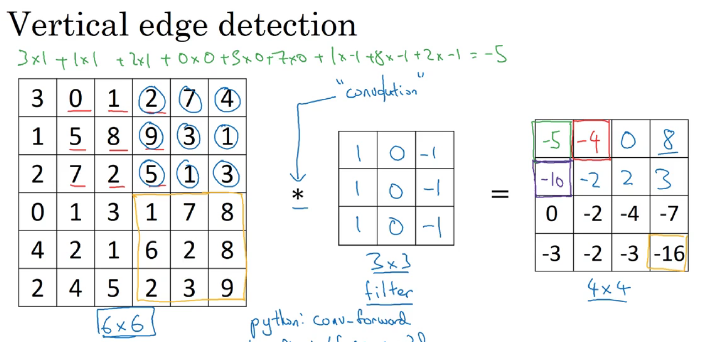

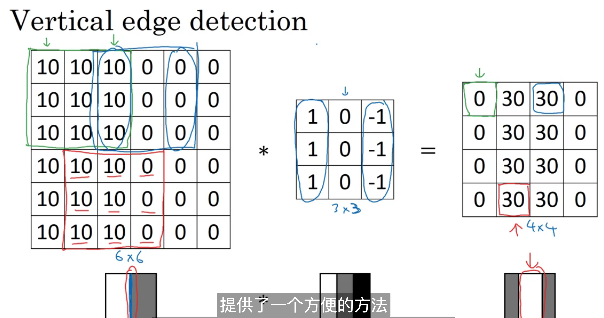

## 10.3 More edge detection

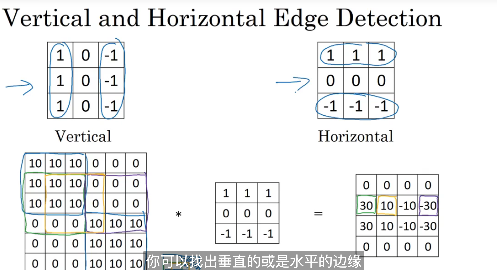

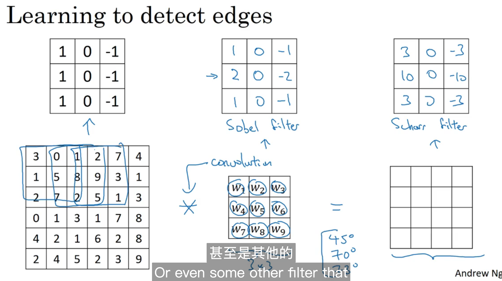

## 10.4 Padding

**Valid: ** (n, n) dot (f, f) -> (n - f + 1, n - f + 1)

**Same:** Pad so that output size is the same as the input size.

(n + 2p, n + 2p) dot (f , f) -> (n + 2p - f + 1, n + 2p - f + 1)

n + 2p -f + 1 = n -> p = (f - 1) / 2

1. f一般都为基数，当f为基数的时候，padding可以直接算出来
2. f为基数的时候，filter会有中心点

## 10.5 Strided convolutions

**Strided convolution:**

(n, n) dot (f, f) use p, s -> $\frac{n + 2p - f}{s} + 1$

cross-correlation: 首先先取镜像。

```
3 4 5        7 2 5
1 0 2    ->  9 0 4 
-1 9 7       -1 1 3  
```

## 10.6 Convolutions over volumes

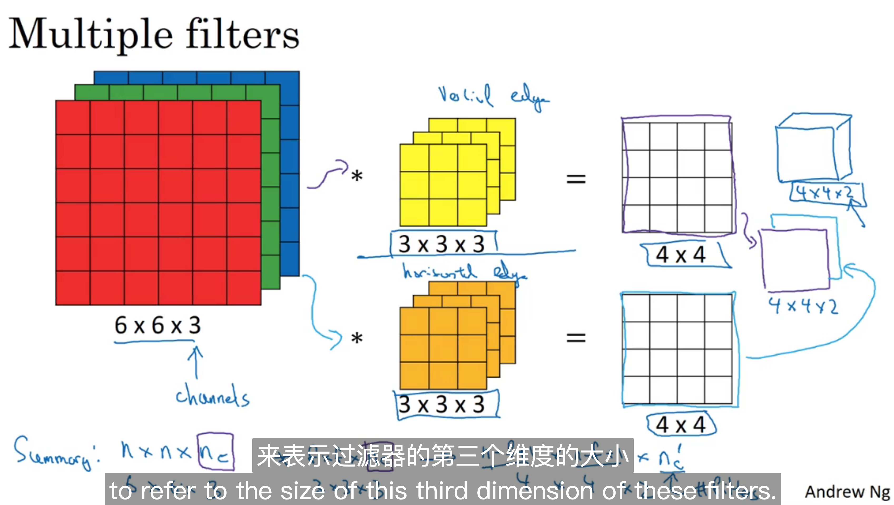

## 10.7 One layer of a convolutional network

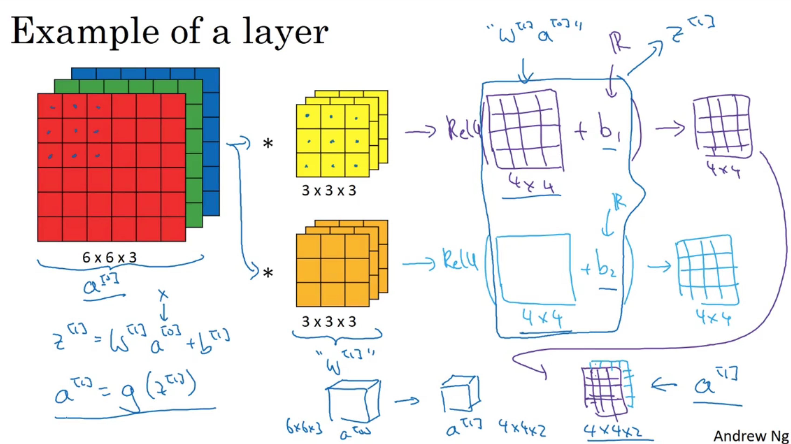

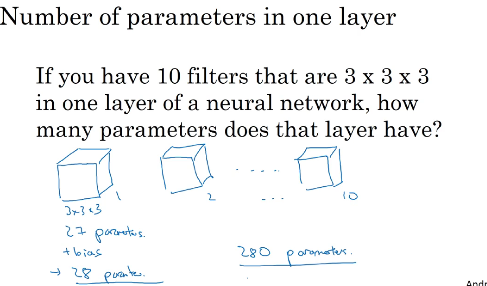

  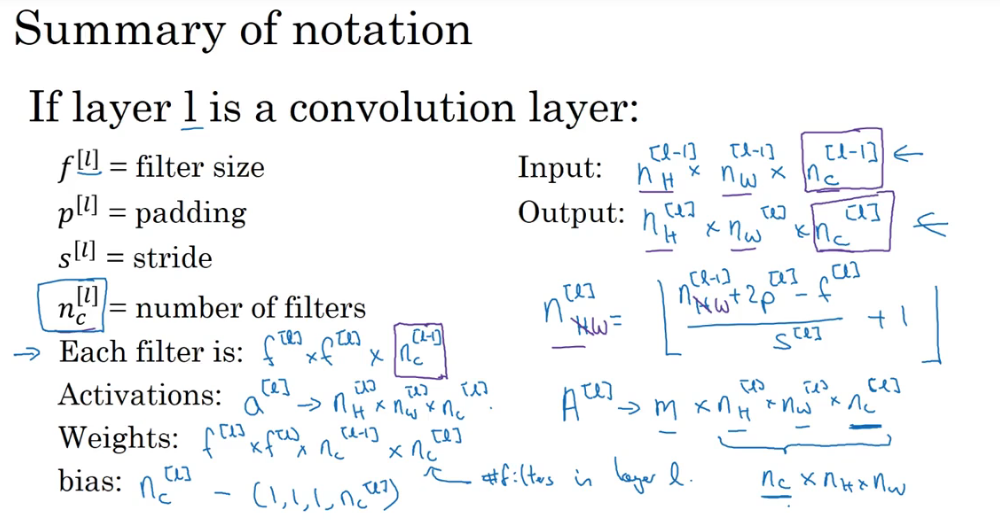

## 10.8 A simple convolution network example

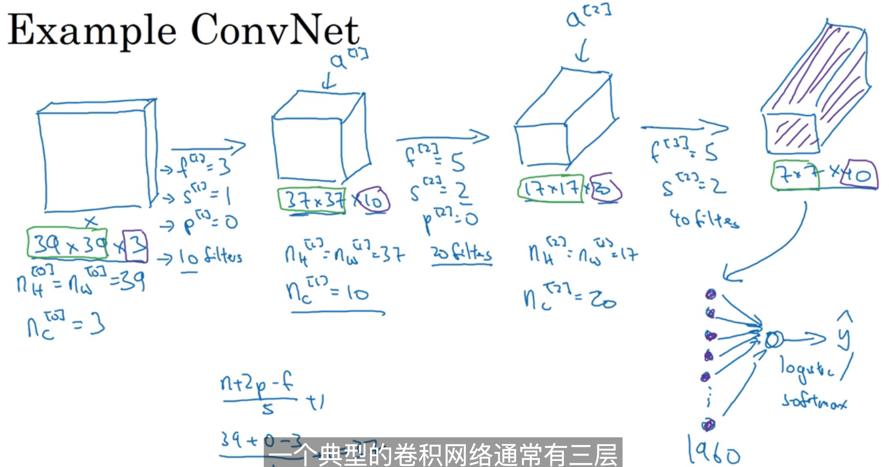

**TYpes of layer in a convolutional network:**

- Convolution (Conv)
- Pooling(Pool)
- Fully connected(FC)

## 10.9 Pooling layers

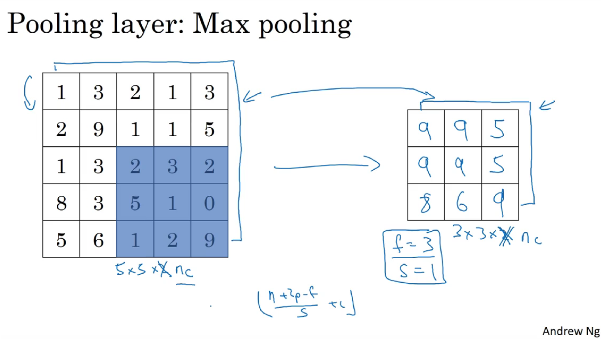

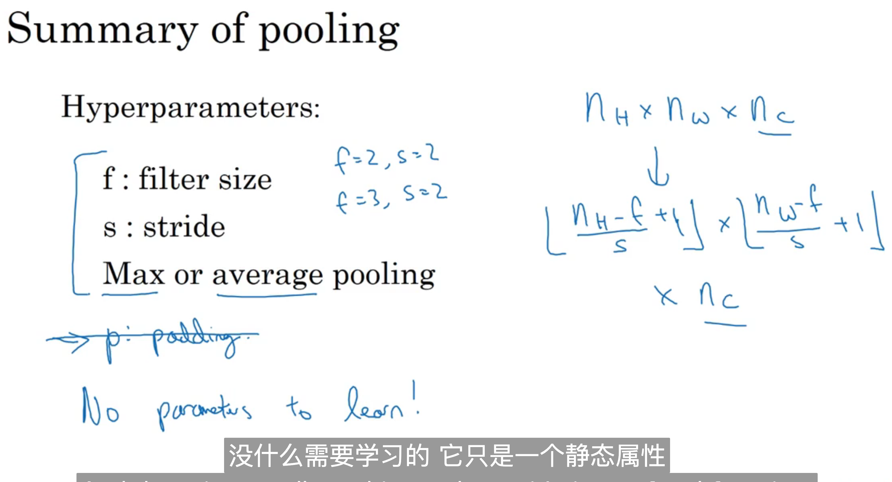

## 10.10 Convolutional neural network example

 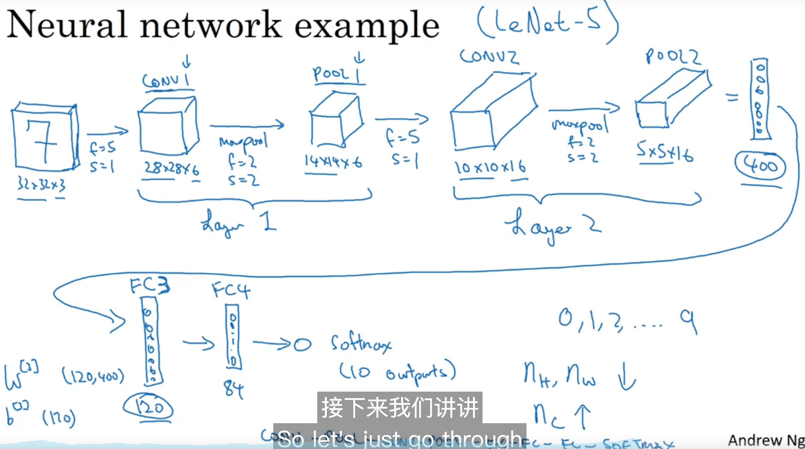

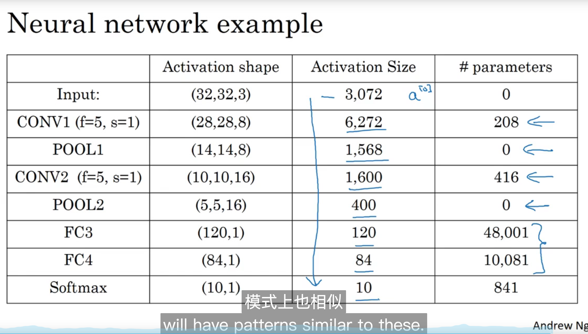

## 10.11 Why convolutions?

- Parameter sharing: A feature detector that's useful in one part of the image is probably usefual in another part of the image.
- Sparisity of connections: In each layer, each output value depends only a small number of inputs.


