# 11. Case Studies

## 11.1 Why look at case studies? 

- LetNet-5
- AlexNet
- VGG 
- ResNet
- Inception

## 11.2 Classic networks

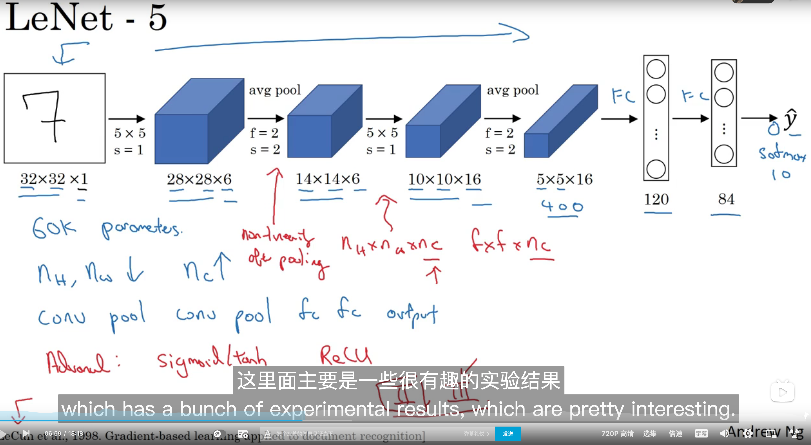

- LeNet: Paramters: 60,000 

- AlexNet: 60,000,000
  - ReLU
  - Mutilpe GPS
  - LRN: this doesn't make sense
- VGG - 16: 138,000,000

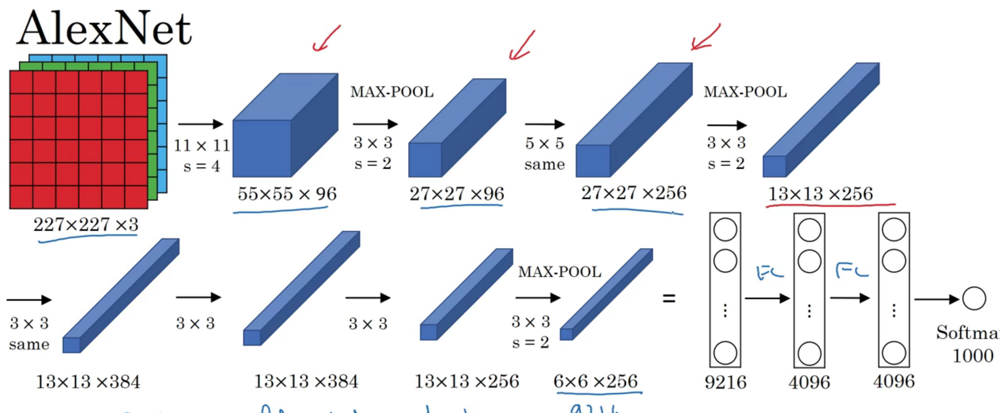

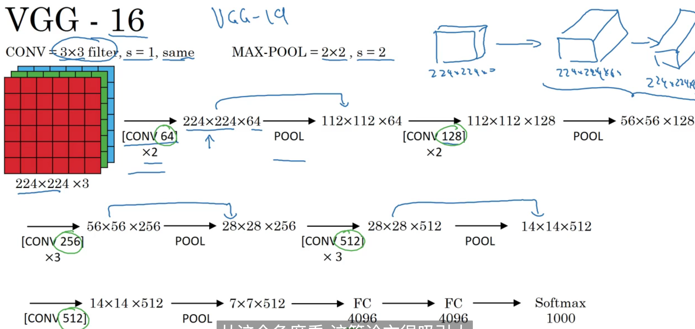

## 11.3 Residual Networks(ResNets)

We'll learn skip connection which allows you to take the activation from one layer and suddenly feed it to another layer, even much deeper in the neural network. And using that, you're going to build ResNets which enables you to rain very very deep networks, sometimes even networks of over 100 layers.

ResNets are built out of something called a residual block.

just add a a l before applying to nonlinearity, the ReLU nonlinearity.

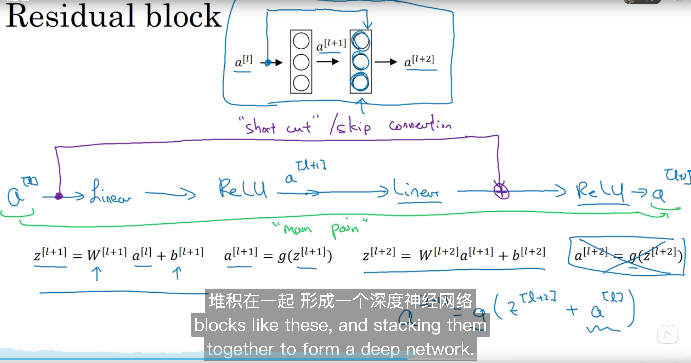

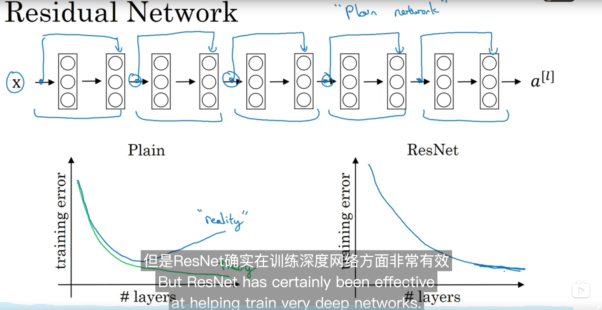

## 11.4 Why ResNets work

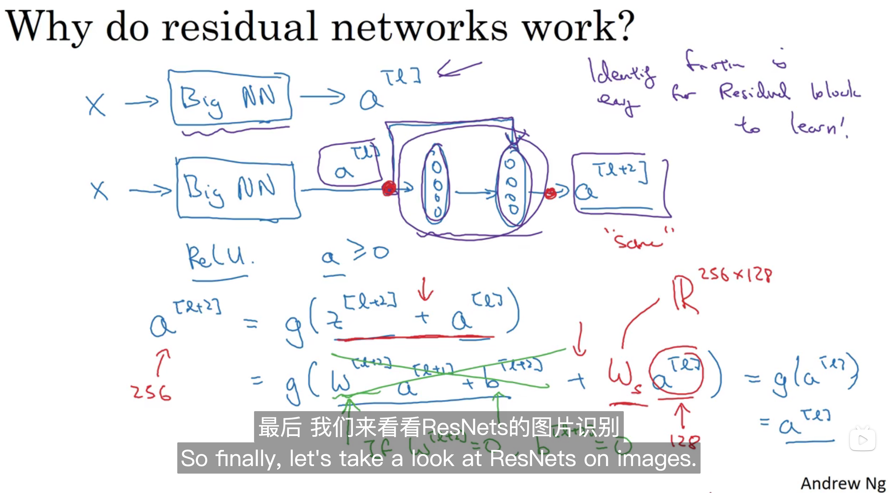

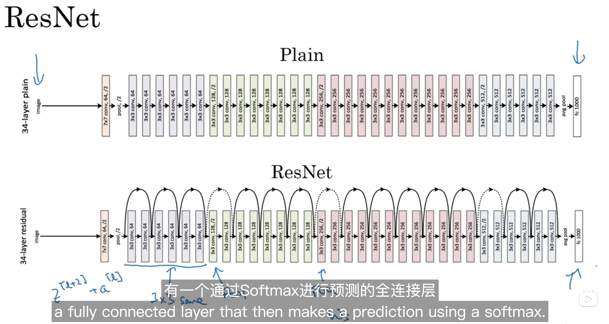

## 11.5 Network in Network and 1 X 1 convolutions

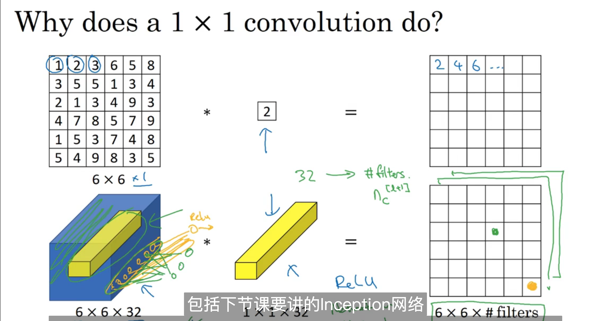

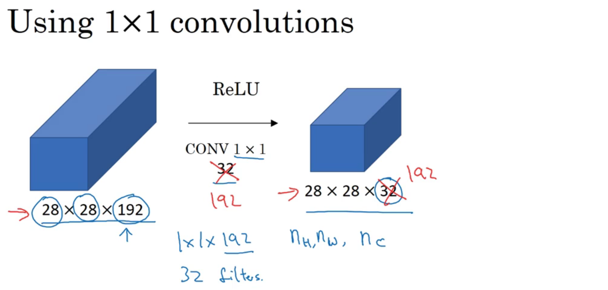

压缩或者保持或者增加信道数量。

## 11.6 Inception network motivation

What's the inception network or what an inception layer syas is,  is instead of choosing what filter size you want in a CONV layer or even do you want a convolutional layer or pooling layer.

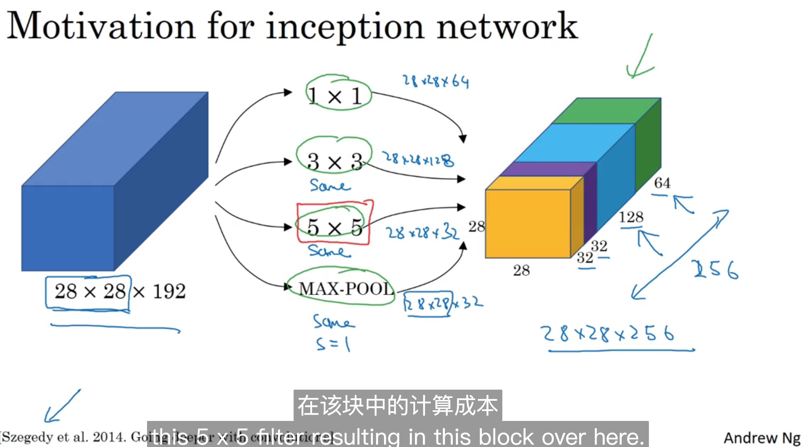

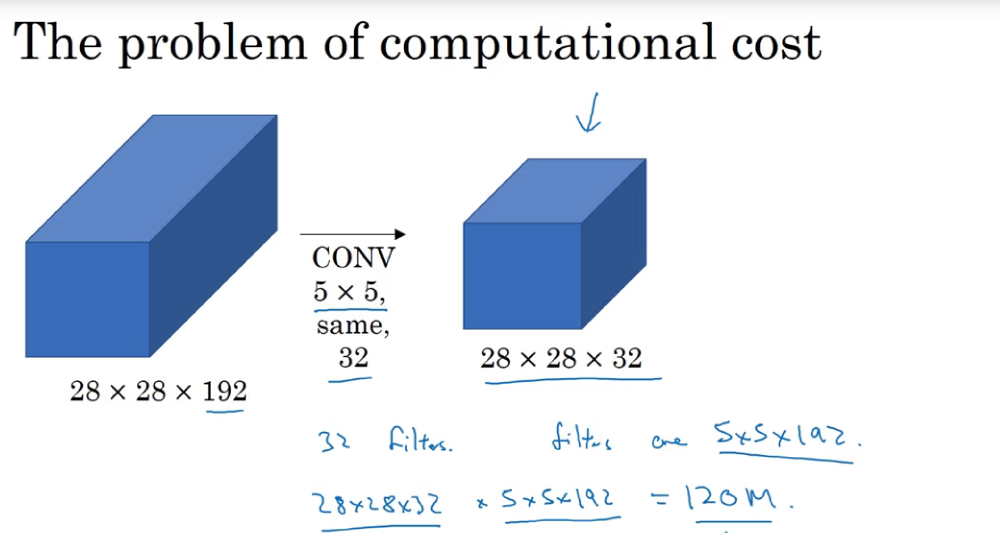

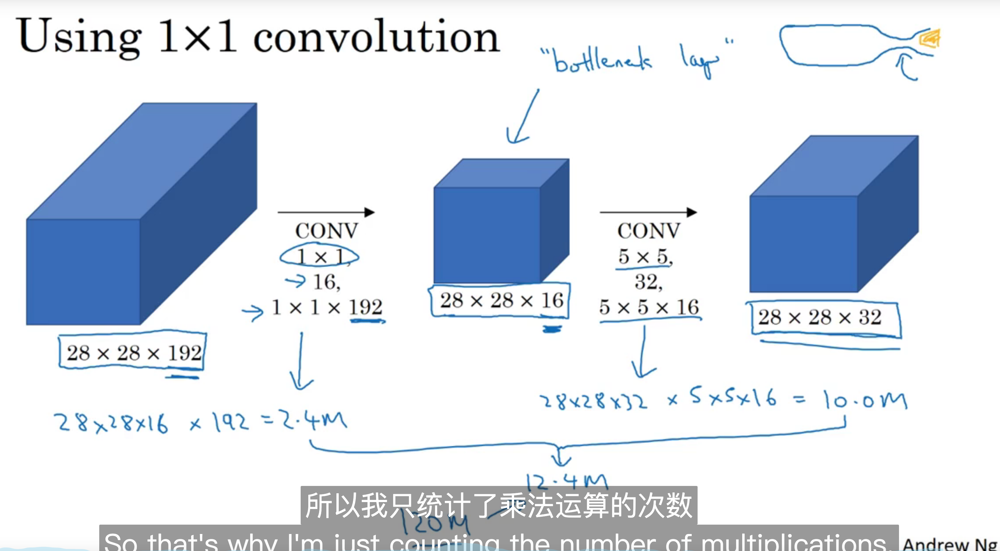

## 11.7 Inception network

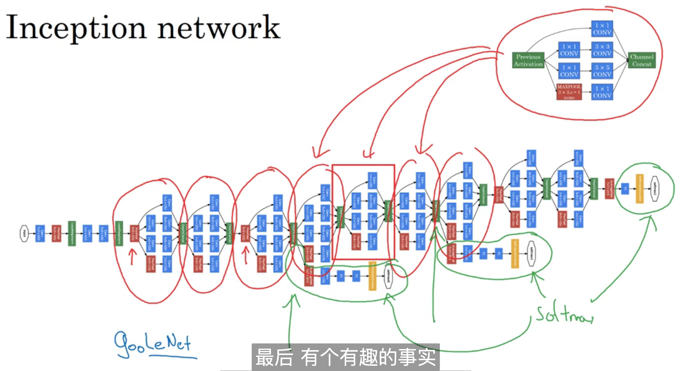

## 11.8 Using open-source implementations

略

## 11.9 Transfer learning 

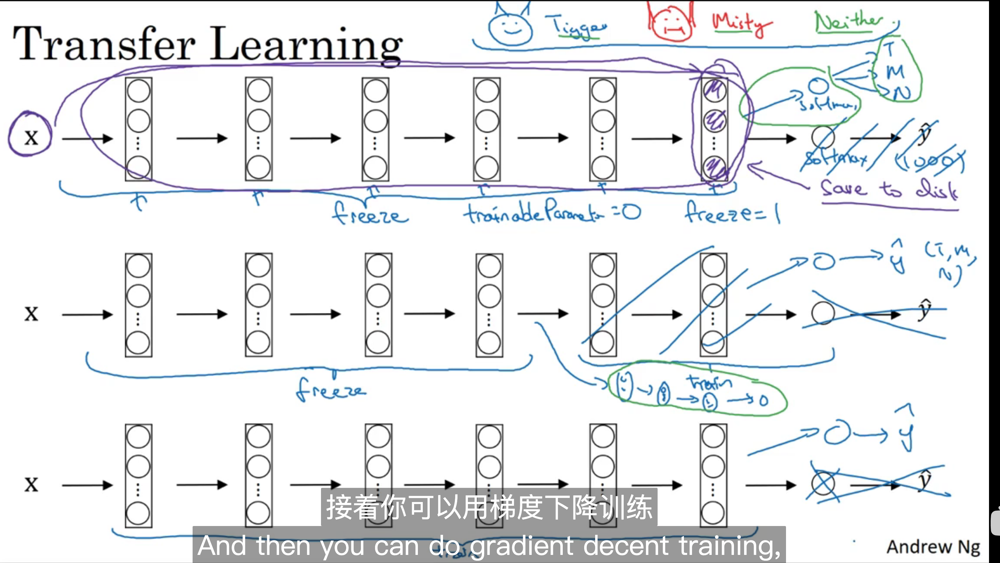

## 11.10 Data augmentation

Mirroring , Random 

PCA COlor 

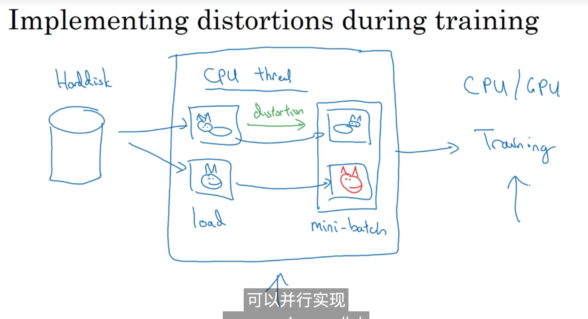

## 11.11 The state of computer vision 

提高基准的方法： Multi-crop ，10-crop，一个图片取10个地方的偏移，正中心+左上右下右上左下+image+左上右下右上左下 = 10 ,然后再来去预测

Use open source code 

- Use architectures of networks published in the literature 
- Use open source implementations if possible 
- Use pretrained models and fine-tune on your dataset

 

