# 12.Object Decection

## 12.1 Object localization

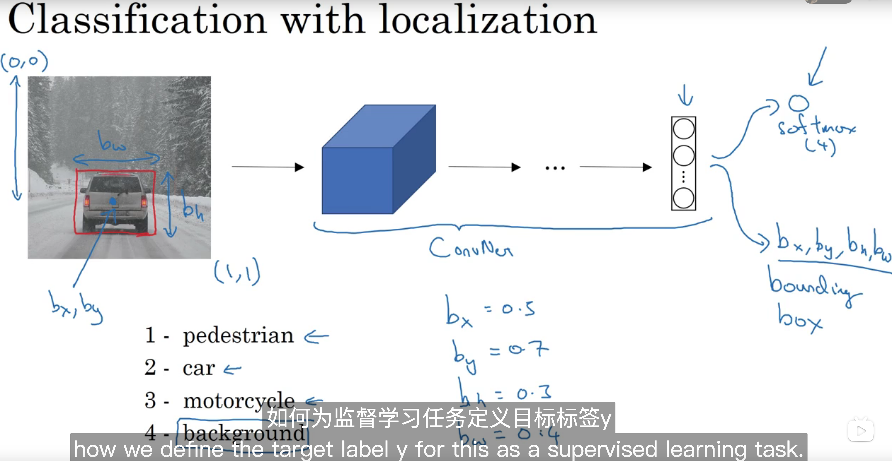

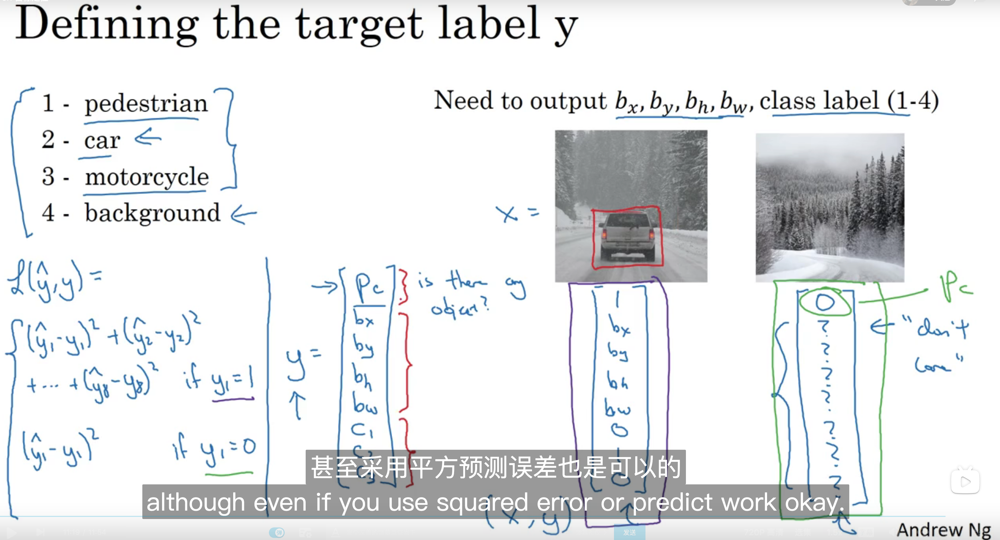

## 12.2 Landmark dection

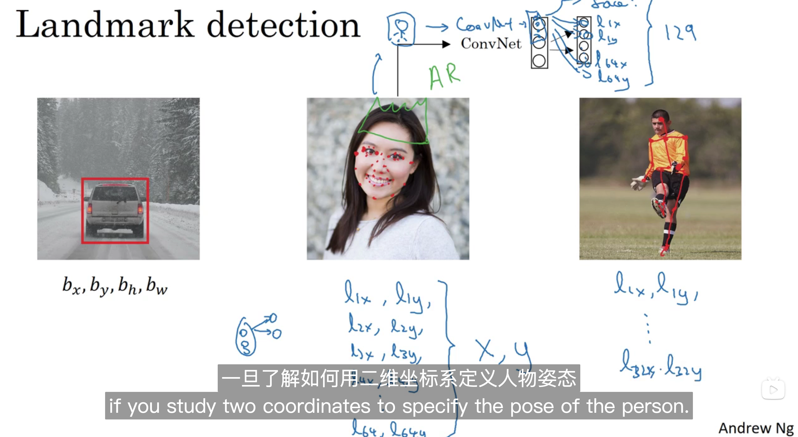

## 12.3 Object detection

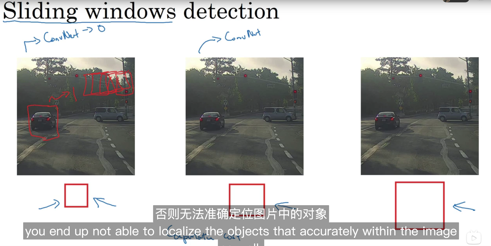

## 12.4 Convolutional implementation of sliding windows

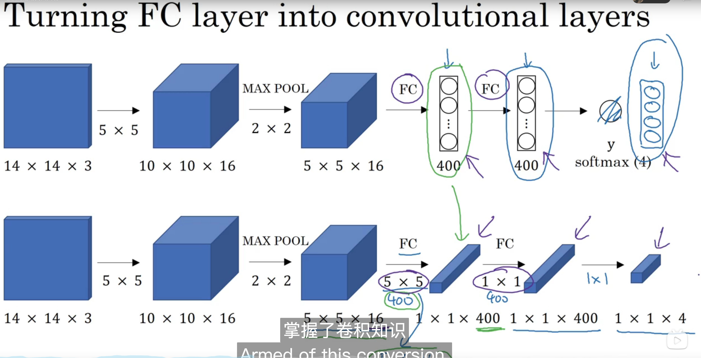

  

## 12.5 Bouding box predictions

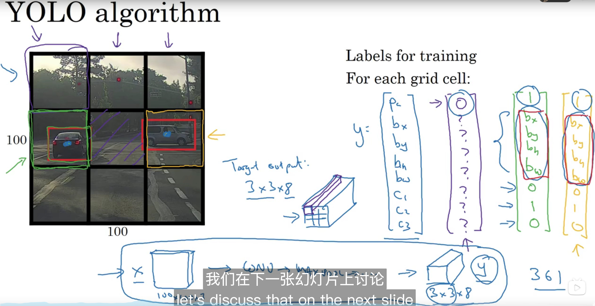

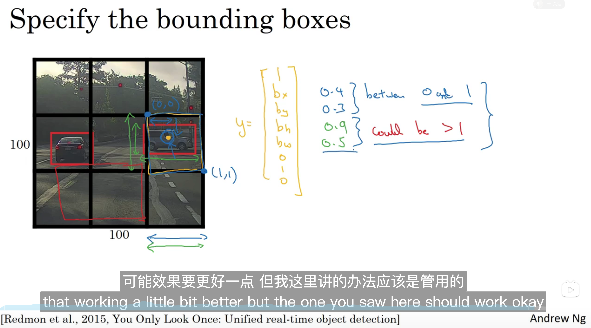

## 12.6 Intersection over union

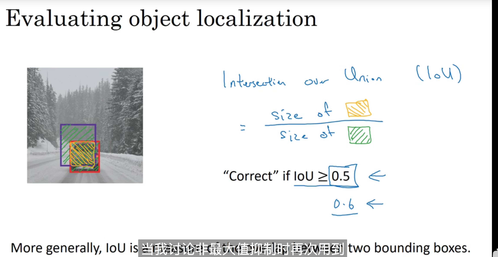

## 12.7 Non-max suppression

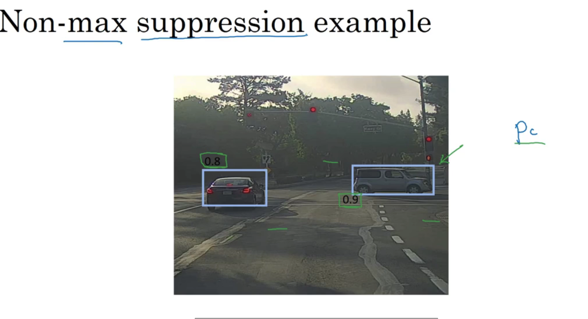

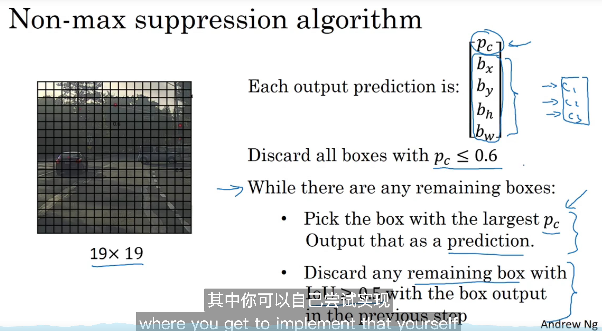

## 12.8 Anchor boxes

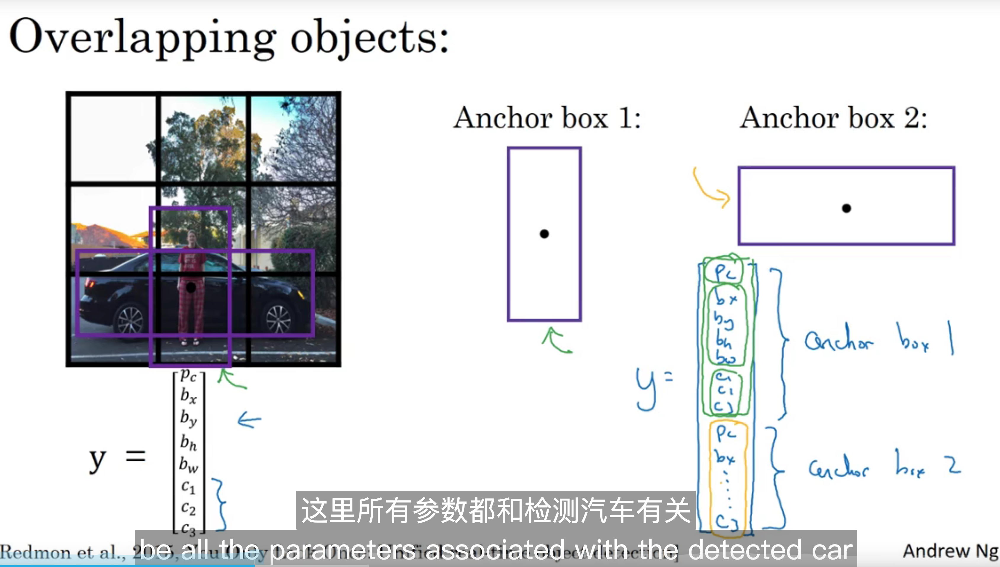

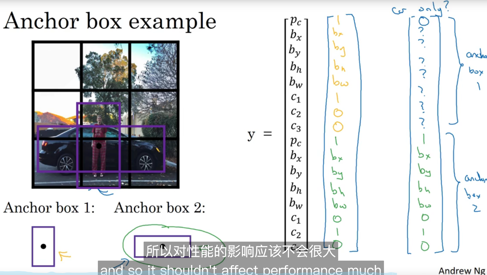

## 12.9 Putting it together YOLO algorithm

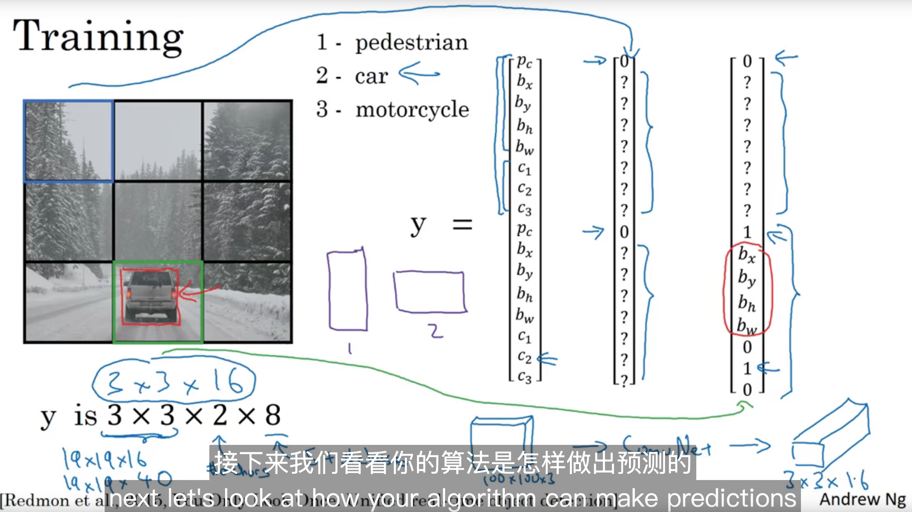

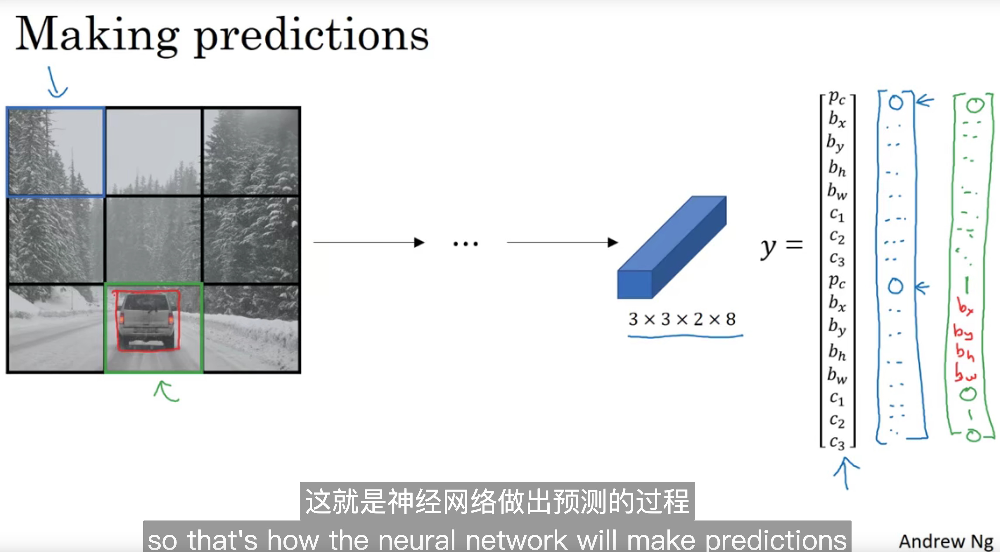

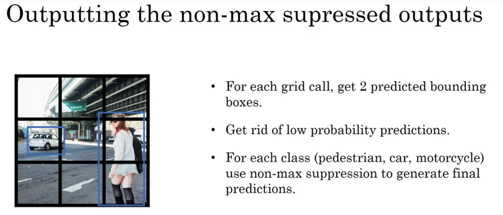

## 12.10 Region proposals

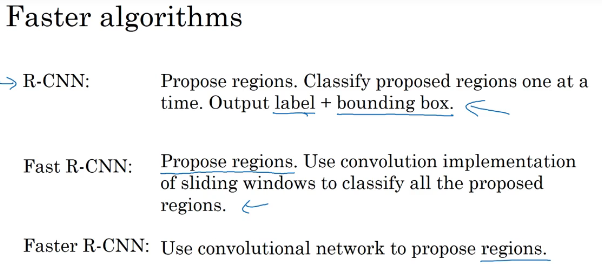

 