## 13. Face recognition

## 13.1 What is face recognition?

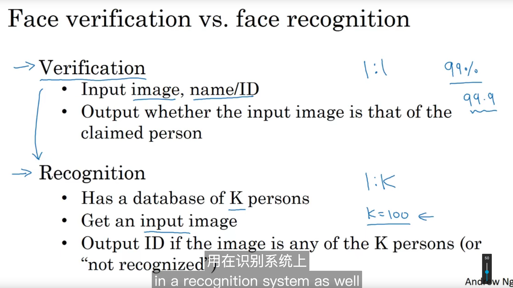

## 13.2 One-shot learning 

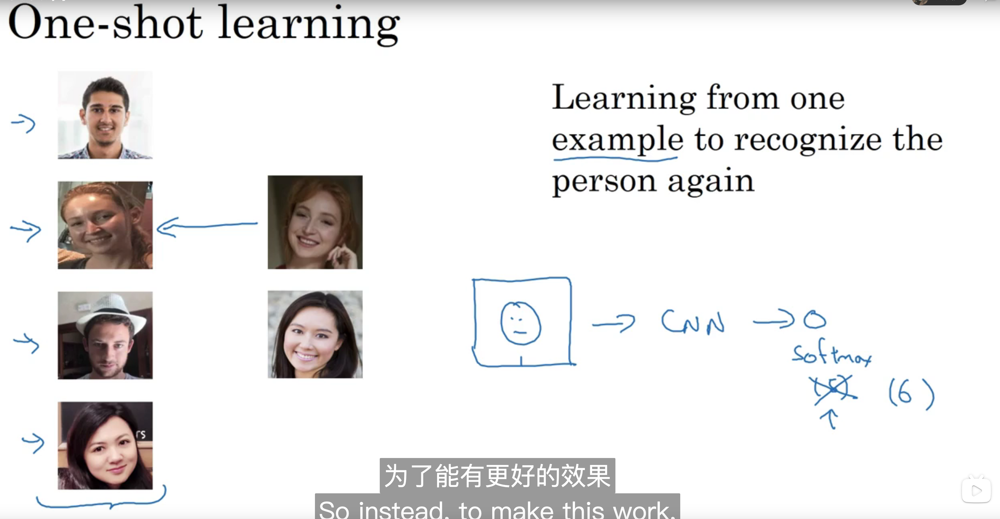

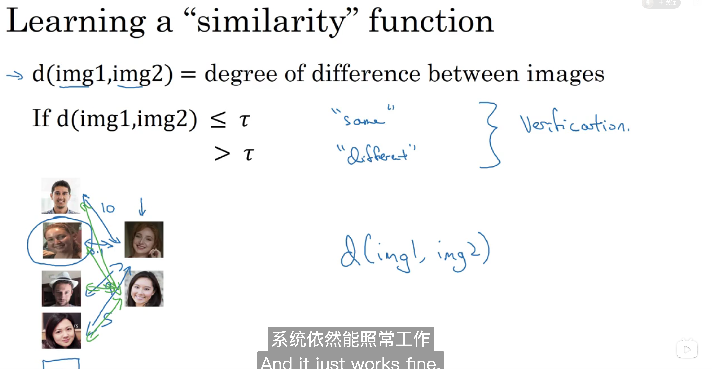

## 13.3 Siamese network

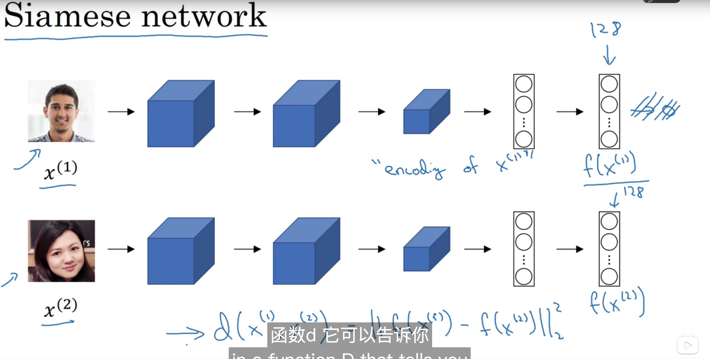

## 13.4 Triplet loss

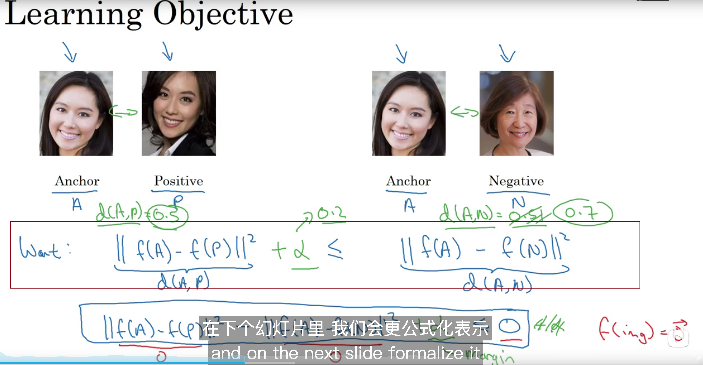

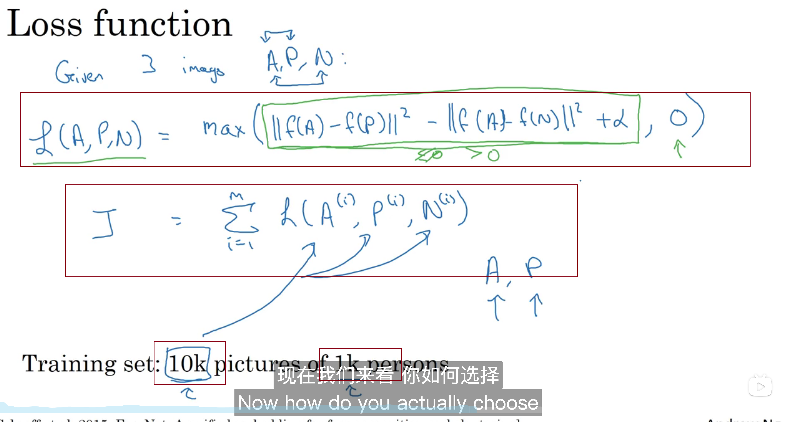

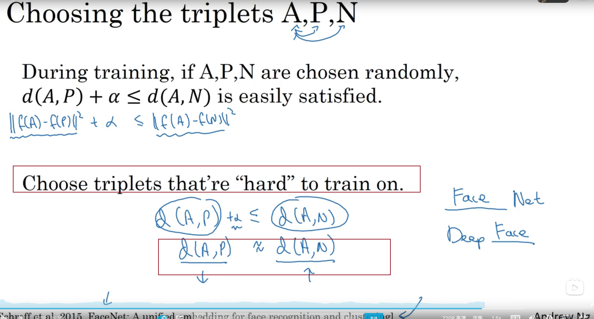

## 13.5 Face verification and binay classification

 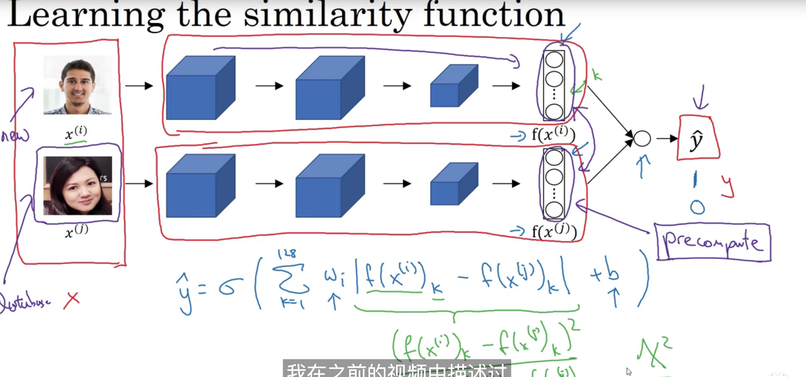

## 13.6 What is neural style transfer? 

## 13.7 What are deep ConvNets learning?

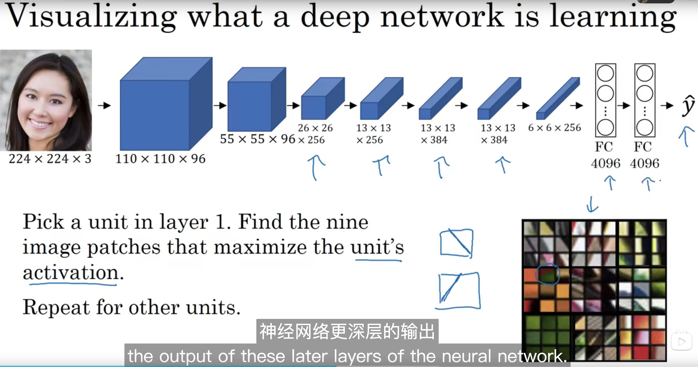

## 13.8 Cost function 

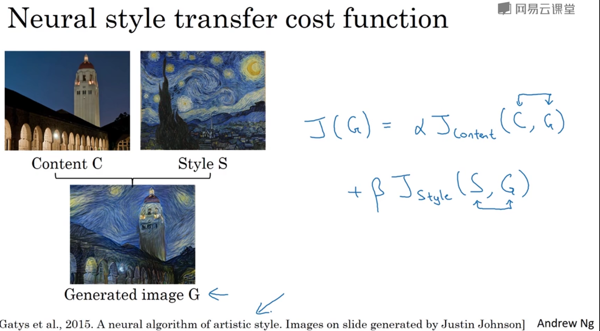

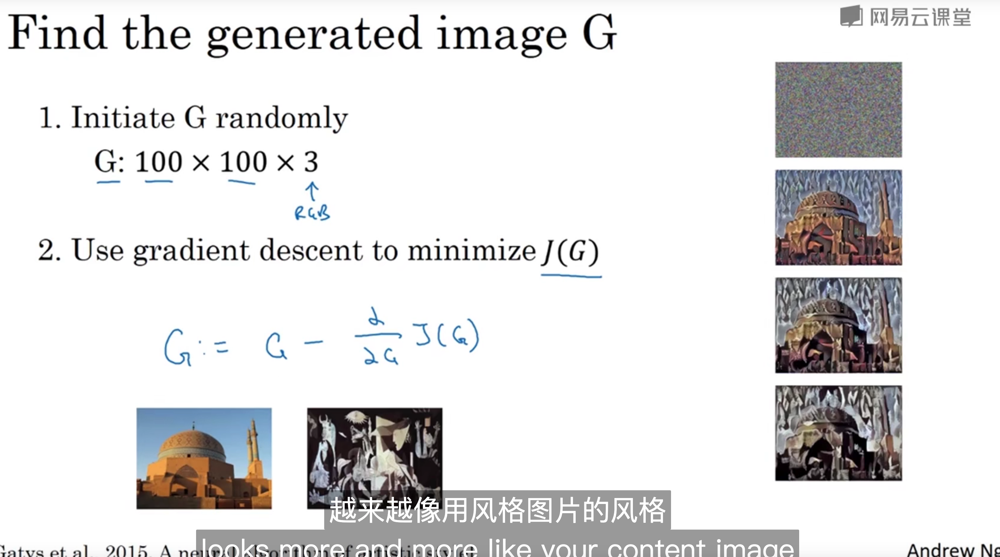

## 13.9 Content cost function

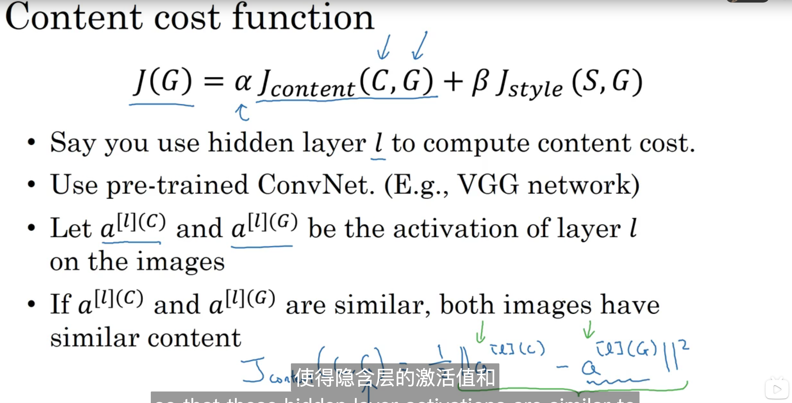

## 13.10 Style cost function

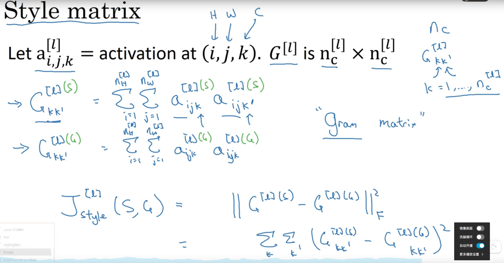

## 13. 1D - 3D 

familiar to 2D 

