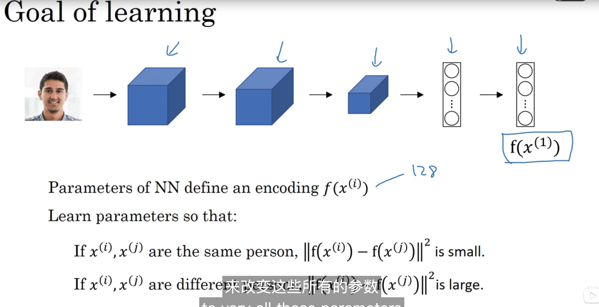
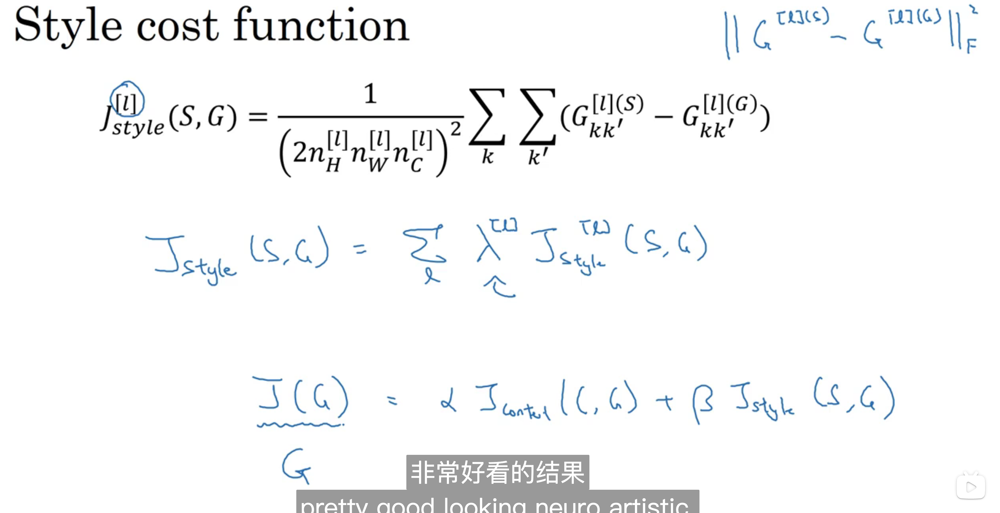

## 13. Face recognition

## 13.1 What is face recognition?

## 13.2 One-shot learning 

## 13.3 Siamese network

## 13.4 Triplet loss

## 13.5 Face verification and binay classification

 

## 13.6 What is neural style transfer? 

## 13.7 What are deep ConvNets learning?

## 13.8 Cost function 

## 13.9 Content cost function

## 13.10 Style cost function

## 13. 1D - 3D 

familiar to 2D 

