# 15.Recurrent Neural Networks

## 15.1 Why sequence models?

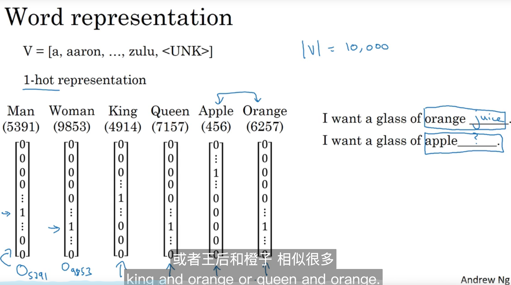

## 15.2 Notation

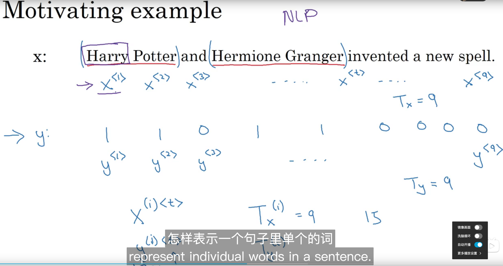

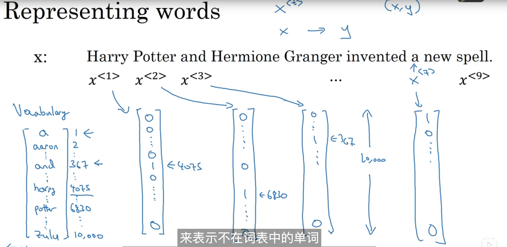

## 15.3 Recurrent Neural Network Model

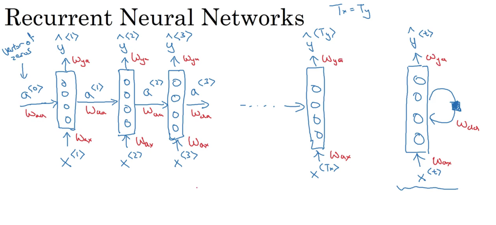

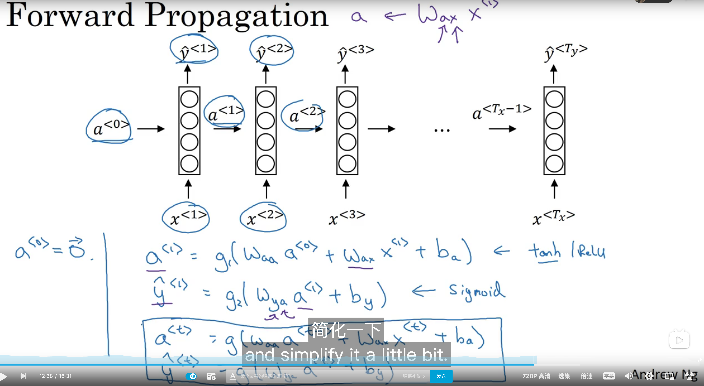

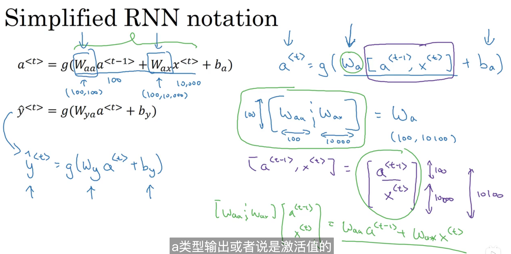

## 15.4 Backpropagation through time

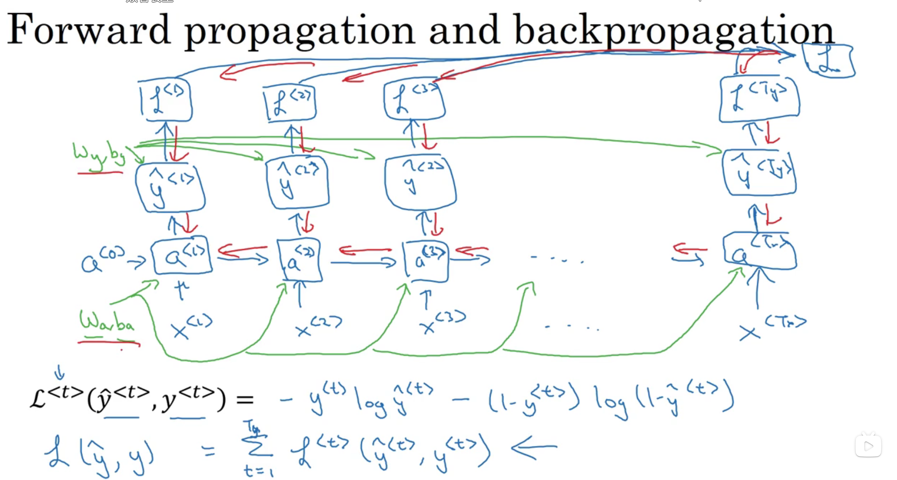

## 15.5 Different types of RNNs

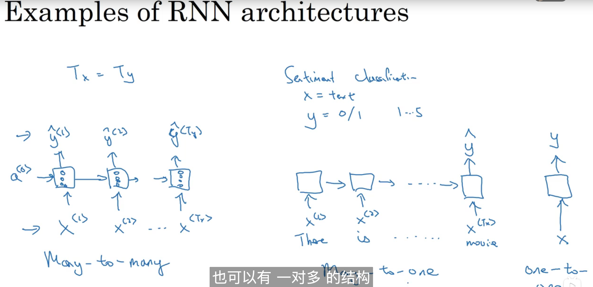

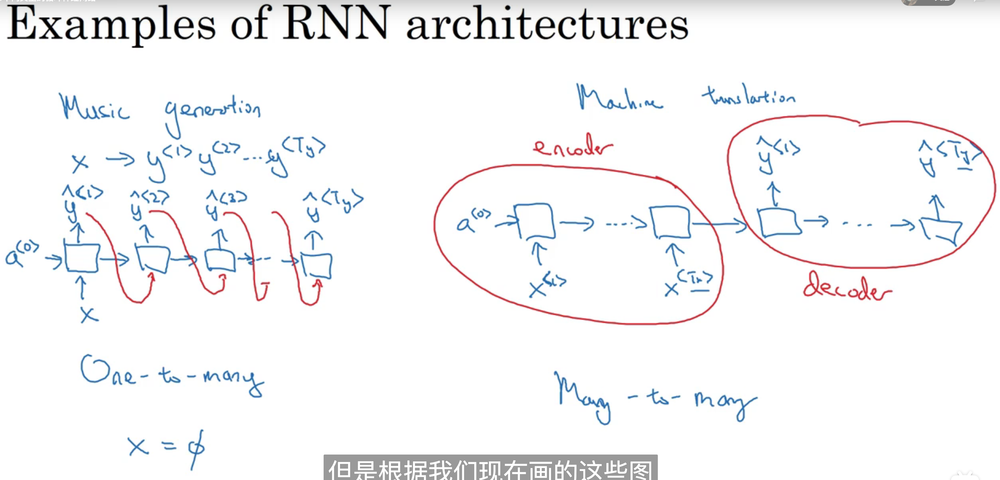

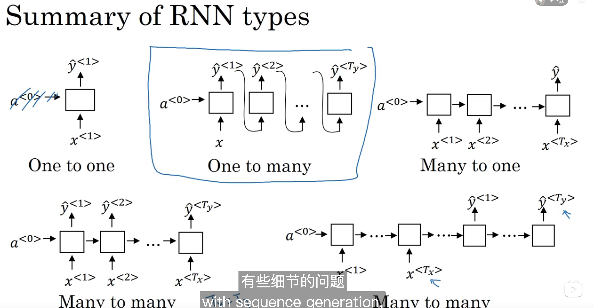

## 15.6 Language model and sequence generation

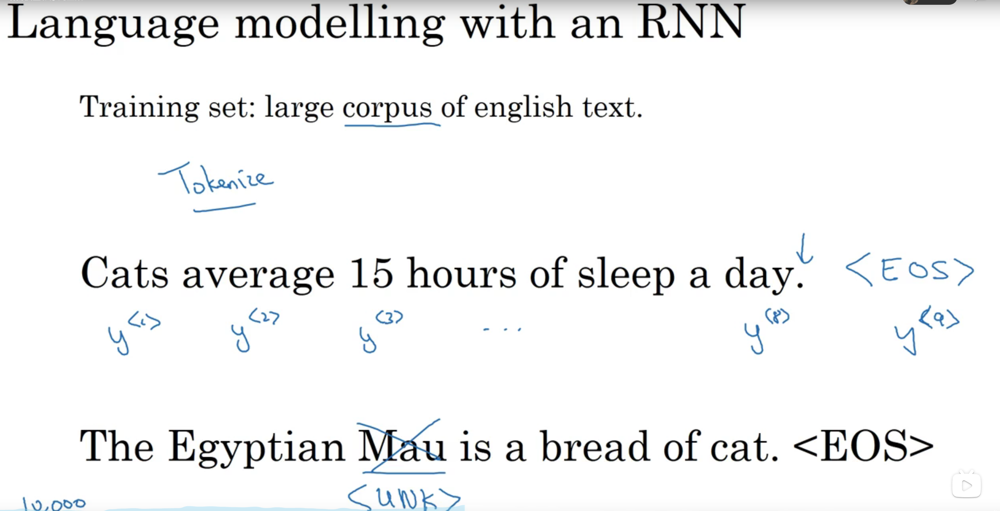 

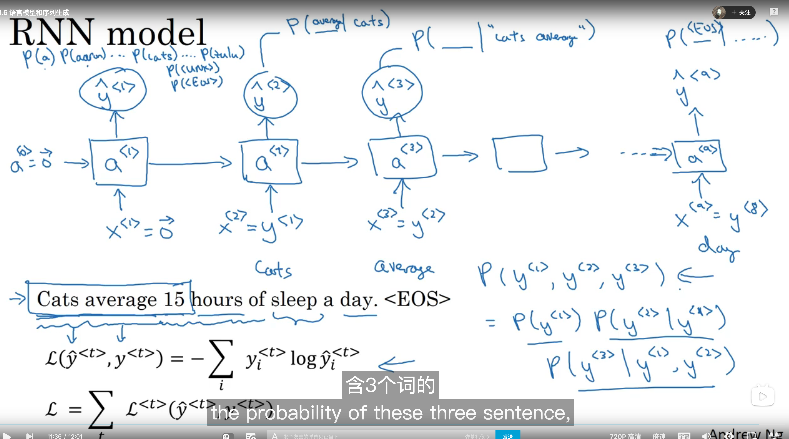

## 15.7 Sampling novel sequences 

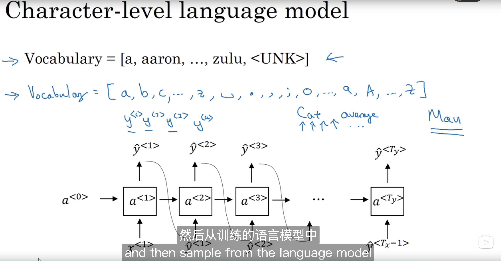

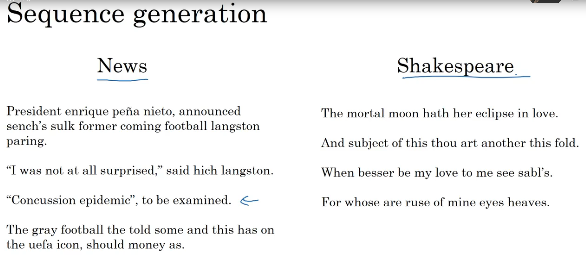

## 15.8 Vanishing gradients with RNNs

略

## 15.9 Gated Recurrent Unit(GRU)

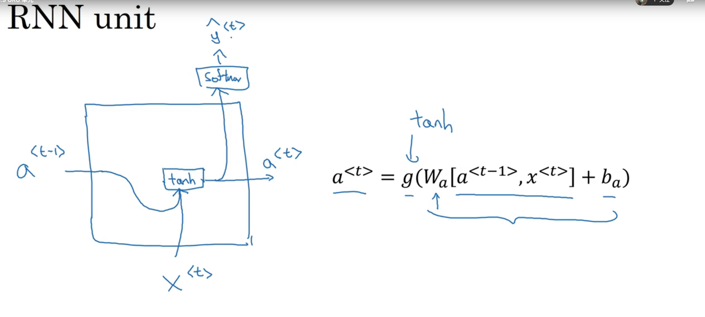

 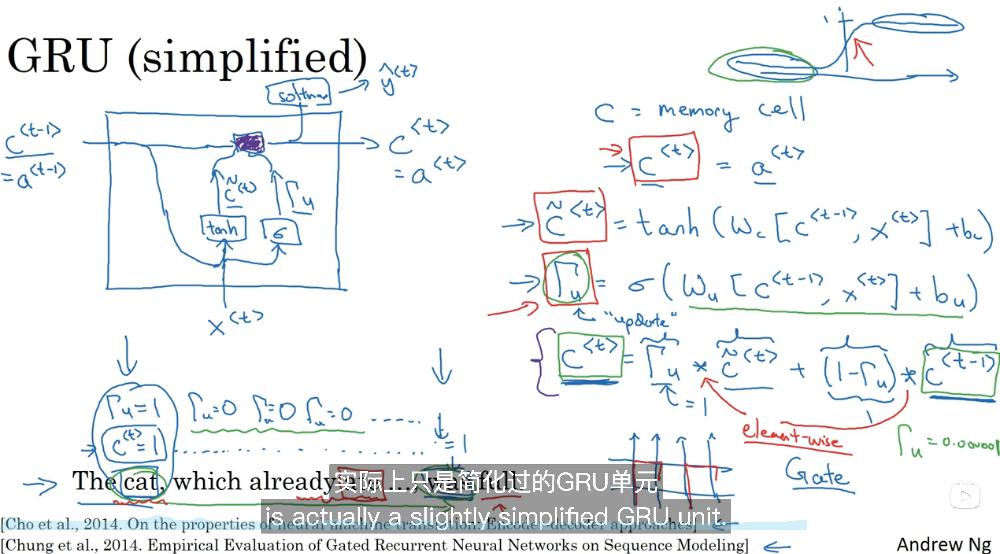

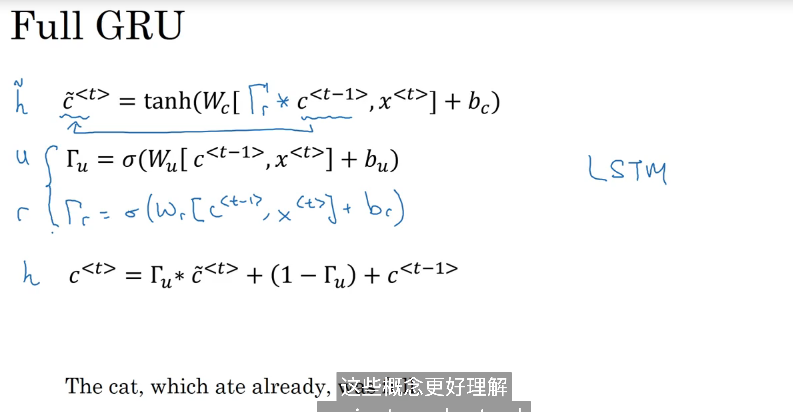

## 15.10 LSTM(long short term memory) unit

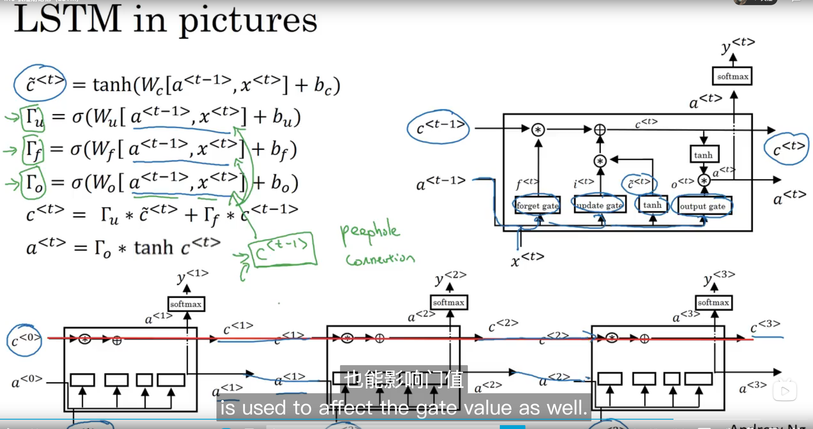

## 15.11 Bidirectional RNN 

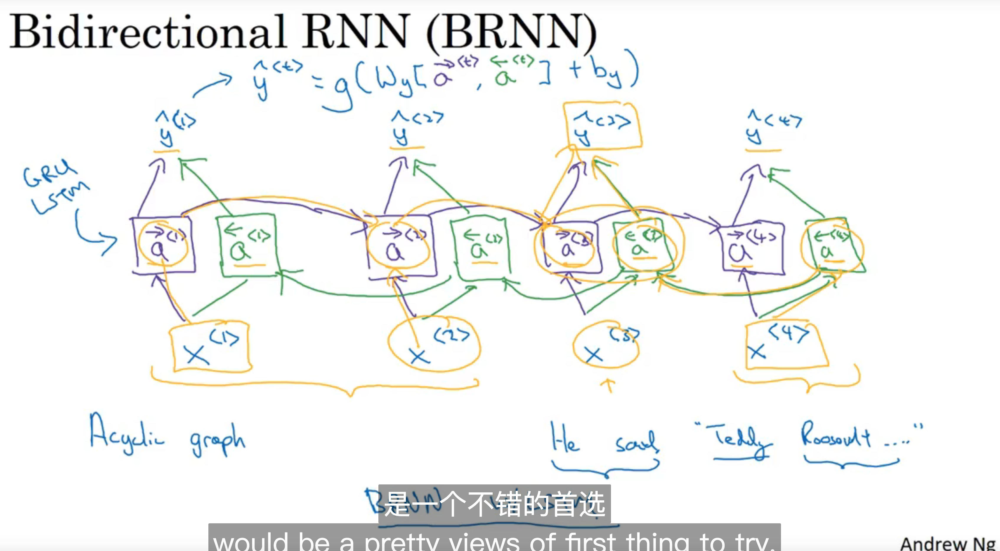

## 15.12 Deep RNNs

**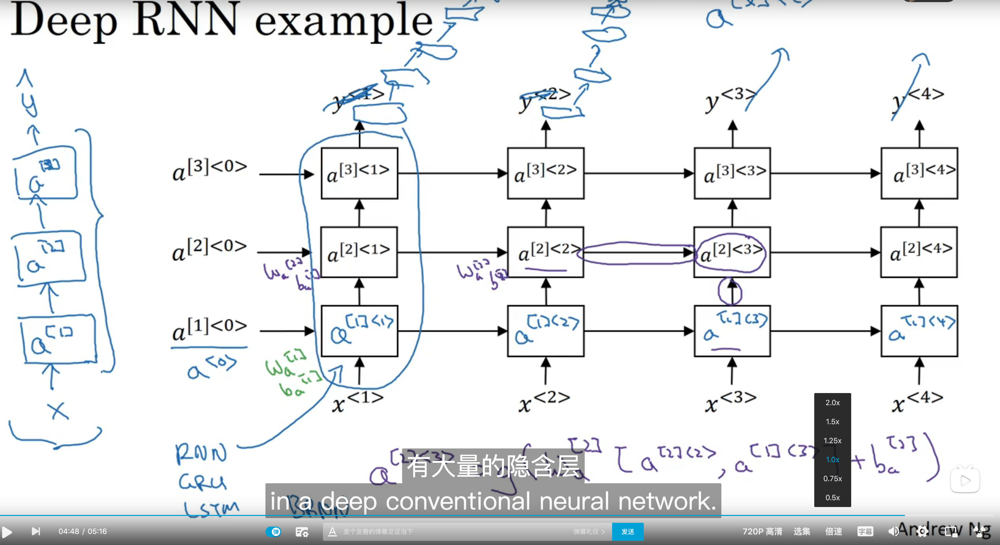**

