# 15. NLP and Word Embeddings

## 15.1 Word representation

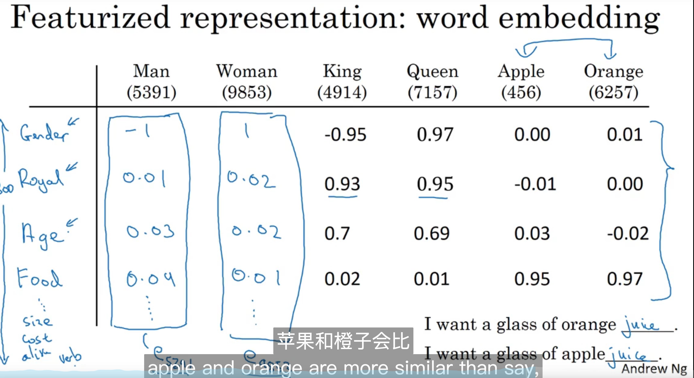

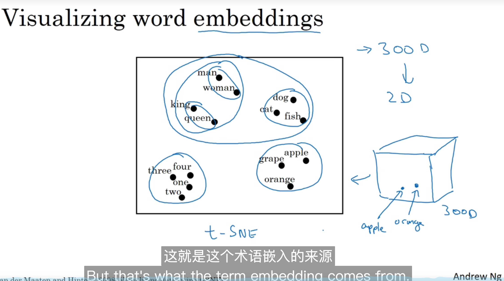

## 15.2 Using word embeddings

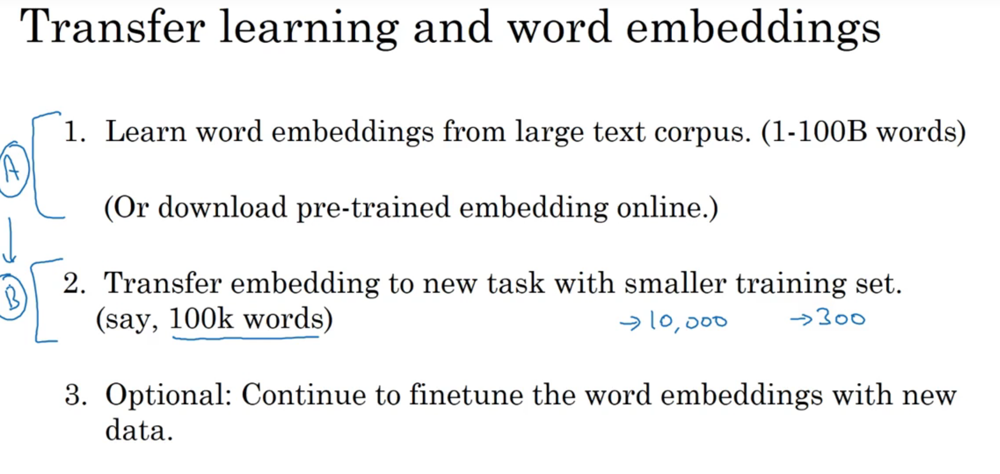

## 15.3 Properties of word embeddings

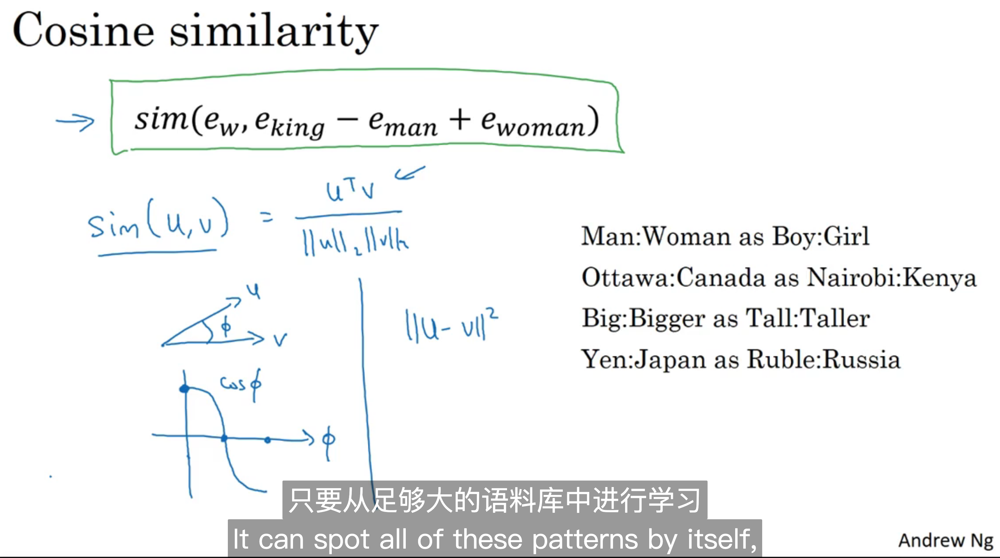

特性

## 15.4 Embedding matrix

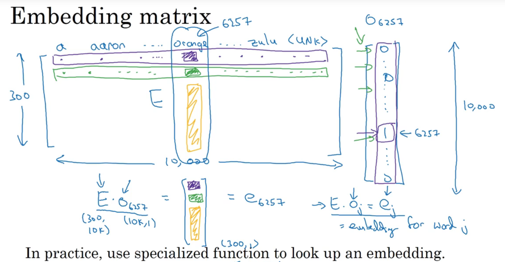

## 15.5 Learning word embeddings

略

## 15.6 Word2Vec- skip-gram

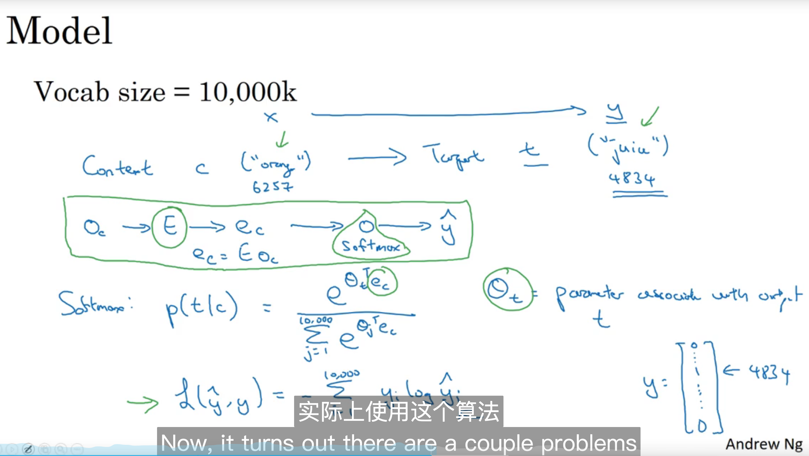

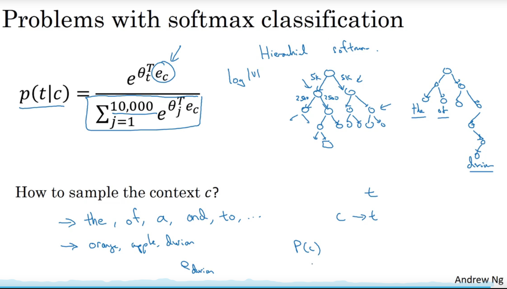

## 15.7 Negative sampling

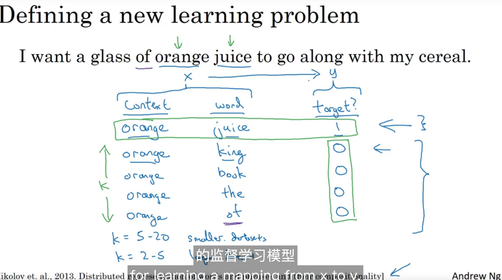

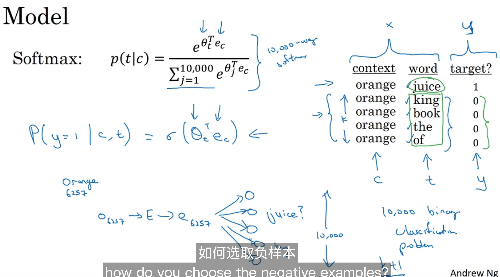

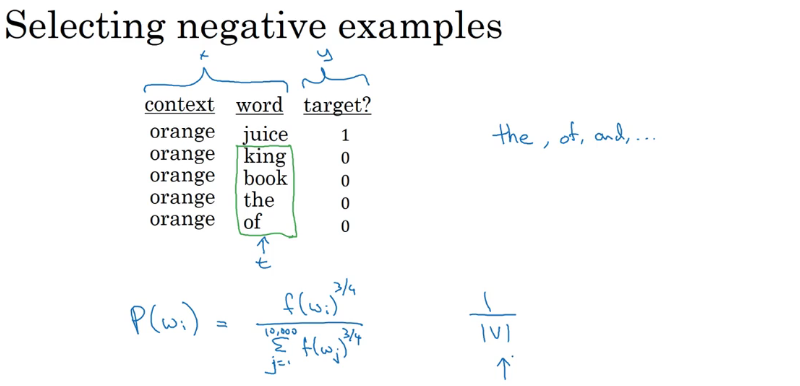

## 15.8 Glove word vectors

听不懂

##  15.9 Sentiment classification

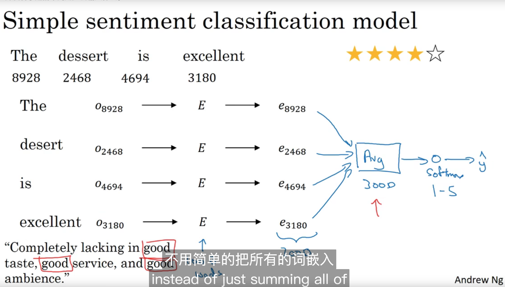

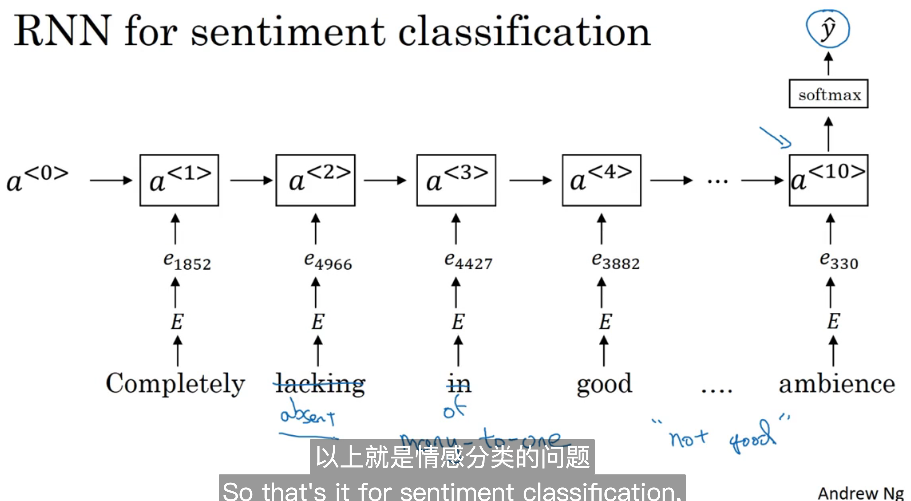

## 15.10 Debiasing word embeddings

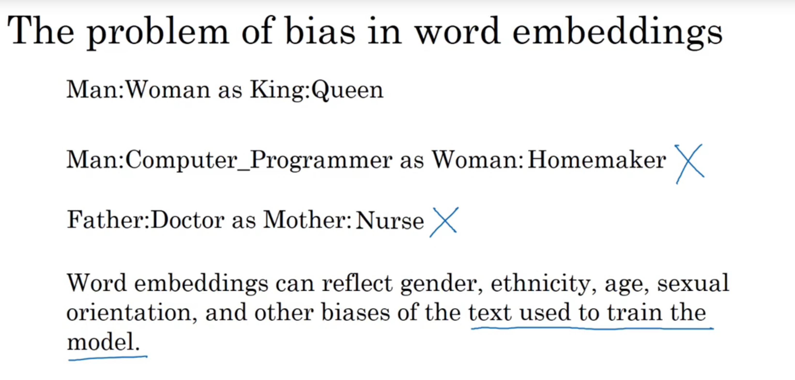

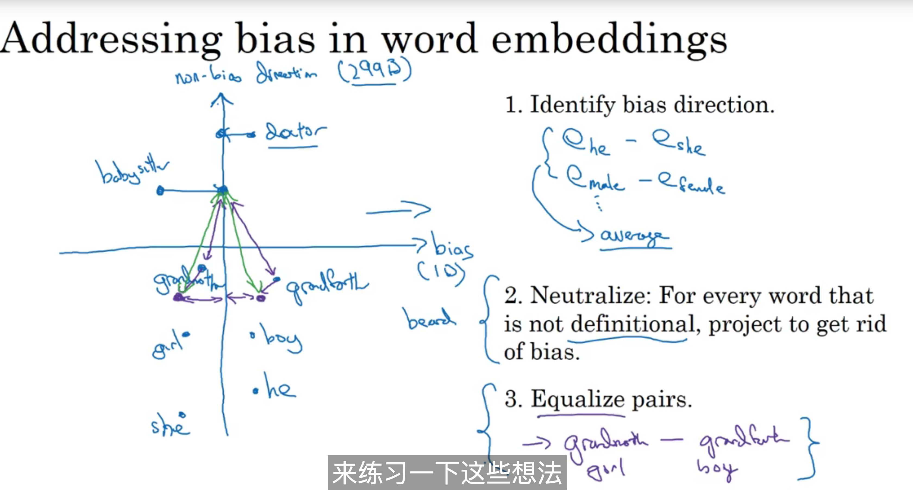

