# 16. Sequence to sequence models

## 16.1 Basic models

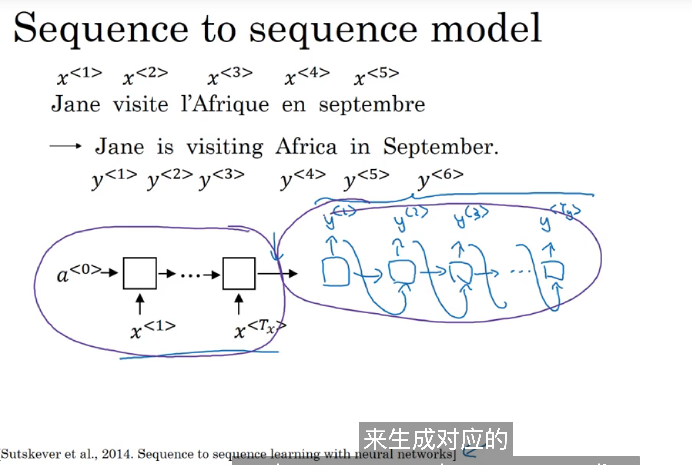

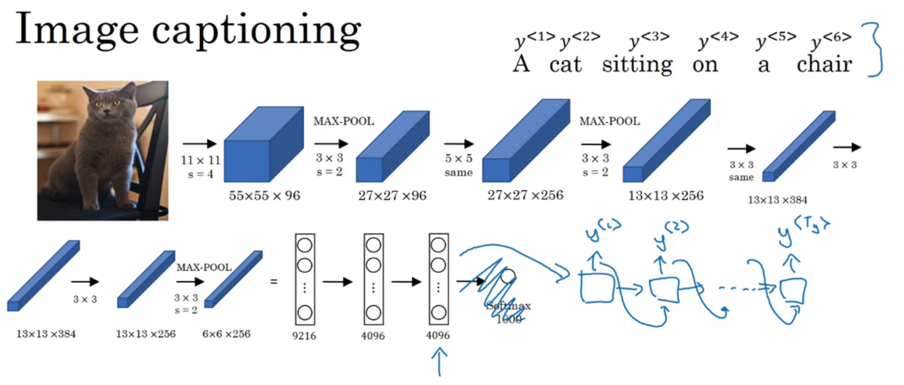

## 16.2 Picking the most likely sentence

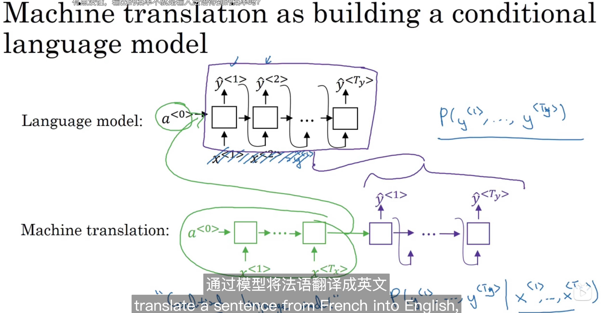

## 16.3 Beam search(定向搜索)

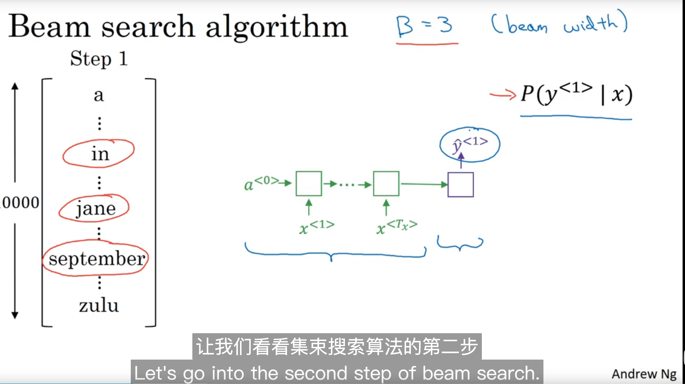

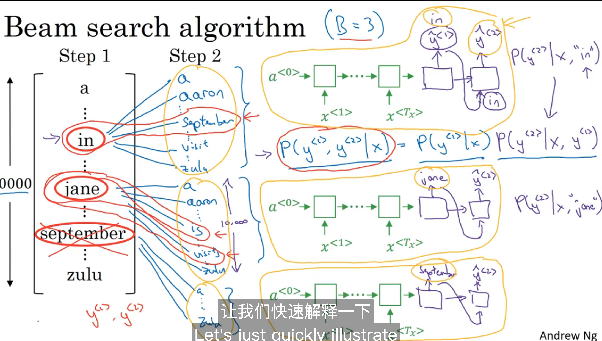

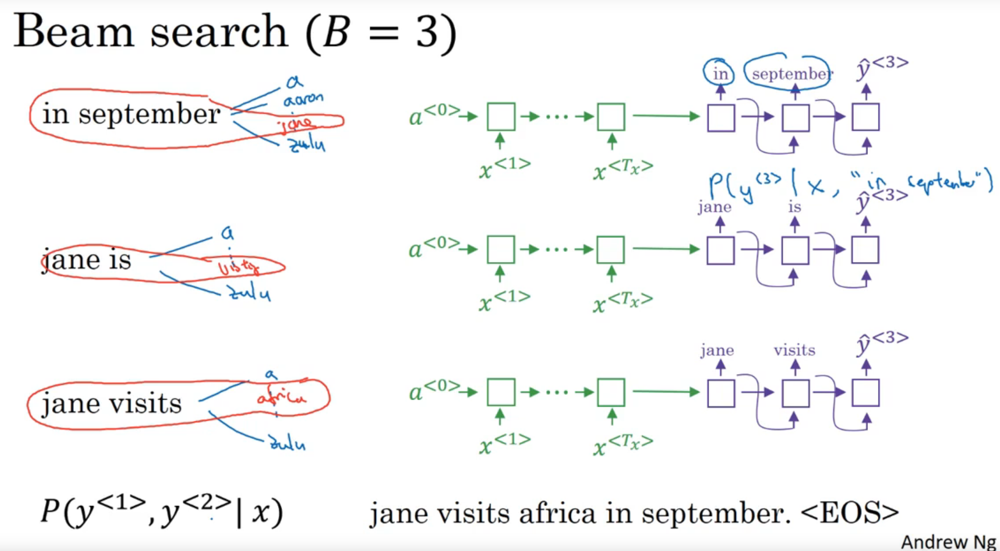

贪心但是不是特别贪，3个一贪。

## 16.4 Refinements to beam search

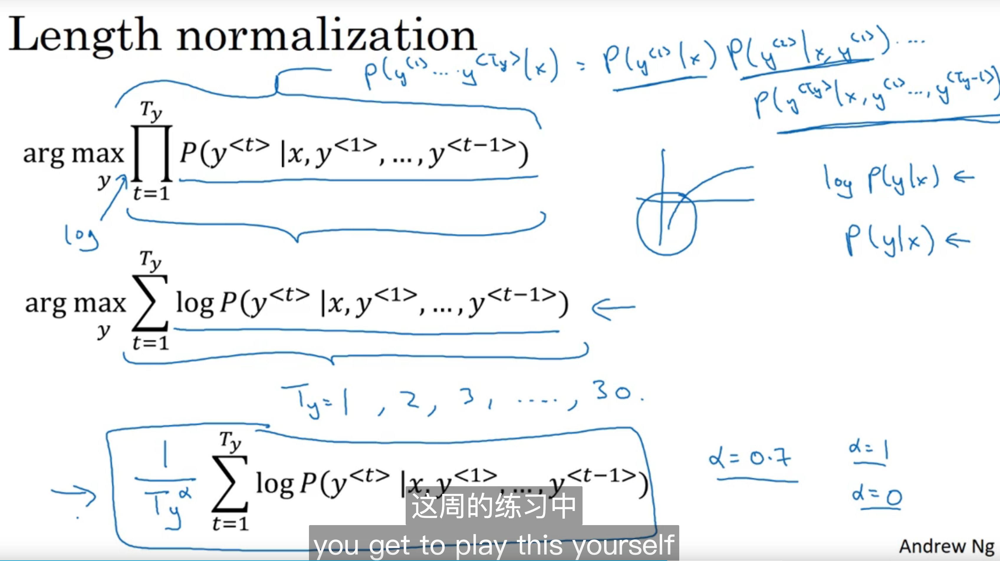

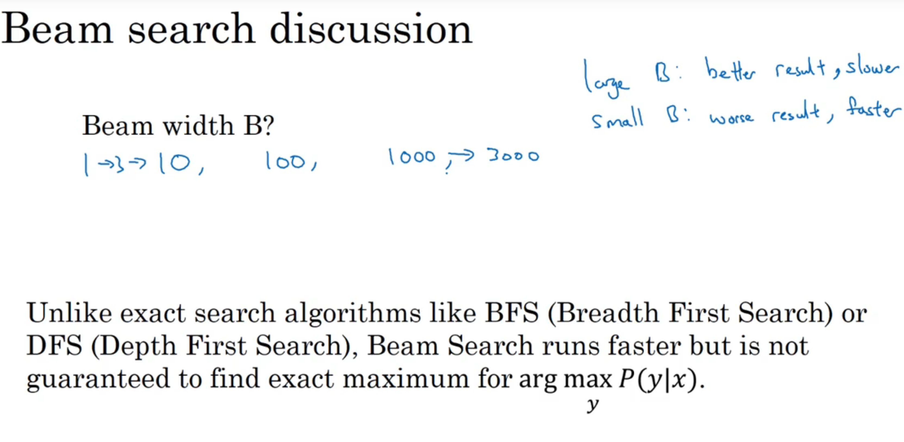

## 16.5 Error analysis on beam search

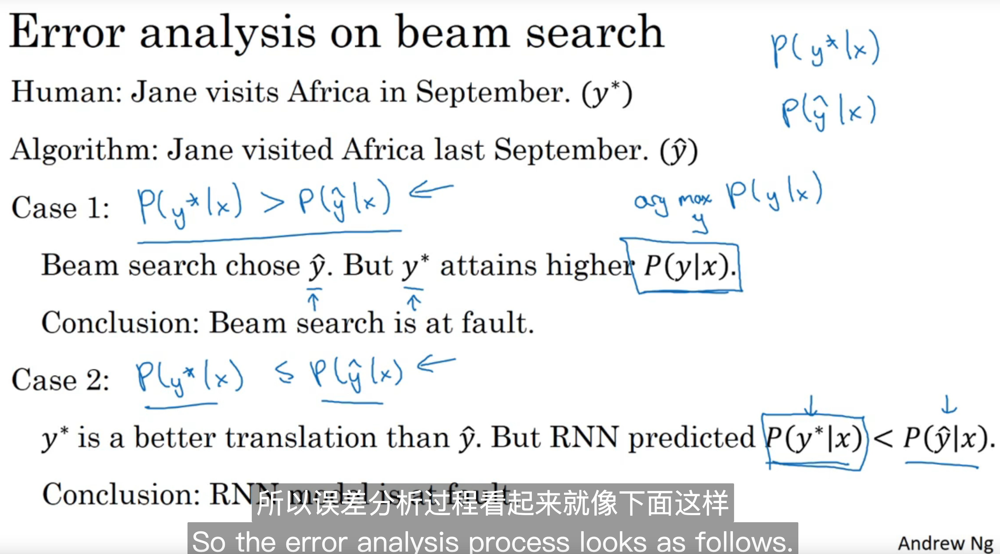

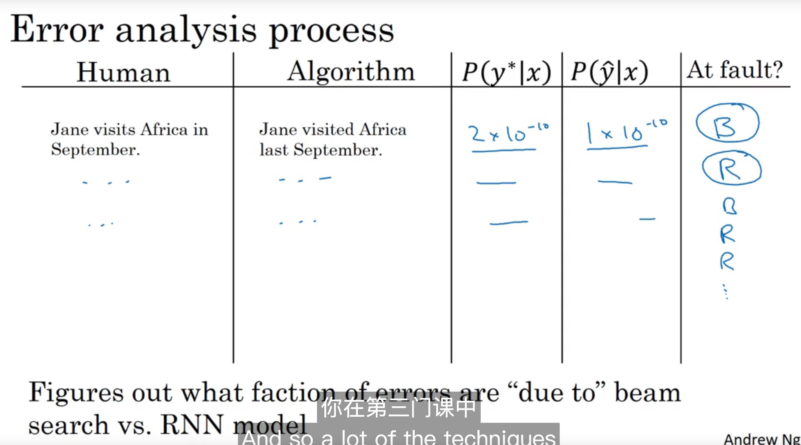

## 16.6 Bleu Score

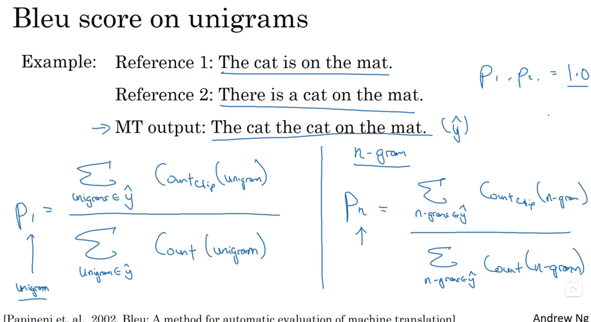

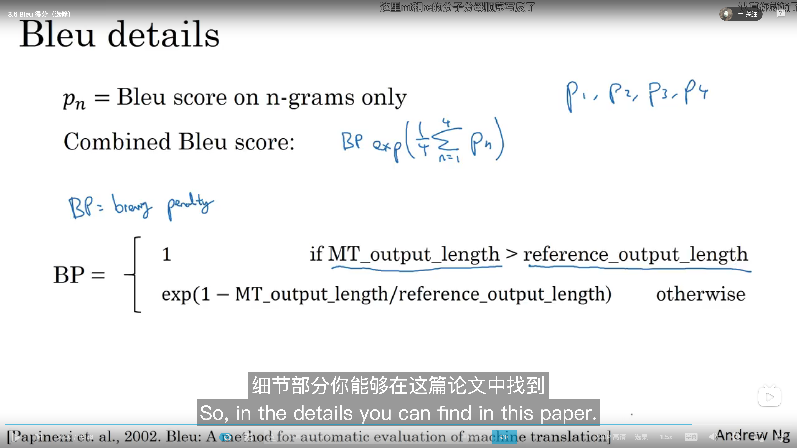

这里mt和re写反了

## 16.7 Attention model intuition

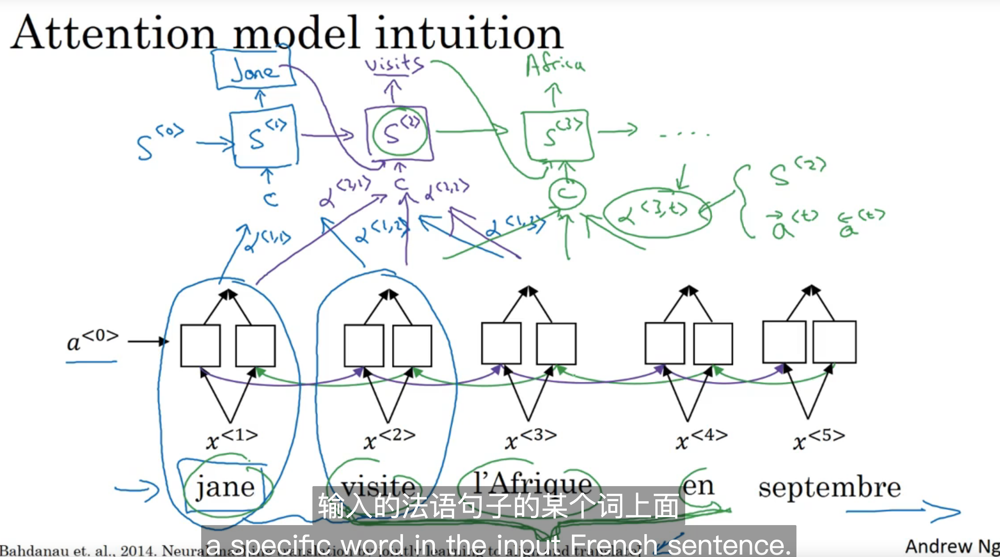

## 16.8 Attention model

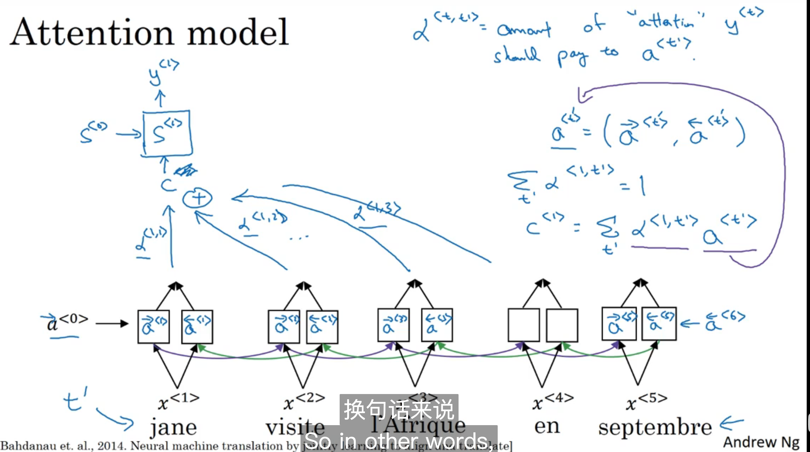

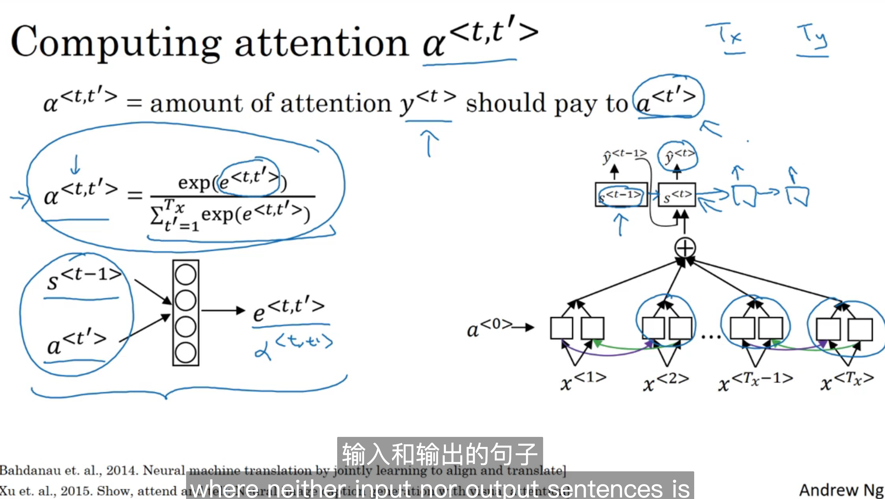

计算权重的网络也是通过浅层神经网络训练出来的。

# Audio data

## 16.9 Speech recognition

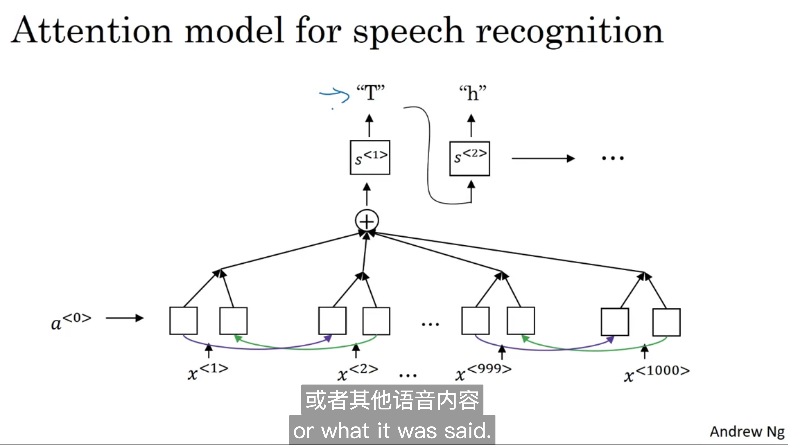

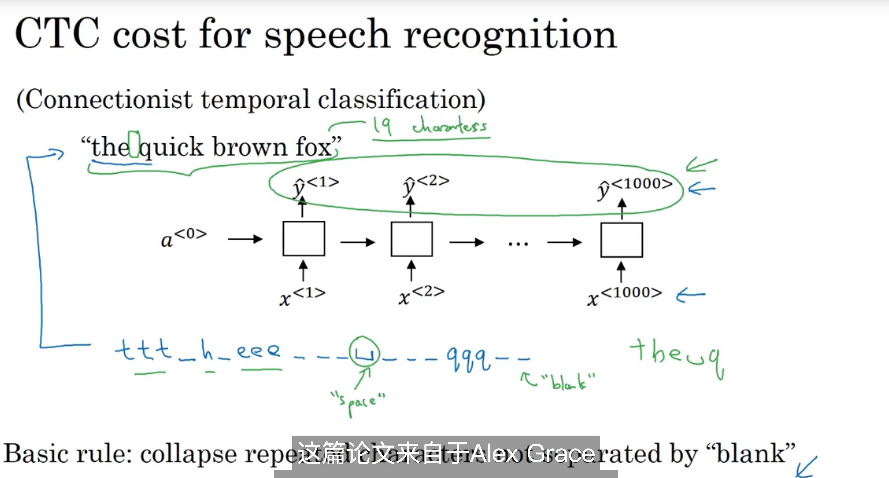

## 16.10 Trigger word dection

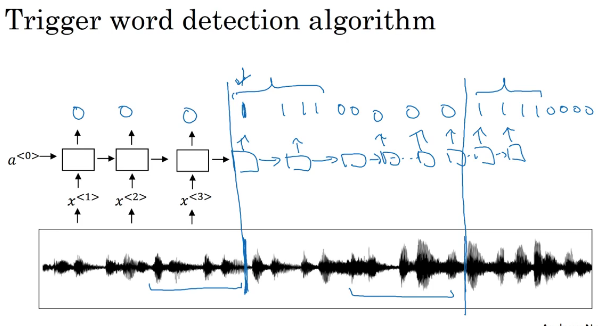

