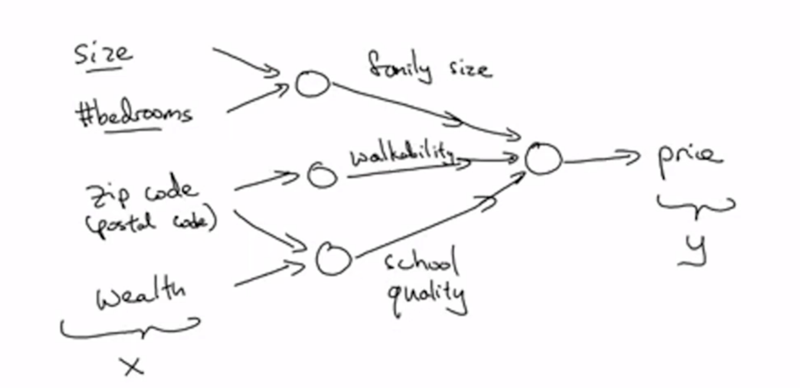
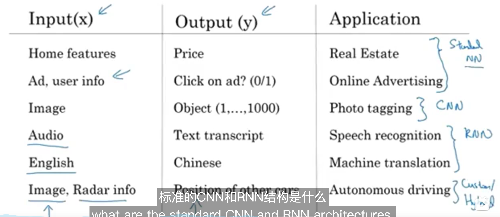
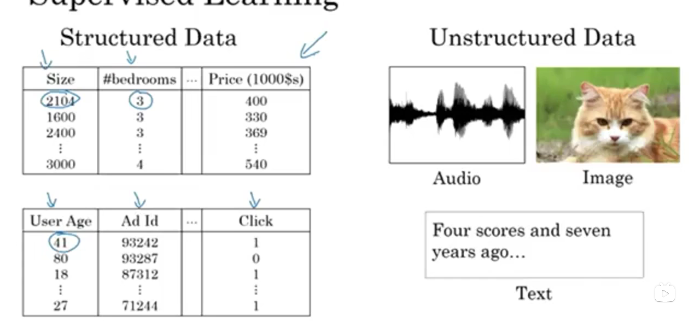

# Introduction to deep learning

## 1.1 what is a neural network?

**a single neural network**

## 1.2 supervised learning with neural networks

## 1.3 why deep learning taking off?

- data 
- computation
- algorithms

### 1.4 about the course?

1. Neural Networks and deep learning.  OK 
2. Improving deep neural networks: hyperparameter tuning, Regularization and Optimazation
3. Structuring your machine learning project
4. convolutional neural networks
5. natural language processing: building sequence models

