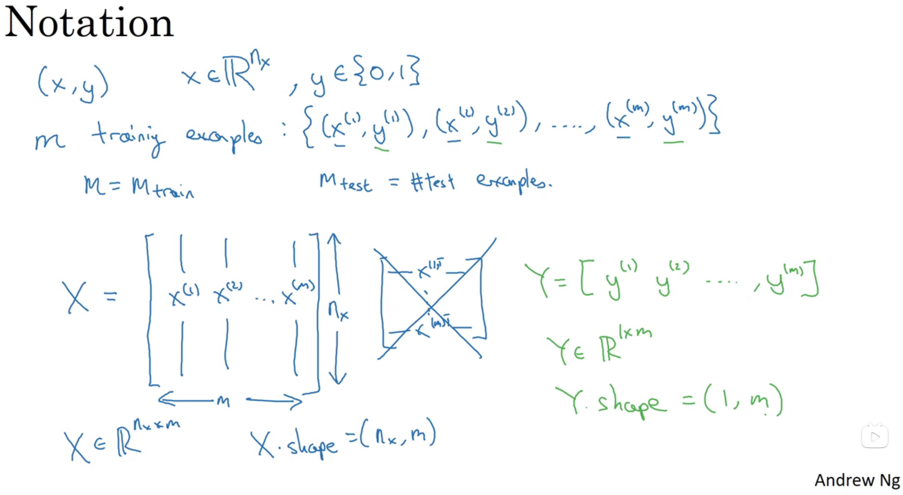
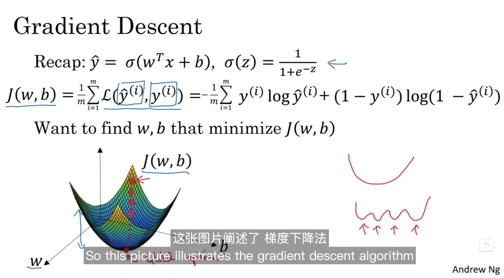
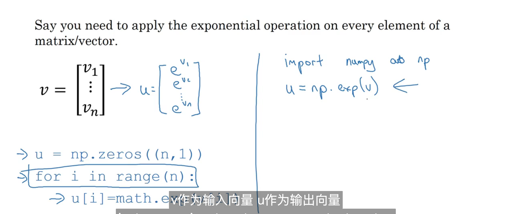
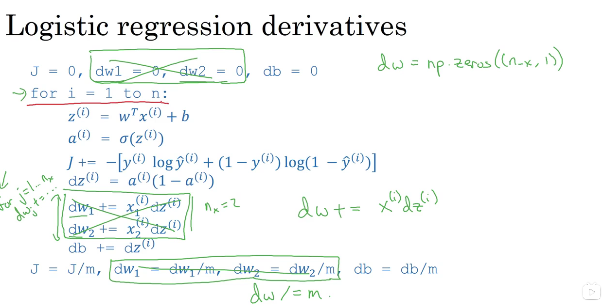
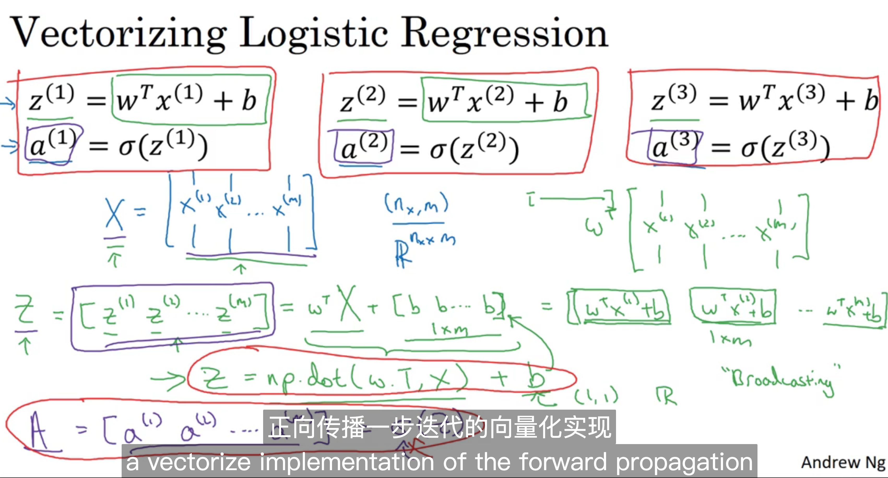
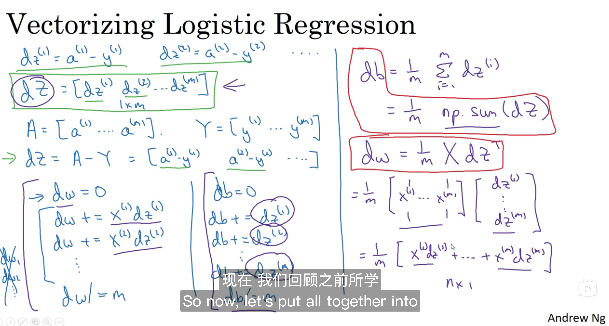
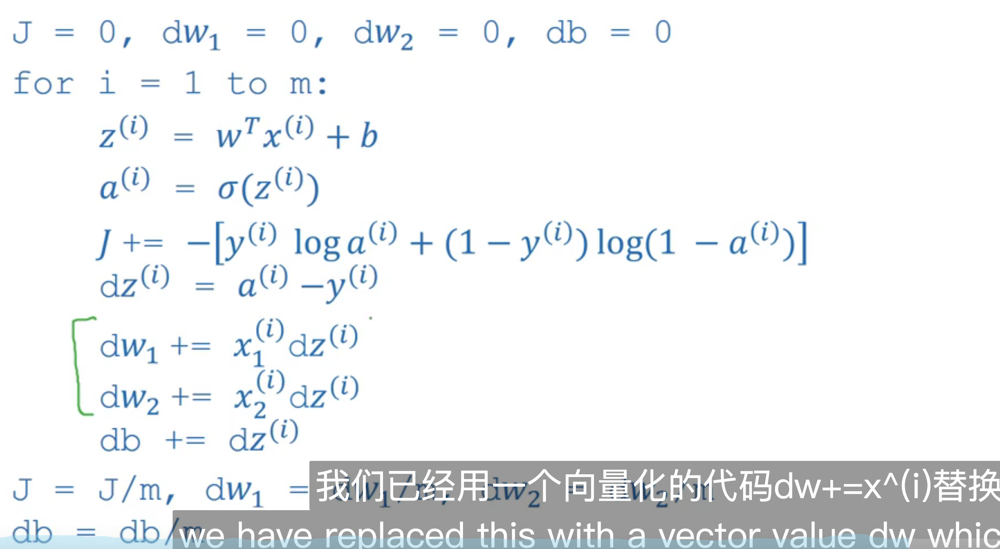
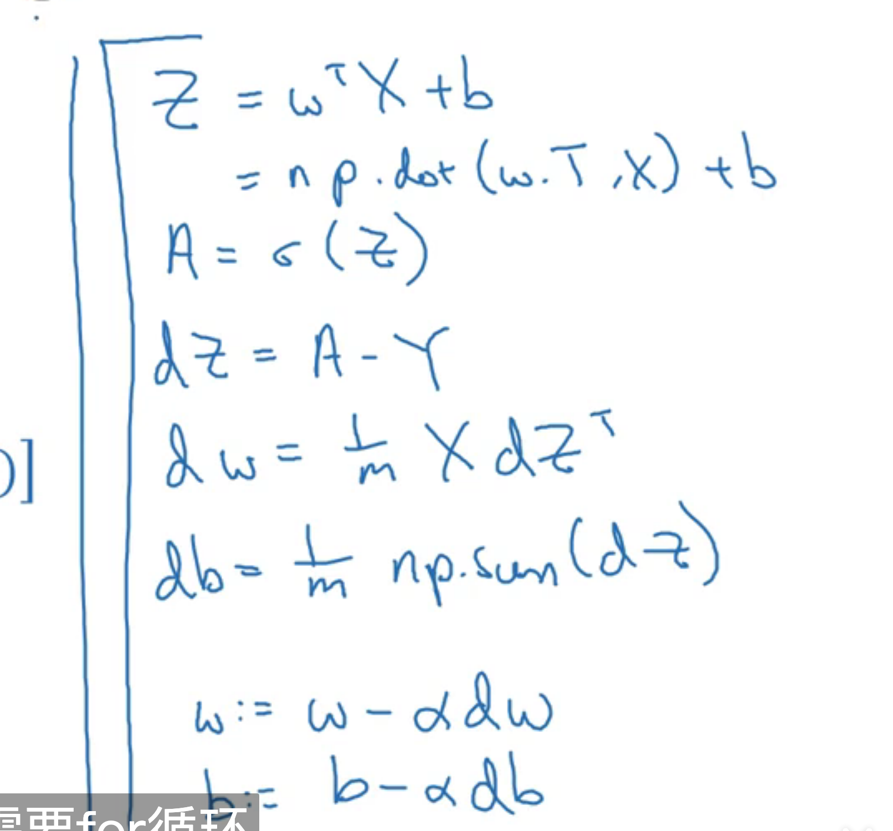
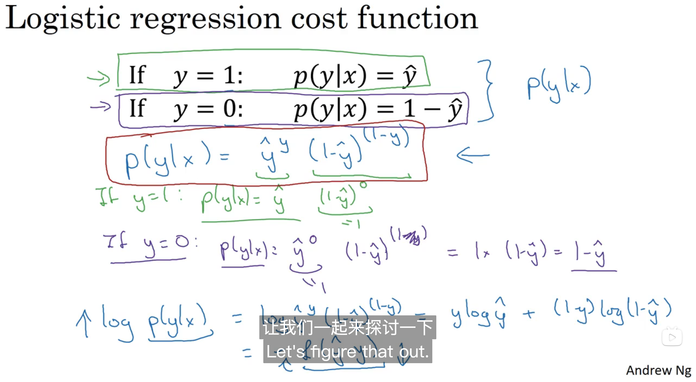
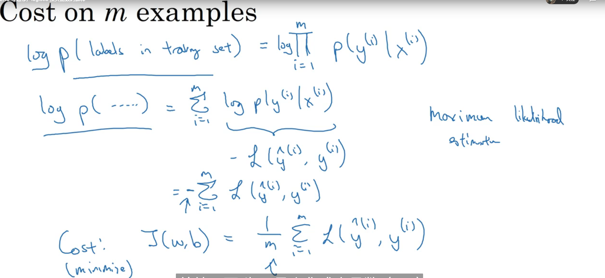

# Basics of Neural Network Programming

## 2.1 Binary Classification

**Logistic** regression is an algorithm for binary classfication


### Notation

 A single training example is represented by a pair (x,y).

where x is a nx-dimensional feature vector.

and y , the label, is either 0 or 1.

Your training sets will comprise lower-case m training examples.

Finally, to put all of the training examples into a more compact notation, we are going to define a matrix, capital X.

As defined by taking you training set inputs x1, x2, and so on.



## 2.2 Logistic Regression


## 2.3 Logistic Regression cost function


**Loss function: ** that measures how well you're doing on the single training example.

**Cost function:** that mearsures how well your parameters w and b are doing.


## 2.4 Gradient Descent




## 2.5 Derivatives


## 2.6 More derivatives examples

略

## 2.7 Computation Graph

 

**computation graph:** organizes a computation with this blue arrow left to right computation

## 2.8 Derivative with a computation graph

How to figure out derivative calculations for that function J?


## 2.9 Logistic Regression Gradient Descent


## 2.10 Gradient descent on m examples


## 2.11 Vectorization

**Vectorization:** is basically the art of getting rid of explict for loops in your code.

```python
import numpy as np
import time
a = np.random.rand(1000000)
b = np.random.rand(1000000)


tic = time.time()
c = np.dot(a, b)
toc = time.time()
print(c)
print("vectorized version:" +  str(1000 * (toc - tic)) + "ms")


c = 0
tic = time.time()

for i in range(1000000):
    c += a[i] * b[i]

toc = time.time()
print(c)
print("For loop:" + str(1000* (toc - tic)) + "ms")


```

```
249954.0568957462
vectorized version:1.0268688201904297ms
249954.05689573902
For loop:472.5492000579834ms
```

## 2.12 More Vectorization examples

**Neural network programming guideline:**

1. Whenever possible, avoid explicit for-loops.



 



## 2.13 Vectorizing Logistic Regression



## 2.14 Vectorizing Logistic Regression's Gradient Computation







## 2.15 Broadcasting in Python

```
cal = A.sum(axis = 0) 
percentage = 100 * A / cal.reshaple(1,4)
```

## 2.16 A note on python/ numpy vectors

```
a = np.random.randn(5) 
a.shape = (5,)
"rank 1 array"
DO not use 
如果有的话，就使用a = a.reshape(1,5) | a = a.reshape(5,1)
```


```
a = np.random.randn(5,1)
a.shape = (5,1)
a = np.random.randn(1,5)
a.shape = (1,5)
```


```
assert(a.shape == (5,1)) <- 声明
```

## 2.17 Jupyter 

略

## 2.18 Explanation of logistic regression cost function (optional)

 

The probility of all the labels in the training set.

then the probability of the example is the product of probabilities.

The product from i = 1 through m p(y(i) given x(i)




