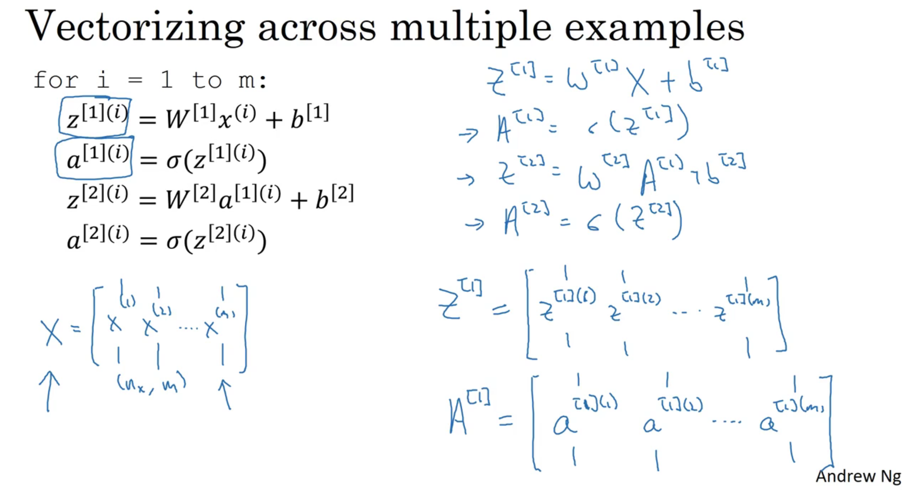
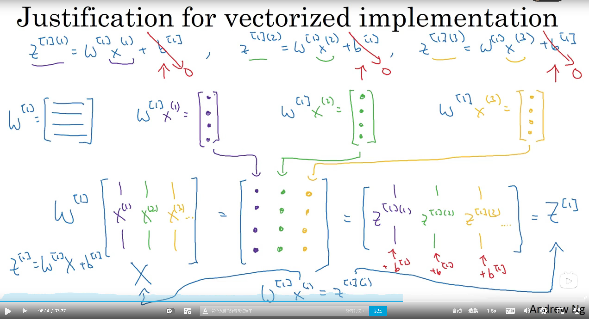

# 3. One hidden layer Neural Network

## 3.1 Nerual Networks overview


## 3.2 Neural Network representation


## 3.3 Computing a neural network's output


W [1] = (4, 3) 4: 层的神经元个数.  3: 输入的个数

W[2] = (1, 4) 1: 层的神经元个数. 4: 输入的个数

## 3.4 Vetorizing across multiple example




hidden units , training examples.

## 3.5 Explanation for vectorized implementation




## 3.6 Activation functions


## 3.7 Why do you need non-linear activation functions?

略

## 3.8 Derivatives of activation functions

```
sigmoid: g'(z) = a * (1 - a)
tanh: g'(z) = 1 - a ^ 2
ReLU: g'(z) = 1 | 0
```

## 3.9 Gradient descent for neural networks


## 3.10 Backpropagation intuition(Optional)


​                                     

```
由上面的推导下面的，麻中麻。
那个a[2] - y是上面算出来的结果。
然后 a[1]T实际上就是x
```

## 3.11 Random Initialization


   


